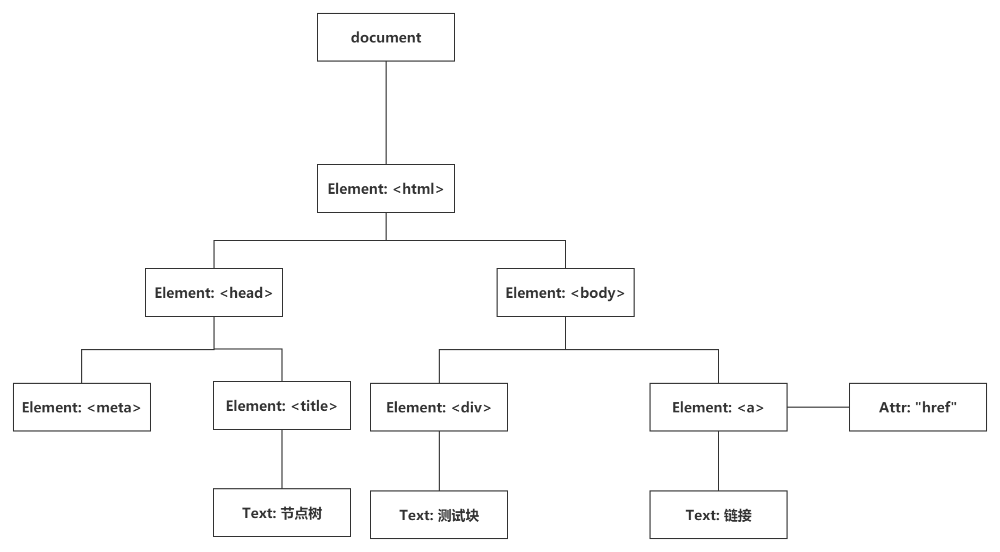

# 概述

DOM全称Document Object Model，即文档对象模型。是HTML和XML文档的编程接口，DOM将文档（HTML或XML）描绘成一个多节点构成的结构。使用JavaScript可以改变文档的结构、样式和内容。

# 分类

DOM目前有三种级别：

- **DOM Level 1**：1998年10月成为W3C的推荐标准，主要定义HTML和XML文档的底层结构。
- **DOM Level 2**： 在DOM1基础上扩充了方法和属性，引入了与文档更多的交互能力。主要包括DOM视图、DOM样式、DOM事件、DOM遍历和范围等。 
- **DOM Level 3**：引入了将XML文档加载和序列化的方法。提供了验证文档有效性的能力。


# 节点树

以下面的HTML为例：

```html
<html>
<head>
    <meta charset="UTF-8">
    <title>节点树</title>
</head>
<body>
    <div>测试块</div>
    <a href="/about">链接</a>
</body>
</html>
```

浏览器会将HTML文档解析成节点并组成节点树。



HTML DOM中通过不同类型节点来表示， `Document`是每个文档的根节点。这里的`document`只有一个`<html>`子节点，称之为文档元素(`Element`)。`Element`表示元素类型的节点，`Text`表示文本类型的节点。

# 节点类型

DOM 的最小组成单位叫做节点（node）。上面的节点树中，每一段都由不同类型的节点组成。节点的类型有如下几种：

- `Node`：浏览器提供的原生节点，下面的节点都继承它。
- `Document`：整个文档树的顶层节点
- `DocumentType`：`doctype`标签（比如`<!DOCTYPE html>`）。
- `Element`：网页的各种HTML标签（比如`<body>`、`<a>`等）。
- `Attr`：网页元素的属性（比如`class="right"`）。
- `Text`：标签之间或标签包含的文本。
- `Comment`：注释
- `DocumentFragment`：文档的片段

## Node

DOM1中定义了一个`Node`接口，JavaScript中所有节点类型都继承自`Node`类型，因此属性和方法都相同。

在`Node`类型中定义了`nodeType`属性来表明节点的类型，由12个常量表示。任何节点必居其一：

- `Node.ELEMENT_NODE`：数值1，对应元素节点`Element`。
- `Node.ATTRIBUTE_NODE`：数值2，对应属性节点`Attr`。
- `Node.TEXT_NODE`：数值3，对应文本节点`Text`。
- `Node.CDATA_SECTION_NODE`：数值4，对应文档中CDATA部（不会由解析器解析的文本）。
- `Node.ENTITY_REFERENCE_NODE`：数值5，对应实体引用。
- `Node.ENTITY_NODE`：数值6，对应实体类型`Entity`。
- `Node.PROCESSING_INSTRUCTION_NODE`：数值7，对应处理指令。
- `Node.COMMENT_NODE`：数值8，对应注释节点`Comment`。
- `Node.DOCUMENT_NODE`：数值9，对应文档节点`Document`。
- `Node.DOCUMENT_TYPE_NODE`：数值10，对应文档类型节点`DocumentType`。
- `Node.DOCUMENT_FRAGMENT_NODE`：数值11，对应文档片段节点`DocumentFragment`。
- `Node.NOTATION_NODE`：数值12，对应DTD中声明的符号。

使用`nodeType`可以很容易确定节点类型，`IE`中没有公开`Node`类型的构造函数，使用`Node.ELEMENT_NODE`比较会导致错误。为了兼容`IE`，可以使用数值进行比较：

```javascript
if (onenode.nodeType == Node.ELEMENT_NODE) {    // 在IE中无效
    console.log("The Node is an Element.");
}
// 或者
if (oneNode.nodeType == 1) {    // 适用所有浏览器
    console.log("The Node is an Element.");
}
```

`nodeName`返回节点的标签名

```javascript
var div = document.getElementByTagName('div')[0];
console.log(onenode.nodeName);    // DIV
```

`nodeValue`返回字符串，表示节点的文本值，可读写。

```javascript
var div = document.getElementByTagName('div')[0];
console.log(onenode.nodeValue);    // null
```

## Document

JavaScript通过`Document`类型表示文档。浏览器中的`document`对象是`HTMLDocument`的一个实例，表示整个HTML页面。`Document`节点具有以下特征：

- `nodeType`为`Node.DOCUMENT_NODE`，值为9。
- `nodeName`的值为`#document`。
- `nodeValue`的值为`null`。
- `parentNode`的值为`null`。
- `ownerDocument`的值为`null`。
- 其子结点可能是一个`DocumentType`、`Element`、`ProcessingInstruction`或`Comment`。

## Element

Element类型用于表现XML或HTML元素，提供对元素标签名、子节点及特性的访问。例如`<body>`和`<div>`等。`Element`节点具有以下特征：

- `nodeType`为`Node.ELEMENT_NODE`，值为1。
- `nodeName`的值为元素的标签名。
- `nodeValue`的值为`null`。
- `parentNode`可能是`Document`或`Element`。
- 其子节点可能是`Element`、`Text`、`Comment`、`ProcessingInstruction`、`CDATASection`或`EntityReference`。

要访问元素的标签名，可以使用`nodeName`属性，也可以使用`tagName`属性；这两个属性会返回相同值。

获取`<div id="divId"></div>`的标签名：

```javascript
var div = document.getElementById("divId");
console.log(div.tagName);    // DIV
console.log(div.tagName == div.nodeName);    // true
```

## Attr

元素的特性在DOM中以`Attr`类型来表示。在所有浏览器中（包括IE8），都可以访问`Attr`类型的构造函数和原型。从技术角度讲，特性就是存在于元素的`attributes`属性中的节点。特性节点具有下列特征：

- `nodeType`为`Node.TEXT_NODE`，值为3。
- `nodeName`的值是特性的名称。
- `nodeValue`的值是特性的名称。
- `parentNode`的值为`null`。
- 在HTML中不支持子节点（没有子节点）。
- 在XML中子节点可以是`Text`或`EntityReference`。

尽管它们也是节点，但特性却不被认为是DOM文档树的一部分。开发人员最常使用的是`getAttrubute()`、`setAttribute()`和`removeAttribute()`方法，很少直接引用特性节点。

`Attr`对象有3个属性：name、value和specified。其中，name是特性名称（与nodeName的值相同）、value是特性的值（与nodeValue的值相同），而specified是一个布尔值，用以区别特性是在代码中指定的、还是默认的。

使用`document.createAttribute()`并传入特性的名称可以创建新的特性节点。例如，要为元素添加`align`特性，可以使用下列代码：

```javascript
var attr = document.createAttribute("align");
attr.value = "left";
element.setAttributeNode(attr);
alert(element.attributes["align"].value); //"left"
alert(element.getAttributeNode("align").value); //"left"
alert(element.getAttribute("align")); //"left"
```

这个例子创建了一个新的特性节点。由于在调用`createAttribute()`时已经为name属性赋了值，所以后面就不必给它赋值了。之后，又把value属性的值设置为"left"。为了将新创建的特性添加到元素中，必须使用元素的setAttributeNode()方法。添加特性之后，可以通过下列任何方式访问改特性：attributes属性、getAttributeNode()方法以及getAttribute()方法。其中，attributes和getAttributeNode()都会返回对应特性的Attr节点，而getAttribute()则只会返回特性的值。

## Text

文本节点由`Text`类型表示，包含的是可以造字面解释的纯文本内容。纯文本中可以包含转义后的HTML字符，但不能包含HTML代码。`Text`节点具有以下特征：

- `nodeType`为`Node.TEXT_NODE`，值为3。
- `nodeName`的值为`#text`。
- `nodeValue`的值为节点所包含的文本。
- `parentNode`是一个`Element`。
- 不支持子节点（没有子节点）。

可以通过`nodeValue`属性或`data`属性访问`Text`节点中包含的文本，这两个属性中包含的值相同。对`nodeValue`的修改也会通过`data`反映出来，反之亦然。使用下列方法可以操作节点中的文本。

- `appendData(text)`：将`text`添加到节点的末尾。
- `deleteData(offset, count)`：从`offset`指定位置开始删除`count`个字符。
- `insertData(offset, text)`：在`offset`指定位置插入`text`。
- `replaceData(offset, count, text)`：用`text`替换从`offset`指定的位置开始到`offset`+`count`位置处的文本。
- `splitText(offset)`：从`offset`指定的位置将当前文本节点分成两个文本节点。
- `substringData(offset, count)`：提取从`offset`指定的位置开始到`offset`+`count`为止处的字符串。

除了这些方法外，文本节点还有一个`length`属性，保存着节点中字符的数目。而且，`nodeValue.length`和`data.length`中也保存着同样的值。

## Comment

注释在DOM中是通过`Comment`类型来表示的。`Comment`节点具有下列特征：

- `nodeType`为Node.COMMENT_NODE，数值为8。
- `nodeName`的值为`#comment`。
- `nodeValue`的值是注释的内容。
- `parentNode`可能是`Document`或`Element`。
- 不支持子节点（没有子节点）。

`Comment`类型与`Text`类型继承自相同的基类，因此它拥有除`splitText()`之外的所有字符串操作方法。与`Text`类型相似，也可以通过`nodeValue`或`data`属性取得注释的内容。

获取`<div id="divId"><!--A comment--></div>`代码中的注释：

```javascript
var div = document.getElementById("divId");
var comment = div.firstChild;
console.log(comment.data);    // A comment
```

## CDATASection

`CDATASection`类型只针对基于XML文档，表示的是`CDATA`区域。与`Comment`类似，`CDATASection`类型继承自`Text`类型，因此拥有除`splitText()`之外的所有字符串操作方法。`CDATASection`节点具有以下特征：

- `nodeType`为`CDATA_SECTION_NODE`，值为4。
- `nodeName`的值为`#cdata-section`。
- `nodeValue`的值是`CDATA`区域中的内容。
- `parentNode`可能是`Document`或`Element`。
- 不支持子节点（没有子节点）。

`CDATA`区域只会出现在XML文档中，因此多数浏览器都会把`CDATA`区域错误地解析为`Comment`或`Element`。一下面的代码为例：

```html
<div id="divId"><![CDATA[This is content.]]></div>
```

这个例子中的`<div>`元素应该包含一个`CDATASection`节点。可是，四大主流浏览器无一能够这样解析它。即使对于有效的XHTML页面，浏览器也没有正确地支持嵌入的`CDATA`区域。

在真正的XML文档中，可以使用`document.createCDataSection()`来创建`CDATA`区域，只需为其传入节点的内容即可。

## DocumentType

`DocumentType`类型在Web浏览器中并不常用，仅有Firefox、Safari和Opera支持它。`DocumentType`包含着与文档有关的`doctype`有关的所有信息，它具有下列特征：

- `nodeType`为`Node.DOCUMENT_TYPE_NODE`，值为10。
- `nodeName`的值为`doctype`的名称。
- `nodeValue`的值为`null`。
- `parentNode`是`Document`。
- 不支持子节点（没有子节点）。

在DOM1级中，`DocumentType`对象不能动态创建，而只能通过解析文档代码的方式来创建。支持它的浏览器会把`DocumentType`对象保存着`document.doctype`中。DOM1级描述了`DocumentType`对象的3个属性：name、entities和notations。其中，name表示文档类型的名称；entities是由文档类型描述的实体的NamedNodeMap对象；notations是由文档类型描述的符号的NamedNodeMap对象。通常，浏览器中的文档使用的都是HTML或XHTML文档类型，因而entities和notations都是空列表（列表中的项来自行内文档类型声明）。但不管怎样，只有name属性是有用的。这个属性中保存的是文档类型的名称，也就是出现在`<!DOCTYPE`之后的文本。以下面严格型HTML4.01的文档类型声明为例：

```html
<!DOCTYPE HTML PUBLIC "-//W3C//DTD HTML 4.01//EN"
"http://www.w3.org/TR/html4/strict.dtd">
```

`DocumentType`的name属性中保存的就是"HTML"：

```javascript
console.log(document.doctype.name);    // HTML
```

IE 及更早版本不支持DocumentType，因此document.doctype 的值始终都等于null。可是，些浏览器会把文档类型声明错误地解释为注释， 并且为它创建一个注释节点。IE9 会给document.doctype 赋正确的对象，但仍然不支持访问DocumentType 类型。

## DocumentFragment

在所有节点类型中，只有`DocumentFragment`在文档中没有对应的标记。DOM规定文档片段（document fragment）是一种"轻量级"的文档，可以包含和控制节点，但不会像完整的文档那样占用额外的资源。`DocumentFragment`节点具有下列特征：

- `nodeType`为`Node.DOCUMENT_FRAGMENT_NODE`，值为11。
- `nodeName`的值为`#document-fragment`。
- `nodeValue`的值为`null`。
- `parentNode`的值为`null`。
- 子节点可以是`Element`、`ProcessingInstruction`、`Comment`、`Text`、`CDATASection`或`EntityReference`。

虽然不能报文档片段直接添加到文档中，但可以把它作为一个"仓库"来使用，即可以在里面保存将来可能会添加到文档中的节点。要创建文档片段，可以使用`document.createDocumentFragment()`方法，如下所示：

```javascript
var fragment = document.createDocumentFragment();
```

文档片段继承了Node 的所有方法，通常用于执行那些针对文档的DOM操作。如果将文档中的节点添加到文档片段中，就会从文档树中移除该节点，也不会从浏览器中再看到该节点。添加到文档片段中的新节点同样也不属于文档树。可以通过appendChild()或insertBefore()将文档片段中内容添加到文档中。在将文档片段作为参数传递给这两个方法时，实际上只会将文档片段的所有子节点添加到相应位置上；文档片段本身永远不会成为文档树的一部分。来看下面的HTML 示例代码：

```html
<ul id="ulId"></ul>
```

假设我们想为这个`<ul>`元素添加3 个列表项。如果逐个地添加列表项，将会导致浏览器反复渲染（呈现）新信息。为避免这个问题，可以像下面这样使用一个文档片段来保存创建的列表项，然后再一次性将它们添加到文档中。

```javascript
var fragment = document.createDocumentFragment();
var ul = document.getElementById("myList");
var li = null;
for (var i=0; i < 3; i++){
    li = document.createElement("li");
    li.appendChild(document.createTextNode("Item" + (i+1)));
    fragment.appendChild(li);
}
ul.appendChild(fragment);
```

在这个例子中，我们先创建一个文档片段并取得了对`<ul>`元素的引用。然后，通过`for`循环创建3个列表项，并通过文本表示它们的顺序。为此，需要分别创建`<li>`元素、创建文本节点，再把文本节点添加到`<li>`元素。接着使用appendChild()将`<li>`元素添加到文档片段中。循环结束后，再调用appendChild()并传入文档片段，将所有列表项添加到`<ul>`元素中。此时，文档片段的所有子节点都被删除并转移到了`<ul>`元素中。

# DOM操作

浏览器中充斥着隐藏的陷阱和不兼容问题，用JavaScript代码处理DOM的某些部分要比处理其它部分更复杂一些。

## 动态脚本

使用`<script>`元素可以向页面中插入JavaScript代码，一种是通过其`src`特性包含外部文件，另一种方式就是用这个元素本身包含代码。这一节讨论的动态脚本，指的是在页面加载时不存在，但将来的某一时刻通过修改DOM动态添加的脚本。跟操作HTML元素一样，创建动态脚本也有两种方式：插入外部文件和直接插入JavaScript代码。

动态加载的外部JavaScript文件能够立即运行，比如下面的`<script>`元素：

```html
<script type="text/javascript" src="client.js"></script>
```

这个`<script>`元素包含了第九章的客户端检测脚本。而创建这个节点的DOM代码如下所示：

```javascript
var script = document.createElement("script");
script.type = "text/javascript";
script.src = "client.js";
document.body.appendChild(script);
```

显然，这里的DOM代码如实反映了相应的HTML代码。不过，在执行最后一行代码把`<script>`元素添加到页面中之前，是不会下载外部文件的。也可以把这个元素添加到`<head>`元素中，效果相同。整个过程可以使用下面的函数来封装：

```javascript
function loadScript(url) {
    var script = document.createElement("script");
    script.type = "text/javascript";
    script.src = url;
    document.body.appendChild(script);
}
```

然后，就可以通过调用这个函数来加载外部的JavaScript文件了：

```javascript
loadScript("client.js");
```

加载完成后，就可以在页面中的其它地方使用这个脚本了。问题只有一个：怎么知道脚本加载完成呢？遗憾的是，