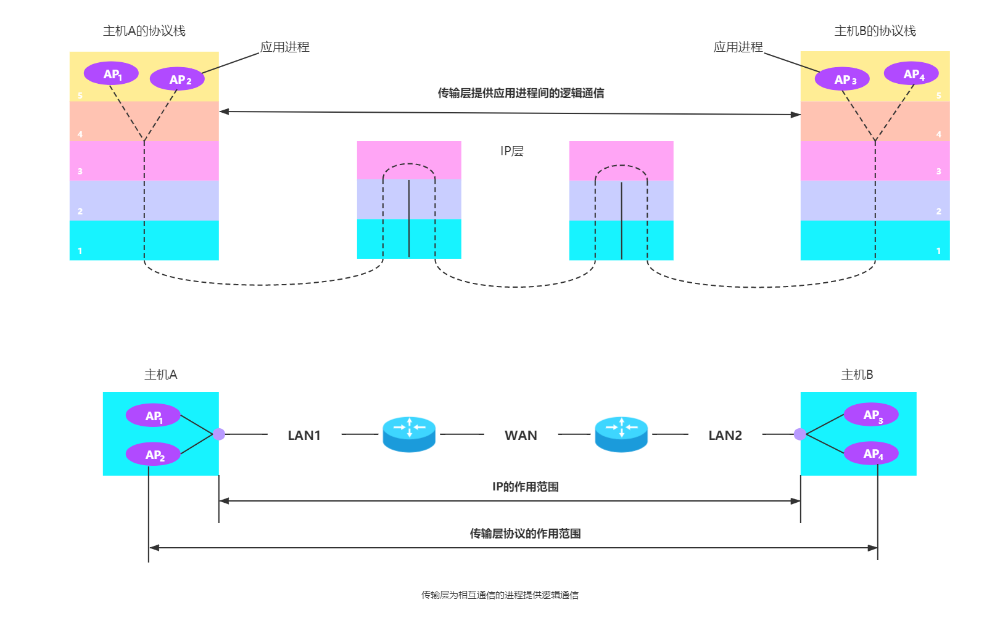

传输层位于应用层和网络层之间，是整个网络体系结构的关键层次。该层为运行在不同主机上的应用进程提供直接的通信服务起着至关重要的作用。在下文中，我们讲述传输层协议的特点、进程之间的通信和端口等重要概念，讨论传输层的原理和这些原理在现有的协议中是如何实现的。

# 传输层服务

## 传输的功能

从通信和信息处理的角度看，**传输层向它上面的应用层提供通信服务**，它属于面向通信部分的最高层，同时也是用户功能中的最底层。

传输层位于网络层之上，它为运行在不同主机上的进程之间提供了逻辑通信，而网络层提供主机之间的逻辑通信。显然，即使网络层协议不可靠（网络层协议使分组丢失、混乱和重复），传输层同样能为应用程序提供可靠的服务。

通过下图来说明传输层的作用。当网络的边缘部分的两台主机使用网络核心部分的功能进行端到端的通信时，只有主机的协议栈才有传输层和应用层，而路由器在转发分组时都只用到下三层的功能（即在通信子网中没有传输层，传输层只存在于通信子网以外的主机中）。

传输层的功能如下：

**1. 端到端通信**

传输层提供应用进程之间的逻辑通信（即端到端通信）。与网络层的区别是，网络层提供的是主机之间的逻辑通信。

从网络层来说，通信的双方是两台主机，IP 数据报的首部给出了这两台主机的 IP 地址。但 “两台主机之间的通信” 实际上是两台主机中的应用进程之间的通信，应用进程之间的通信又称端到端的逻辑通信。这里 “逻辑通信” 的意思是：传输层之间的通信好像是沿水平方向传输数据，但事实上这两个传输层之间并没有一条水平方向的物理连接。

**2. 分用和复用**

复用是指在发送方不同的应用进程都可使用同一个传输层协议传送数据（需加适当的首部）；分用是指接收方的传输层在剥去报文的首部后能够把这些数据正确交付到目的应用进程。

注意：传输层的复用分用功能与网络层的复用分用功能不同。网络层的复用是指发送方不同协议的数据都可以封装成 IP 数据报发送出去，分用是指接收方的网络层在剥去首部后把数据交付给相应的协议。

**3. 差错检测**

传输层还要对接收的报文进行差错检测。在网络层，IP 数据报首部中的检验和字段，只检验首部是否出现差错而不检验数据部分是否出错。

**4. 提供传输协议**

根据应用程序的不同需求，传输层提供两种不同的传输协议，即 **面向连接的 TCP** 和 **无连接的 UDP**。而网络层无法同时实现两种协议（即在网络层要么只提供面向连接的服务，如虚电路；要么只提供无连接服务，如数据报，而不可能在网络层同时存在这两种方式）。

传输层向高层用户屏蔽了底层网络核心的细节（如网络拓扑、路由协议等），它使应用进程看见的是好像在两个传输层实体之间有一条端到端的逻辑通信信道，但这条逻辑通信信道对上层的表现却因传输层使用不同协议而有很大的差别。当传输层采用面向连接的 TCP 时，尽管下面的网络是不可靠的，但这种逻辑通信信道就相当于 **一条全双工的可靠信道**。但当传输层采用无连接的 UDP 时，这种逻辑通信信道仍然是 **一条不可靠信道**。

## 传输层的主要协议

无连接服务是指两个实体之间的通信不需要先建立好连接，需要通信时，直接将信息发送到 “网络” 中，让该信息的传递在网上尽力而为地往目的地传送。UDP 就是无连接服务。

面向连接服务就是在通信双方进行通信之前，必须先建立连接，在通信过程中，整个连接的情况一直被实时地监控和管理。通信结束后，应该释放这个连接。TCP 就是面向连接服务。

TCP/IP 协议族在 IP 层之上使用两个主要的传输协议：

1. **用户数据报协议 UDP**（User Datagram Protocol）。采用 TCP 时，传输层向上提供的是一条全双工的可靠逻辑信道。
2. **传输控制协议 TCP**（Transmission Control Protocol）。采用 UDP 时，传输层向上提供的是一条不可靠的逻辑信道。

下图给出这两种协议在协议栈中的位置。

按 OSI 的术语，两个对等传输实体在通信时传送的数据单位叫做  **传输协议数据单元 TPDU**（Transport Protocol Data Unit）。但在 TCP/IP 体系中，根据所使用的协议是 TCP 或 UDP，分别称之为 **TCP 报文段** (segment) 或 **UDP 用户数据报** 。

UDP 是一个无连接的非可靠传输层协议。它在 IP 之上仅提供两个附加服务：多路复用和对数据的错误检查。IP 知道怎样把分组投递给一台主机，但不知道怎样把它们投递给主机上的具体应用。UDP 在传送数据之前不需要先建立连接，远程主机的传输层收到 UDP 报文后，不需要给出任何确认。由于 UDP 比较简单，因此执行速度比较快、实时性好。使用 UDP 的应用层协议主要包括 DNS域名系统、TFTP简单文件传送协议、RTP路由信息协议、DHCP动态主机配置协议、SNMP简单网络管理协议、NFS网络文件协议、IGMP网际组管理协议等。

TCP 提供面向连接的服务，在传送数据之前必须先建立连接，数据传送结束后要释放连接。TCP 不提供广播或组播服务。由于 TCP 提供面向连接的可靠传输服务，因此不可避免地增加了许多开销，如确认、流量控制、计时器及连接管理等。这不仅使协议数据单元的头部增大很多，还要占用许多的处理机资源。因此 TCP 主要适用于可靠性更重要的场合，如 FTP文件传输协议、HTTP超文本传输协议、TELNET远程登录、SMTP简单邮件传送协议等。

注意：  
1. IP 数据报和 UDP 数据报的区别：IP 数据报在网络层要经过路由的存储转发；而 UDP 数据报在传输层的端到端的逻辑信道中传输，封装成 IP 数据报在网络层传输时，UDP 数据报的信息对路由是不可见的。
2. TCP 和网络层虚电路的区别：TCP 报文段在传输层抽象的逻辑信道中传输，对路由器不可见；虚电路所经过的交换结点都必须保存虚电路状态信息，在网络层若采用虚电路方式，则无法提供无连接服务；而传输层采用 TCP 不影响网络层提供无连接服务。

## 传输层的端口

协议栈层间的抽象的协议端口是软件端口，路由器或交换机上的端口是硬件端口。硬件端口是不同硬件设备进行交互的接口，而软件端口是应用层的各种协议进程与传输实体进行层间交互的一种地址。不同的系统具体实现端口的方法可以是不同的。

**1. 端口的作用**

端口能够让应用层的各种应用进程将其数据通过端口向下交付给传输层，以及让传输层知道应当将其报文段中的数据向上通过端口交付给应用层相应的进程。

端口是传输层服务访问点（TSAP），它在传输层的作用类似于 IP 地址在网络层的作用或 MAC 地址在数据链路层的作用，只不过 IP 地址和 MAC 地址标识的是主机，而端口标识的是主机中的应用进程。

数据链路层的 SAP 是 MAC 地址，网络层的 SAP 是 IP 地址，传输层的 SAP 是端口。

在协议栈层间的抽象的协议端口是软件端口，它与路由器或交换机上的硬件端口是完全不同的概念。硬件端口是不同硬件设备进行交互的接口，而软件端口是应用层的各种协议进程与传输实体进行层间交互的一种地址。传输层使用的是软件端口。

**2. 端口号**

TCP/IP 的传输层用一个长度为 16bit 的端口号来标识一个端口，允许有 $2^{16} - 1 = 65535$ 个不同的端口号。端口号只具有本地意义，只是为了标志本计算机应用层中的各个进程在和传输层交互时的层间接口。在互联网不同计算机中，相同的端口是没有关联的。因此两个计算机中的进程互相通信，就必须知道对方的 IP 地址和端口号。

互联网上的计算机通信采用客户/服务器方式，客户在发起通信请求时，必须先知道对方服务器的 IP 地址和端口号。因此根据传输层的端口号根据范围可分为两类：

- **服务端使用的端口号**。这里有分为两类，最重要的一类是 **熟知端口号** 或 **系统端口号**，数值为 0~1023，IANA（互联网地址指派机构）把这些端口号指派给了 TCP/IP 最重要的一些应用程序，让所有的用户都知道。下表给出一些常用的熟知端口号：

  |应用程序|FTP|TELNET|SMTP|DNS|TFTP|HTTP|SNMP|HTTPS|
  |:---:|:---:|:---:|:---:|:---:|:---:|:---:|:---:|:---:|
  |熟知端口号|21|23|25|53|69|80|161|443|
  
  另一类叫做 **登记端口号**，数值为 1024~49151。这类端口号是为没有熟知端口号的应用程序使用的。使用这类端口号必须在 IANA 登记，以防止重复。

- **客户端使用的端口号**，数值为 49152~65535。由于这类端口号仅在客户进程运行时才动态选择，因此又称 **短暂端口号**（也称临时端口）。这类端口号留给客户进程选择暂时使用。当服务器进程收到客户进程的报文时，就知道了客户进程所使用的端口号，因而可以把数据发送给客户进程。 通信结束后，刚用过的客户端口号就不复存在，从而这个端口号就可供其它客户进程使用。

**3. 套接字**

在网络中通过 IP 地址来标识和区别不同的主机，通过端口号来标识和区分一台主机中的不同应用进程。在网络中采用发送方和接收方的套接字（Socket）组合来识别端点。所谓套接字，实际上是一个通信端点，即

$$
套接字 Socket = (主机 IP 地址，端口号)
$$

它是唯一地标识网络中的一台主机和其上的一个应用（进程）。而 TCP 每一条连接唯一地被通信两端的两个端点（即两个套接字）所确定。即：

$$
TCP连接  ::= \{ socket_1, socket_2 \} = \{(IP_1: port_1), (IP_2: port_2)\}
$$

套接字的表示方法是在点分十进制的 IP 地址后面写上端口号，中间用冒号或逗号隔开。如 IP 地址是  `192.3.4.5` 而端口号是 `80`，那得到的套接字就是 `192.3.4.5:80`。

在网络通信中，主机 A 发送主机 B 的报文段包含目的端口号和源端口号，源端口号是 “返回地址” 的一部分，即当 B 需要发回一个报文段给 A 时，B 到 A 的报文段中的目的端口号便是 A 到 B 的报文段中的源端口号（完全的返回地址是 A 的 IP 地址和源端口号）。

# UDP 协议

## UDP 数据报

**1. UDP 概述**

用户数据报协议 UDP  只在 IP 的数据报服务至上增加了两个最基本的服务：复用和分用的功能以及差错检测的功能。如果应用程序开发者选择 UDP 而非 TCP，那么应用程序几乎直接与 IP 打交道。UDP 的主要特点是：

1. UDP 在发送数据报之前不需要建立连接，因此减少了开销和发送数据之前的时延。试想如果 DNS 运行在 TCP 而非 UDP 上，那么 DNS 的速度会慢很多。HTTP 使用 TCP 而非 UDP，是因为对于基于文本数据的 Web 网页来说，可靠性是至关重要的。
2. UDP 没有拥塞控制。因此网络出现的拥塞不会使源主机的发送速率降低。这对某些实时应用是很重要的。很多的实时应用要求源主机以恒定的速率发送数据，并且允许在网络发送拥塞时丢失一些数据，但却不允许数据有太大的时延。UDP 正好适合这种要求。
3. UDP 支持一对一、一对多、多对一和多对多的交互通信。因为不用维护端系统的连接状态，也不跟踪接收和发送缓存、拥塞控制参数和序号与确认号的参数。因此，某些专用应用服务器使用 UDP 时，一般都能支持更多的活动客户机。
4. UDP 的首部开销小。UDP 只有 8 个字节，即 8B，比 TCP 的 20 个字节首部要短。

UDP 常用于一次性传输较少数据的网络应用，如 DNS、SNMP 等，因为对于这些应用，若采用 TCP，则将为连接创建、维护和拆除带来不小的开销。UDP 也常用于多媒体应用（如 IP 电话、实时视频会议、流媒体等），显然，可靠数据传输对这些应用来说并不是最重要的，但 TCP 的拥塞控制会导致数据出现较大的延迟，这是它们不可容忍的。

UDP 使用尽最大努力交付，即不保证可靠交付，因此主机不需要维护复杂的连接状态表。但这并不意味着应用对数据的要求是不可靠的，因为所有维护传输可靠性的工作需要用户在应用层来完成。应用实体可以根据应用的需求来灵活设计自己的可靠性机制。

UDP 是面向报文的。发送方的 UDP 对应用程序交下来的报文，在添加首部后就向下交付给 IP 层，既不合并，也不拆分，而是保留这些报文的边界，如下图所示。接收方的 UDP 对 IP 层交上来的 UDP 用户数据报，在去除首部后就原封不动地交付上去的应用进程，一次交付一个完整的报文，因为报文不可分割，是 UDP 数据报处理的最小单位。因此必须选择合适大小的报文，若太长，IP 层在传送时可能会进行分片，会降低 IP 层的效率，若太短，IP 数据报的首部的相对长度太大，也会会降低 IP 层的效率。

**2. UDP 的首部格式**

用户数据报 UDP 包含两部分：UDP 首部和用户数据，整个 UDP 数据报作为 IP 数据报的数据部分封装在 IP 数据报中，如下图所示，UDP 首部有 8 个字节，由四个字段组成，每个字段的长度都是 2 个字节。如下图所示。各字段意义如下：

1. 源端口。源端口号。在需要对方回信时选用，不需要时可用全 0。
2. 目的端口。目的端口号。这在终点交付报文时必须使用。
3. 长度。UDP 用户数据报的长度（包括首部和数据），其最小值是 8（仅有首部）。
4. 校验和。检测 UDP 数据报在传输中是否有错。有错就丢弃。该字段是可选的，当源主机不想计算校验和时，则直接令该字段为全 0。

当传输层从 IP 层收到 UDP 数据报时，就根据首部中的目的端口，把 UDP 数据报通过相应的端口上交给应用进程。如图所示。

如果接收方 UDP 发现收到的报文中的目的端口号不正确（即不存在对应于端口号的应用进程），那么就丢弃该报文，并由 ICMP 发送 “端口不可达” 差错报文给发送方。

注意：在 UDP 之间的通信要用到其端口号，但由于 UDP 的通信是无连接的，因此不需要使用套接字，而 TCP 之间的通信必须要在两个套接字之间建立连接。

## UDP 校验

用户数据报 UDP 在计算校验和时，要在 UDP 用户数据报之前增加 12B 的 **伪首部**，伪首部并不是 UDP 的真正首部。只是在计算校验和时，临时添加在 UDP 数据报的前面，得到一个临时的 UDP 用户数据报。校验和就是按照这个临时的 UDP 用户数据报计算的。伪首部既不向下传送也不向上递交，而仅是为了计算校验和。这样的校验和，既检查了 UDP 用户数据报，又对 IP 数据报的源 IP 地址和目的 IP 地址进行了检验。下图给出了 UDP 用户数据报的伪首部各字段的内容。

UDP 计算效验和的方法和计算 IP 数据报首部校验和的计算方法相似，都使用二进制反码运算求和再取反。但不同的是，IP 数据报的校验和只检验 IP 数据报的首部，但 UDP 的校验和则检验首部和数据部分。

发送方首先把全零放入校验和字段，然后把伪首部以及 UDP用户 数据报视为许多 16 位的字串连接起来。若 UDP 用户数据报的数据部分不是偶数个字节，则在数据部分末尾增加一个全零字节（但此字节不发送）。然后按二进制反码计算出这些 16 位字的和，将此和的二进制反码写入校验和字段，然后就发送这样的用户数据报。接收方把收到的 UDP 用户数据报加上伪首部（以及可能的填充全零字节）后，按二进制反码计算出这些 16 位字的和。当无差错时其结果应全为 1，否则表明有差错出现，接收方就应丢弃这个 UDP 用户数据报。

下图给出了一个计算 UDP 校验和的例子。本例中，UDP 数据报的长度是 15B（不含伪首部），因此需要添加一个全 0 字节。

注意：  
1. 校验时，若 UDP 数据报部分的长度不是偶数个字节，则需填入一个全 0 字节，如图所示，但是此字节和伪首部一样，是不发送的。
2. 如果 UDP 校验和校验出 UDP 数据报是错误的，那么可以丢弃，也可以交付给上层，但是需要附上错误报告，即告诉上层这是错误的数据报。
3. 通过伪首部，不仅可以检查源端口号、目的端口号和 UDP 用户数据报的数据部分，还可以检查 IP 数据报的源 IP 地址和目的地址。

这种简单的差错校验方法的检错能力并不强，但它的好处是简单、处理速度快。

# TCP 协议

## TCP 协议的特点

TCP 是在不可靠的 IP 层之上实现的可靠的数据传输协议，它主要解决传输的可靠、有序、无丢失和不重复问题。TCP 是 TCP/IP 体系中非常复杂的一个协议，主要特点如下：

1. **TCP** 是 **面向连接的传输层协议**。即使用 TCP 协议之前，先建立 TCP 连接。传送数据完毕后就释放建立的 TCP 连接。
2. 每条 **TCP** 连接只能有两个 **端点**，每条 TCP 连接只能是 **点对点** 的（一对一）。
3. TCP 提供 **可靠交付** 的服务，保证传送的数据无差错、不丢失、不重复且有序到达。
4. TCP 提供 **全双工通信**，允许通信双方的应用进程在任何时候都能发送数据。TCP 连接的两端都设有发送缓存和接收缓存，用来临时存放双向通信的数据。
    发送缓存用来暂时存放以下数据：
    - 1） 发送应用程序传送给发送方 TCP 准备发送的数据；
    - 2）TCP 已发送出但尚未收到确认的数据。接收缓存用来暂时存放以下数据：①按序到达但尚未被接收应用程序读取的数据；②不按序到达的数据。
5. **TCP** 是 **面向字节流** 的。指的是应用程序和 TCP 的交互是一次一个数据块（大小不等），但 TCP 把应用程序交下来的数据仅视为一连串的无结构的字节流。

## TCP 报文段

TCP 传送的数据单元称为报文段，一个 TCP 报文段分为 TCP 首部和 TCP 数据两部分，TCP 的全部功能都体现在首部中各字段的作用。整个 TCP 段作为 IP 数据报的数据部分封装在 IP 数据报中，如图所示。

TCP 报文段首部的前 20 个字节是固定的，后面有 4n 字节是根据需要而增加的选项，通常长度为 4B 的整数倍。TCP 报文段的首部最短为 20 字节。

TCP 报文段既可以用来运载数据，又可以用来建立连接、释放连接和应答。

首部各字段意义如下：

1. **源端口和目的端口字段**。各占 2 个字节，分别写入源端口号和目的端口号。端口是传输层与应用层的服务接口，传输层的复用和分用功能都要通过端口实现。
2. **序号**。占 4 字节。序号范围是$[0, 2^{32} - 1]$，共 $2^{32}$（即 4 294 967 269）个序号。TCP 是面向字节流的（即 TCP 传送时是逐个字节传送的），所以 TCP 连接中传送的字节流中的 **每个字节都编上一个序号**。首部中的序号字段值则指的是本报文端所发送的数据的第一个字节的序号。
    例如，一报文段的序号字段值是 301，而携带的数据共有 100B，表明本报文段的数据的第一个字节的序号是 301，最后一个字节的序号是 400，故下一个报文段的数据序号应从 401 开始。
3. **确认号**。占 4 字节，是期望收到对方的下一个报文段的第一个数据字节的序号。**若确认号为 N，则表明到序号 N-1 为止的所有数据都已正确收到**。
    例如，B 正确收到了 A 发送过来的一个报文段，其序号字段是 501，而数据长度是 200B（序号 501~700），这表明 B 正确收到了 A 发送的到序号 700 为止的数据。因此 B 期望收到 A 的下一个数据序号是 701，于是 B 在发送给 A 的确认报文段中把确认号置为 701。
    由于序号字段有 32 位长，可对 4 GB（即 4 千兆字节）的数据进行编号。在一般情况下可保证当序号重复使用时，旧序号的数据早已通过网路到达终点了。
4. **数据偏移**。占 4 位，指的是 TCP 报文段的首部长度，它指出 TCP 报文段的数据起始处距离 TCP 报文段的起始处有多远。
    注意：“数据偏移” 的单位是 32 位（以 4 字节为计算单位）。因此当此字段的值为 15 时，达到 TCP 首部的最大长度 60 字节。因首部中有长度不确定的选项字段，才需要数据偏移字段。
5. **保留**。占 6 位，保留为今后使用，但目前应置为 0。
6. **紧急位 URG**（URGent）。当 URG=1 时，表明紧急指针字段有效。它告诉系统报文段中有紧急数据，应尽快传送（相当于高级优先级的数据），不按原来的排队顺序传送。
    当 URG 置 1 时， 发送应用进程告诉发送方的 TCP 有紧急数据传送，发送方 TCP 就将紧急数据插入到本报文段数据的最前面，紧急数据后面的就是普通数据，并与首部中的紧急指针（Urgent Pointer）字段配合使用。
7. **确认位 ACK**。只有当 ACK=1 时确认号字段才有效。当 ACK=0 时，确认号无效。
    TCP 规定，在连接建立后所有传送的报文段都必须把 ACK 置 1。
8. **推送位 PSH**（PuSH）。两个应用进程交互时的通信时，有时在一端的应用进程希望键入一个命令后立即就能够收到对方的响应。TCP 就可以使用推送(push)操作。即 发送方 TCP 把 PSH 置 1，并立即创建一个报文段发送出去。接收 TCP 收到 PSH=1 的报文段，就尽快地交付给接收应用进程，而不再等到整个缓存都填满后再向上交付。
9. **复位位 RST**（Reset）。RST=1 时，表明 TCP 连接中出现严重差错（如主机崩溃或其它原因），必须释放连接，然后再重新建立传输连接。RST 置 1 还用来拒绝一个非法的报文段或拒绝打开一个连接。RST 也可称为重建位或重置位。
10. **同步位 SYN**（Synchronization）。在连接建立时用来同步序号。同步 SYN=1 表示这是一个连接请求或连接接收报文。
    当 SYN=1，ACK=0 时，表明这是一个连接请求报文，对方若同意建立连接，则在响应报文中使用 SYN=1，ACK=1。即 SYN=1 表明这是一个连接请求或连接接收报文。
11. **终止位 FIN**（Finish）。用来释放一个连接。FIN=1 表明此报文段的发送方的数据已发送完毕，并要求释放传输连接。
12. **窗口**。占 2 字节。窗口值是 $[0, 2^{16} - 1]$ 之间的整数。窗口指的是发送本报文段的一方的接收窗口。 它指出接收方允许对方发送的数据量，因为接收方的数据缓存空间是有限的，故用窗口值作为接收方让发送方设置其发送窗口的依据，单位为字节。
    例如，设确认号是 701，窗口字段是 1000。这表明，从 701 号算起，发送此报文段的一方还有接收 1000B 数据（字节序号为 701~1700）的接收缓存空间。
13. **校验和**。占 2 字节。校验和字段检验的范围包括首部和数据两部分。在计算校验和时，和 UDP 一样，要在 TCP 报文段的前面加上 12 字节 的伪首部。只需将 UDP 伪首部的第 4 个字段中的 17 改成 6，第 5 字段中的 UDP 长度改为 TCP 长度。接收方收到此报文段后，仍要加上这个伪首部来计算检验和。若使用 IPv6，则相应的伪首部也要改变。
14. **紧急指针**。占 2 字节，仅在 URG = 1 时才有意义，它指出在本报文段中紧急数据的字节数（紧急数据放在本报文段数据的最前面）。
15. **选项**。长度可变。最长可达 40 字节。没使用 “选项” 时，TCP 的首部长度是 20 字节。 
    TCP 最初只规定了一种选项，即最大报文段长度（Maximum Segument Size，MSS）。MSS 是每一个 TCP 报文段中的数据字段的最大长度。数据字段加上 TCP 首部才等于等个的 TCP 报文段。
16. **填充**。这是为了使整个首部长度是 4 字节的整数倍。

## TCP 连接管理

TCP 是面向连接的协议。传输连接时用来传送 TCP 报文的。TCP 传输连接的建立和释放是每一次面向连接的通信中必不可少的过程。因此每个 TCP 连接都有三个阶段：数据建立、数据传送和连接释放。传输连接的管理就是使传输连接的建立和释放都能正常进行。

在 TCP 连接建立的过程中，要解决以下三个问题：

1. 要使每一方都能够确知对方的存在。
2. 要允许双方协商一些参数（如最大窗口值、是否使用窗口扩大选项、时间戳选项及服务质量等）。
3. 能够对传输实体资源（如缓存大小、连接表中的项目等）进行分配。

TCP 把连接作为最基本的抽象，每条 TCP 连接有两个端点，TCP 连接的端点不是主机，不是主机的 IP 地址，不是应用进程，也不是传输层的协议端口。TCP 连接的端口称为套接字(socket) 或插口。端口拼接到 IP 地址即构成套接字。

每条 TCP 连接唯一地被通信两端的两个端点（即两个套接字）确定。

TCP 连接的建立采用客户/服务器方式。主动发起连接建立的应用进程称为客户机（Client），而被动等待连接建立的应用进程称为服务器（Server）。

**1. TCP 连接的建立**

TCP 连接建立的过程看成握手，而连接的建立需经历 3 个步骤，通常称三次握手，如图所示。

第一步，客户机的 TCP 首先向服务器的 TCP 发送一个连接请求报文段，首部中的同步位 SYN = 1，同时选择一个初始序号 seq = x。TCP 规定，SYN = 1 的报文段不能携带数据，倒要消耗掉一个序号。

第二步，服务器的 TCP 收到连接请求报文段后，如同意建立连接，则向客户机发送确认。在确认报文段中，SYN 和 ACK 位都被置为 1，确认号是 ack=  x + 1，并且服务器随机产生起始序号 seq=y。确认报文也不能携带数据，但也要消耗一个序号。

第三步，客户机收到确认报文后，还要向服务器给出确认。确认报文段的 ACK 置 1，确认号 ack = y + 1，序号 seq = x + 1。TCP 规定，ACK 报文段可以携带数据，但不携带数据则不消耗序号。这种情况下的下一个数据报文段的序号仍是 seq = x + 1。

成功进行以上三步后，就建立了 TCP 连接，接下来就可以传送应用层数据。TCP 提供的全双工通信，因此通信双方的应用进程在任何时候都能发送数据。

另外，值得注意的是，服务器端的资源是在完成第二次握手时分配的，而客户端的资源是在完成第三次握手时分配的，这就使得服务器易于受到 SYN 洪泛攻击。

**2. TCP 连接的释放**

数据传输结束后，参数 TCP 连接的两个进程中的任何一个都能终止该连接。TCP 连接释放的过程通常称为四次握手，如下图所示。

第一步，客户机打算关闭连接时，向其 TCP 发出连接释放报文段，并停止再发送数据，主动关闭 TCP 连接。连接释放报文段首部的终止控制位 FIN 置 1，其序号 seq = u，它等于前面已传送过的数据的最后一个字节的序号加1。TCP 规定，FIN 报文段即使不携带数据，也消耗掉一个序号。TCP 是全双工的，即可以想象为一条 TCP 连接上有两条数据通路。发送 FIN 报文时，发送 FIN 的一端不能再发送数据，即关闭了其中一条数据通路，但对方还可以发送数据。

第二步，服务器收到连接释放报文段后即发出确认，确认号是 ack = u + 1，而这个报文段自己的序号是 v，等于前面已传送过的数据的最后一个字节的序号加 1。TCP 服务器进程这时应通知高层应用进程，因而从客户机到服务器这个方向的连接就释放了，这时的 TCP 连接处于半关闭状态。即客户机已没有数据发送，而服务器若发送数据，客户机仍要接收，即从服务器到客户机这个方向的连接并未关闭。

第三步，若服务器已经没有向客户机发送的数据，就通知 TCP 释放连接，这时发出的连接释放报文段必须使 FIN = 1。

第四步，客户机在收到服务器连接释放报文段后，必须对此发出确认。在确认报文段中把 ACK 置 1，确认号 ack = w + 1，序号 seq = u + 1。根据 TCP 标准，前面发送过的 FIN 报文段要消耗一个序号。这时进入时间 TIME-WAIT 状态，现在 TCP 连接还未释放掉，必须经过时间等待晋时期设置的时间 2 MSL后，客户机才进入连接关闭状态。

对上述 TCP 连接建立和释放的总结如下：

1）连接建立。分为 3 步：  
  ① SYN=1，seq=x。  
  ② SYN=1，ACK=1，seq=y，ack=x+1。  
  ③ ACK=1，seq=x+1，ack=y+1。  

2）释放连接。分为 4 步：  
  ① FIN=1，deq=u。  
  ② ACK=1，deq=v，ack=u+1。  
  ③ FIN=1，ACK=1，seq=w，ack=u+1。  
  ④ ACK=1，seq=u+1，ack=w+1。  

## TCP 可靠传输

TCP 是在 IP 层提供的不可靠的传输、只能提供尽最大努力服务的基础上建立的一种可靠数据传输服务。TCP 提供的可靠数据传输服务就是要保证接收方进程从缓存区读取的字节流与发送方发出的字节流是完全一样的。TCP 使用了校验、序号、确认和重传等机制来达到这个目的。其中，TCP 的校验机制与 UDP 校验一样。

**1. 序号**

TCP 首部的序号字段用来保证数据能有序提交给应用层，TCP 把数据视为一个无结构但有序的字节流，序号建立在传送的字节流之上，而不建立在报文段之上。

TCP 连接传送的数据流中的每个字节都编上一个序号。序号字段的值是指本报文段所发送的数据的第一个字节的序号。如图所示，假设 A 和 B 之间建立了一条 TCP 连接，A 的发送缓存区中共有 10B，序号从 0 开始标号，第一个报文包含第 0~2 个字节，则该 TCP 报文段的序号是0，第二个报文段的序号是 3。

**2. 确认**

TCP 首部的确认号是期望收到对方的下一个报文段的数据的前一个字节的序号。在图中，如果接收方 B 已收到第一个报文段，此时 B 希望收到的下一个报文段的数据是从第 3 个字节开始的，那么 B 发送给 A 的报文中的确认号字段应为 3。发送方缓存区会继续存储那些已发送但未收到确认的报文段，以便在需要时重传。

TCP 默认使用累计确认，即 TCP 只确认数据流中至第一个丢失字节为止的字节。例如，在图中，接收方 B 收到了 A 发送的包含字节 0~2 及字节 6~7 的报文段。由于某种原因，B 还未收到字节 3~5 的报文段，此时 B 仍在等待字节 3（和其后面的字节），因此 B 到 A 的下一个报文段将确认号字段置为 3。

**3. 重传**

有两种事件会导致 TCP 对报文段进行重传：超时和冗余 ACK。

（1）超时

TCP 的发送方在规定的时间内没有收到确认就要重传已发送的报文段。

由于 TCP 的下层是互联网环境，并且每个 IP 数据报所选择的路由可能不同，因而传输层的往返时延的方差会很大。为计算传输超时的重传时间，TCP 采用一种自适应算法，它记录一个报文段发出的时间，以及收到的相应的确认的时间。这两个时间之差就是 **报文段的往返时间 RTT**。TCP 保留了 RTT 的一个加权平均往返时间 $RTT_S$ 。每当第一次测量到 RTT 样本时，$RTT_S$ 值就为所测量到的 RTT 样本值。但以后每测量到一个新的 RTT 样本，就按下式重新计算一次 $RTT_S$：

$$
新 RTT_S = (1-\alpha) \times (旧 RTT_S) + \alpha \times (新 RTT 样本)
$$

上式中，$0 \leq \alpha < 1 $。若 $ \alpha $ 接近于零，表示新 $RTT_S$ 值和旧 $RTT_S$ 值相比变化不大，而对新的 RTT 样本的影响不大（RTT 值更新较慢）。若选择 $\alpha$ 接近于 1，则表示新 $RTT_S$ 值受新 RTT 样本的影响较大（RTT值更新较快）。[RFC 6298] 推荐的 $\alpha$ 的值为 0.125。

显然，超时计时器设置的 **超时重传时间 RTO**（Retransmission Time-Out）应略大于上面得出的加权平均往返时间 $RTT_S$，使用下式计算：

$$
RTO = RTT_S + 4 \times RTT_D
$$

上式中，$RTT_D$ 是 $RTT$ 的 **偏差** 的加权平均值，它与 $RTT_S$ 和新 RTT 样本之差有关。第一次测量时，$RTT_D$ 取为测量到的 RTT 样本值的一半。在以后的测量中，使用下式计算加权平均值 $RTT_D$：

$$
新 RTT_D = (1-\beta) \times (旧 RTT_D) + \beta \times|RTT_S - 新 RTT 样本|
$$

上式中，$\beta$是个小于 1 的系数，它的推荐值是 0.25。

（2）冗余 ACK（冗余确认）

超时触发重传存在的一个问题是超时周期往往太长。所幸的是，发送方通常可在超时事件发生之前通过注意所谓的冗余 ACK 来较好地检测丢包情况。冗余 ACK 就是再次确认某个报文段的 ACK，而发送方先前已经收到过该报文段的确认。例如，发送方 A 发送了序号为 1、2、3、4、5 的 TCP 报文段，其中 2 号 报文段在链路中丢失，它无法到达接收方 B。因此 3、4、5 号报文段对于 B 来说就成了失序报文段。TCP 规定每当比期望序号大的失序报文段到达时，就发送一个冗余 ACK，指明下一个期待字节的序号。在本例中，3、4、5 号报文到达 B，但它们不是 B 所期望收到的下一个报文，于是 B 就发送 3 个对 1 号报文段的冗余 ACK，表示自己期望接收 2 号报文段。TCP 规定当发送方收到对同一个报文段的 3 个冗余 ACK 时，就可以认为跟在这个被确认报文段之后的报文段已经丢失。就前面的例子而言，当 A 收到对于 1 号报文段的 3 个冗余 ACK 时，它可以认为 2 号报文段已经丢失。这时发送方 A 可以立即对 2 号报文执行重传，这种技术通常称为快速重传。

## TCP 流量控制

一般来说，我们总是希望数据传输得更快一些。但如果发送方把数据发送得过快，接收方就可能来不及接收，这就会造成数据的丢矢。所谓流量控制就是让发送方的发送速率不要太快，要让接收方来得及接收。

TCP 提供 **流量控制服务** 以消除发送方使接收方缓存溢出的可能性。因此，流量控制是一个速度匹配服务，即发送方的发送速率与接收方的读取速率相匹配。

TCP 通过让发送方维护一个称为接收窗口的变量来提供流量控制。同属地说，接收窗口用于给发送方一个指示——该接收方还有多少可用的缓存空间。

TCP 提供一种基于滑动窗口机制实现对发送方的流量控制。

TCP 是全双工通信，在连接两端的发送方都各自维护一个接收窗口。在通信过程中，接收方根据自己接收缓存的大小，动态地调整发送方的发送窗口。设接收窗口为 rwnd，即调整 TCP 报文段首部中的 “窗口” 字段值，来限制发送方向网络注入报文的速率。。同时，发送方根据其对当前网络拥塞程序的估计而确定的窗口值，这称为拥塞窗口 cwnd，其大小的与网络的带宽和时延密切相关。

例如，在通信中，有效数据只从 A 发往 B，而 B 仅向 A 发送确认报文，这时 B 可以通过设置确认报文段首部的窗口字段来将 rwnd 通知给 A。rwnd 即接收方允许连续接收的最大能力，单位是字节。发送方 A 总是根据最新收到的 rwnd 值来限制自己发送窗口的大小，从而将未确认的数据量控制在 rwnd 大小之内，保证 A 不会使 B 的接收缓存溢出。当然，A 的 **发送窗口的实际大小取 rwnd 和 cwnd 中的最小值**。

下图中的例子说明了如何利用滑动窗口机制进行流量控制。设主机 A 向主机 B 发送数据，在连接建立时，B 告诉 A：“我的接收窗口 rwnd = 400（字节）”。

传输层和数据链路层的流量控制的区别是：传输层定义端到端用户之间的流量控制，数据链路层定义两个中间的相邻结点的流量控制。另外，数据链路层的华东窗口协议的窗口大小不能动态变化，传输层的则可以动态变化。

## TCP 拥塞控制

所谓 **拥塞控制** 就是 **防止过多的数据注入网络，以使网络中的路由器或链路不致过载**。出现拥塞时，端点并不了解到拥塞发生的细节，对通信连接的端点来说，拥塞往往表现为通信时延的增加。当然，拥塞控制和流量控制也有相似的地方，即它们都是通过控制发送方发送数据的速率来达到效果的。

拥塞控制与流量控制的区别：拥塞控制是让网络能够承受现有的网络负荷，是一个全局性的过程，涉及到所有的主机、路由器、以及与降低网络传输性能有关的所有因素。相反，流量控制往往是指点对点通信量的控制，即接收端控制发送端。他所要做的就是抑制发送端发送数据的速率，以便使接收端来得及接收。而常常被弄混的原因是因为某些拥塞控制算法是向发送端发送控制报文，并告诉发送端网络已出现麻烦，必须放慢发送速率。这点和流量控制很相似。

例如，某个链路的传输速率为 1000 Gbit/s，某巨型机向一台个人电脑以 1Gb/s 的速率传送文件，显然网络的带宽是足够大的，不存在拥塞问题，但如此高的发送速率将导致个人计算机可能来不及接收，因此必须进行流量控制。但若有 1000 台大型计算机在此链路上以 1Mbit/s 的速率传送文件，则现在的问题就是整个网络的输入负载是否超过了现有网络所能承受的范围。

下图为拥塞控制所起到的作用。横坐标是提供的负载，代表单位时间内输入给网络的分组数目。因此提供的负载也称为输入负载或网络负载。纵坐标是吞吐量，代表单位时间内从网络输出的分组数目。

在理想拥塞控制的网络，吞吐量饱和之前，网络吞吐量等于提供的负载。当提供的负载超过某一限度时，由于网络资源受限，吞吐量不在增长，即吞吐量达到饱和。虽有一部分提供的负载损失掉，但网络吞吐量仍然维持在其所能达到的最大值。而实际的情况是随着提供的负载的增大，网络吞吐量的增长速率逐渐减小，并且还未达到饱和时，就有一部分的输入分组被丢弃。当网络的吞吐量明显地小于理想的吞吐量时，网络就进入了轻度拥塞的状态。而提供的负载达到某一数值时，网络的吞吐量反而随提供的负载而下降，这时网络进入拥塞状态。当网络吞吐量下降到零时，网络就无法工作，这就是死锁。

TCP 进行拥塞控制的算法有四种，即 **慢开始**、**拥塞避免**、**快重传** 和 **快恢复**。

发送方在确定发送报文段的速率时，既要根据接收方的接受能力，又要从全局考虑不要使网络发生拥塞。因此，TCP 协议要求发送方维护以下两个窗口：

1. 接收窗口 rwnd，接收方根据目前接收缓存大小所许诺的最新窗口值，反映接收方的容量。由接收方根据其放在 TCP 报文的首部的窗口字段通知发送方。
2. 拥塞窗口 cwnd，发送方根据自己估计的网络拥塞程度而设置的窗口值，反映网络的当前容量。只要网络未出现拥塞，拥塞窗口就再增大一些，以便把更多的分组发送出去。但只要网络出现拥塞，拥塞窗口就减小一些，以减少注入网络的分组数。

发送窗口的上限值应取接收窗口 rwnd 和拥塞窗口 cwnd 中较小的一个，即

$$
发送窗口的上限值 = min[rwnd, cwnd]
$$

注意：接收方总有足够大的缓存空间，因而发送窗口大小由网络的拥塞程度决定，也就是说，可以将发送窗口等同为拥塞窗口。

接收窗口的大小可根据 TCP 报文首部的窗口字段通知发送方，而发送方如何维护拥塞窗口呢？这就是下面讲解的慢开始和拥塞避免算法。

**1.慢开始算法**

慢开始的思路：如果立即把大量数据字节注入到网络，可能会引起网络发生拥塞。因此要由小到大逐渐增大拥塞窗口数值。

旧的规定是在刚开始发送报文段时，初始拥塞窗口 cwnd 设置为 1 至 2 个发送方的最大报文段 SMSS 的数值，而 [RFC 5681] 新规定把初始拥塞窗口 cwnd 设置为 2 至 4 个 SMSS 的数值。具体规定如下：

- 若 $SMSS > 2190$ 字节，设置初始拥塞窗口 $cwnd = 2 \times SMSS$ 字节，且不得超过 2 个报文段。
- 若 $1095 < SMSS \leq 2190$ 字节，设置初始拥塞窗口 $cwnd = 3 \times SMSS$ 字节，且不得超过 3 个报文段。
- 若 $SMSS \leq 1095$ 字节，设置初始拥塞窗口 $cwnd = 4 \times SMSS$ 字节，且不得超过 4 个报文段。

这个规定就是限制初始拥塞窗口的字节数。

每收到一个对新的报文段的确认后，可以把拥塞窗口增加最多一个 SMSS 的数值。如下：

$$
拥塞窗口 cwnd 每次的增加量 = min(N, SMSS)
$$

其中 N 是原先未被确认的、但现在被刚收到的确认报文段所确认的字节数。当 N < SMSS 时，拥塞窗口每次的增加量要小于 SMSS。下面举例说明慢开始算法。

在 TCP 刚刚连接好并开始发送 TCP 报文段，先令拥塞窗口 cwnd =1，表明可以传一个 MSS 大小的数据，这就使得初始发送速率大约为 MSS/RTT。每收到一个对新报文段的确认后，将增加 1 个 MSS。使用慢开始算法后，每经过一个传输轮次，拥塞窗口就加倍。这样逐渐增大比 cwnd 值一下子把许多报文段注入到网络要 “慢得多”，可使分组注入网络的速率更加合理。

例如，A 向 B 发送数据，发送时 A 的拥塞窗口为 2，那么 A 一次可以发送两个 TCP 报文段，经过一个 RTT 后（也称一个传输轮次），A 收到 B 对刚才两个报文的确认，于是把拥塞窗口调整为 4，下一次发送时就可一次发送 4 个报文段。

使用慢开始算法后，每经过一个传输轮次（即往返时延 RTT），拥塞窗口 cwnd 就会加倍，即 cwnd 的大小指数式增长。为防止拥塞窗口 cwnd 增长过大引起网络拥塞，需要设置一个 **慢开始门阀 ssthresh** 状态变量。慢开始门限 ssthresh 的用法如下：

- 当 cwnd < ssthresh 时，使用上述的慢开始算法。
- 当 cwnd > ssthresh 时，停止使用慢开始算法而改用拥塞避免算法。
- 当 cwnd = ssthresh 时，既可以使用慢开始算法，也可使用拥塞避免算法。

**2.拥塞避免算法**

拥塞避免算法的思路：发送端的拥塞窗口 cwnd 每经过一个往返时间 RTT 就增加一个 MSS 的大小，而不像慢开始阶段那样加倍增长，使得拥塞窗口 cwnd 在拥塞避免阶段按线性规律缓慢增长（加法增大），当网络出现超时（网络拥塞），调整门阀值 ssthresh = cwnd /2 = 12，并设置拥塞窗口 cwnd = 1，进入慢开始阶段。当丢包事件出现时，ssthresh 的值被更新为 cwnd 的值的一半。

**3.快重传**

快重传算法让发送方尽早知道发生报文段丢失，并要求接收方不必等待自己发送数据时才进行捎带确认，而要立即发送确认，即使收到失序的报文段也要立即发出对已收到的报文段的重复确认。

当发送方连续收到 3 个重复的 ACK 报文时，立即重传对方尚未收到的报文段，不必等待哪个报文段设置的重传计时器超时，发送方也不会误认为出现了网络拥塞。

**4.快恢复**

快恢复算法的原理如下：发送端收到连续三个冗余 ACK （即重复确认）时，执行 “乘法减小” 算法，把慢开始门限 ssthresh 设置为出现拥塞时发送方 cwnd 的一半。与慢开始（慢开始算法将拥塞窗口 cwnd 设置为 1）的不同之处是，它把 cwnd 的值设置为慢开始门限 ssthresh 改变后的数值，然后开始执行拥塞避免算法（“加法增大”），使拥塞窗口缓慢地线性增大。由于跳过了 cwnd 从 1 起始的慢开始过程，所以被称为快恢复。

在流量控制中，发送方发送数据的量由接收方决定，而在拥塞控制中，则由发送方自己通过检测网络状况来决定。实际上，慢开始、拥塞避免、快重传和快恢复几种算法应是同时应用在拥塞控制机制之中的，当发送方检测到超时的时候，就采用慢开始和拥塞避免，当发送方接收到冗余 ACK 时，就采用快重传和快恢复。

**5.网络拥塞的处理**

网络出现拥塞时，无论是在慢开始阶段还是在拥塞避免阶段，只要发送方检测到超时事件的发生（未按时收到确认，重传计时器超时），就要把慢开始门限 ssthresh 设置为出现拥塞时的发送方的 cwnd 值的一半（但不能小于 2）。然后把拥塞窗口 cwnd 重新设置为 1，执行慢开始算法。这样做的目的是迅速减少主机发送到网络中的分组数，使得发生拥塞的路由器有足够时间把队列中积压的分组处理完。

拥塞避免并不能完全能避免拥塞。利用以上措施要完全避免网络拥塞是不可能的。拥塞避免是指在拥塞避免阶段把拥塞窗口控制为按线性规律增长，使网络比较不容易出现拥塞。

网络拥塞的处理过程如下图所示。

- 初始时，拥塞窗口置为 1，即 cwnd = 1，慢开始门限置为 16，即 ssthresh = 16。慢开始阶段，cwnd 的初值为 1，以后发送方每收到一个确认 ACK，cwnd 值加 1，也即经过每个传输轮次（RTT），cwnd 呈指数规律增长。
- 当拥塞窗口 cwnd 增长到慢开始门限 ssthresh 时（cwnd = 16），改用拥塞避免算法，cwnd 按线性规律增长。
- 当拥塞窗口 cwnd = 24 时，网络出现超时，发送方判断为网络拥塞。于是调整门限值 ssthresh = cwnd /2 = 12，同时设置拥塞窗口 cwnd = 1，并执行慢开始算法。
- 当拥塞窗口 cwnd = 12 时，改为执行拥塞避免算法，拥塞窗口按线性规律增大。
- 当拥塞窗口 cwnd = 16 时，发送方一连收到 3 个对同一个报文段的重复确认。这是因为个别报文段会在网络中丢失，但实际并未发生拥塞。如发送方迟迟收不到确认，就会产生超时，会被误认为网络发生拥塞。这时执行快恢复算法。这时，发送方调整门限值 ssthresh = cwnd / 2 = 8，同时设置拥塞窗口 cwnd = ssthresh = 8，并开始执行拥塞避免算法。如果执行慢开始并把拥塞窗口 cwnd = 1 会降低传输效率。

注意，在慢开始（指数级增长）阶段，若 $2 \times cwnd > ssthresh$，则下一个 RTT 的 cwnd 等于 ssthresh，而不等于 $2 \times cwnd$，即 cwnd 不能跃过 ssthresh 值。如上图所示，在第 16 个轮次时 cwnd = 8、ssthresh = 12，在第 17 个轮次时 cwnd = 12，而不等于 16。

从上图中可以看出，在拥塞避免算法中使用了 “加法增大” 方法，“加法增大” 是指每经过一个 RTT， 拥塞窗口 cwnd 就增加一个 MSS 大小，使其按照线性规律增大，以防网络过早出现拥塞。快恢复算法中使用 “乘法减小” 方法，“乘法减小” 是指一旦出现超时或 3 个重复的确认，就要把门限值 ssthresh 设置为当前拥塞窗口值的一半，并大大减小拥塞窗口的数值。二者合在一起就是 AIMD 算法。

TCP 的拥塞控制可以归纳为下图所示的流程图。

注意，发送方的发送窗口的实际大小由流量控制和拥塞控制共同决定。也就是说：

$$
发送方窗口的上限值 = Min[rwnd, cwnd]
$$

上式中指出，发送方窗口的上限值由接收端窗口 rwnd 和 拥塞窗口 cwnd 中数值较小的一个决定发送方发送数据的速率。
