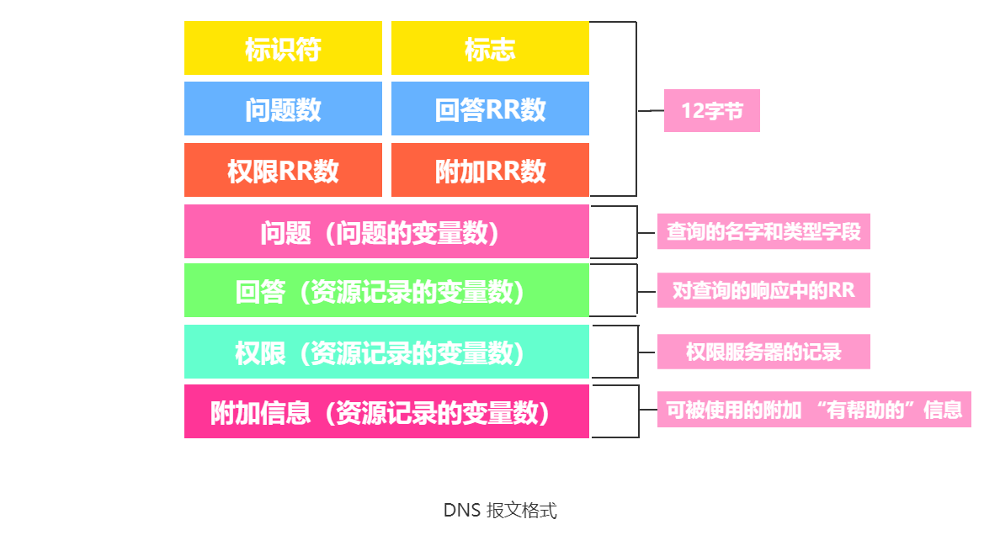
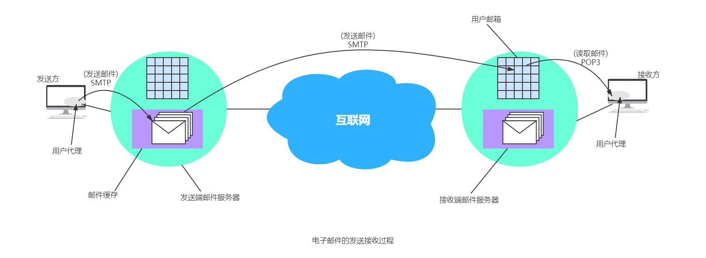
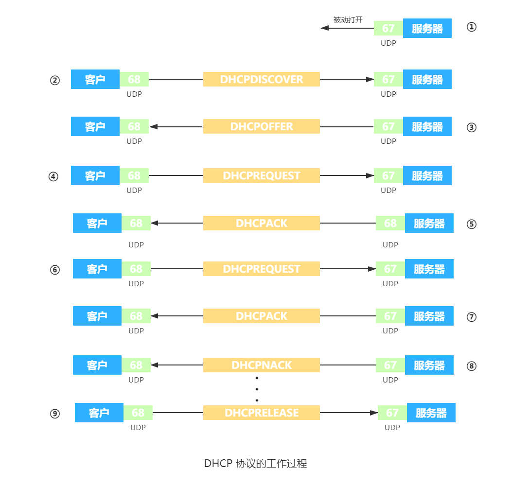

网络应用是计算机网络存在的理由，自网络发明以来，出现了许多拥有用的、有趣的网络应用，如经典的基于文本应用的电子邮件、20世纪90年代的万维网或者是20世纪末的P2P文件共享等。而最近的移动应用更是不胜枚举。互联网应用并没有减缓。

在本篇文档中，我们讨论网络应用的原理和实现。

不同的网络应用的应用进程之间，需要有不同的 **应用层协议(application layer protocol)** 的通信规则来解决位于不同主机中的多个应用进程之间的通信和协同工作来完成。

**应用层协议(application layer protocol)** 的作用就是为了让不同主机中的多个进程之间通信和协同工作。每个应用层协议解决某一类问题。

应用层的具体内容就是精确定义通信规则。应用层协议应当定义：

- 应用进程交换的报文类型，如请求报文和响应报文。
- 各种报文类型的语法，如报文中的各个字段及其详细描述。
- 字段的语义，即包含在字段中的信息的含义。
- 进程何时、如何发送报文，以及对报文进行响应的规则。

注意，应用层协议与网络应用不是同一个概念。应用层协议只是网络应用的一部分。

**客户/服务器模型**

在客户/服务器（Client/Server，C/S）模型中，有一个总是打开的主机称为服务器，它服务于许多来自其它称为客户机的主机请求。工作流程是：

1. 服务器处于接收请求的状态。
2. 客户机发出服务请求，并等待接收结果。
3. 服务器收到请求后，分析请求，进行必要的处理，得到结果并发送给客户机。

客户程序必须知道服务器程序的地址，客户机上一般不需要特殊的硬件和复杂的操作系统。服务器上运行的软件则是专门用来提供某种服务的程序，可同时处理多个远地或本地客户的要求。系统启动后即自动调用并一直不断地运行着，被动地等待并接收来自各地客户的请求。因此，服务器程序不需要知道客户程序的地址。

**客户/服务器模型最主要的特征是：客户是服务请求放，服务器是服务提供方**。如 Web 应用程序，其中总是打开的 Web 服务器服务于运行在客户机上的浏览器的请求。当 Web 服务器接收来自客户机对某对象的请求时，它向该客户机发送所请求的对象以做出响应。常见的使用客户/服务器模型的应用包括 Web、FTP、远程登录和电子邮件等。

客户/服务器模型的主要特点还有：

1. 网络中各计算机的地位不平等，服务器可以通过对用户权限的限制来达到管理客户机的目的，使它们不能随意存储/删除数据，或进行其它受限的网络活动。整个网络的管理工作由少数服务器担当，故网络的管理非常集中和方便。
2. 客户机相互之间不直接通信。例如，在 Web 应用中两个浏览器并不直接通信。
3. 可扩展性不佳。受服务器硬件和网络带宽的限制，服务器支持的客户机数有限。


不难看出，在客户/服务器模型中，服务器性能的好坏决定了整个系统的性能，当大量用户请求服务时，服务器必然成为系统的瓶颈。


**P2P 模型**

而 P2P 模式，对总是打开的基础设施服务器有最小的（或没有）依赖。P2P 的思想是整个网络中的传输内容不再被保存在中心服务器上，每个结点都同时具有下载、上传的功能，其权利和义务都是大体对等的。


在 P2P 模型中，各计算机没有固定的客户和服务器划分。相反，任意一对计算机 —— 称为对等方（Peer），直接相互通信。实际上，P2P 模型从本质上来看仍然是使用客户/服务器方式，每个结点即作为客户访问其它结点的资源，也作为服务器提供资源给其它结点访问。

与 C/S 模型相比，P2P 模型的优点主要体现在：

1. 减轻了服务器的计算压力，消除了对某个服务器的完全依赖，可以将任务分配到各个结点上，因此大大提高了系统效率和资源利用率（例如，播放流媒体时对服务器的压力过大，通过 P2P 模型，可以利用大量的客户机来提供服务）。
2. 多个客户机之间可以可以直接共享文档。
3. 可扩展性好，传统服务器有响应和带宽的限制，因此只能接受一定数量的请求。
4. 网络健壮性强，单个结点的失效也不会影响其它部分的结点。

P2P 模型也有缺点，在获取服务的同时，还要给其它结点提供服务，因此会占用较多的内存，影响整机速度。例如，经常进行 P2P 下载还会对硬盘造成较大的损伤。据某互联网调研机构统计，当前 P2P 程序已经占据了互联网 50%~90%的流量，使网络变得非常拥塞，因此各大 ISP（互联网服务提供商，如电信，网通等）通常都对 P2P 应用持反对态度。

# 域名系统DNS

用户使用便于记忆的主机名字，路由器使用定长且有层次结构的 IP 地址，而 **域名系统**（Domain Name System，DNS）就是为主机名和 IP 地址提供相互转换的服务。

DNS由两部分组成：

1. 一个由分层的 DNS 服务器实现的分布式数据库。
2. 一个使得主机能够查询分布式数据库的应用层协议。

**DNS 的协议运行在 UDP 之上，使用 53 号端口**。

DNS 协议是应用层协议，原因在于：

1. 使用 客户/服务器 模式运行在通信的主机之间。
2. 在通信的主机之间通过下面的端到端运输协议传送 DNS 报文。

DNS 的作用与文件传输应用等不同之处在于，DNS 通常不和用户打交道，而是由其它应用层协议使用，包括 HTTP、SMTP 和 FTP，将用户提供的主机名解析为 IP 地址。

除了进行主机名到 IP 地址的转换外，DNS 还提供了一些重要的服务：

- 主机别名（host aliasing）。有着复杂主机名的主机能拥有一个或者多个别名。
- 邮件服务器别名（mail server aliasing）。电子邮件应用程序可以调用 DNS，对提供的邮件服务器别名进行解析，以获得该主机的规范主机名及其 IP 地址。
- 负载分配（load distribution）。DNS 用于在冗余的服务器之间进行负载分配。繁忙的站点被冗余分布在多台服务器上，每台服务器均运行在不同的端系统上，每个都有着不同的 IP 地址。由于这些冗余的 Web 服务器，一个 IP 地址集合因此与同一规范主机名相联系。DNS 数据库中存储着这些 IP 地址集合。当客户对映射到某地址集合的名字发出一个 DNS 请求时，该服务器用 IP 地址的整个集合进行响应，但在每个回答中循环这些地址次序。因为客户通常总是向 IP 地址排在最前面的服务器发送 HTTP 请求报文，所以 DNS 就在所有这些冗余的 Web 服务器之间循环分配了负载。DNS 的循环同样可以用于邮件服务器。因此，多个邮件服务器可以具有相同的别名。一些内容分发公司如 Akamai 也以更加复杂的方式使用 DNS，以提供 Web 内容分发。

DNS 可以设计成只使用一个 DNS 服务器，该服务器包含所有映射。但这种集中式设计会出现很大的问题：

- 单点故障（a single point of failure）。如果该 DNS 服务器崩溃，整个互联网随之瘫痪！
- 通信容量（traffic volume）。单个 DNS 服务器不得不处理所有的 DNS 查询。
- 远距离的集中式数据库（distant centralized database）。单个 DNS 服务器不可能 “邻近” 所有查询客户。从一边传播到另一边，中间也许还要经过低速和拥塞的链路。这将导致严重的时延。
- 维护（maintenance）。单个 DNS 服务器将不得不为所有的互联网主机保留记录。这不仅将使这个中央数据库非常庞大，而且它还不得不为解决每个新添加的主机而频繁更新。

设计成集中式的 DNS 服务器完全没有扩展能力。因此，DNS 采用分布式的设计方案。它的组织模式采用层次结构，并且分布在全世界范围内。没有一台 DNS 服务器拥有互联网上所有主机的映射。相反，该映射分布在所有的 DNS 服务器上。

## 域名结构

互联网采取层次树状结构的命名方法。采用这种命名方法，任何一个连接在互联网上的主机或路由器，都有一个唯一的层次结构的名字，即 **域名**（domain name）。**域** 是名字空间中一个可被管理的划分。域还分为子域。子域可以继续分为子域的子域，这样就形成了顶级域、二级域、三级域等等。每个域名都由 **标号**（label）序列组成，而各标号之间用点隔开。


DNS 规定域名的标号：

1. 标号都由英文字母和数字组成，每个标号不超过 63 个字符，也不区分大小写字母。
2. 标号中除连字符 `-` 外不能使用其它的标点符号。
3. 级别最低的域名写在最左边，级别最高的顶级域名写在最右边。

各级域名由其上一级域名管理机构管理，最高级的顶级域名由 ICANN 进行管理。

顶级域名(Top Level Domain，TLD)分为三大类：

1. 国家顶级域名 nTLD。采用 ISO 3166 的规定。一般以国家或某些地区命名。如：".cn" 表示中国，“.uk” 表示英国，“.hk” 表示中国香港特别行政区。
2. 通用顶级域名 gTLD。最先确定的 7 个 com，net，org，int，edu，gov，mil 和后续添加的 13 个 aero，asia，biz，cat，coop，info，jobs，mobi，museum，name，pro，tel，travel。
3. 基础结构域名(infrastructure domain)。这种顶级域名只有一个，即 arpa，用于反向域名解析，因此又称反向域名。

国家顶级域名下注册的二级域名均有该国家自行确定。例如，顶级域名为 jp 的日本，将其教育和企业机构的二级域名定为 ac 和 co，而不用 edu 和 com。下图展示域名空间的树状结构。


域名系统中，每个域分别由不同的组织进行管理。每个组织都可以将它的域再分成一定数目的子域，并将这些子域委托给其它组织去管理。例如，管理 cn 域的中国将 edu.cn 子域授权给中国教育和科研计算机网（CERNET）来管理。

## 域名服务器

互联网的域名系统被设计成一个联机分布式的数据库系统，并采用客户/服务器模型。域名到 IP 地址的解析由运行在域名服务器上的程序完成的，一个服务器所负责管辖的（或有权限的）范围称为一个服务器所负责管辖的（或有权限的）范围叫做区(zone)。各单位根据具体情况来划分自己管辖范围的区。但在一个区中的所有节点必须是能够联通的。每一个区设置相应的权限域名服务器(authoritative name server)，用来保存该区中的所有主机的域名到IP地址的映射。每一个域名服务器都能够进行部分域名到 IP 地址的解析。当某个 DNS 服务器不能进行域名到 IP 地址的映射时，它就设法找互联网上别的域名服务器进行解析。

DNS 使用了大量的域名服务器，它们以层次方式组织。没有一台域名服务器具有互联网上所有主机的映射，相反，该映射分布在所有的 DNS 上。采用分布式设计的 DNS，是一个在互联网上实现分布式数据库的精彩范例。根据域名服务器起到的作用，分为 4 中不同类型的域名服务器：

**1.根域名服务器**

根域名服务器（root name server）是最高层次的域名服务器。所有的根域名服务器都知道所有的顶级域名服务器的域名和 IP 地址。根域名服务器是最重要的域名服务器，因为不管是哪一个本地域名服务器，若要对应互联网上任何一个域名进行解析（即转换为 IP 地址），只要自己无法解析，就首先要求助于根域名服务器。

互联网上有 13 个根 DNS 服务器，尽管我们我们将这 13 个根 DNS 服务器中的每个都视为单个的服务器，但每台 “服务器” 实际上是一个冗余服务器的网络，以提供安全性和可靠性。

根域名服务器采用 **任播** (anycast)技术，当 DNS 客户向某个域名服务器的 IP 地址发出查询报文时，互联网上的路由器就能找到离这个DNS客户最近的一个根域名服务器。这样做不仅加快了DNS的查询过程，也更加合理地利用了互联网的资源。

值得注意的是，在许多情况下，根域名服务器并不直接把待查询的域名直接转换成 IP 地址（根域名服务器也没有存放这种信息），而是告诉本地域名服务器下一步应当找哪一个顶级域名服务器进行查询。

**2.顶级域名服务器(即TLD服务器)**

这些域名服务器负责管理在该顶级域名服务器注册的所有二级域名。当收到DNS查询请求时，就给出相应的回答（可能是最后的结果，也可能是下一步应当找的域名服务器的IP地址）。

**3.权限域名服务器（授权域名服务器）**

每一个主机都必须在权限服务器出登记。权限域名服务器总是能够将其管辖的主机名转换为该主机的 IP 地址。当一个权限域名服务器还不能给出最后的查询回答时，就会告诉发出查询请求的DNS客户，下一步应当找哪一个权限域名服务器。

**4.本地域名服务器(local name server)**

本地域名服务器严格来说并不属于域名服务器层次结构，但它对 DNS 层次结构是重要的。每个因特网服务提供者 ISP，或者一个大学，甚至一个大学里的系，都可以有一台本地域名服务器。当一台主机发出DNS查询请求时，这个查询请求报文就发送给本地域名服务器。

DNS 域名服务器的层次结构如图所示。


## 域名解析

域名解析是指把域名映射成为 IP 地址或把 IP 地址映射成为域名的过程。前者称为正向解析，后者称为反向解析。当客户端需要域名解析时，通过本机的 DHS 客户端构成一个 DNS 请求报文，以 UDP 数据报方式发往本地域名服务器。域名解析有两种方式：递归查询和递归与迭代相结合的查询。递归查询的过程如图(a)所示，由于该方法给根域名服务器造成的负载过大，所以在实际中几乎不使用。

常用递归与迭代相结合的查询方式，如图(b)所示，该方法分为两部分。


（1）主机向本地域名服务器的查询采用的是递归查询

如果本地主机所询问的本地域名服务器不知道被查询域名的 IP 地址，那么本地域名服务器就以 DNS 客户的身份，向根域名服务器继续发出查询请求报文（即替该主机继续查询），而不是让该主机自己进行下一步的查询。在这种情况下，本地域名服务器只需向根域名服务器查询一次，后面的几次查询都是递归地在其它几个域名服务器之间进行的[见图 (a) 中的步骤③~⑥]。在步骤 ⑦ 中，本地域名服务器从根域名服务器得到了所需的 IP 地址，最后在步骤 ⑧ 中，本地域名服务器把查询结果告诉主机 m.xyz.com。

（2）本地域名服务器向根域名服务器的查询采用迭代查询

当域名服务器收到本地域名服务器发出的迭代查询请求报文时，要么给出所要查询的 IP 地址，要么告诉本地域名服务器：“你下一步应当向哪个顶级域名服务器进行查询”。然后让本地域名服务器向这个顶级域名服务器进行后续的查询，如图 (b) 所示。同样，顶级域名服务器收到查询报文后，要么给出所要查询的 IP 地址，要么告诉本地域名服务器下一步应向哪个权限域名服务器查询。最后，知道所要解析的域名的 IP 地址后，把这个结果返回给发起查询的主机。

下面举例说明域名解析的过程。假定某客户想获知域名为 y.abc.com 主机的 IP 地址，域名解析的过程如下：

1. 客户机向其本地域名服务器发出 DNS 请求报文。
2. 本地域名服务器收到请求后，查询本地缓存。若没有该记录，则以 DNS 客户的身份向根域名服务器发出解析请求。
3. 根域名服务器收到请求后，判断该域名属于`.com`域，将对应的顶级域名服务器 `dns.com` 的 IP 地址返回给本地域名服务器。
4. 本地域名服务器向顶级域名服务器 `dns.com` 发出解析请求报文。
5. 顶级域名服务器 `dns.com` 收到请求后，判断该域名属于 `abc.com` 域，故将对应的权限域名服务器 `dns.abc.com` 的 IP 地址返回给本地域名服务器。
6. 本地域名服务器向权限域名服务器 `dns.abc.com` 发起解析请求报文。
7. 权限域名服务器 `dns.abc.com` 收到请求后，将查询结果返回给本地域名服务器。
8. 本地域名服务器将查询结果保存到本地缓存，同时返回给客户机。

为了提高 DNS 的效率，并减少因特网上的 DNS 查询报文数量，在域名服务器中广泛地使用了高速缓存，当一个 DNS 服务器接收到 DNS 查询结果时，它能将该 DNS 信息缓存在告诉缓存中。这样，当另一个相同的域名查询到达该 DNS 服务器时，该服务器就能够直接提供所要求的 IP 地址，而不需要再去向其它 DNS 服务器询问。因为主机名和 IP 地址之间的映射不是永久的，所以 DNS 服务器将在一段时间后丢弃告诉缓存中的信息。

域名到 IP 地址的解析过程要点如下：

1. 应用进程需要把主机名解析为 IP 地址时，该应用进程就调用解析程序(resolver)，并成为 DNS 的一个客户，把待解析的域名放在 DNS 请求报文中，以 UDP 用户数据报方式发给本地域名服务器。
2. 本地域名服务器在查找域名后，把对应的 IP 地址放在回答报文中返回。应用进程获得目的主机的 IP 地址后即可进行通信。
3. 本地域名服务器不能回答该请求，则此域名服务器就暂时成为 DNS 中的另一个客户，并向其它域名服务器发出查询请求。这种过程直至找到能够回答该请求的域名服务器未为止。

## DNS 记录

共同实现 DNS 分布式数据库的所有 DNS 服务器存储了 **资源记录**（Resource Record， RR），RR 提供了主机名到 IP 地址的映射。每个 DNS 回答报文包含了一条或多条资源记录。

资源记录是一个包含了下列字段的 4 元组：（Name，Value，Type，TTL）。

TTL为记录的生存时间，决定了资源记录应当从缓存中删除的时间。当忽略掉 TTL 时。Name 和 Value 的值就取决于 Type：

- `Type=A`时，`Name`是主机名，`Value`是主机名对应的 IP 地址。
- `Type=NS`时，`Name`是一个域（如foo.com），`Value`是该域中主机 IP 地址的权限 DNS 服务器的主机名。这个记录用于沿着查询链来路由 DNS 查询。
- `Type=CNAME`时，`Value`是别名为`Name`的主机名对应的规范主机名。
- `Type=MX`时，`Value`是个别名为`Name`的邮件服务器的规范主机名。

## DNS 报文

DNS 只有查询和回答两种报文，切两种报文的格式相同，如图所示。



DNS 报文中各字段的语义如下：

- 前 12 个字节是 **首部区域**，有 6 个字段。
	- 标识符：一个 16 比特的数，用于标识该查询。这个标识符会被复制到对查询的回答报文中，以便让客户用它来匹配发送的请求和接收到的回答。
	- 标志字段：有若干字段。
		- 1 比特的 “查询/回答” 标志位。0 指查询报文，1 指回答报文。
		- 1 比特的 “权威的” 标志位。置于回答报文中。
		- 如果客户（主机或者 DNS 服务器）在该 DNS服务器没有某记录时希望它执行递归查询，将设置 1 比特的 “希望递归” 标志位。
		- 如果该 DNS 服务器支持递归查询，在它的回答报文中会对 1 比特的 “递归可用” 标志位置位。
	- 在该首部中，还有 4 个有关数量的字段，这些字段指出了在首部后的 4 类数据区域出现的数量。

- **问题区域** 包含着正在进行的查询信息。该区域包括：
	- ①名字字段，指出正在被查询的主机名字；
	- ②类型字段，指出有关该名字的正被询问的问题类型，例如主机地址是与一个名字相关联（类型A）还是与某个名字的邮件服务器相关联（类型MX）。

- **回答区域**： 在来自 DNS 服务器的回答中，包含了对最初请求的名字的资源记录。在回答报文的回答区域中可以包含多条 RR，因此一个主机名能够有多个 IP 地址。

- **权限区域**：包含了其它权威服务器的记录。

- **附加区域**：包含了一条资源记录。

# FTP

**FTP **（File Transfer Protocol，文件传送协议）是互联网上使用最广泛的文件传送协议。FTP 提供交互式的访问，允许客户指明文件的类型与格式），并允许文件具有存取权限，FTP 屏蔽了各计算机系统系统的细节，因而适合于在异构网络中任意计算机之间传送文件。

FTP 提供以下功能：

1. 提供不同种类主机系统（硬、软件体系等都可以不同）之间的文件传输能力。
2. 以用户权限管理的方式提供用户对远程 FTP 服务器上的文件管理能力。
3. 以匿名 FTP 的方式提供公用文件共享的能力。

FTP 采用客户/服务器的工作方式，它使用 TCP 可靠的传输服务。一个 FTP 服务器进程可同时为多个客户进程提供服务。FTP 的服务器进程由两大部分组成：一个主进程，负责接收新的请求；另外有若干个从属进程，负责处理单个请求。其工作步骤如下：

1. 打开熟知端口（端口号为21），使客户进程能够连接上。
2. 等待客户进程发出连接请求。
3. 启动从属进程处理客户进程发来的请求。从属进程对客户进程的请求处理完毕后即终止，但从属进程在运行期间根据需要还可能创建其它一些子进程。
4. 回到等待状态，继续接受其它客户进程发来的请求。主进程与从属进程的处理是并发进行的。

FTP 服务器 必须在整个会话期间保留用户的状态信息，特别是服务器必须把指定的用户账户与控制连接联系起来，服务器必须追踪用户在远程目录树上的当前位置。

在文件传输时，FTP 的客户和服务器之间要建立两个并行的 TCP 连接：控制连接（端口号 21）和数据连接（端口号 20）。使用两个不同的端口号可使协议更加简单和更容易实现。


**1.控制连接**

服务器监听在 21 号端口，等待客户连接，建立在这个端口上的连接称为控制连接，控制连接用来传输控制信息（如连接请求、传送请求等）。并且控制信息都是以 7 位 ASCII 格式传送的。FTP 客户发出的传送请求，通过控制连接发送给服务器端的控制进程，但控制连接并不用来传送文件。在传输文件时还可以使用控制连接（例如，客户在传输中途发一个中止传输的命令），因此控制连接在整个会话期间一直保持打开状态。

**2.数据连接**

服务器端的控制进程在接收到 FTP 客户发送来的文件传输请求后就创建 “数据传送进程” 和 “数据连接”。数据连接用来连接客户端和服务器端的数据传送进程，数据传送进程实际完成文件的传送，在传送完毕后关闭 “数据传送连接” 并结束运行。

因为 FTP 使用了一个分离的控制连接，所以也称 FTP 的控制信息是带外（Out-of-band）传送的。使用 FTP 时，若需要修改服务器上的文件，则需要先将此文件传送到本地主机，然后再将修改后的文件副本传送到原服务器。

网络文件系统 NFS 采取另一种思路， 允许进程打开一个远地文件，并在该文件的某个特定位置开始读写数据。这样， NFS 可使用户复制一个大文件中的一个很小的片段，而不需要复制整个大文件。


## TFTP

**TFTP**（Trivial File Transfer Protocol，简单文件传送协议）是一个很小且易于实现的文件传送协议，使用客户/服务器方式。由于使用 UDP 数据报，不提供可靠传输，因此需要有自己的差错改正措施。

TFTP 支持文件传输，不支持交互。没有庞大的命令集，没有列目录功能，不能对用户进行身份鉴别。但 TFTP 主要有两个优点：

1. TFTP 可用于 UDP 编程。如当需要将程序或文件同时向许多机器下载时往往需要使用 TFTP。
2. TFTP 代码所占内存较小。对较小的计算机或某些特殊用途的设备很重要。

TFTP 的主要特点是：

1. 每次传送的数据报文中有 512 字节的数据，但最后一次可不足 512 字节。
2. 数据报文按序编号，从 1 开始。
3. 支持 ASCII 码或二进制传送。
4. 可对文件进行读或写。
5. 使用很简单的首部。

TFTP 工作很像停止等待协议。发送完一个文件块后等待对方确认，确认时应指明所确认的块编号。发完数据后在规定时间内收不到确认要重发数据 PDU。发送确认 PDU 的一方若在规定时间内收不到下一个文件块，也重发确认 PDU。保证文件传送不致因某一个数据报的丢失而告失败。

开始工作时，TFTP 客户进程发送一个读请求报文或写请求报文给 TFTP 服务器进程，熟知端口号为 69。TFTP 服务器进程要选择一个新的端口和 TFTP 客户进程通信。若文件长度恰好为 512 字节的整数倍，则文件传送完毕后，必须在最后发送一个只含首部而无数据的数据报文。若文件长度不是 512 字节的整数倍，则最后传送数据报文中的数据字段一定不满 512 字节，正好作为文件结束的标志。

# TELNET

TELNET 是一个简单的 **远程终端协议**，是 TCP/IP 协议族中的一员。用户可以远程控制网络中的某一主机。TELNET 协议能够用户使用的本地主机（称为仿真终端）与远程主机进行交互。因此 TELNET 又称为 **终端仿真协议**。

TELNET 使用客户服务器方式。在本地系统运行 TELNET 客户进程，而在远地主机则运行 TELNET 服务器进程。和 FTP 的情况相似，服务器中的主进程等待新的请求，并产生从属进程来处理每一个连接。

TELNET 的工作过程：

1. TELNET 客户端将用户的击键和命令转换成 **NVT** (Network Virtual Terminal，网络虚拟终端) 格式，并送交服务器。
2. 服务器把收到的数据和命令从 NVT 格式转换成远地系统所需的格式。
3. 向用户返回数据时，服务器把远地系统的格式转换为 NVT 格式，本地客户再从 NVT 格式转换到本地系统所需的格式。


NVT 的格式定义很简单。所有的通信都使用 8 位一个字节。在运行时，NVT 使用 7 位 ASCII 码传送数据，而当高位置 1 时用作控制命令。

TELNET 的选项协商(Option Negotiation)使 TELNET 客户和 TELNET 服务器可商定使用更多的终端功能，协商的双方是平等的。

# Web 

**World Wide Web** 简称 Web，中文翻译万维网，它是一个 **大规模的，联机式的信息储藏所**。使用 **链接** (link)的方法从一个站点访问另一个站点，从而主动地按需获取丰富的信息。

万维网是一个分布式的 **超媒体(hypermedia)** 系统，它是 **超文本(hypertext)** 系统的扩充。所谓超文本是指包含指向其它文档的链接的文本(text)。也就是说，一个超文本由多个信息源链接成，而这些信息源可以分布在世界各地，并且数目也是不受限制的。利用一个链接可使用户找到远在异地的另一个文档，而这又可链接到其它的文档（依次类推）。这些文档可以位于世界上任何一个接在互联网上的超文本系统中。超文本是万维网的基础。

万维网以客户服务器方式工作。浏览器是用户主机上的万维网客户端。万维网文档所在主机为万维网服务器。**客户端向服务器端发出请求，服务器端向客户端发送客户端所需的万维网文档**。客户端上显示的万维网文档被称为 **页面(page)**。工作流程如下：

1. Web 用户使用浏览器（指定 URL）与 Web 服务器建立连接，并发送浏览请求。
2. Web 服务器把 URL 转换为文件路径，并返回信息给 Web 浏览器。
3. 通信完成，关闭连接。

万维网是无数个网络站点和网页的集合，它们在一起构成了互联网最主要的部分（互联网也包括电子邮件、Usent 以及新闻组）。

万维网的核心部分由三个标准构成：

1. **URL**（Uniform Resource Locator，统一资源定位符），用于标识万维网上的各种文档，并使每一个文档在整个互联网的范围内具有唯一的标识符 URL。
2. **HTTP**（HyperText Transfer Protocol，超文本传送协议），是一个应用层协议，使用 TCP 连接进行可靠的传送，HTTP 是使万维网客户端与万维网服务器之间的交互遵守严格的协议。
3. **HTML**（HyperText Markup Language），是一种文档结构的标记语言，使用一些约定的标记对页面上的各种信息（包括文字、声音、图像、视频等）、格式进行描述。

## URL

**URL** 是 **Uniform Resource Locator** 的缩写，可以从互联网上得到资源位置和访问资源的方法。实际上就是互联网上的资源的地址。互联网上的所有资源都有一个唯一确定的 URL。“资源” 指的是互联网上可以被访问的任何对象（包括文件目录、文件、文档、图像、声音等），以及与互联网相连的任何形式的数据。URL相当于一个文件名在网络范围的扩展，是与互联网相连的机器上的任何可访问对象的一个指针。

URL 的一般形式是：

```http
protocol://hostname[:port][path][?query][#fragment]
```

- `protocol`（协议）：常用的协议有 `HTTP`、`FTP` 等。
- `hostname`（主机地址）：存放资源的主机在互联网中的域名，也可以是 IP 地址。
- `port`（端口号）：HTTP 的默认端口号为 `80`，有时可省略。
- `path`（路径）：以 `/` 字符区别路径中的每一个目录名称，有时可省略。
- `query`（查询）：为 GET 模式的窗体参数，以 `?` 字符为起点，每个参数以 `&` 隔开，再以 `=` 分开参数名称与数据。
- `fragment`（片段）：用于指定网络资源中的片段。例如一个网页中有多个名词解释，可使用`fragment`直接定位到某一名词解释。以 `#` 字符为起点。

在 URL 中不区分大小写。下面给出一个例子：

```http
https://www.tsinghua.edu.cn/ssjgy.jsp?wbtreeid=1010#computer
```

① `https` 是协议；  
② `www.tsinghua.edu.cn`是主机地址；  
③ `/ssjgy.jsp` 是路径；  
④ `?wbtreeid=1010` 是查询；  
⑤ `#computer` 是片段。

## HTTP

**HTTP** 是 **HyperText Transfer Protocol** 的缩写，该协议定义了浏览器（万维网客户端进程）怎样向万维网服务器请求万维网文档，以及服务器怎样把文档传送给浏览器。从层次的角度看，HTTP 是 **面向事务的(transaction-oriented)** 应用层协议，它是万维网上能够可靠地交换文件（包括文本、声音、图像等各种多媒体文件）的重要基础。

注意：HTTP 不仅传送完成超文本跳转所必需的信息，而且也传送任何可从互联网上得到的信息，如文本、超文本、声音和图像等。

**1.HTTP 的操作过程**

从协议执行过程来说，浏览器要访问 WWW 服务器时，首先要完成对 WWW 服务器的域名解析。一旦获得了服务器的 IP 地址，浏览器将通过 TCP 向服务器发送连接建立请求。

万维网的大致工作过程如下图所示。每个万维网站点都有一个服务器进程，它不断地监听 TCP 的端口 80（默认），当监听到连接请求后便与浏览器建立连接。TCP 连接建立后，浏览器就向服务器发送请求获取某一 Web 页面的 HTTP 请求。服务器收到 HTTP 请求后，将构建所请求的 Web 页所必须的信息，并通过 HTTP 响应返回给浏览器。浏览器再进行解析，然后将 Web 页显示给用户。最后，TCP 连接释放。


在浏览器和服务器之间的请求和响应的交互，必须按照规定的格式和遵循一定的规则，这些格式和规则就是 HTTP。因此 HTTP 有两类报文：请求报文（从 Web 客户端向 Web 服务器发送服务请求）和响应报文（从 Web 服务器向 Web 客户端请求的回答）。

用户单击鼠标后所发生得事件按顺序如下（以访问清华大学的网站为例）：

1. 浏览器分析链接指向页面的 URL（`https://www.tsinghua.edu.cn/ssjgy.jsp`）。
2. 浏览器向 DNS 请求解析 `www.tsinghua.edu.cn` 的 IP 地址。
3. 域名系统 DNS 解析出清华大学服务器的 IP 地址。
4. 浏览器与该服务器建立 TCP 链接（默认端口号 80）。
5. 浏览器发出 HTTP 请求：GET `/ssjgy.jsp`。
6. 服务器通过 HTTP 响应把 `ssjgy.jsp` 发送给浏览器。
7. TCP 连接释放。
8. 浏览器将文件 `ssjgy.jsp` 进行解释，并将 Web 页显示给用户。

**2.HTTP 协议的特点**

HTTP 协议是无状态的。也就是说，同一个客户第二次访问同一个服务器上的页面时，服务器的响应与第一次被访问时的相同。因为服务器并不记得曾经访问过的这个客户，也不记得为客户曾经服务过多少次。

HTTP 的无状态特性简化了服务器的设计，使服务器更容易支持大量并发的 HTTP请求。在实际应用中，通常使用 Cookie 加数据库的方式来跟踪用户的活动（如记录用户最近浏览的商品等）。Cookie 是一个存储在用户主机中的文本文件，里面含有一串 “识别码”，如 “123456”，用于 Web 服务识别用户。Web 服务器根据 Cookie 就能从数据库中查询到该用户的活动记录，进而执行一些个性化的工作，如根据用户之前浏览过的商品向其推荐新产品等。

HTTP 采用 TCP 作为运输层协议，保证了数据的可靠传输。HTTP 不必考虑数据在传输过程中被丢弃后又怎样被重传。但是，HTTP 本身是无连接的。也就是说，虽然 HTTP 使用了 TCP 连接，但通信的双方在交换 HTTP 报文之前不需要先建立 HTTP 连接。

HTTP 既可以使用非持久连接，也可以使用持久连接（HTTP/1.1 支持）。

对于非持久连接，每个网页元素对象（如 JPEG 图形、Flash 等）的传输都需要单独建立一个 TCP 连接，如图所示（第三次握手的报文段中捎带了客户对万维网文档的请求）。也就是说，请求一个万维网文档所需的时间是该文档的传输时间（与文档大小成正比）加上两倍往返时间 RTT（一个 RTT 用于 TCP 连接，另一个 RTT 用于请求和接收文档）。


所谓持久连接，是指万维网服务器在发送响应后仍然保持这条连接，使同一个客户和服务器可以继续在这条连接上传送后续的 HTTP 请求与响应报文，如图所示：


持久连接又分为非流水线和流水线两种方式，对于非流水线方式，客户在收到一个响应后才能发出下一个请求。HTTP/1.1 的默认方式是使用流水线的持久连接。这种情况下，客户每遇到一个对象引用就立即发出一个请求，因而客户可以逐个地连续发出对各个引用对象的请求。如果所有的请求和响应都是连续发送的，那么所有引用的对象共计经历 1 个 RTT 延迟，而不是像非流水线方式那样，每个引用都必须有 1 个 RTT 延迟。

**3.HTTP 的报文结构**

 HTTP 是 **面向文本的(text-oriented)**，因此在报文中的每一个字段都是一些 ASCII 码串，因而各个字段的长度都是不确定的。HTTP 有两类报文：

1. 请求报文 —— 从客户向服务器发送请求报文，见下图 (a)。
2. 响应报文 —— 从服务器到客户的回答，见下图 (b)。


HTTP 请求报文和响应报文都是由三个部分组成的。可以看出，这两种报文格式的区别就是开时行不同。

1. **开时行**，用于区分是请求报文还是响应报文。在请求报文中的开始行叫做**请求行(Request-Line)**，而在响应报文中的开始行叫做 **状态行(Status-Line)**。在开始行的三个字段之间都以空格分隔开，最后的 "CR" 和 "LF" 分别代表 “回车” 和 “换行”。请求报文的第一行 “请求行” 只有三个内容：方法、请求资源的 URL 以及 HTTP 的版本。响应报文的第一行 “状态行” 包括三项内容：HTTP 版本，状态码以及解释状态码的简单短语。
2. **首部行**，用来说明浏览器、服务器或报文主体的一些信息。首部可有好几行，但也可以不使用。在每一个首部行中都有首部字段名和它的值，每行在结束的地方都要有 “回车” 和 “换行”。整个首部行结束时，还有一空行将首部行和后面的实体主体分开。
3. **实体主体(entity body)**，在请求报文中一般都不用这个字段，而在响应报文中也可能没有这个字段。

下面介绍请求报文的主要特点。

所谓 **方法** 就是对所请求的对象进行的操作，这些方法实际上也就是一些命令。因此，请求报文的类型是由它所采用的方法决定的。下表给出请求报文中常用的几种方法。

|方法（操作）|意义|支持的 HTTP 协议版本|
|:---:|:---:|:---:|
|HEAD|请求读取由URL所标志的信息的首部|1.0、1.1|
|GET|请求读取由URL所标志的信息|1.0、1.1|
|POST|给服务器添加信息（例如，注释）|1.0、1.1|
|PUT|在指明的URL下存储一个文档|1.1|
|DELETE|删除指明的URL所标志的资源|1.1|
|OPTION|请求一些选项的信息|1.1|
|TRACE|用来进行环回测试的请求报文|1.1|
|CONNECT|用于代理服务器|1.1|

下面提供一个 HTTP 的请求报文：

```http
GET /dir/index.htm HTTP/1.1		{请求行使用了相对 URL}
Host: www.xyz.edu.cn			 {此行是首部行的开始。这行给出了主机的域名}
Connection: close				{告诉服务器发送完请求的文档后就可释放连接}
User-Agent: Mozilla/5.0			{表名用户代理是使用火狐浏览器 Firefox}
Accept-Language: cn				{表示用户希望优先得到中文版本的文档}
								{请求报文的最后还有一个空行}
```

如上所示，它是 `http://www.xyz.edu.cn/dir/index.htm` 完整请求的请求头。通过观察它，让我们知道：①报文是用普通 ASCII 文本书写的。②该报文由 5 行组成，每行由一个回车和换行符结束。③最后一行再附加一个回车符。

在看一下 HTTP 响应报文的主要特点。

每一个请求报文发出后，都能收到一个响应报文。响应报文的第一行就是状态行。

**状态码(Status-Code)** 由三位数字组成，分 5 大类。这 5 大类的状态码都是以不同的数字开头的。

- 1xx 表示通知信息，如请求收到了或正在进行处理。
- 2xx 表示成功，如接受或知道了。
- 3xx 表示重定向，如要完成请求还必须采取进一步的行动。
- 4xx 表示客户的差错，如请求中有错误的语法或不能完成。
- 5xx 表示服务器的差错，如服务器失效无法完成请求。

下面提供一个响应报文：

```http
HTTP/1.1 200 OK							{状态行指示服务器在使用 HTTP/1.1，并且一切正常}
Connection: close						{首部行告诉客户，发送完报文后将关闭该TCP连接}
Date: Sun, 09 Aug 2020 18:44:04 GMT		{首部行指示服务器产生并发送该响应报文的日期和时间}
Server: Apache/2.2.3 (CentOS)			{首部行指示该报文由一台 Apache Web 服务器产生，类似于HTTP请求报文中的User-agent}
Last-Modified: Sun, 09 Aug 2020 18:20:03 GMT	{首部行指示对象创建或者修改的日期和时间}
Content-Length: 6821					{首部行指示被发送对象中的字节数}
Content-Type: text/html					{首部行指示实体中的对象是 HTML 文本}

(data data data data data ...)			{请求的对象本身}
```

一些常见的状态码和相关的短语包括：

- 200 OK：请求成功，信息在返回的响应报文中。
- 301 Moved Permanently：请求的对象已经被永久转移了，新的 URL 定义在响应报文的 Location：首部行中。客户软件将自动获取新的 URL。
- 400 Bad Request：一个通用差错代码，指示该请求不能被服务器理解。
- 404 Not Found：被请求的文档不在服务器上。
- 505 HTTP Version Not Supported：服务器不支持请求报文使用的 HTTP 协议版本。

**4.cookie**

HTTP 服务器是无状态的，但一个 Web 站点通常希望能够识别用户，可能是因为服务器希望限制用户的访问，或者因为它希望把内容与用户身份联系起来。为此，HTTP 使用了 Cookie，它允许站点对用户进行跟踪。目前大多数商务 Web 站点都使用了 Cookie。

Cookie 技术有 4 个组件：

1. 在 HTTP 响应报文中的一个 cookie 首部行。
2. 在 HTTP 请求报文中的一个 cookie 首部行。
3. 在用户端系统中保留有一个 cookie 文件，并由用户的浏览器进行管理。
4. 位于 Web 站点的一个后端数据库。

Cookie 工作流程：第一次访问某个 Web 服务器时，服务器会为用户产生一个唯一识别码，并以此作为索引在服务器的后端数据库中产生一个项目。接着在给用户返回的响应报文中添加 `Set-cookie` 首部行，并将唯一识别码赋予 `Set-cookie`。用户会接收到响应后，其浏览器在它管理的特定 Cookie 文件中添加一行，其中包括服务器的主机名和 `Set-cookie` 后面给出的识别码。当再次访问这个网站时，浏览器会从其 Cookie 文件中取出网站的识别码并放到 HTTP 请求报文的 Cookie 首部行中，此时服务器能够跟踪该用户在该网站的活动。

**5.代理服务器**

**代理服务器**（proxy server）也叫 Web 缓存器（Web cache），它能够代表初始 Web 服务器来满足 HTTP 请求的网络实体。它有自己的磁盘存储空间，并在存储空间中保存最近请求过的对象的副本。

下面来讲述它的作用：

下图(a) 是不使用代理服务器的情况。这时，校园网中所有的计算机都通过 2 Mbit/s 专线链路（$R_1 - R_2$）与互联网上的源点服务器建立 TCP 连接。因而校园网各计算机访问互联网的通信量往往会使这条 2 Mbit/s 的链路过载，使得时延大大增加。

下图(b)是使用代理服务器的情况。这时的访问过程：

1. 校园网的计算机中的浏览器向互联网的服务器请求服务时，就先和校园网的代理服务器建立 TCP 连接，并向代理服务器发出 HTTP 请求报文。
2. 若代理服务器已经存放了所请求的对象，代理服务器就把这个对象放入 HTTP 响应报文中返回给计算机的浏览器。
3. 否则，代理服务器就代表发出请求的用户浏览器，与互联网上的源点服务器(origin server)建立 TCP 连接，并发送 HTTP 请求报文。
4. 源点服务器把所请求的对象放在 HTTP 响应报文中返回给校园网的代理服务器。
5. 代理服务器收到这个对象后，先复制在自己的本地存储器中（留待以后用），然后再把这个对象放在 HTTP 响应报文中，通过已建立的 TCP 连接，返回给请求该对象的浏览器。


值得注意的是，代理服务器是服务器（当接受浏览器的 HTTP 请求时）同时又是客户（当向互联网上的源点服务器发送 HTTP 请求时）。

在互联网上部署 Web 缓存器有两个原因：

- 能大大减少对客户请求的响应时间。
- 减低互联网上的 Web 流量，改善应用性能。

虽然高速缓存能减少响应时间，但也引入一个新的问题，即存放在缓存器中的对象副本可能是陈旧的。但 HTTP 协议由一种机制，允许缓存器证实它的对象是最新的，这种机制就是 **条件GET**（conditional GET）方法。

条件 GET 请求报文要满足以下要求：

1. 请求报文使用 GET 方法。
2. 请求报文中包含一个 `If-Modified-Since:` 首部行。

看一个操作 `GET` 方法的例子：

首先，一个代理缓存器（proxy cache）代表一个请求浏览器，向某Web 服务器发送一个请求报文：

```http
GET /fruit/kiwi.gif HTTP/1.1
Host: www.exotiquecuisine.com
```

其次，该 Web 服务器向缓存器发送具有被请求的对象的响应报文：

```http
HTTP/1.1 200 OK
Date: Sat, 8 Oct 2011 15:39:29
Server: Apache/1.3.0 (Unix)
Last-Modified: Wed, 7 Sep 2011 09:23:24
Content-Type: image/gif

(data data data data data ...)
```

该缓存器在将对象转发到请求的浏览器的同时，在本地缓存了该对象并且也存储了最后修改日期。一段时间后，另一个用户经过该缓存器请求同一个对象，该对象仍在这个缓存器中。但位于 Web 服务器上的该对象可能已被修改，该缓存器通过发送一个条件 GET 执行最新检查。具体来说，该缓存器发送：

```http
GET /fruit/kiwi.gif HTTP/1.1
Host: www.exotiquecuisine.com
If-Modified-Since: Wed, 7 Sep 2011 09:23:24
```

`If-Modified-Since` 的值等于之前发送的响应报文中的 `Last-Modified`。该条件 GET 报文告诉服务器，仅当自指定日期之后对该对象修改过，才发送该对象。假设没被修改过，会执行下面的步骤，Web 服务器向该缓存器发送一个响应报文：

```http
HTTP/1.1 304 Not Modified
Date: Sat, 15 Oct 2011 15:39:29
Server: Apache/1.3.0 (Unix)

(empty entity body)
```

作为该条件 GET 方法的响应，该 Web 服务器仍发送一个响应报文，但并没有在该响应报文中包含所请求的对象。状态行中为 304 Not Modified，告诉缓存器可以使用该对象，能像请求的浏览器转发代理缓存器缓存的该对象副本。

## HTML

**HTML**（HyperText Markup Language，超文本标记语言）是一种制作万维网页面的标准语言，它消除了不同计算机之间信息交流的障碍。但 **HTML 不是应用层协议**，只是浏览器使用的一种语言。

HTML 定义了许多用于排版的命令，即 "标签"（tag）。如 `<div></div>`、`<i></i>`。HTML 把各种标签嵌入到万维网的页面中，就构成了 HTML 文档。仅当 HTML 文档是以 `.html` 或 `.htm` 为后缀时，浏览器才解释 HTML 文档中的各种标签。如将 HTML 改成 `.txt`，则浏览器只能看见原来的文本文件。

跟浏览器有关的还有几种其它语言：

- **XML**（Extensible Markup Language）是可扩展标记语言，和 HTML 相似。但 XML 设计宗旨是传输数据，并不是显示数据。
- **XHTML**（Extensible HTML）是可扩展超文本标记语言，与 HTML 4.01 几乎相同。但 XHTML 是更严格的 HTML 版本。
- **CSS**（Cascading Style Sheets）是层叠样式表，它是一种样式表语言，用于为 HTML 文档定义布局。CSS 与 HTML 的区别：HTML 用于结构化内容，CSS 用于格式化结构化的内容。

# 电子邮件

自从有了互联网，电子邮件就在互联网上流行起来。电子邮件是一种异步通信方式，通信时不需要双方同时在场。电子邮件把邮件发送到收件人使用的邮件服务器，并放在其中的收件人 **邮箱** 中，收件人可以随时上网到自己使用的邮件服务器进行读取。e-mail 有时也称为 **电子邮箱**。

电子邮件系统具有三个主要组成部分：**用户代理**（user agent）、**邮件服务器**（mail server）、以及 **邮件发送协议**（如 SMTP）和 **邮件读取协议**（如 POP3）。


**1.用户代理**

**用户代理 UA**（user agent）：用户与电子邮件系统的接口，用户代理向用户提供一个很友好的接口来发送和接收邮件。用户代理至少具有以下四个功能：

1. **撰写**：给用户提供编辑信件的环境。
2. **显示**：方便地在计算机屏幕上显示出来信。
3. **处理**：处理包括发送邮件和接收邮件。收件人应能根据情况按不同方式对来信进行处理。
4. **通信**：发件人在撰写完邮件后，利用邮件发送协议发送到用户所使用的邮件服务器。收件人在接收邮件时，使用邮件读取协议从本地邮件服务器接收邮件。

**2.邮件服务器**

**邮件服务器**：组成了电子邮件的核心。邮件服务器的功能是发送和接收邮件，同时还要向发件人报告邮件传送的结果（已交付、被拒绝、丢失等）。

邮件服务器按照客户服务器方式工作。邮件服务器需要使用两种不同的协议。一种协议用于用户代理向邮件服务器发送邮件，如 SMTP 协议；另一种协议用于用户代理从邮件服务器读取邮件，如 POP3 协议。

注意，邮件服务器必须能够同时充当客户和服务器。

**3.邮件发送协议和读取协议**

邮件发送协议用于用户代理向邮件服务器发送邮件或在邮件服务器之间发送邮件，通常使用 SMTP；邮件读取协议用于用户代理从邮件服务器读取邮件，如 POP3（邮局协议的第 3 个版本）。

注意，SMTP 采用的是 “推”（Push）的通信方式，即在用户代理向邮件服务器发送邮件以及邮件服务器之间发送邮件时，SMTP 客户端主动将邮件 “推” 送到 SMTP 服务器端。而 POP3 采用的是 “拉”（Pull）的通信方式，当用户读取邮件时，用户代理向邮件服务器发出请求，“拉” 取用户邮箱中的邮件。

电子邮件的发送接收过程如图所示。



下面简单地介绍电子邮件的收发过程。

1. 发信人调用用户代理来撰写和编辑要发送的邮件。用户代理用 SMTP 协议把邮件传送给发送方邮件服务器。
2. 发送方邮件服务器将邮件放入邮件缓存队列中，等待发送。
3. 运行在发送方邮件服务器的 SMTP 客户进程，发现在邮件缓存中有待发送的邮件，就向运行在接收方邮件服务器的 SMTP 服务器进程发起建立 TCP 连接。
4. TCP 连接建立后，SMTP 客户进程开始向远程的 SMTP 服务器进程发送邮件。当所有的待发送邮件发完了，SMTP 就关闭所建立的 TCP 连接。
5. 运行在接收方邮件服务器中的 SMTP 服务器进程收到邮件后，将邮件放入收信人的用户邮箱中，等待收信人在方便时进行读取。
6. 收信人在打算收信时，调用用户代理，使用 POP3（或 IMAP）协议将自己的邮件从接收方邮件服务器的用户邮箱中取回（如果邮箱中有来信的话）。

**4.电子邮件格式**

一个电子邮件分为信封和内容两大部分。邮件内容分为首部和主体。[RFC 5322] 规定了邮件的首部格式，而邮件的主体部分让用户自由撰写。用户写好首部后，邮件系统自动地将信封所需的信息取出来并卸载信封上，用户不需要填写电子邮件信封上的信息。

邮件内容的首部包括一些关键字，后跟冒号。最重要的关键字是：`To` 和 `Subject`。

`To:` 后面填入一个或多个电子邮件地址。电子邮件地址的规定格式为：`收件人邮箱名@邮箱所在主机的域名`，如 `abc@cskaoyan.com`，其中，收件人邮箱名在这个邮箱服务器上必须唯一，保证邮件地址在整个互联网上也是唯一的。

`Subject:` 是邮件的主题，反映了邮件的主要内容。

`Cc:` 是邮件首部的抄送。来自于 `Carbon copy`（复写副本）。借用旧的名词，表示应给某某人发送一个邮件副本。

`Bcc` （Blind carbon copy）实现盲覆写副本。使发件人能将邮件的副本送给某人，但不希望此事为收件人知道。`Bcc` 又称为 暗送。

`From` 和 `Date`，表示发件人的电子邮件地址和发信日期。这两项一般都由邮件系统自动填入。

`Reply-To`，即对方回信所用的地址。这个地址可以与发件人发信时所用的地址不同。例如有时到外地借用他人的邮箱给自己的朋友发送邮件，但仍希望对方将回信发送到自己的邮箱。可先设置好，不需要每次写信时都设置。

一个典型的邮件内容如下：


**5.SMTP**

**SMTP**（Simple Mail Transfer Protocol，简单邮件传送协议）是一种提供可靠且有效的电子邮件传输的协议，控制两个相互通信的 SMTP 进程交换信息。由于 SMTP 使用客户/服务器方式，因此负责发送邮件的 SMTP 进程就是 SMTP 客户，负责接收邮件的 SMTP 进程就是 SMTP 服务器。SMTP 用的是 TCP 连接，端口号 25。

SMTP 通信分为以下三个阶段：

1. 建立连接：发件人的邮件发送到发送方邮件服务器的邮件缓存后，SMTP 客户就每隔一定时间对邮件缓存扫描一次。如发现有邮件，就使用 SMTP 的熟知端口号（25）与接收方邮件服务器的 SMTP 服务器建立 TCP连接。连接建立后，接收方 SMTP 服务器发出 220 Service ready（服务器就绪）。然后 SMTP 客户向 SMTP 服务器发送 HELO 命令，附上发送方的主机名。

SMTP 不使用中间邮件服务器。TCP 连接总是在发送方与接收方这两个邮件服务器之间直接建立，而不管它们相隔多远。接收方的邮件服务器因故障暂时不能建立连接时，发送方的邮件服务器只能等待一段时间后再次尝试连接。

2. 邮件传送：连接建立后，就可以传送邮件。邮件的传送从 MAIL 命令开始，MAIL 命令后面有发件人的地址。如 `MAIL FROM: <hoopdog@hust.edu.cn>`。若 SMTP 服务器已准备好接收邮件，则回答 250 OK。接着 SMTP 客户端发送一个或多个 RCPT（收件人 recipient 的缩写）命令，格式为 `RCPT TO: <收件人地址>`。每发送一个 RCPT 命令，都应有相应的信息从 SMTP 服务器返回，如 250 OK 或 550 No such user here（无此用户）。

RCPT 命令的作用是，先弄清接收方系统是否已做好接收邮件的准备，然后才发送邮件，以便不至于发送了很长的邮件后才知道地址错误，进而避免浪费通信资源。

获得 OK 的回答后，客户端就是 DATA 命令，表示要开始传输邮件的内容。正常情况下，SMTP 服务器回复信息 `354 Start mail input; end with <CRLF>.<CRLF>`。`<CRLF>`表示回车换行。此时 SMTP 客户端就开始传送邮件内容，并用 `<CRLF>.<CRLF>`（两个回车，中间一个点）表示邮件内容的结束。

3. 连接释放：邮件发送完毕后，SMTP 客户应发送 QUIT 命令。SMTP 服务器返回的信息是 “221（服务关闭）”，表示 SMTP 同意释放 TCP 连接。邮件传送的全部过程即结束。

SMTP 存在一些缺点。如 ①发送电子邮件不需要经过鉴别；②设计为传送 ASCII 码，后来添加的 MIME 可传送二进制数据，但传送非 ASCII 码的长报文时，网络传输效率不高；③传送的邮件是明文，不利于保密。

基于以上问题，[RFC 5321] 对 SMTP 进行了扩充，成为 **扩充的 SMTP**（Extended SMTP），记为 ESMTP。[RFC 5321] 在许多命令中增加扩展的参数。新增加的功能有：客户端的鉴别，服务器接受二进制报文，服务器接受分块传送的大报文，发送前先检查报文的大小，使用安全传输 TLS，以及使用国际化地址等。使用 ESMTP 客户端传送报文时，不发送 HELO 而是发送 EHLO 报文。EHLO 报文被对方服务器拒绝，表明对方是 SMTP 服务器（不使用扩展参数），因而按照原来使用的 SMTP 参数发送邮件。如果 EHLO 报文被接收，那客户端可以使用 ESMTP 扩展的参数传送报文。

**6.MIME**

SMTP 有以下缺点：

- SMTP 不能传送可执行文件或其它二进制对象。
- SMTP 限于传送 7 位的 ASCII 码。
- SMTP 服务器会拒绝超过一定长度的邮件。
- SMTP 的某些实现并没有按照 SMTP 的互联网标准。

因此提出了 **MIME**（Multipurpose Internet Mail Extensions，多用途网际邮件扩充）。

MIME 并没有改动 SMTP 或取代它。MIME 的意图是继续使用目前的格式，但增加了邮件主体的结构，并定义了传送非 ASCII 码的编码规则。也就是说，MIME 邮件可在现有的电子邮件程序和协议下传送。MIME 与 SMTP 的关系如图所示。


MIME 主要包括以下三部分内容：

1. 5 个新的邮件首部字段，包括 MIME 版本、内容描述、内容标识、内容传送编码和内容类型。
2. 定义了许多邮件内容的格式，对多媒体电子邮件的表示方法进行了标准化。
3. 定义了传送编码，可对任何内容格式进行转换，而不会被邮件系统改变。

下面是 MIME 增加的 5 个新的邮件首部的名称及其意义：

1. MIME-Version：标志 MIME 的版本。现在的版本号是 1.0。若无此行，则为英文文本。
2. Content-Description：可读字符串，说明此邮件主体是否是图像、音频或视频。
3. Content-Id：邮件的唯一标识符。
4. Content-Transfer-Encoding：在传送时邮件的主体是如何编码的。
5. Content-Type：说明邮件主体的数据类型和子类型。

**7.POP3**

POP（Post office Protocol，邮局协议）是一个非常简单、但功能有限的邮件读取协议，现在使用的是它的第 3 个版本 POP3。

POP3 使用客户服务器的工作方式。传输层使用 TCP 协议，端口号 110。在接收邮件的用户计算机中的用户代理必须运行 POP3 客户程序，而在收件人所连接的 ISP 的邮件服务器中则运行 POP3 服务器程序。

POP 有两种工作方式：`下载并保留` 和 `下载并删除`。在 `下载并保留` 的模式下，用户从邮件服务器上读取了邮件之后，邮件亦然会保存在邮件服务器上，用户下次可以再次从服务器上读取该邮件；而使用 `下载并删除` 时，邮件一旦被读取之后，就被从邮件服务器上删除了，用户不能再次从服务器上读取了。

**8.IMAP**

**IMAP**（Internet Message Access Protocol，网际报文存取协议）是一个比 POP 复杂的多的邮件接收协议。目前还是互联网的建议标准。

使用 IMAP时，用户的 IMAP 客户端与接收方邮件服务器上的 IMAP 服务端建立 TCP连接。IMAP 是一个联机协议，在自己计算计算上可以操作邮件服务器的邮箱。

IMAP 的好处是可在不同地方使用不同计算机随时上网阅读和处理自己在邮件服务器中的邮件。还允许只读邮件的某一部分。

IMAP 的缺点是如果用户没有将邮件复制到自己的计算机上，则邮件一直存放在 IMAP 服务器上。要想查阅自己的邮件，必须先上网。

下面的表给出了 IMAP 和 POP3 的主要功能的比较。

|操作位置|操作内容|IMAP|POP3|
|:---:|:---:|:---:|:---:|
|收件箱|阅读、标记、移动、删除邮件等|客户端与邮箱更新同步|仅在客户端内|
|发件箱|保存到已发送|客户端与邮箱更新同步|仅在客户端内|
|创建文件夹|新键自定义的文件夹|客户端与邮箱更新同步|仅在客户端内|
|草稿|保存草稿|客户端与邮箱更新同步|仅在客户端内|
|垃圾文件夹|接收并移入垃圾文件夹的邮件|支持|不支持|
|广告邮件|接收并移入广告邮件夹的油价|支持|不支持|

此外，随着万维网的流行，目前出现了很多基于万维网的电子邮件，如 Gmail、Hotmail 等。这种电子邮件的特点是用户浏览器与 Hotmail 或 Gmail 的邮件服务器之间的发送或接收邮件使用 HTTP 协议，而仅在不同邮件服务器之间传送邮件才使用 SMTP 协议。

# DHCP

在协议软件中，给协议参数赋值的动作叫做 **协议配置**。一个协议软件在使用之前必须是已正确配置的。具体的配置信息取决于协议栈。

**DHCP**（Dynamic Host Configuration Protocol，动态主机配置协议 ）是一个用于 IP 网络的网络协议，位于 OSI 模型的应用层，使用 UDP 协议工作，主要用于自动分配 IP 地址给用户，方便管理员进行统一管理。

DHCP 使用客户/服务器方式。需要 IP 地址的主机在启动时就向 DHCP 服务器广播发送 **发现报文**（DHCPDISCOVER）（将目的 IP 地址置为全 1，即 255.255.255.255），这时该主机就成为 DHCP 客户。本地网络上的所有主机都能够收到这个广播报文，但只有 DHCP 服务器才回答此广播报文。DHCP 服务器先在其数据库中查找该计算机的配置信息。若找到，则返回找到的信息。若找不到，则从服务器的 IP 地址池（address pool）中取一个地址分配给该计算机。DHCP 服务器的回答报文叫做 **提供报文**（DHCPOFFER）。

DHCP **中继代理** (relay agent) 是在 DHCP 服务器和客户端之间转发 DHCP 数据包。当 DHCP 客户端与服务器不在同一个子网上，就必须有 DHCP 中继代理来转发 DHCP 请求和应答消息。DHCP 中继代理配置 DHCP 服务器的 IP 地址信息，当 DHCP 中继代理收到主机 A 以广播形式发送的发现报文后，就以单播方式向 DHCP 服务器转发此报文，并等待其回答。收到 DHCP 服务器回答的提供报文后，DHCP 中继代理再把此提供报文发回给主机 A。


DHCP 使用了租约的概念，因为 DHCP 服务器分配给 DHCP 客户的 IP 地址是临时的，因此将 DHCP 客户只能使用分配的 IP 地址的有效时间称为 **租用期**（lease period）。

下面介绍 DHCP 的详细工作过程。DHCP 客户端使用 UDP 端口是 68，DHCP 服务器使用 UDP 端口是 67。



1. DHCP 服务器被动打开 UDP 端口 `67`，等待客户端发来的报文。
2. DHCP 客户从 UDP 端口 `68` 发送 DHCP 发现报文。
3. 凡是到 DHCP 发现报文的 DHCP 服务器都发出 DHCP 提供报文，因此 DHCP 客户可能收到多个 DHCP 提供报文。
4. DHCP 客户从几个 DHCP 服务器中选择其中一个，并向所选择的 DHCP 服务器发送 DHCP 请求报文。
5. 被选择的 DHCP 服务器发送确认报文 DHCPACK。从这时起，DHCP 客户就可以使用这个 IP 地址了。这种状态叫做 **已绑定状态**，因为在 DHCP 客户端的 IP 地址和硬件地址已经完成绑定，并且可以开始使用得到的临时 IP 地址了。DHCP 客户现在要根据服务器提供的租用期 T 设置两个计时器 $T_1$ 和 $T_2$，它们的超时时间分别是 0.5T 和 0.875T。当超时时间到了就要请求更新租用期。
6. 租用期过了一半（$T_1$时间到），DHCP 发送请求报文 DHCPREQUEST 要求更新租用期。
7. DHCP 服务器若同意，则返回确认报文 DHCPACK。DHCP客户得到了新的租用期，重新设置计时器。
8. DHCP 服务器若不同意，则发回否认报文 DHCPNACK。这时 DHCP 客户必须立即停止使用原来的 IP 地址，而必须重新申请 IP 地址（回到步骤②）。若 DHCP 服务器不响应步骤⑥的请求报文 DHCPREQUEST，则在租用期过了 87.5% 时（$T_2$时间到），DHCP 客户必须重新发送请求报文 DHCPREQUEST（重复步骤⑥），然后又继续后面的步骤。
9. DHCP 客户可以随时提前终止服务器所提供的租用期，这时只需向 DHCP 服务器发送释放报文 DHCPRELEASE 即可。

# SNMP

**SNMP**（Simple Network Management Protocol，简单网络管理协议）支持网络管理系统，用于管理和监控所有支持这种协议的网络设备。包括监视网络性能、检测分析网络差错和配置网络设备等。网络正常时实现统计、配置和测试等功能。网络故障时实现差错检测和恢复功能。

**网络管理** 包括对硬件、软件和人力的使用、综合与协调，以便对网络资源进行监视、测试、配置、分析、评价和控制，这样就能以合理的价格满足网络的一些需求，如实时运行性能、服务质量等。网络管理常称为 **网管**。

网络管理并不是指对网络进行行政上的管理。

一个网络管理模型中由下列三个关键组件组成：

1. 网络管理系统(NMS，Network-management systems)
2. 被管理的设备(managed device)
3. 代理者(agent)

一个网络管理系统运行 SNMP 客户程序，以该程序监控并控制被管理的设备。网络管理员直接操控与网络设备进行交互。网络管理系统提供网络管理需要的大量运算和记忆资源。一个被管理的网络可能存在一个以上的网络管理系统。


一个被管理的设备是一个网络节点，包含一个存在于被管理的网络中的 SNMP 代理者。被管理的设备透过管理信息库（MIB）收集并存储管理信息，并且让网络管理系统能够透过 SNMP 代理者获取这项信息。

代理者是一种存在于被管理的被管理的设备中的网络管理软件模块。代理者控制本地机器的管理信息，以和 SNMP 兼容的格式发送这项信息。

**SNMP** 中的管理程序和代理程序按客户服务器方式工作。管理程序运行 SNMP 客户程序，向代理程序发出请求（或命令） ；代理程序运行 SNMP 服务器程序，监听到请求后返回给管理站所需信息或执行某个动作。在网管系统中往往是一个（或少数几个）客户程序与很多的服务器程序进行交互。

**网络管理基本原理**：若要管理某个对象，就必然会给该对象添加一些软件或硬件，但这种 “添加” 对原有对象的影响必须尽量小些。

若网络元素使用的不是 SNMP 协议而是另一种网络管理协议，那么 SNMP 协议就无法控制该网络元素。这时可使用委托代理(proxy agent)。委托代理能提供如协议转换和过滤操作等功能对被管对象进行管理。

SNMP 有三个版本：SNMPv1、SNMPv2、SNMPv3。

- SNMPv1版本：只验证团体名，属于同一团体的管理站和被管理站才能互相作用，类似于密码的作用。
- SNMPv2版本：也采用团体名认证。兼容 SNMPv1 的同时又扩充了 SNMPv1 的功能，提供了更多的操作类型（GetBulk 和 inform 操作）。
- SNMPv3版本：最大的改进就在于安全性。

SNMP 的网络管理由三个部分组成：

- SNMP本身。
- 管理信息结构 SMI（Structure of Management Information）。
- 管理信息库 MIB（Mamagement Information Base）。

SNMP 定义了管理站和代理之间所交换的分组格式。所交换的分组包含各代理中的对象（变量）名及其状态（值）。SNMP 负责读取和改变这些值。

SMI 定义了命名对象和定义对象类型（包括范围和长度）的通用规则，以及把对象和对象的值进行编码的规则。SMI 并不定义一个实体应管理的对象数目，也不定义被管对象名以及对象名及其值之间的关联。

MIB 在被管理的实体中创建了命名对象，并规定了其类型。

SMI 建立规则，MIB 对变量进行说明，而 SNMP 完成网管的动作。

## SMI

**SMI** （管理信息结构） 是 SNMP 的重要组成部分。SMI 的功能有：

1. 被管对象应怎样命名。
2. 用来存储被管对象的数据类型有哪些。
3. 在网络上传送的管理数据应如何编码。

SMI规定，所有的被管对象都必须处在 **对象命名树(object naming tree)** 上。


对象命名树的根没有名字，下面有三个顶级对象，即 ITU-T（过去叫 CCITT），ISO 以及这两个组织的联合体，标号分别是 0 到 2。ISO 下面标号 3 的节点是 ISO 认同的组织成员 org。其下面有一个 dod 的子树，在下面是 internet。

internet 节点下面的标号为 2 的结点是 mgmt。再下面只有一个节点，即管理信息库 mib-2，其对象标识符为 `1.3.6.1.2.1`。mib-2 下面包含了所有被 SNMP 管理的对象。

SMI 使用基本的抽象语法记法 1（即 ISO 制定的 ASN.1）来定义数据类型，但又增加了一些新的定义。因此 SMI 既是 ASN.1 的子集，又是 ASN.1 的超集。ASN.1 的记法很严格，它使得数据的含义不存在任何可能的二义性。

SMI 把数据类型分为两大类：简单类型和结构化类型。简单类型是最基本的、直接使用 ASN.1 定义的类型。下表给出最主要的几种简单类型。

|   类型   |  大小  | 说明                               |
| :------: | :----: | :--------------------------------- |
| INTERGER | 4 字节 | 在 $-2^{31}$ 到 $2^{31}-1$ 之间的整数 |
| Interger32 | 4 字节 | 和 INTERGER 相同 |
| Unsigned32 | 4 字节 | 在 $0$ 到 $2^{31}-1$ 之间的无符号数 |
| OCTET STRING | 可变 | 不超过 65535 字节长的字节串 |
| OBJECT IDENTIFIER | 可变 | 对象标识符 |
| IPAddress | 4 字节 | 由 4 个整数组成的 IP 地址 |
| Counter32 | 4 字节 | 可从 0 增加到 $2^{32}$ 的整数；当它达到最大值时就返回到 0 |
| TimeTicks | 4 字节 | 记录时间的计数值，以 1/100 秒为单位 |
| BITS | —— | 比特串 |
| Opaque | 可变 | 不解释的串 |

SMI 定义了两种结构化类型，即 sequence（类似 C 中的 struct 或 record） 和 sequence of（类似 C 中的 array）。

SMI 使用 ASN.1 制定的 **基本编码规则 BER**（Basic Encoding Rule）进行数据的编码。BER 指明了每种数据的类型和值。发送端用 BER 进行编码，可把用 ASN.1 所表述的报文转换成唯一的比特序列。接收端用 BER 进行解码，可得到该比特序列所表示的 ASN.1 报文。

ASN.1 把所有的数据元素都表示为 T-L-V 三个字段组成的序列：


- T 字段(Tag) 叫标记字段，占 1 字节。定义数据的类型。还要定义类别、格式和编号三个子字段，较复杂。类别（2位）四种，通用类(00)，即 ASN.1 定义的类别；应用类(01)，即 SMI 定义的类型；上下文类(10)，即上下文所定义的类型；专用类(11)，保留为特定厂商定义的类型。格式（1位）两种，指出数据类型的种类；简单数据类型(0)，结构化数据类型(1)。编号（5位）用来标志不同的数据类型。范围为0~30。大于30时，T 字段就要扩展为多个字节。
- L 字段(Length)叫长度字段（单字节或多字节）。定义 V 字段的长度。单字节时，最高位为0，后面7位定义V字段长度。多字节时，最高位为1，后面7位定义后续字节的字节数（用二进制整数表示）。后续字节并置起来的二进制整数定义V字段的长度。
- V 字段(Value)叫值字段。 定义数据元素的值。


TLV 方法中的 V 字段还可嵌套其它数据元素的 TLV 字段，并可多重嵌套。

## MIB

**MIB**（管理信息库）就是 必须维持可供管理程序读写的若干控制和状态信息的被管对象的集合。管理程序使用 MIB 中这些信息的值对网络进行管理（如读取或重新设置这些值）。只有在 MIB 中的对象才是 SNMP 所能够管理的。

下表给出了节点 `mib-2` 所包含的前八个信息类别代表的意思。

|类别|标号|所包含的信息|
|:---:|:---:|:---:|
|system|(1)|主机或路由器的操作系统|
|interfaces|(2)|各种网络接口|
|address translation|(3)|地址转换（例如，ARP 映射）|
|ip|(4)|IP 软件|
|icmp|(5)|ICMP 软件|
|tcp|(6)|TCP 软件|
|udp|(7)|UDP 软件|
|egp|(8)|EGP 软件|


## SNMP 报文

**SNMP 报文** 由 `版本`、`首部`、`安全参数`和 `SNMP 报文的数据部分` 四部分组成。


首部包括报文标识(message identification)、最大报文长度、报文标志(message flag)。报文标志占 1 字节，其中的每一位定义安全类型或其它信息。安全参数用来产生报文摘要。

SNMP 使用无连接的 UDP，且运行代理程序的服务器端用熟知端口 161 来接收 Get 或 Set 报文和发送响应报文（与熟知端口通信的客户端使用临时端口），但运行管理程序的客户端则使用熟知端口 162 来接收自各代理的 trap 报文。

SNMP 规定了一些常见的协议数据单元。PDU 编号后面对应的 T 字段值（16进制表示）。

|PDU 编号(T)|PDU 名称|用途|
|:---:|:---:|:---:|
|0 (A0)|GetRequest|管理者从代理读取一个或一组变量的值|
|1 (A1)|GetNextRequest|管理者从代理读取MIB树上的下一个变量的值|
|2 (A2)|Response|代理向管理者或管理者向管理者发送对五种 Request 报文的响应，并提供差错码、差错状态等信息|
|3 (A3)|SetRequest|管理者对代理的一个或多个MIB变量的值进行设置|
|5 (A5)|GetBulkRequest|管理者从代理读取大数据块的值|
|6 (A6)|InformRequest|管理者从另一远程管理者读取该管理者控制的代理中的变量值|
|7 (A7)|SNMPv2Trap|代理向管理者报告代理中发生的异常事件|
|8 (A8)|Report|在管理者之间报告某些类型的差错，目前尚未定义|

前四种 PDU 格式由 **PDU 类型、请求 ID、差错状态、差错索引以及变量绑定** 这几个字段组成。

- **请求标识符(request ID)**，由管理进程设置的 4 字节整数值。代理进程在发送响应报文时也要返回此请求标识符。由于管理进程可同时向许多代理发出请求读取变量值的报文，因此设置了请求标识符可使管理进程能够识别返回的响应的是对应于哪一个请求报文。


- **差错状态(error status)**，在请求报文中，这个字段是零。当代理进程响应时，就填入 0~18 中的一个数字。下面是差错状态的描述：

|差错状态|名称|描述|
|:---:|:---:|:---:|
|0|noError|一切正常|
|1|tooBig|代理无法把回答装入到一个 SNMP 报文之中|
|2|noSuchName|操作指明了一个不存在的变量|
|3|badValue|无效值或无效语法|
|4|readOnly|管理进程试图改变一个只读变量|
|5|genErr|其它错误|
|...|...|...|

- **差错索引(error index)**，请求报文中字段为零。代理进程响应时出现 `noSuchName`，`badValue` 或 `readOnly` 的差错，由代理进程设置一个整数，指明有差错的变量在变量列表中的偏移。


- **变量绑定(variable-bindings)**，指明一个或多个变量的名和对应的值。请求报文中，变量的值应忽略（类型是 NULL）。

# 应用进程跨域网络的通信

了解系统调用和应用编程接口，用以不能直接使用标准化的互联网应用协议的特定应用实现互联网的支持。

**1.1 系统调用**

大多数操作系统使用 **系统调用** (system call) 的机制在应用程序和操作系统之间传递控制权。系统调用是将控制权交给了操作系统。下图说明多个应用进程使用系统调用的机制。


当某个应用进程启动系统调用时，控制权就从应用进程传递给了系统调用接口。此接口再把控制权传递给计算机的操作系统。操作系统把这个调用转给某个内部过程，并执行锁清秋的操作。内部过程一旦执行完毕，控制权就又通过系统调用接口返回给应用进程。

**系统调用接口** 实际上就是应用进程的控制权和操作系统的控制权进行转换的一个接口。

**1.2 应用编程接口**

由于应用程序在使用系统调用之前要编写一些程序，特别是需要设置系统调用中的许多参数，因此系统调用接口又称为 **应用编程接口 API**（Application Programming Interface）。

API 从程序设计的角度定义了许多标准的系统调用函数。应用进程只要使用标准的系统调用函数就可得到操作系统的服务。因此从程序设计的角度看，也可以把 API 看成是应用程序和操作系统之间的接口。

**1.3 TCP/IP 协议 API**

TCP/IP 协议族被设计成能运行在多种操作系统的环境中，因此 TCP/IP 标准没有规定细节，而是允许系统设计者能够选择有关 API 的具体实现细节。

几种可供应用程序使用 TCP/IP 的应用编程接口 API：

- Berkeley UNIX 操作系统定义了一种 API，又称 套接字接口（socket interface）。
- 微软公司在其操作系统中采用套接字接口 API，形成一个稍有不同的 API，称之为 Windows Socket，简称 WinSock。
- AT&T为其 UNIX 系统 V 定义了一种 API，简写为 TLI（Transport Layer Interface）。

在讨论网络编程时常常把套接字作为应用进程和运输层协议之间的接口，现在套接字已成为计算机操作系统内核的一部分。

**1.4 Socket 套接字**

套接字是应用进程为了获得网络通信服务而与操作系统进行交互时使用的一种机制。


- 当应用进程需要使用网络进行通信时，首先发出 socket 系统调用，请求操作系统为其创建一个 “套接字”，用于请求操作系统把网络通信所需要的系统资源分配给该应用进程。
- 操作系统为这些资源的总和用一个叫做 **套接字描述符** 的号码（小的整数）来表示，并把此号码返回给应用进程。应用进程接下来的网络操作必须使用这个号码。
- 引用进程通过一个关闭套接字的 close 系统调用通知操作系统回收与该 “号码” 相关的所有资源。

下图是应用进程发出 socket 系统调用时，操作系统创建的套接字描述符与套接字数据结构的关系。


## 几种常见的系统调用

以使用 TCP 的服务为例介绍几种常用的系统调用。

**2.1 连接建立阶段**

下面是服务器接受客户端发起的连接请求而进行的一些系统调用。

刚创建的套接字的端口号和 IP 地址都为空，应用进程调用 **bind** （绑定）指明套接字的本地地址。在服务器端调用 bind 时就是把熟知端口号和本地 IP 地址填写到已创建的套接字中（本地地址绑定到套接字）。客户端可以不调用 bind，由操作系统内核自动分配一个动态端口号（通信结束后由系统回收）。

服务器在调用 bind 后，必须调用 listen 把套接字设置为被动方式，以便随时接受客户的服务请求。UDP 服务器由于只提供无连接服务，不使用 listen 系统调用。

服务器紧接着就调用 accept（接受），以便把远地客户进程发来的连接请求提取出来。系统调用 accept 的一个变量就是要指明是从哪一个套接字发起的连接。

调用 accept 要完成的动作较多。因此使用 **并发方式** (concurrent) 工作的服务器。使用主服务器进程用原来的套接字接受连接请求，而从属服务器进程用新创建的套接字和相应的客户建立连接并可进行双向传送数据。


下面是客户端情况。

使用 TCP 协议的客户已经调用 socket 创建了套接字后，客户进程就调用 connect，以便和远地服务器建立连接（主动打开，相当于客户发出的连接请求）。在 connect 系统调用中，客户必须指明远地端点（即远地服务器的 IP 地址和端口号）。

**2.2 数据传送阶段**

客户和服务器都在 TCP 连接上使用 send 系统调用传送数据，使用 recv 系统调用接收数据。通常客户使用 send 发送请求，而服务器使用 send 发送回答。服务器使用 recv 接收客户用 send 调用发送的请求。客户在发完请求后用 recv 接收回到。

**2.3 连接释放阶段**

一旦客户或服务器结束使用套接字，就把套接字撤销。这时就调用 close 释放连接和撤销套接字。


UDP 服务器只提供无连接服务，因此不使用 listen 和 accept 系统调用。

# P2P应用

目前为止，讨论的协议 DNS、HTTP、SMTP 都采用了 客户/服务器 模式，极大地依赖于总是打开的基础设置服务器。使用 P2P 体系结构，对总是打开的基础设施服务器有最小的（或者没有）依赖。与之相反，成对间歇连接的主机（称为对等方）彼此直接通信。这些对等方并不为服务提供商所拥有，而是受用户控制的主机。

在 P2P 文件共享的发展史上，出现过几种不同的技术路线：

- 集中目录服务器：典型的 Napster。采用集中目录服务器存储音乐文件索引信息，使用者通过地址索引进行下载，目录服务器只提供检索功能。最大缺点是可靠性差。
- 洪泛查询：典型的 Gnutella。在非结构化的覆盖网络中进行洪泛查询，在 Gnutella 用户间进行查询，减少倾注到互联网的查询流量，但查询范围受限，影响查询定位的准确性。
- 分布式散列表（Distributed Hash Table，也译为分布式哈希表）：达到 Napster 的效率和正确性，以及 Gnutella 的分散性，使用较为结构化的基于键值对的路由方法。

**P2P文件分发**

有 N 台主机要从互联网上的服务器下载一个大文件，其长度为 F bit。把服务器的上传速率记为 $u_s$，单位是 bit/s。 再假定主机与互联网连接的链路的上传速率和下载速率分别为 $u_i$ 和 $d_i$，单位都是 bit/s。假定互联网的核心部分不会产生拥塞。瓶颈只会发生在服务器的接入链路，或者是某些主机的接入链路。


计算在客户-服务器方式下的所有主机分发完毕的最短时间 $T_{cs}$。

从服务器端考虑，N 台主机共需要从服务器得到的数据总量（比特数）是 NF。如果服务器能够不停地以其上传速率 $u_s$ 向各主机传送数据，一直到各主机都收到文件 F，就需要时间 $NF/u_s$，单位是秒。由此可见，$T_{cs}$ 不可能小于 $NF/u_s$。

如果 N 台主机都以各自的下载速率不停地下载文件 F，那么下载速率最慢的主机（设其下载速率为 $d_{min}$）的下载文件时间（$F/d_{min}$），将是 N 个下载时间中最大的一个。由此可见，$T_{cs}$也不可能小于$F/d_{min}$。

如果 $NF/u_s >= F/d_{min}$，则瓶颈在服务器端的接入链路。这时 $T_{cs} = NF/u_s$。

如果 $F/d_{min} >= NF/u_s$，则瓶颈在下载最慢的主机的接入链路。这时 $T_{cs} = F/d_{min}$。

由此可得出所有主机都下载完文件 F 的最少时间是

$$
T_{cs} = max \begin{Bmatrix} \frac{NF}{u_s}, \frac{F}{d_{min}} \end{Bmatrix}
$$

计算在P2P方式下的文件全部分发完毕的最少时间 $T_{P2P}$。

在P2P方式下，文件分发所需的时间较难计算，这时因为每一台主机在接收文件的同时，还利用自己的上传能力向其它主机传送文件。文件传送所需的时间取决于主机向对等方传送文件的具体方式。但是，我们还是可以导出文件分发所需的最少时间的表达式。

文件分发时，只有服务器有文件 F。服务器必须把文件 F 的每一个比特通过接入链路传送到互联网（至少要传送一次）。因此文件分发的最少时间不可能小于 $F/u_s$。和客户-服务器方式相比，在P2P方式下，服务器不需要一遍一遍地发送文件 F，因为互联网上的其它主机（即对等方）可以代替服务器向其它对等方分发文件 F。

在 P2P 方式下，下载速率最慢的主机（设其下载速率为 $d_{min}$）下载文件 F 的时间是 $F/d_{min}$，这是 N 个对等方下载时间中最大的一个。可见文件分发的最少时间不可能小于 $F/d_{min}$。这个结论和客户-服务器方式是一样的。

整个系统中所有主机（包括服务器）的上传速率之和是 $u_T = u_s + u_1 + u_2 + ... + u_N$。因此，文件分发的最少时间也不可能小于 $NF/u_T$。

这样，我们得出在 P2P 方式下所有主机都下载完文件 F 的最少时间的下限是

$$
T_{P2P} >= max \begin{Bmatrix} \frac{F}{u_s}, \frac{F}{d_{min}}, \frac{NF}{u_T} \end{Bmatrix}
$$

**在 P2P 对等方中搜索对象**

在 P2P 文件系统中，对等方用户的数量非常多，并且处于一种无序的状态。任何一个对等方可以随时加入进来或随时退出。可以利用 **散列函数** 来定位对等方来找到所需文件。

设法构建一种分布式数据库，以进行对等方及其资源的定位。这种分布式数据库只要能够支持大量对等方（可能有几百万个）进行索引查找即可。存储在数据库中的信息只有两个部分：

1. 要查找的资源名 K（例如，电影或歌曲的名字）。资源名也可称为关键字。
2. 存放该对象的结点的 IP 地址 N。有的 IP 地址还附带有端口号。

**分布式散列表 DHT**（Distributed Hash Table）是使用索引和查找的技术，也译为分布式哈希表。由大量对等方共同维护的散列表。基于 DHT 的具体算法有 Chord，Pastry，CAN（Content Addressable Network），以及 Kademilia 等。简单介绍下 Chord 算法。

利用散列函数，把资源名 K 及其存放的结点 IP 地址 N 都分别映射为 **资源名标识符 KID** 和 **结点标识符 NID**。如果所有的对等方都使用散列函数 SHA-1，那么通过散列得出的标识符 KID 和 NID 都是 160 位二进制数字，且其数值范围在 $[0, 2^{160} - 1]$ 之间。从理论上将，散列函数 SHA-1 是多对一的函数，但实际上不同输入得到相同的输出环境的概率是极小的。此外，通过 SHA-1 映射得到的标识符能够比较均匀而稀疏地分布在 Chord 环上。为便于谈论，我们假定现在标识符只有 5 位二进制数字，也就是说，所有经散列函数得出的标识符的数值范围都在 [0, 31] 之间。Chord 把结点按标识符数值从小到达沿顺时针排列成一个环形覆盖网络，并按照下面的规则进行映射：

1. 结点标识符 NID 按照其标识符值映射到 Chord 环上对应的点，见下图(a)中标有 NID 的小圆点，如 N4，N7，N10，N20，N26和N30。
2. 资源名标识符 KID 则按照其标识符值映射到与其值最接近的下一个 NID，见下图(a)中标有 KID 的小方块。所谓 “最接近的下一个” NID 就是指：从 KID 值开始，按顺时针方向沿 Chord 环遇到下一个 NID。

每个资源由 Chord 环上与其标识符值 **最接近** 的下一个结点提供服务。在强调一下，Chord 环并非实际的网络。在 Chord 环上相邻的结点，在地里上很可能相距非常远。


Chord 环上的每一个结点都要维护两个指针变量，一个指向其后继结点，而另一个指向其前任结点。

在这样的 Chord 环上查找资源，从理论上讲，任何一个结点，只要从其后继结点一个个地遍历查找下去，一定可以找到所查询的资源。可见要定位一个资源，平均需要沿环发送查找报文 N/2 个，或遍历 O(N) 个结点（N为环上的总结点数）。显然，这种顺序查找的方法效率很低。

为了加速查找，在 Chord 环上可以增加一些 **指针表(finger table)**，它又称为 **路由表** 或 **查找器表**。若 Chord 环上的标识符有 m 位（现在 m = 5），则在结点 n 上的指针表可设置不超过 m 个指针，指向其后继的结点。看图 6-37 中结点 N4 的指针表。指针表中的第 2 列是从 N4 可以指向的多个后继结点。本来每一个结点仅仅指向沿顺时针方向的下一个后继结点，但现在则指向多个后继结点。第 1 列的第 i 行是计算（$N4 + 2^{i-1}$）,用来得出后继结点。例如，第 4 行 i = 4，算出 $(N4 + 2^{i-1}) = N4 + 8 = 12$，而 Chord 环上的结点 12 的后继结点是 N20。图中还画出了从 N4 到这几个后继结点的连线（这些连写就是 Chord 环上的弦，Chord 名字由此得出）。还有一点要注意的是，在 N20 的指针表中的第 5 行，N20 + 16 = 36，但按照模 $2^5$ 运算，$36 mod 2^5 = 5$，恰好结点 4 的后继结点是 N4。

假定在下图中的结点 N4 要查找 K29。如果用遍历各结点的方法，则要查找 5 次，即 N7->N10->N20->N29->N30。但若利用指针表，则 N4 首先在自己的指针表中寻找在不到 29 且最接近 29 的结点，即 N20，然后把定位资源 K29 的请求发送给 N20。在N20 的指针表中继续类似的寻找。结果是：最近接 29 的结点是 N30。这就是存放资源 K29 的结点。这种查找方法类似于二分查找。只用了两次查找，定位一个资源仅需 $O(log_2N)$步。


P2P 网络中，对等方可能会相当频繁地加入或退出系统，这需要很好地维护分布式数据库，维护的工作量会相当大。

P2P 技术还在不断改进，但由于现在 P2P 文件共享程序的大量使用，已经消耗了互联网的主干网上大部分的带宽。

常见应用层协议小结如下表所示。

|应用程序|FTP 数据链接|FTP 控制链接|TELNET|SMTP|DNS|TFTP|HTTP|POP3|SNMP|
|:---:|:---:|:---:|:---:|:---:|:---:|:---:|:---:|:---:|:---:|
|使用协议|TCP|TCP|TCP|TCP|UDP|UDP|TCP|TCP|UDP|
|熟知端口号|20|21|23|25|53|69|80|110|161|