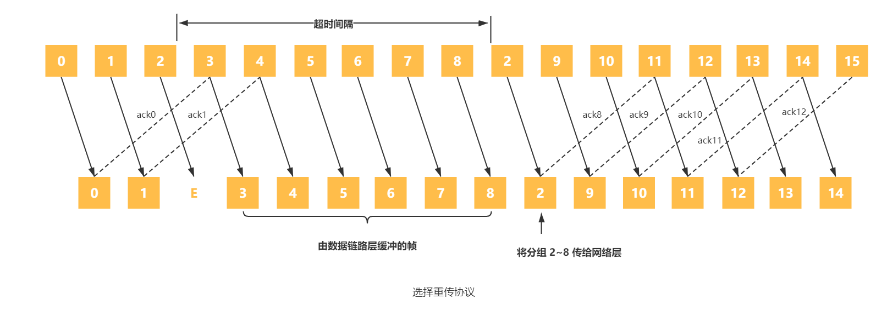
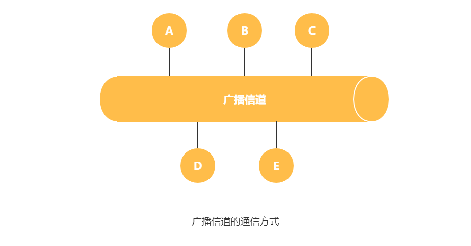
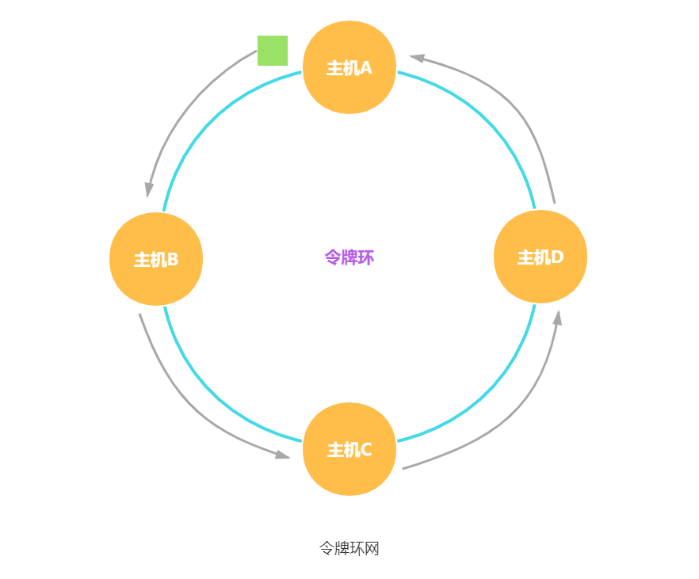

数据链路层介于物理层和网络层之间，在物理层提供的服务的基础上向网络层提供服务，网络层的数据报需要被封装进链路层帧，然后通过链路层传输到目的主机并通过链路层从帧中取出数据报上交给网络层。

数据链路层连接的建立、维持和释放过程称为 **链路管理**，它主要用于面向连接的服务链路两端的结点要进行通信，必须首先确认对方已处于就绪状态，并交换一些必要的信息以对帧序号初始化，然后才能建立连接，在传输过程中则要能维持连接，而在传输完毕后要释放该连接。在多个站点共享同一物理信道的情况下如何在要求通信的站点间分配和管理信道也属于数据链路层管理的范畴。

将运行链路层协议的任何设备均称为 **结点**（node）。结点包括主机、路由器、交换机和 WiFi 接入点。

把沿着通信路径连接相邻结点的通信信道称为 **链路**（link）。为了将一个数据报从源主机传输到目的主机，数据报必须通过沿端到端路径上的各段链路传输。

在数据链路层中，有两种不同类型的链路层信道。第一种是点对点信道，主要使用点对点的通信方式，如 PPP 协议；第二种是广播信道，主要使用一对多的广播通信方式，因为许多主机与相同的广播信道连接，需要所谓的媒体访问协议来协调帧传输。

# 数据链路层的服务

数据链路层在物理层提供服务的基础上向网络层提供服务，其主要作用是加强物理层传输原始比特流的功能，将物理层提供的可能出错的物理连接改造为逻辑上无差错的数据链路，使之对网络层表现为一条无差错的链路。

数据链路层的服务都是将数据报通过链路在各结点之间传输，但所提供的服务细节会随着链路层协议的不同而变化。但有三个基本问题则是共同的，即封装成帧、透明传输和差错检测。

## 封装成帧

封装成帧就是在一段数据的前后分别添加首部和尾部，这样就构成了一个帧。接收端在收到物理层上交的比特流后，就能根据首部和尾部的标记，从收到的比特流中识别帧的开始和结束。

互联网上传送的数据都以分组，也就是 IP 数据报为传送单位，而网络层的 IP 数据报要想通过数据链路层传送，就需要成为帧的数据部分。

**帧** 是由一段数据，并且在其前后分别添加首部和尾部而组成。这里的 **帧** 是数据链路层的数据传送单元。

帧的首部和尾部中含有很多控制信息，它们的一个重要作用是确定帧的界限，即 **帧定界**。而 **帧同步** 指的是接收方应能从接收到的二进制比特流中区分出帧的起始与终止。

## 透明传输

当传输的数据中的任何比特的组合出现与帧定界符相同的比特编码时，数据链路层会错误地认为找到帧的边界。这里要采取的措施就是将所传的数据不管是什么样的比特组合，都应当没有差错地通过数据链路层，即所谓的透明传输。

解决透明传输的方法有两种，即字节填充或字符填充。

## 差错检测

当帧中的比特在传输过程中，接收方结点中的链路层硬件可能由于信号减弱或电磁噪声等原因将 1 识别为 0，0 识别为 1 的比特差错。这种情况下没有必要转发一个有差错的数据报，所以许多链路层协议提供了检测比特差错的机制。通过让发送结点在帧中包括差错检测比特，让接收结点进行差错检查，以此来完成这项工作。

在一段时间内，传输错误的比特占所传输比特总数的比率称为 **误码率 BER**（Bit Error Rate）。误码率与信噪比有很大的关系。为了保证数据传输的可靠性，在计算机网络传输数据时，常见的差错检测有 **奇偶校验码** 、**校验和方法** 和 **循环冗余检验**。

### 奇偶校验码

**奇偶校验码** 是一种最基本的检错码，分为奇校验和偶校验，是两种校验方案的统称。由 n -1 位信息元和 1 位校验元组成，在奇校验方案中，由信息元与校验元组成的码长为 n 的码字中共有奇数个 1；在偶校验方案中，由信息元与校验元组成的码长为 n 的码字中共有偶数个 1。它又分为垂直奇偶校验、水平奇偶校验和水平垂直奇偶校验。

下图描述了一个偶校验的方案，单个校验比特被存放在一个单独的字段中。

采用单个奇偶校验位方式，接收方的操作也很简单。接收方只需要数一数接收的 d+1 比特中 1 的数目即可。如果在采用偶校验方案中发现了奇数个值为 1 的比特，接收放知道至少出现了一个比特差错。更准确的说法是，出现了奇数个比特差错。

如果出现了偶数个比特差错，将导致一个未检出的差错。如果比特差错的概率小，而且比特之间的差错可以被看作是独立发生的，在一个分组中多个比特同时出错的概率将是极小的。在这种情况下，单个奇偶校验位可能是足够的了。然而，测量已经表明了差错经常以 “突发” 方式聚集在一起，而不是独立地发生。在突发差错的情况下，使用单比特奇偶校验保护的一帧中未检测出差错的概率能够达到 50%。显然，需要一个更健壮的差错检测方案。但是在研究实践中使用的差错检测方案之前，我们考虑对单比特奇偶校验的一种简单一般化方案，这将使我们深入地理解纠错技术。

### 校验和方法

在校验和方法中，将 d 比特的数据视为多个 k 比特整数构成的序列。一个简单的校验和指的是将序列中的多个 k 比特整数相加得到的结果，接收方对收到的数据执行同样的计算，然后将结果与收到的校验和进行比较。因特网校验和就是基于这种方法，即数据的字节作为 16 比特的整数对待并求和。这个和的反码形成了携带在报文段首部的因特网检验和。接收方通过对接收的数据（包括校验和）的和取反码，并且检测其结果是否为全 1 比特来检测检验和。如果这些比特中有任何比特时 0，就可以指示出差错。

相比于奇偶校验，因特网校验和差错加测能力更强；涉及简单的减法和比较运算，开销小。与循环冗余检验相比，提供相对弱的差错保护，但在链路层使用循环冗余检验的情况下，可以作为补充端到端的差错检测。

### 循环冗余检验

**循环冗余检验**（Cyclic Redundancy Check，CRC）编码也称 **多项式编码**，任何一个由二进制数位串组成的代码都可以看作为系数是 0 和 1 的一个多项式。

在发送端把数据划分为组，每组 k 个比特。待传送的数据 M，CRC 运算就是在数据 M 后面再添加供差错检测用的 n 位冗余码，总共 k+n 位构成一个帧并发送出去。

接收端对收到的每一帧进行 CRC 检验，若得出的余数 R = 0，则判定这个帧没有差错，就接收；若余数 $R \neq 0$，则判定这个帧有差错，就丢弃。

通过以下方式计算 n 位冗余码。这里假定待传送 M = 101001（k=6），用二进制的模 2 运算进行$2^n$ 乘 M 的运算，这相当于在 M 后面添加 n 个 0。得到的 `k + n` 位的数除以事先选定好的长度为 `n+1` 位的除数 P = 1101（n=3），得出商 Q=110101 而余数 R=001，余数 R 比除数 P 少 1 位，即 R 是 n 位。将余数 R 作为冗余码拼接在数据 M 后面，一起发送出去。循环冗余码的运算过程如下图所示。

这种为了进行检错而添加的冗余码常被称为 **帧检验序列 FCS**（Frame Check Sequence）。因此发送出去的帧为$2^nM + FCS = 101001 \  001$ 。

多项式采用模 2 运算规则，在加法中不进位，减法中不借位，且两种操作等价于按位异或操作。乘除法类似于二进制的运算，只是在做加减法时按模 2 规则进行。

# 组帧

数据链路层之所以要把比特组合成帧为单位传输，是为了在出错时只重发出错的帧，而不必重发全部数据，从而提高效率。为了使接收方能正确地接收并检查所传输的帧，发送方必须依据一定的规则把网络层递交的分组封装成帧，称为组帧。组帧主要解决帧定界、帧同步、透明传输等问题。通常有以下4中方法实现组帧。

注意：组帧时既要加首部，又要加尾部。原因是，在网络中信息是以帧为最小单位进行传输的，所以接收端要正确地接收帧，必须要清除该帧在一串比特流中从哪里开始到哪里结束（因为接收端收到的是一串比特流，没有首部和尾部是不能正确区分帧的），而分组（即 IP 数据报）仅是包含在帧中的数据部分，所以不需要加尾部来定界。

## 字符计数法

如下图所示，字符计数法是指在帧头部使用一个计数字段来标明帧内字符数。目的结点的数据链路层收到字节计数值时，就知道后面跟随的字节数，从而可以确定帧结束的位置（计数字段提供的字节数包含自身所占用的一个字节）。

这种方法最大的问题在于如果计数字段出错，即失去了帧边界划分的依据，那么接收方就无法判断所传输帧的结束位和下一帧的开始位，收发双发将失去同步，从而造成灾难性后果。

## 字符填充法

字符填充法使用一些特定的字符来定界一帧的开始（DLE STX）与结束（DEL ETX），为了使信息位中出现的特殊字符不被误判为帧的首尾定界符，可以在特殊字符前面填充一个转义字符（DLE）来加以区分（注意，转义字符是 ASCII 码中的控制字符，是一个字符，而非 “D” “L” “E” 三个字符的组合），以实现数据的透明传输。接收方收到转义字符后，就知道其后面紧跟着的是数据信息，而不是控制信息。

如下图（a）所示的字符帧，帧的数据段中出现 DLE 字符，发送方在每个 DLE 字符前再插入一个 DLE 字符[见下图（b）]，接收方收到数据后会自己删除这个插入的 DLE 字符，结果仍得到原来的数据[见下图（c）]。这也正是字符填充法名称的由来。

## 比特填充法

如下图所示，比特填充法允许数据帧包含任意个数的比特，也允许每个字符的编码包含任意个数的比特。它使用一个特定的比特模式，即 01111110 来标志一帧的开始和结束。为了不使信息位中出现的比特流 01111110 被误判为帧的首尾标志，发送方的数据链路层在信息位中遇到 5 个连续的 “1” 时，将自动在其后插入一个 “0”；而接收方做该过程的逆操作，即每收到 5 个连续的 “1” 时，自动删除后面紧跟着的 “0”，以恢复原信息。

比特填充法很容易由硬件来实现，性能优于字符填充法。

## 违规编码法

在物理层进行比特编码时，通常采用违规编码法。例如，曼彻斯特编码方法将数据比特 “1” 编码成 “高-低” 电平对，将数据比特 “0” 编码成 “低-高” 电平对，而 “高-高” 电平对和 “低-低” 电平对在数据比特中是违法的（即没有采用）。可以借用这些违规编码序列来定界帧的起始和终止。局域网 IEEE 802 标准就采用了这种方法。

违规编码法不需要采用任何填充技术，便能实现数据传输的透明性，但它只适用于采用冗余编码的特殊编码环境。

由于字节计数法中计数字段的脆弱性和字符填充法实现上的复杂性与不兼容性，目前较常用的组帧方法是比特填充法和违规编码法。

# 流量控制

流量控制涉及对链路上的帧的发送速率的控制，以使接收方有足够的缓冲空间来接收每个帧。例如，在面向帧的自动重传请求系统中，当待确认帧的数量增加时，有可能超出缓冲存储空间而造成过载。流量控制的基本方法是由接收方控制发送方发送数据的速率，常见的方式有两种：停止-等待协议和滑动窗口协议。

## 停止-等待流量控制

发送方每发送一帧，都要等待接收方的应答信号，之后才能发送下一帧；接收方每接收一帧，都要反馈一个应答信号，表示可接收下一帧，如果接收方不反馈应答信号，那么发送方必须一直等待。每次只允许发送一帧，然后就陷入等待接收方确认信息的过程中，因而传输效率很低。

## 滑动窗口流量控制

在任意时刻，发送方都维持一组连续的允许发送的帧的序号，称为发送窗口；同时接收方也维持一组连续的允许接收帧的序号，称为接收窗口。发送窗口用来发送方进行流量控制，而发送窗口的大小 $W_T$ 代表在还未收到对方确认信息的情况下，发送方法最多还可以发送多少个数据帧。

同理，在接收端设置接收窗口是为了控制可以接收哪些数据帧和不可以接收哪些帧。在接收方，只有收到的数据帧的序号落入接收窗口内时，才允许将该数据帧收下。若接收到的数据帧落在接收窗口之外，则一律将其丢弃。

下图给出了发送窗口的工作原理。

下图给出了接收窗口的工作原理。

发送端每收到一个确认帧，发送窗口就向前滑动一个帧的位置，当发送窗口内没有可以发送的帧（即窗口内的帧全都是已发送但未收到确认的帧）时，发送方就会停止发送，直到收到接收方发送的确认帧使窗口移动，窗口内有可以发送的帧后，才开始继续发送。

接收端收到数据帧后，将窗口向前移一个位置，并发回确认帧，若收到的数据帧落在接收窗口之外，则一律丢弃。

滑动窗口有以下重要特性：

1. 只有接收窗口向前滑动（同时接收方发送了确认帧）时，发送窗口才有可能（只有发送方收到确认帧后才一定）向前滑动。
2. 从滑动窗口的概念看，停止-等待协议、后退 N 帧协议和选择重传协议只在发送窗口大小与接收窗口大小上有所差别：
   停止-等待协议：发送窗口大小 = 1，接收窗口大小 = 1。
   后退 N帧协议：发送窗口大小 > 1，接收窗口大小 = 1。
   选择重传协议：发送窗口大小 > 1，接收窗口大小 > 1。

3. 接收窗口的大小为 1 时，可保证帧的有序接收。
4. 数据链路层的滑动窗口协议中，窗口的大小在传输过程中是固定的（注意与第5章传输层的滑动窗口协议的区别）。

## 可靠传输机制

数据链路层的可靠传输通常使用确认和超时重传两种机制来完成。确认是一种无数据的控制帧，这种空指针使得接收方可以让发送方知道哪些内容被正确接收。有些情况下为了提高幻术效率，将确认捎带在一个回复帧中，称为捎带确认。超时重传是指发送方在发送某个数据帧后就开启一个计时器，在一定时间内如果没有得到发送的数据帧的确认帧，那么就重新发送该数据帧，直到发送成功为止。

**自动重传请求**（Auto Repeat reQuest，ARQ）通过接收方请求发送方重传出错的数据帧来恢复出错的帧，是通信中用于处理信道所带来差错的方法之一。传统自动重传请求分为三种，即停止-等待（Stop-and-Wait）ARQ、后退 N 帧（Go-Back-N）ARQ 和选择性重传（Selective Repeat）ARQ。后两种协议是滑动窗口技术与请求重发技术的结合，由于窗口尺寸开到足够大时，帧在线路上可以连续地流动，因此又称其为连续 ARQ 协议。注意，在数据链路层中流量控制机制和可靠传输机制是交织在一起的。

### 停止-等待协议

在停止-等待协议中，源站发送单个帧后必须等待确认，在目的站的回答到达源站之前，源站不能发送其他的数据帧。从滑动窗口机制的角度看，停止-等待协议相当于发送窗口和接收窗口大小均为 1 的滑动窗口协议。

在停止-等待协议中，除数据帧丢失外，还可能出现以下两种差错。

到达目的站的帧可能以遭破坏，接收站利用前面讨论过的差错检测技术检出后，简单地将该帧丢弃。为了对付这种可能发送的情况，源站装备了计时器。在一个帧发送之后，源站等待确认，如果在计时器计满时仍未收到确认，那么再次发送相同的帧。如此重复，直到该数据帧无错误地到达为止。

另一种可能的差错是数据帧正确而去人帧被破坏，此时接收方已收到正确的数据帧，但发送方收不到确认帧，因此发送方会重传已被接收的数据帧，接收方收到同样的数据帧时会丢弃该帧，并重传一个该帧对应的确认帧。发送的帧交替地用 0 和 1 来标识，肯定确认分别用 ACK0 和 ACK1 来表示，收到的确认有误时，重传已发送的帧。停止-等待协议算法的实现步骤如下所示。

在发送结点：

1. 从主机取一个数据帧，送交发送缓存。
2. $V(S) \longleftarrow 0$。{发送状态变量V(S)初始化}
3. $N(S) \longleftarrow V(S)$。{将发送状态变量值写入数据帧中的发送序号 N(S)}
4. 将发送缓存中的数据帧发送出去。{这个数据帧的副本仍保留在发送缓存中}
5. 设置超时计时器。{选择适当的超时重传时间 $t_{out}$}
6. 等待。{等待以下 7 和 8 这两个事件中最先出现的一个}
7. 收到确认帧 ACKn 后，
   若 n=1=V(S)，则{已发送的数据帧被接收方确认}
   从主机取一个新的数据帧，放入发送缓存。
   $V(S) \longleftarrow [1-V(S)]$，转到 4。{更新发送状态变量，变为下一个序号}
   否则，丢弃这个确认帧，转到 6。{表明已发送的数据帧未被接收方确认}

8. 若超时计时器时间到，则转到 4。{重传已发送的数据帧}

在接收结点：

1. $V(R) \longrightarrow 0$。{接受状态变量初始化，其数值等于预接收的数据帧的发送序号}
2. 等待。
3. 收到一个数据帧时，检查有无产生传输差错（如用CRC）。
   若检查结果正确无误（否则直接丢弃，转 2），则执行后续算法。

4. 若 N(S) = V(R)，则执行后续算法。{收到发送序号正确的数据帧}
   否则丢弃此数据帧，然后转到 7。{丢弃的帧就是重复帧}

5. 将收到的数据帧中的数据部分送交主机。
6. $V(R) \longrightarrow [1-V(R)]$。{更新接受状态变量，准备接收下一个数据帧}
7. 发送确认帧 ACKn，并转到 2。{n = V(R)，表明期望收到 V(R)}

由以上算法可知，对于停止-等待协议，由于每发送一个数据帧就停止并等待，因此用 1bit 来编号就以足够。在停止-等待协议中，若连续出现相同发送序号的数据帧，表明发送端进行了超时重传。连续出现相同序号的确认帧时，表明接收端收到了重复帧。

此外，为了超时重发和判定重复帧的需要，发送方和接收方都须设置一个帧缓冲区。发送端在发送完数据帧时，必须在其发送缓存中保留此数据帧的副本，这样才能爱出差错时进行重传。只有在收到对方发来的确认帧 ACK 时，方可清除此副本。

由下图可知，停止-等待协议通信信道的利用率很低。为了克服这一缺点，就产生了另外两种协议，即后退 N 帧协议和选择重传协议。

### 后退 N 帧协议（GBN）

在后退 N 帧式 ARQ 中，发送方无须在收到一个帧的 ACK 后才能开始发送下一帧，而是可以连续发送帧。当接收方检测出失序的信息后，要求发送方重发最后一个正确接收的信息帧之后的所有未被确认的帧；或者当发送方发送了 N 个帧后，若发现该 N 个帧的前一个帧在计时器超时后仍未返回其确认信息，则该帧被潘伟出错或丢失，此时发送方就不得不重传该出错帧及随后的 N 个帧。换句话说，接收方只允许按顺序接收帧。

如下图所示，源站向目的站发送数据帧。当源站发完 0 号帧后，可以继续发送后续的 1 号帧、2 号帧等。源站每发送完一帧就要为该帧设置超时计时器。由于连续发送了许多帧，所以确认帧必须要指明是对哪一帧进行确认。为了减小开销，GBN 协议还规定接收端不一定每收到一个正确的数据帧就必须立即发回一个却认真，而可以在连续收到好几个正确的数据帧后，才对最后一个数据帧发确认信息，或者可在自己有数据要发送时才将对以前正确收到的帧加以捎带确认。这就是说，对某一数据帧的确认就表明该数据帧和以前所有的数据帧均已正确无误地收到。在下图中，ACKn表示对第n号帧的确认，表示接收方已正确收到第 n 号帧及以前的所有帧，下一次期望收到第 n+1 号帧（也可能是第 0 号帧）。接收端只按序接收数据帧。虽然在有差距的 2 号帧之后接着又收到了正确的 6 个数据帧，但接收端都必须将这些帧丢弃。接收端虽然丢弃了这些不按序的无差错帧，但应重复发送已发送的最后一个确认帧 ACK1（这是为了防止已发送的确认帧 ACK1 丢弃）。

后退 N 帧协议的接收窗口为 1，可以保证按序接收数据帧。若采用 n 比特对帧编号，则其发送窗口的尺寸 $W_T$ 应满足 $1 <= W_T <= 2^n - 1$，若发送窗口的尺寸大于 $2^n-1$，则会造成接收方无法分辨新帧和旧帧。

从下图中不难看出，后退 N 帧协议一方面因连续发送数据帧而提高了信道的利用率，另一方面在重传时又必须把原来已传送正确的数据帧进行重传（仅因这些数据帧的前面有一个数据帧除了错），这种做法又使传送效率降低。由此可见，若信道的传输质量很差导致误码率较大时，后退 N 帧协议不一定优于停止-等待协议。

### 选择重传协议（SR）

为进一步提高信道的利用率，可设法只重传出现差错的数据帧或计时器超时的数据帧，但此时必须加大接收窗口，以便先收下发送序号不连续但仍处在接收窗口中的那些数据帧。等到所缺序号的数据帧收到后再进一并送交主机。这就是选择重传 ARQ 协议。

在选择重传协议中，每个发送缓冲区对应一个计时器，当计时器超时时，缓冲区的帧就会重传。另外，该协议使用了比上述其他协议更有效的差错处理策略，即一旦接收方怀疑帧出错，就会发一个否定帧 NAK 给发送方，要求发送方对 NAK 中指定的帧进行重传，如下图所示。

选择重传协议的接收窗口尺寸 $W_R$ 和发送窗口尺寸 $W_T$ 都大于 1，一次可以发送或接收多个帧。若采用 n 比特对帧编号，为了保证接受方向前移动窗口后，新窗口序号与旧窗口序号没有重叠部分，需要满足条件：接收窗口 $W_R + 发送窗口 \quad Wr \leq 2^n$。假定仍然采用累计确认的方法，并且接收窗口 $W_R$ 显然不应超过发送窗口 $W_T$（否则无意义），那么接收窗口尺寸不应超过序号范围的一半，即 $W_R \leq 2^{n-1}$。接收窗口为最大值时，$W_{Tmax} = W_{Rmax} = 2^{n-1}$。需要提醒读者的是，一般情况下，在 SR 协议中，接收窗口的大小和发送窗口的大小是相同的。

选择重传协议可以避免重复传送那些本已正确到达接收端的数据帧，但在接收端要设置具有相当容量的缓冲区来暂存那些未按序正确收到的帧。接收端不能接收窗口下界以下或窗口上界以上的序号的帧，因此所需缓冲区的数目等于窗口的大小，而不是序号数目。

信道的效率，也称信道利用率。可从不同的角度来定义信道的效率，这里给出一种从时间角度的定义：信道效率是对发送方而言的，是指发送方在一个发送周期的时间内，有效地发送数据所需要的时间占整个发送周期的比率。

例如，发送方从开始发送数据到收到第一个确定帧为止，称为一个发送周期，设为 T，发送方在这个周期内共发送 L 比特的数据，发送方的数据传输率为 C，则发送方用于发送有效数据的时间为 L/C，在这种情况下，信道的利用率为 (L/C)/T。

从上面的讨论可以发现，求信道的利用率主要是周期时间 T 和有效数据发送时间 L/C，在题目中，这两个量一般不会直接给出，需要读者根据题意自行计算。

信道吞吐率 = 信道利用率 x 发送方的发送速率。

# 多路访问链路和协议

数据链路层主要有两种类型的网络链路：

1. **点对点链路**（point-to-point link）    由链路一端的单个发送方和链路另一端的单个接收方组成。许多链路层协议都是为点对点链路设计的，如点对点协议（point-to-point protocol，PPP）和高级数据链路控制（high-level data link control，HDLC）。
2. **广播链路**（broadcast link）     能够让多个发送和接收结点都连接到相同的、单一的、共享的广播信道上。常用于局域网中。

下图是广播链路的通信方式，结点 A、B、C、D、E共享广播链路，假设 A 要与 C 发生通信，B 要与 D 发生通信，由于它们共用一条链路，如果不加控制，那么两对结点间的通信可能会因为互相干扰而失败，这样会使得广播链路的大量带宽将被浪费掉。

因此，当多个结点处于活跃状态时，为了确保广播信道执行有用的工作，使用多路访问协议来协调多个发送和接收结点对一个共享广播信道的访问。所谓的 **多路访问协议**（multiple access protocol），即结点通过协议来规范它们在共享的广播信道上的传输行为。 

在理想情况下，对于速率为 $R \  bps$ 广播信道，多路访问协议应该具有以下所希望的特性：

1. 当仅有一个结点有数据发送时，该结点具有 $R \  bps$ 的吞吐量；
2. 当有 M 个结点要发送数据时，每个结点吞吐量为 $R/M \  bps$。这不必要求 M 结点中的每一个结点总是有 $R/M$ 的瞬间速率，而是每个结点在一些适当定义的时间间隔内应该有 $R/M$ 的平均传输速率。
3. 协议是分散的；这就是说不会因某主结点故障而使整个系统崩溃。
4. 协议是简单的，使实现不昂贵。

这里可以将任何多路访问协议划分为 3 类：信道划分协议（channel partitioning protocol），随机接入协议（random access protocol）和轮流协议（taking-turns protocol）。其中信道划分协议属于静态信道，随机接入协议与轮流协议属于动态信道。

## 信道划分协议

下面介绍多路复用技术的概念。当传输介质的带宽超过传输单个信号所需的带宽时，人们就通过在一条介质上同时携带多个传输信号的方法来提高传输系统的利用率，这就是所谓的多路复用，也是实现信道划分协议的途径。多路复用技术把多个信号组合在一条物理信道上进行传输，使多个计算机或终端设备共享信道资源，提高了信道的利用率。

采用多路复用技术可把多个输入通道的信息整合到一个复用通道中，在接收端把收到的信息分离出来并传递到对应的输出通道，如下图所示。

信道划分的实质就是通过分时、分频、分码等方法把原来的一条广播信道，逻辑上分为几条用于两个结点之间通信的互不干扰的子信道，实际上就是把广播信道转变为点对点信道。

信道划分协议分为频分多路复用、时分多路复用、波分多路复用和码分多路复用四种。

### 频分多路复用

频分多路复用（FDM）是一种将多路基带信号调制到不同频率载波上，再叠加形成一个复合信号的多路复用技术。在物理信道的可用带宽超过单个原始信号所需带宽的情况下，可将该物理信道的总带宽分隔成若干与传输单个信号带宽相同或略宽的子信道，每个子信道传输一种信号，这就是频分多路复用，如下图所示。

每个子信道分配的带宽可不相同，但它们的总和必须不超过信道的总带宽。在实际应用中，为了防止子信道之间的干扰，相邻信道之间需要加入 “保护频带”。

频分多路复用的优点在于充分利用了传输介质的带宽，系统效率较高；由于技术比较成熟，实现也较容易。

### 时分多路复用

时分多路复用（TDM）是将一条五路信道按时间分成若干时间片，轮流地分配给多个信号使用。每个时间片由复用的一个信号占用，而不像 FDM 那样，同一时间同时发送多路信号。这样，利用每个信号在时间上的交叉，就可以在一条物理信道上传输多个信号，如下图所示。

就某个时刻来看，时分多路复用信道上传送的仅是某一对设备之间的信号；就某段时间而言，传送的是按事件分隔的多路复用信号。但由于计算机数据的突发性，一个用户对已经分配到的子信道的利用率一般不高。统计时分多路复用（STDM，又称异步时分多路复用）是 TDM 的一种改进，它采用 STDM 帧，STDM 帧并不固定分配时隙，而按需动态地分配时隙，当终端有数据要传送时，才会分配到时间片，因此可以提高线路的利用率。例如，线路传输率为 8000b/s，4 个用户的平均速率都为 2000b/s，当采用 TDM 方式时，每个用户的最高速率为 2000b/s，而在 STDM 方式下，每个用户的最高速率可达 8000b/s。

### 波分多路复用

波分多路复用（WDM）即光的频分多路复用，它在一根光纤中传输多种不同波长（频率）的光信号，由于波长（频率）不同，各路光信号互不干扰，最后再用波长分解复用器将各路波长分解出来。由于广播处于频谱的高频段，有很高的带宽，因而可以实现多路的波分复用。如下图所示。

### 码分多路复用

码分多路复用是采用不同的编码来区分各路原始信号的一种复用方式。与 FDM 和 TDM 不同，它既共享信道的频率，又共享时间。下面举一个直观的例子来理解码分复用，如下图所示。

假设 A 站要向 C 站运输黄豆，B 站向 C 站运输绿豆，A 与 C、B 与 C 之间有一条公共的道路，可以类比为广播信道。

在频分复用方式下，公共道路被划分为两个车道，分别提供 A 到 C 的车和 B 到 C 的车行走，两类车可以同时行走，但只分到了公共车道的一半，因此频分复用（波分复用也一样）共享时间而不共享空间。

在时分复用方式下，先让 A 到 C 的车走一趟，再让 B 到 C 的车走一趟，两类车交替地占用公共车道。公共车道没有划分，因此两车共享了空间，但不共享时间。

码分复用与另外两种信道划分方式大为不同，在码分复用情况下，黄豆与绿豆放在同一辆车上运送，到达 C 后，由 C 站负责把车上的黄豆和绿豆分开。因此，黄豆和绿豆的运送，在码分复用的情况下，既共享了空间，也共享了时间。

码分多址（Code Division Multiple Access, CDMA）是码分复用的一种方式，其原理是每比特时间被分成 m 个更短的时间槽，称为码片（Chip），通常情况下每比特有 64 或 128 个码片。每个站点被指定一个唯一的 m 位代码或码片序列。发送 1 时，站点发送码片序列；发送 0 时，站点发送码片序列的反码。当两个或多个站点同时发送时，各路数据在信道中线性相加。为从信道中分离出各路信号，要求各个站点的码片序列相互正交。

简单理解就是，A 站向 C 站发出的信号用一个向量来表示，B 站向 C 站发出的信号用另一个向量来表示，两个向量要求相互正交。向量中的分量，就是所谓的码片。

下面举例说明 CDMA 的原理。

加入站点 A 的码片序列被指定为 00011011，则 A 站发送 00011011 就表示发送比特 1，发送 11100100 就表示发送比特 0。按惯例将码片序列中的 0 写成 -1，将 1 写为 +1，A 站的码片序列就是 -1 -1 -1 +1 -1 +1 +1。

令向量 S 表示 A 站的码片向量，令 T 表示 B 站的码片向量。两个不同站的码片序列正交，即向量 S 和 T 的规格化内积（Inner Product）为 0：

$$
S \bullet T \equiv \frac{1}{m} \sum_{i=1}^m S_iT_i = 0
$$

任何一个码片向量和该码片向量自身的规格化内积都是 1，任何一个码片向量和该码片反码的向量的规格化内积是 -1，如

$$
S \bullet S = \frac{1}{m} \sum_{i=1}^m S_iS_i = \frac{1}{m} \sum_{i=1}^m S_i^2 = \frac{1}{m} \sum_{i=1}^m (\pm1)^2 = 1
$$

令向量 T 为 (-1 -1 +1 -1 +1 +1 +1 -1)

当 A 站向 C 站发送数据 1 时，就发送了向量 (-1 -1 -1 +1 +1 -1 +1 +1)。

当 B 站向 C 站发送数据 0 时，就发送了向量 (+1 +1 -1 +1 -1 -1 -1 +1)。

两个向量到了公共信道上就进行叠加，实际上就是线性相加，得到

$$
S - T = (0 0 -2 2 0 -2 0 2)
$$

到达 C 站后，进行数据分离。如果要得到来自 A 站的数据，那么就让 S 与 S -T 进行规格化内积，得到

$$
S \bullet (S -T) = 1
$$

所以 A 站发出的数据是 1。同理，如果要得到来自 B 站的数据，那么

$$
T \bullet (S - T) = -1
$$

因此从 B 站发送过来的信号向量是一个反码向量，代表 0。

规格化内积是线性代数中的内容，但不再考研大纲之中，实际上就是在得到两个向量的内积后再除以向量的分量的个数。

码分多路复用技术具有频谱利用率高、抗干扰能力强、保密性强、语音质量好等优点，还可以减少投资和降低运行成本，主要用于无线通信系统，特别是移动通信系统。

## 随机接入协议

在随机接入协议中，不集中控制传输结点的次序问题，一个传输结点根据用户意愿，以信道的全部速率（即 $R \  bps$）进行发送。当有碰撞时，设计碰撞的每个结点反复地重发它的帧，也就是分组，到该帧无碰撞地通过为止。为了解决随机接入发生的碰撞，涉及碰撞的结点不必立即重新发送，独立地选择随机时延并等待，然后在重发该帧。常用的随机接入协议有 ALOHA 协议、CSMA 协议、CSMA/CD 协议和 CSMA/CA 协议等，核心思想都是 `胜利者通过争用获得信道，从而获得结点的发送权`。因此，随机接入协议又称 **争用型协议**。

### ALOHA

ALOHA协议处于 OSI 模型中的数据链路层。它属于随机存取协议（Random Access Protocol）中的一种。ALOHA 协议分为纯 ALOHA 协议和时隙 ALOHA 协议两种。

#### 纯 ALOHA

在纯 ALOHA 协议中，当网络中的任何一个站点需要发送数据时，可以不进行任何检测就发送数据。如果在一段时间内未收到确认，那么该站点就认为传输过程中发生了冲突。发送站点需要等待一段时间后再发送数据，直至发送成功。下图所示的模型不仅可代表总线形网络的情况，而且可以代表无线信道的情况。

纯 ALOHA 协议的工作原理如下图所示。每个站均自由地发送数据帧，为简化问题，不考虑由信道不良而产生的误码，并假定所有站发送的帧都是定长的，帧的长度不用比特而用发送这个帧所需的时间来表示，在下图中用 $T_0$ 表示这段时间。

在上图的例子中，当站 1 发送帧 1 时，其他站都未发送数据，所以站 1 的发送必定是成功的。但随后站 2 和站 N-1 发送的帧 2 和帧 3 在时间上重叠了一些（即发生了碰撞）。碰撞的结果是，碰撞双方（有时也可能是多方）所发送的数据出现了差错，因而都必须进行重传。但是发生碰撞的各站并不能马上进行重传，因为这样做必然会继续发生碰撞。纯 ALOHA 系统采用的重传策略是让各站等待一段随机的时间，然后再进行重传。若再次发生碰撞，则需要再等待一段随机的时间，直到重传成功为止。图中其余一些帧发送情况是帧 4 发送成功，而帧 5 和帧 6 发生碰撞。

假设网络负载（$T_0$时间内所有站点发送成功的和未成功而重传的帧数）为 G，则纯 ALOHA 网络的吞吐量（$T_0$时间内成功发送的平均帧数）为 $S=Ge^{-2G}$。当 G = 0.5 时，$S = 0.5e^{-1} \approx 0.184$，这是吞吐量 S 可能达到的极大值。可见，纯 ALOHA 网络的吞吐量很低，为了克服这一缺点，人们在原始的纯 ALOHA 协议的基础上进行改进，产生了时隙 ALOHA 协议。

#### 时隙 ALOHA

时隙 ALOHA 协议把所有各站在事件上同步起来，并将时间划分为一段段等长的时隙（Slot），规定只能在每个时隙开始时才能发送一个帧。从而避免了用户发送数据的随意性，减少了数据产生冲突的可能性，提高了信道的利用率。

下图为两个站的时隙 ALOHA 协议的工作原理示意图。时隙的长度 $T_0$ 使得每个帧正好在一个时隙内发送完毕。每个帧在到达后，一般都要在缓存中等待一段小于 $T_0$ 的时间，然后才能发送出去。在一个时隙内有两个或两个以上的帧到达时，在下一个时隙将产生碰撞。碰撞后重传的策略与纯 ALOHA 的情况是相似的。

时隙 ALOHA 网络的吞吐量 S 与网络负载 G 的关系是 $S=Ge^{-G}$。当 G = 1 时，$S = e^{-1} \approx 0.368$。这是吞吐量 S 可能达到的极大值。可见，时隙 ALOHA 网络比纯 ALOHA 网络的吞吐量大了1 倍。

时隙多路访问协议的效率（efficiency）定义为：当有大量的活跃结点且每个结点总有大量的帧要发送时，长期运行中成功时隙的份额。注意到如果不使用某种形式的访问控制，而且每个结点都在每次碰撞之后立即重传，这个效率将为零。时隙 ALOHA 显然增加了它的效率，使之大于零，但是效率增加了多少呢？

时隙 ALOHA 系统的效率虽然是纯 ALOHA 系统的两倍，但每个站点都是随心所欲地发送数据的，即使其他站点正在发送也照发不误，因此发送碰撞的概率很大。

### CSMA

**载波侦听多路访问**（Carrier Sense Multiple Access，CSMA）指的是一个结点在传输之前，先对介质进行侦听，当确认信道空闲时，才开始传输。**多路访问** 指多个设备可以同时访问介质，一个设备发送的帧也可以被多个设备接收。因此，使用 CSMA 协议会大大降低冲突的可能，从而提高信道的利用率。

根据具体的侦听方式和发送策略，可将 CSMA 分为三种。

#### 非持续 CSMA

非持续 CSMA（non-persistent CSMA）是指当要发送帧的设备侦听到信道忙或发生碰撞时，会随机等待一段时间在侦听，直到信道空闲，才开始传输。

非持续 CSMA 协议在侦听到信道忙或发生碰撞就放弃侦听，会减少传输时导致冲突的概率，但也会导致信道利用率降低，以及较长的延迟。可见，信道利用率的提高是以增加数据在网络中的延迟时间为代价的。

#### 1-持续 CSMA

1-持续 CSMA（1-persistent CSMA）是指当要发送帧的设备侦听到信道忙活发生碰撞时，会持续侦听，直到信道空闲就立即传输；当发生冲突时，会随机等待一段时间，在重新开始侦听信道。

传播延迟对 1-持续 CSMA 协议的性能影响较大。当多个设备同时发送帧时，会产生冲突，导致性能降低。

#### p-持续 CSMA

p-持续 CSMA（p-persistent CSMA）是指当要发送帧的设备侦听到信道忙或发生碰撞时，会持续侦听；若发现不忙，则根据一个事先指定的概率 p 来发送帧，以概率 1-p 来继续监听。这个过程一直持续到发送帧成功或因其他结点发送而检测到信道忙位置，若是后者，则等待一个随机的时间后重新开始帧听。

p-持续 CSMA 的目的是降低 1-持续 CSMA 协议中多个结点检测到信道空闲后同时发送数据的冲突概率；采用持续 “帧听” 的目的是，视图克服非持续 CSMA 协议中由于随机等待而造成的延迟时间较长的缺点。因此，p-持续 CSMA 协议在非持续 CSMA 协议和 1-持续 CSMA 协议中达到一定的平衡。

三种不同类型的 CSMA 协议比较如下表所示。

| 信道状态 |               非持续              |      1-持续      |                  p-持续                   |
| :------: | :--------------: | :----------------------------------: | :----------------------------------------: |
|   空闲   |   立即发送数据   |             立即发送数据             | 以概率p发送数据，以概率1-p推迟到下一个时隙 |
|    忙    | 放弃侦听，等待一个随机的时间后再侦听 |继续坚持侦听信道 |        持续侦听，等待下一个时隙再侦听       |

### CSMA/CD

**载波侦听多路访问/碰撞检测**（Carrier Sense Multiple Access with Collision Detection，CSMA/CD）协议是 CSMA 协议的改进方案，适用于总线形网络或半双工网络环境。此方案要求一个结点在传输之前，先对介质进行侦听，以确定是否发生碰撞，结点在传输时，通过检测信道上信号电压的变化情况，判断其他站点是否也在传输。

CSMA/CD 的工作流程可简单概括为 “先听后发，边听边发，冲突停发，随机重发”。

1. 适配器从其父结点获得一个网络层数据报，准备一个以太网帧，并把该帧放到适配器缓冲区中。
2. 如果适配器侦听到信道空闲，那么它开始传输该帧。如果适配器侦听到信道忙，那么它将等待直至侦听到信号能量，然后开始传输该镇。
3. 在传输过程中，适配器检测来自其他适配器的信号能量。如果这个适配器传输了整个帧，而没有检测来自其他适配器的信号能量，那么这个适配器完成该帧的传输。否则，适配器就须停止传输它的帧，取而代之传输一个 48 比特的拥塞信号。
4. 在中止（即传输拥塞信号）后，适配器采用截断二进制指数退避算法等待一段随机时间后返回步骤 2。

总线的传播时延对 CSMA/CD 的影响很大。如纯 ALOHA 协议的工作原理图所示，设 $\tau$为单程传播时延。在 $\tau = 0$ 时，A 发送数据，B 检测到信道空闲。在 $t = \tau - \delta$ 时，A 发送的数据还未到达 B，由于 N 检测到信道空闲而发送数据。经过时间 $\delta/2$ 后，即在 $t = \tau - \delta/2$ 时，A 发送的数据和 B 发送的数据发生碰撞，但这时 A 和 B 都不知道。在 $t=\tau$时，B 检测到碰撞，于是停止发送数据。在 $t=2\tau - \delta$ 时，A 检测到碰撞，也停止发送数据。显然，CSMA/CD 中的站不可能同时进行发送和接收，因此采用 CSMA/CD 协议的以太网不可能进行全双工通信，而只能进行半双工通信。

由下图可知，站 A 在发送帧后至多经过时间 $2\tau$ 就能知道所发送的帧是否发生碰撞（$\delta \rightarrow 0$ 时）。因此把以太网端到端往返时间 $2\tau$称为争用期（又称冲突窗口或碰撞窗口）。每个站在自己发送数据之后的一小段时间内，存在发生冲突的可能性，只有经过争用期这段时间还未检测到冲突时，才能确定这次发送不会发生冲突。

为了确保发送站在发送数据的同时能检测到可能存在的冲突，需要在发送完帧之前就能收到自己发送出去的数据，即帧的传输时延至少要两倍于信号在总线中的传播时延，所以 CSMA/CD 总线网中的所有数据帧都必须要大于一个最小帧长。任何站点收到真长小于最小帧长的帧时，就把它当作无效帧立即丢弃。最小帧长的计算公式为

$$
最小帧长 = 总线传播时延 x 数据传输率 x 2
$$

例如，以太网规定取 $51.2 \mu s$ 为争用期的长度。对于 10Mb/s 的以太网，在争用期内可发送 512bit，即 64B。在以太网发送数据时，如果前 64B 未发生冲突，那么后续数据也就不会发生冲突（表示已成功抢占信道）。换句话说，如果发生冲突，那么就一定在前 64B。由于一旦检测到冲突就立即停止发送，因此这时发送出去的数据一定小于 64B。因此，以太网规定最短帧长为 64B，凡长度小于 64B 的都是由于冲突而异常终止的无效帧。

如果只发送小于 64B 的帧，如 40B 的帧，那么需要在 MAC 子层中于数据字段的后面加入一个整数字节的填充字段，以保证以太网的 MAC 帧的长度不小于 64B。

除检测冲突外，CSMA/CD 还能从冲突中恢复。一旦发生了冲突，参与冲突的两个站点紧接着再次发送是没有意义的，如果它们这样做，那么将会导致无休止的冲突，CSMA/CD 采用二进制指数退避算法来解决碰撞问题。算法精髓如下：

1. 确定基本退避时间，一般取两倍的总线端到端传播时延 $2\tau$（即争用期）。
2. 定义参数 k，它等于重传次数，但 k 不超过 10，即 k=min[重传次数, 10]。当重传次数不超过 10 时，k 等于重传次数；当重传次数大于 10 时，k 就不再增大而一直等于 10（这个条件往往容易忽略，请读者注意）。
3. 当离散的整数集合 $[0, 1, ···, 2^k-1]$中随机去除一个数 $\gamma$，重传所需要退避的时间就是 $\gamma$ 倍的基本退避时间，即 $2\gamma \tau$。
4. 当重传达 16 次仍不能成功时，说明网络太拥挤，认为此帧永远无法正确发出，抛弃此帧并向高层报告出错（这个条件也容易忽略，请读者注意）。

现在来看一个例子，假设一个适配器首次视图传输一帧，当传输时，它检测到碰撞。第 1 次重传时，k = 1，随机数 $\gamma$ 从整数 {0, 1} 中选择，因此适配器可选的重传推迟时间是 0 或 $2\tau$。若再次发送碰撞，则在第 2 次重传时，随机数 $\gamma$ 从整数 {0, 1, 2, 3} 中选择，因此重传推迟时间是在 $0$，$2\tau$，$4\tau$，$6\tau$ 这 4 个时间中随机地选取一个。依次类推。

使用二进制指数退避算法可使重传需要推迟的平均时间随重传次数的增大而增大（这也称动态退避），因而能降低发生碰撞的概率，有利于整个系统的稳定。

### CSMA/CA

CSMA/CD 协议已成功应用于使用有线连接的局域网，但在无线局域网环境下，却不能简单地搬用 CSMA/CD 协议，特别是碰撞检测部分，主要有两个原因：

1. 接收信号的强度往往会远小于发送信号的强度，且在无线介质上信号强度的动态变化范围很大，因此若要实现碰撞检测，则硬件上的花费就会过大。
2. 在无线通信中，并非所有的站点都能够听见对方，即存在 “隐蔽站” 问题。

为此，802.11 标准定义了广泛应用于无线局域网的 CSMA/CA 协议，它对 CSMA/CD 协议进行了修改，把碰撞检测改为碰撞避免。“碰撞避免” 并不是指协议可以完全避免碰撞，而是指协议的设计要尽量降低碰撞发生的概率。

CSMA/CA 采用二进制指数退避算法。信道从忙态变为空闲时，任何一个站要发送数据帧时，不仅都须等待一个时间间隔，而且还要进入争用窗口，并计算随机退避时间以便再次试图接入信道，因此降低了发生碰撞的概率。当且仅当检测到信道空闲并且这个数据帧是要发送的第一个数据帧时，才不使用退避算法。

CSMA/CA 还使用预约信道、ACK 帧、RTS/CTS 帧等三种机制来实现碰撞避免：

1. 预约信道。发送方在发送数据的同时向其他站点通知自己传输数据需要的时间长度，以便让其他站点在这段时间内不发送数据，从而避免碰撞。
2. ACK 帧。所有站点在正确接收到发给自己的数据帧（除广播帧和组播帧）后，都需要向发送方发回一个 ACK 帧，如果接收失败，那么不采取任何行动。发送方在发送完一个数据帧后，在规定的时间内如果未收到 ACK 帧，那么认为发送失败，此时进行该数据帧的重发，直到收到 ACK 帧或达到规定重发次数为止。
3. RTS/CTS 帧。可选的碰撞避免机制，主要用于解决无线网中的 “隐蔽站” 问题。

前两者是必须实现的，而 RTS/CTS 帧时可选的，但后两者又增加了网络流量，所以 IEEE 802.11 无线网络在网络利用率上与类似的以太网相比，性能总是差一点。

CSMA/CD 与 CSMA/CA 主要有如下区别：

1. CSMA/CD 可以检测冲突，但无法避免；CSMA/CA 发送包的同时不能检测到信道上有无冲突，本结点处没有冲突并不意味着在接收结点处就没有冲突，只能尽量避免。
2. 传输介质不同。CSMA/CD 用于总线形以太网，CSMA/CA 用于无线局域网 802.11a/b/g/n 等。
3. 检测方式不同。CSMA/CD 通过电缆中的电压变化来检测；而 CSMA/CA 采用能量检测、载波检测和能量载波混合检测三种检测信道空闲的方式。
4. 在本结点处有（无）冲突，并不意味着在接收结点处就有（无）冲突。

总结：CSMA/CA 协议的基本思想是在发送数据时先广播告知其他结点，让其他结点在某段时间内不要发送数据，以免出现碰撞。CSMA/CD 协议的基本思想是发送前侦听，边发送边侦听，一旦出现碰撞马上停止发送。

## 轮流协议

多路访问协议的两个理想特性是：

1.  当只有一个结点活跃时，该活跃点具有 $R \  bps$ 的吞吐量；

2. 当有 M 个结点活跃时，每个活跃结点的吞吐量最接近 $R/M \  bps$。

ALOHA 和 CSMA 协议具备第一个特性，但不具备第二个特性。而这就是 **轮流协议**（taking-turns protocol）诞生的原因。

在轮询访问中，用户不能随机地发送信息，而要通过一个集中控制的监控站，以循环方式轮询每个结点，再决定信道的分配。当某结点使用信道时，其他结点都不能使用信道。

轮流协议非常适合负载很高的广播信道。所谓负载很高的信道，是指多个结点在同一时刻发送数据概率很大的信道。可以想象，如果这样的广播信道采用随机介质访问控制，那么发生冲突的概率将会很大，而采用轮询介质访问控制则可以很好地满足各结点间的通信需求。

轮流协议既不共享时间，也不共享空间，它实际上是在随机介质访问控制的基础上，限定了有权利发送数据的结点只能有一个。

即使是广播信道也可通过介质访问控制机制使广播信道逻辑上变为点对点的信道，所以说数据链路层研究的是 “点到点” 之间的通信。

下面讨论两种比较重要的协议，轮询协议（polling protocol）和 令牌传递协议（token-passing protocol）。

### 轮询协议

**轮询协议**（polling protocol）要求这些结点之一要被指定为主结点。主结点以循环的方式轮询（poll）每个结点。特别是，主结点首先向结点 1 发送一个报文，告诉它（结点 1）能够传输的帧的最多数量。在结点 1 传输了某些帧后，主结点告诉结点 2 它（结点 2）能够传输的帧的最多数量。（主结点能够通过观察在信道上是否缺乏信号，来决定一个结点何时完成了帧的发送。）上述过程以这种方式继续进行，主结点以循环的方式轮询了每个结点。

轮询协议消除了困扰随机接入协议的碰撞和空时隙，这使得轮询取得高得多的效率。但是它也有一些缺点。第一个缺点是该协议引入了轮询时延，即通知一个结点 “它可以传输” 所需的时间。例如，如果只有一个结点是活跃的，那么这个结点将以小于 $R \  bps$ 的速率传输，因为每次活跃结点发送了它最多数量的帧时，主结点必须依次轮询每一个非活跃的结点。第二个缺点可能更为严重，就是如果主结点有故障，整个信道都变得不可操作。

### 令牌传递协议

**令牌传递协议**（token-passing protocol）是由一个称为令牌的小的特殊帧在结点之间以某种固定的次序进行交换。**令牌**（token）是由一组特殊的比特组合而成的帧。当环上的一个站希望传递帧时，必须等待令牌。帧在环上传送时，不管该帧是否发给本站点的，所有站点都进行转发，直到该帧回到它的始发站，并由该始发站撤销该帧。帧的目的站除转发帧外，应针对该帧维持一个副本，并通过在帧的尾部设置 “响应比特” 来指示已收到此副本。站点在发送完一帧后，应释放令牌，以便让其他站使用。

当计算机都不需要发送数据时，令牌就在环形网上游荡，而需要发送数据的计算机只有在拿到该令牌后才能发送数据帧，因此不会发送从图（因为令牌只有一个）。

在令牌传递网络中，传输介质的物理拓扑不必是一个环，但是为了把对介质访问的许可从一个设备传递到另一个设备，令牌在设备间的传递通路逻辑上必须是一个环且没有主结点。例如，结点 1 可能总是把令牌发送给结点 2，结点 2 可能总是把令牌发送给结点 3，而结点 N 可能总是把令牌发送给结点 1。当一个结点收到令牌时，仅当它有一些帧要发送时，它才持有这个令牌；否则，它立即向下一个结点转发该令牌。当一个结点收到令牌时，如果它确实有帧要传输，它发送最大数目的帧数，然后把令牌转发给下一个结点。令牌传递是分散的，并由很高的效率。但是它也有自己的一些问题。例如，一个结点的故障可能会使整个信道崩溃。或者如果一个结点偶然忘记了释放令牌，则必须调用某些恢复步骤使令牌返回到循环中来。经过多年，人们已经开发了许多令牌传递协议，包括光纤分布式数据接口（FDDI）协议和 IEEE 802.5 令牌协议，每一种都必须解决这些和其他一些棘手的问题。

# 局域网

**局域网**（Local Area Network，LAN）是指局部区域内的各种计算机、外部设备等通过介质互连，组成资源和信息共享的计算机网络。其主要特点是覆盖区域有限、站点数目有限且为平等关系、数据传输速率高、时延和误码率低、能进行广播和多播。

局域网的特性主要由拓扑结构、传输介质和多路访问协议三种要素决定，其中最重要的是多路访问协议，它决定着局域网的技术特性。如下所示：

- 拓扑结构主要有星形结构、环形结构、总线形结构和星形和总线形结合的混合型拓扑结构。
- 传输介质主要有双绞线、铜线和光纤等，其中双肩先为主流传输介质。
- 介质访问控制主要有 CSMA/CD、令牌总线和令牌环，其中CSMA/CD与令牌总线主要用于总线形局域网，令牌环主要用于环形局域网。

三种特殊的局域网拓扑实现如下：

- 以太网（目前使用范围最广的局域网）。逻辑拓扑是总线形结构，物理拓扑是星形或拓展星形结构。
- 令牌环（Token Ring，IEEE 802.5）。逻辑拓扑是环形结构，物理拓扑是星形结构。
- FDDI（光纤分布数字接口，IEEE 802.5）。逻辑拓扑是环形结构，物理拓扑是双环结构。

IEEE 802 定义的局域网参考模型对应于 OSI 参考模型的数据链路层和物理层，并将数据链路层拆分为两个子层，即 **逻辑链路控制 LLC**（Logical Link Control）子层和 **媒体接入控制 MAC**（Medium Access Control）子层。

与接入传输媒体有关的内容都放在 MAC 子层，它向上层屏蔽对物理层访问的各种差异，提供对物理层的统一访问接口，主要功能包括：组帧和拆卸帧、比特传输差错检测、透明传输；LLC 子层与传输媒体无关，它向网络层提供无确认无连接、面向连接、带确认无连接、告诉传送 4 种不同的连接服务类型，而不管采用何种传媒媒体和 MAC 子层的局域网对 LLC 子层来说都是透明的，如下图所示。

然而以太网是目前最普遍的局域网技术而且 TCP/IP 体系经常使用的局域网不是 IEEE 802.3 标准中的局域网，因此 IEEE 802.3 中的 LLC 子层作用已经不大，现在许多网卡仅装有 MAC 协议而没有 LLC 协议。

## 网络适配器

链路层的主体部分是在 **网络适配器**（network adapter）中实现的，网络适配器有时也称为 **网络接口卡**（Network Interface Card，NIC）或简称 **网卡**。位于网络适配器核心的是链路层控制器，该控制器通常是一个实现了许多链路层服务的专用芯片。因此，链路层控制器的许多功能是用硬件来实现的。但越来越多的网络适配器被综合进主机的主板，即所谓的局域网在主板配置。如下所示，为一个典型的主机体系结构。

计算机与外界局域网的连接时通过网卡进行的。在发送端，控制器取得了由协议栈较高层生成并存储在主机内存中的数据报，在链路层帧中封装该数据报，然后遵循链路接入协议将该帧传进通信链路中。在接收端，控制器接收了整个帧，抽取出网络层数据报。如果链路层执行差错检测，则需要发送控制器在该帧的首部设置差错检测比特，由接收控制器执行差错检测。

## MAC 地址

每块网络适配器都有一个地址，在链路层中有各种不同的称呼： **MAC 地址**、 **LAN 地址**（LAN address）或**物理地址**（physical address）。对于大多数局域网而言，MAC 地址长 6 字节，共有 $2^{48}$ 个可能的 MAC 地址。通常用连字符或冒号分隔的 6 个 16 进制数表示，如 `02-60-8c-e4-b1-21`。 高 24 位为厂商代码，低 24 位为厂商自行分配的网卡序列号。

由于总线上使用的是广播通信，因此网卡从网络上每收到一个 MAC 帧，首先要用硬件检查 MAC 帧中的 MAC 地址。如果是发生本站的帧，那么就收下，否则丢弃。

由 IEEE 在管理着 MAC 地址空间，从而实现适配器具有唯一的 MAC 地址。当一个公司要生产适配器时，它支付象征性的费用购买组成 $2^{24}$ 个地址的一块地址空间。IEEE 分配这块 $2^{24}$ 个地址的方式是：固定一个 MAC 地址的前 24 比特，让公司自己为每个适配器生成后 24 比特的唯一组合。

适配器的 MAC 地址具有扁平结构，与层次结构相反，而且不论适配器到哪里用都不会变化。带有以太网接口的便携机总具有同样的 MAC 地址，无论该计算机位于何方。具有 802.11 接口的一台智能手机总是具有相同的 MAC 地址，无论该智能手机到哪里。与之形成对照的是，前面说过的 IP 地址需要改变，即改变它所连接到的网络。适配器的 MAC 地址与人的社会保险号相似，后者也具有扁平寻址结构，而且无论人到哪里该号码都不会变化。IP 地址则与一个人的邮政地址相似，它是有层次的，无论何时当人搬家时，该地址都必须改变。就像一个人可能发现邮政地址和社会保险号都有用那样，一台主机具有一个网络层地址和一个 MAC 地址是有用的。

当某适配器要向某些目的地适配器发送一个帧时，发送适配器将目的适配器的 MAC 地址插入到该帧中，并将该帧发送到局域网上。如我们马上要看到的那样，一台交换机偶尔将一个入帧广播到它的所有接口。我们将在第 6 章中看到 802.11 也广播帧。因此一块适配器可以接收一个一个并非向它寻址的帧。这样，当适配器接收到一个帧时，将检查该帧中的目的 MAC 地址是否与它自己的 MAC 地址匹配。如果匹配，该适配器提取出封装的数据报，并将该数据报沿协议栈向上传递。如果不匹配，该适配器丢弃该帧，而不会向上传递该网络层数据报。所以，仅当收到该帧时，才会中断目的地。

然而，有时某发送适配器的确要让局域网上所有其他适配器来接收并处理它打算发送的帧。在这种情况下，发送适配器在该帧的目的地址字段中插入一个特殊的 MAC 广播地址（broadcast address）。对于使用 6 字节地址的局域网（例如以太网和 802.11）来说，广播地址是 48 个连续的 1 组成的字符串（即以十六进制表示法的 FF-FF-FF-FF-FF-FF）。

## 以太网

**以太网**（Ethernet） 是一种计算机局域网技术。IEEE 组织的 IEEE 802.3 标准制定了以太网的技术标准，它规定了包括物理层的连线、电子信号和介质访问控制的内容。

IEEE 802.3 标准是一种基带总线形的局域网标准，它描述物理层和数据链路层的 MAC 子层的实现方法。随着技术的发展，该标准又有了大量的补充与更新，以支持更多的传输介质和更高的传输率。

以太网逻辑上采用总线形拓扑结构，以太网中的所有计算机共享同一条总线，信息以广播方式发送。为了保证数据通信的方便性和可靠性，以太网简化了通信流程并使用了 CSMA/CD 方式对总线进行访问控制。

早期符合 DIX Ethernet V2 标准的局域网被称为以太网，而 DIX Ethernet V2 标准与 IEEE 802.3 标准只有很小的差别，因此通常将 IEEE 802.3 局域网简称为以太网。

以太网采用两项措施简化通信：采用无连接的工作方式：不对发送的数据帧编号，也不要求接收方发送确认，即以太网尽最大努力交付数据，提供的是最不可靠服务，对于差错的纠正则由高层完成。

以太网发送的数据都使用曼彻斯特编码。曼彻斯特编码的缺点是：它所占的频带宽度比原始的基带信号增加了一倍。

以太网常用同轴电缆、双绞线和光纤等传输介质来互连结点。

| **标识符** | 10BASE5 | 10BASE2 | 10BASE-T | 10BASE-F |
| :---: | :---: | :---: | :---: | :---: |
| **传输媒介** | 基带同轴粗电缆 | 基带同轴细电缆 | 非屏蔽双绞线 | 光纤对 |
| **拓扑结构** | 总线形 | 总线形 | 星形 | 点对点 |
| **最大段长** | 500m | 185m | 100m | 2000m |
| **最多结点数目** | 100 | 30 | 2 | 2 |

10BASE-T 非屏蔽双绞线以太网拓扑结构为星形网，星形网中心为集线器，但使用集线器的以太网在逻辑上仍然是一个总线网，属于一个冲突域。

总线形以太网使用 CSMA/CD 协议，以半双工方式工作。使用工作在物理层的转发器来扩展以太网的覆盖范围。

星形以太网的中心为集线器，但使用集线器的以太网在逻辑上仍然是一个总线网，属于一个冲突域。

### 以太网技术

各类以太网在速率和配线上存在差别，但以太网技术已被 IEEE 802.3 通过缩写标识符识别多种以太网技术，实现标准化。标识符分为速率、信号类型和物理介质信息三部分。下面介绍几种以太网技术。

- 10BASE-T    传统以太网 ，其速率为 10 Mb/s，使用传输介质为双绞线，是 IEEE 802.3 定义的标准。
- 100BASE-T    快速以太网，在双绞线上传送 100 Mb/s 基带信号的星形拓扑结构以太网，使用 CSMA/CD 协议，支持全双工与半双工，可在全双工方式下工作而无冲突发生。CSMA/CD 协议对全双工的快速以太网不起作用，但半双工一定要使用 CSMA/CD 协议。是 IEEE 802.3u 定义的标准，其最大传输距离 100m，帧间时间间隔从原来的 $9.6\mu s$ 改为现在的 $0.96\mu s$。
- 1000BASE-T    吉比特以太网，又称千兆以太网，允许在 1Gb/s 下用全双工和半双工两种工作方式，在半双工下使用 CSMA/CD 协议，全双工下不需要使用，使用 IEEE 802.3 协议规定的帧格式，是 IEEE 802.3z 定义的标准。
- 10GBASE-T    10吉比特以太网，其速率 10Gb/s，是 802.3an 定义的标准。不再使用铜线只使用光纤作为传输媒体，而且只工作在全双工方式下，因此没有争用问题，也不使用 CSMA/CD 协议。

这里的 10、100、1000 或 10G 指以太网的速率；BASE 指基带以太网，意味着该物理媒体仅承载以太网流量，几乎所有的 802.3 标准都适用于基带以太网；最后一部分指物理媒体本身；以太网是链路层也是物理层的规范，并且能够经各种物理媒体承载，如同轴电缆、铜线和光纤。一般而言，“T” 指双绞铜线；“LX” 指光纤。速率达到或超过 100Mb/s 的以太网称为高速以太网。

### 以太网帧结构

以太网帧格式有两种标准，DIX Ethernet V2 标准和 IEEE 802.3 标准。如下图所示，其主要是 MAC 层的不同。

- **前导码**（Preamble）    8字节，以太网帧以前导码开始，使得接收端与发送端时钟同步。共分为两部分，前 7 字节是前同步码，值都是 10101010，用来快速实现 MAC 帧的比特同步；第 8 字节是帧开始定界符，值是 10101011，表示后面的信息就是 MAC 帧。
- **目的地址**（D.MAC）    6 字节，这个字段包含目的适配器的 MAC 地址。
- **源地址**（S.MAC）    6 字节，这个字段包含了传输该帧到局域网上的适配器的 MAC 地址。
- **类型**（Type）    2 字节，类型字段允许以太网复用多种网络层协议，这里指出数据域中携带的数据应交给哪个协议实体处理。
- **数据**（Data）    46~1500 字节，这个字段承载了 IP 数据报。以太网的最大传输单元（MTU）是 1500 字节。当 IP 数据报超过 1500 字节时，主机将对该数据报分片；由于 CSMA/CD 算法的限制，以太网帧的最短帧长为 64 字节，因此数据最少为 46 字节，当数据小于该值时，将数据填充至 46 字节，传递到网络层后会去除填充部分。
- **FCS**（Frame Check Sequence，帧检验序列）    4 字节，校验范围从目的地址到数据段的末尾，不校验前导码，算法采用 32 位循环冗余码 CRC，目的是使得接收适配器检测帧中是否引入了差错。

MAC 帧并不需要帧结束符，因为以太网在传递帧时，各帧之间必须要有一定的空隙。因此，接收端只要找到帧开始定界符，其后面连续到达的比特流就都属于同一个 MAC 帧，所以上图只有帧开始定界符。但不要误认为以太网 MAC 帧不需要尾部，在数据链路层上，帧既要加首部，也要加尾部。

IEEE 802.3 标准与 DIX Ethernet V2 标准的不同之处在于：

2. 帧长    替代了 DIX Ethernet V2 中类型的位置。当值大于 1536 时，表示类型，这种情况下与 DIX Ethernet V2 的帧格式完全一致。当值小于 1536 时，表示数据部分的长度。
3. LLC    当帧长字段小于 1536 时，表示的是 802.3 标准的 MAC 帧，会新增 LLC 帧 ，用于提供数据报和面向连接的网络服务。
4. SNAP（Sub-Network Access Protocol，子网访问协议）    当为 802.3 标准时，会添加 SNAP 字段扩展 LLC 属性，新添加一个 2 字节的协议类型，用于指示帧中数据包所对应的协议类型，从而支持更多的上层协议类型。

在实践中，前述长度/类型两种机制可以并存，由于 IEEE 802.3 数据段的最长字节数是 1500，所以长度段的最大值是 1500，因此从 1501 到 65535 的值可用于类型段标识符。

## 虚拟局域网

**虚拟局域网**（Virtual Local Area Network，VLAN、V-LAN）是一种构建于局域网交换技术（LAN Switch）的网络管理的技术，通过控制交换机有效分派出入局域网的分组到正确的出入端口，达到对不同的实体局域网中的设备进行逻辑分群管理，并降低局域网内大量资料流通时，因无用分组过多导致壅塞的问题，以及提高局域网的信息安全保障。

采用虚拟局域网技术，可以不受物理位置限制，根据用户需求进行 VLAN 划分；可以在一个交换机上实现，也可以跨交换机实现；可以根据网络用户的位置、作用、部门或根据使用的应用程序、上层协议或者以太网连接端口硬件地址来进行划分。而 VLAN 之间相互通信必须通过网络层协议实现，不能直接相互通信。

下图为 4 个交换机组成的网络拓扑，连接到不同的交换机上的设备被分成了三个局域网，但每个局域网中的设备都有一些是属于不同的学院，因此使用 VLAN 跨交换机划分三个虚拟局域网，能够使每个学院的设备可以无障碍通信。

## 令牌环网

**令牌环网**（Token Ring）是一种定义在 IEEE 802.5 中的 LAN 协议。基本原理是利用令牌来避免网络中的冲突，它与使用冲突检测算法 CSMA/CD 的以太网相比能提高网络的数据传送率。这里的令牌实际是一个特殊格式的 MAC 控制帧，本身并不包含信息，只是沿着环形总线在入网结点计算机间依次传递，并控制信道的使用，确认在同一时刻只有一个结点能够独占信道。站点只有取得令牌后才能发送数据帧，因此令牌环网不会发生碰撞。由于令牌在网环上是按顺序依次传递的，因此对所有入网计算机而言，访问权是公平的。此外，网络中还需专门结点维护令牌。如下图所示。

令牌环网中令牌和数据的传递过程如下：

1. 网络空闲时，环路中只有令牌帧在循环传递。
2. 令牌传递到有数据要发送的站点处时，该站点就修改令牌中的一个标志位，并在令牌中附加自己需要传输的数据，将令牌编程一个数据帧，然后将这个数据帧发送出去。
3. 数据帧沿着环路传输，接收到的站点一边转发数据，一边查看帧的目的地址。如果目的地址和自己的地址相同，那么接收站就复制该数据帧以便进一步处理。
4. 数据帧沿着环路传输，直到到达该帧的源站点，源站点接收到自己发出去的数据帧后便不再进行转发。同时，发送方可以通过检验返回的数据帧来查看数据传输过程中是否有错，若有错则重传该帧。
5. 源站点传送完数据后，重新产生一个令牌，并将令牌传递给下一个站点，以交出对媒体的反问权限。

令牌环网在物理上采用星形拓扑结构，但逻辑上仍是环形拓扑结构，其标准由 IEEE 802.5 定义。上图中的环并不是由通信线路连接而成的物理环。

# 广域网

**广域网**（Wide Area Network，WAN）是指覆盖范围不同地区局域网或城域网的进行通信的计算机网络。数据可跨长距离传输并通信，是互联网的核心组成部分。

广域网不等同于互联网，互联网可以通过路由器将不同类型的网络连接起来。下图是显示通过路由器将局域网与广域网相连的互联网。这样的局域网可以通过广域网与另一个相隔很远的局域网通信。

广域网由一些结点交换机及连接交换机的链路组成。结点交换机的功能是将分组存储并转发。结点之间都是点到点连接，但为了提高网络的可靠性，通常一个交换机往往与多个结点交换机相连。

> 结点交换机不是路由器，但是工作原理类似。结点交换机在单个网络中转发分组，路由器在多个网络构成的互联网中转发分组。

从层次上考虑，广域网和局域网的区别很大，因为局域网使用的协议主要在数据链路层以及少量的物理层，而广域网使用的协议主要在网络层。这是因为当网络中的两个结点要进行数据交换时，除了要发送数据外，还要给数据 “包装” 一层控制信息，用于实现检错纠错等功能。如果是数据链路层协议的控制信息，就称使用了数据链路层协议，如果是网络层的控制信息，就称使用了网络层协议。

区别如下表所示。

||局域网|广域网|
|:---:|:---:|:---:|
|覆盖范围|较小，通常在一个区域内|很广，通常跨区域|
|连接方式|普遍采用多点接入技术|结点之间都是点到点连接，但为了提高网络的可靠性，一个结点交换机往往与多个结点交换机相连|
|OSI层次|两层：物理层，数据链路层|三层：物理层，数据链路层，网络层|
|联系与相似点||1.广域网和局域网都是互联网的重要构件，从互联网的角度上看，两者平等  2. 连接到一个广域网或一个局域网上的主机在该网内进行通信时，只需要使用其网络的物理地址|
|着重点|强调数据传输|强调资源共享|

广域网中的一个重要问题是路由选择和分组转发。路由选择协议负责搜索分组从某个结点到目的结点的最佳传输路由，以便构造路由表，然后从路由表再构造出转发分组的转发表。分组是通过转发表进行转发的。

PPP 协议和 HDLC 协议是目前最常用的两种广域网数据链路层控制协议。

## PPP 协议

**点对点协议**（Point-to-Point Protocol，PPP）通过建立点对点的连接并提供连接认证、传输加密以及压缩，是使用串行线路通信的面向字节的协议，工作在数据链路层。

PPP 协议应考虑多方面的需求：

1. 简单    链路层协议要尽可能简单，因此不需要纠错、流量控制、序号、多点线路和半双工或单工链路等功能。
2. 封装成帧    必须规定特殊的字符作为帧定界符，以便使接收端从收到的比特流中能准确的找出帧的开始和结束的位置。
3. 透明性    必须保证数据传输的透明性。
4. 多种网络层协议    能够在同一条物理链路上同时支持多种网络层协议。
5. 多种类型链路    能够在多种类型的链路上运行。
6. 差错检测    能够对接收端收到的帧进行检测，并立即丢弃有差错的帧。
7. 检测连接状态    能够及时自动检测出链路是否处于正常工作状态。
8. 最大传输单元    必须对每一种类型的点对点链路设置最大传送单元  MTU 的标准默认值，促进各种实现之间的互操作性。
9. 网络层地址协商    必须提供一种机制使通信的两个网络层实体能够通过协商知道或能够配置彼此的网络层地址。
10. 数据压缩协商    必须提供一种方法来协商使用数据压缩算法。

在 TCP/IP 协议族中，可靠传输由传输层的 TCP 协议负责，因此 PPP 协议通过硬件进行 CRC 校验，只保证无差错接收即可，它是不可靠的传输协议，因此也不使用序号和确认机制。不支持多点线路，仅支持点对点的链路通信。只支持全双工链路。PPP 的两端可以运行不同的网络层协议，但仍然可使用同一个 PPP 进行通信。PPP 是面向字节的，当信息字段出现和标志字段一致的比特组合时，PPP 有两种不同的处理方法：若 PPP 用在异步线路，则采用字节填充法；若 PPP 用在 SONET/SDH 等同步线路，与 HDLC 的做法一样，协议规定采用硬件来完成比特填充。

PPP 协议由三个组成部分：

1. 一个将 IP 数据报封装到串行链路的方法。PPP既支持异步链路（无奇偶检验的 8 比特数据），也支持面向比特的同步链路。IP 数据报在 PPP 帧中就是其信息部分，这个信息部分的长度受最大传送单元（MTU）的限制。
2. **链路控制协议**（LCP）。一种扩展链路控制协议，用于建立、配置、测试和管理数据链路。
3. **网络控制协议**（NCP）。PPP 协议允许同时采用多种网络层协议，每个不同的网络层协议要用一个相应的 NCP 来配置，为网络层协议建立和配置逻辑连接。

### PPP 帧格式

PPP 帧的格式如下图所示。PPP 帧的首部和尾部分别为四个字段和两个字段。

- **标志 F**    规定是 0x7E（01111110）。前后各占 1 字节，若它出现在信息字段中，就必须做字节填充，使用的控制转义字节是 7D（01111101）。标记出帧的头或尾。
- **地址 A**    规定是 0xFF，占 1 个字节。
- **控制 C**    规定是 0x03，占 1 个字节。
- **协议**    占 2 个字节。它是说明信息段中运载的是什么种类的分组。以比特 0 开始的是注入 IP、IPX 和 AppleTalk 这样的网络层协议；以比特 1 开始的被用来协商其他协议，包括 LCP 及每个支持的网络层协议的一个不同的 NCP。数据报文中所使用的协议。当协议字段为 0x0021 时，PPP 帧的信息字段就是 IP 数据报。若为 0xC021，则信息字段是 PPP 链路控制协议 LCP 的数据，而 0x8021 表示这是网络层的控制数据。
- **信息**    长度可变，在 0~1500 字节之间。数据报文。
- **帧检验序列 FCS**    占 2 字节，即循环冗余码检验中的冗余码。检验区包括地址字段、控制字段、协议字段和信息字段。错误校验。

地址字段和控制字段的内容固定不变，信息字段占 0~1500 字节。当数据部分出现和标志字段一样的比特组合时，就必须采取一些措施来实现透明传输。

#### 字符填充

当 PPP 协议使用异步传输时，把转义符定义为 0x7D，并使用字符填充方法：

1. 把信息字段中出现的每一个 0x7E 字节转变成为 2 字节序列（0x7D，0x5E）。
2. 若信息字段中出现一个 0x7D 的字节，转变成为 2 字节序列（0x7D，0x5D）。
3. 若信息字段中出现 ASCII 码的控制字符（即数值小于 0x20 的字符），则在该字符前面要加入一个 0x7D 字节，同时将该字符的编码加以改变。例如，出现 0x03（在控制字符中是 “传输结束” ETX）就要把它转变为 2 字节序列（0x7D，0x23）。

由于在发送端进行了字节填充，因此在链路上传送的信息字节数就超过了原来的信息字节数。但接收端在收到数据后再进行与发送端字节填充相反的变换，就可以正确地恢复出原来的信息。

#### 零比特填充

当 PPP 协议用在 SONET/SDH 链路使用同步传输时，使用零比特填充方法：

1. 在发送端，先扫描整个信息字段，当发现有 5 个连续 1，则立即填入一个 0。因此经过这种零比特填充后的数据，就可以保证在信息字段中不会出现 6 个连续 1。
2. 接收端在收到一个帧时，先找到标志字段 F 以确定一个帧的边界，接着对其中的比特流进行扫描。每当发现 5 个连续 1 时，就把这 5 个连续 1 后的一个 0 删除，以还原成原来的信息比特流。如下图所示。

这样就保证了透明传输：在所传送的数据比特流中可以传送任意组合的比特流，而不会引起对帧边界的错误判断。

### PPP 工作状态

PPP 协议通过如下几步实现初始化。

1. 当用户拨号接入 ISP 后，就建立了一条从用户个人电脑到 ISP 的物理连接。
2. 用户个人电脑向 ISP 发送一系列的链路控制协议 LCP 分组（封装成多个 PPP 帧），以便建立 LCP 连接。
3. 这些分组及其响应选择了将要使用的一些 PPP 参数。接着还要进行网络层配置，网络控制协议 NCP 给新接入的用户个人电脑分配一个临时的 IP 地址。这样，用户个人电脑就成为互联网上的一个有 IP 地址的主机了。
4. 当用户通信完毕时，NCP 释放网络层连接，收回原来分配出现的 IP 地址。接着，LCP 释放数据链路层连接。最后释放的是物理层的连接。

上述过程用 PPP 协议的状态图来描述，如下图所示。

PPP 链路的起始和终止状态永远是 “链路静止” 状态，这时不存在物理层连接。当线路检测到载波信号时，建立物理层连接， PPP 链路进入 “链路建立” 状态，其目的是建立链路层的 LCP 连接。此时，LCP 开始协商配置选项，即发送 LCP 的配置请求帧。这是个 PPP 帧，其协议字段置为 LCP 对应的代码，而信息字段包含特定的配置请求。链路的另一端可以发送以下几种响应中的一种：

1. 配置确认帧（Confugure-Ack）    所有选项都接受。
2. 配置否认帧（Configure-Nak）    所有选项都理解但不能接受。
3. 配置拒绝帧（Configure-Reject）    选项有的无法识别或不能接受，需要协商。

LCP 配置选项包括链路上的最大帧长、所使用的鉴别协议的规约，以及省略 PPP 帧中的地址和控制字段。

协商结束后双方就建立了 LCP 链路，接着就进入 “鉴别” 状态。这一状态只允许传送 LCP 协议的分组、鉴别协议的分组以及监测链路质量的分组。当鉴别身份失败，转到 “链路终止” 状态；鉴别身份成功，进入 “网络层协议” 状态。在这一状态下， PPP 链路的两端会通过 NCP 实现不同网络层协议之间的分组交换。

当网络层配置完毕后，链路就进入可进行数据通信的 “链路打开” 状态。链路的两个 PPP 端点可以彼此向对方发送分组。两个 PPP 端点还可发送回送请求 LCP 分组和回送回答 LCP 分组，以检查链路的状态。

数据传输结束后，可以由链路的一端发出终止请求 LCP 分组，请求终止链路连接，在收到对方发来的终止确认 LCP 分组后，转到 “链路终止” 状态。如果链路出现故障，也会从 “链路打开” 状态转到 “链路终止” 状态。当调制解调器的载波停止后，则回到 “链路静止” 状态。

## HDLC 协议

**高级数据链路控制**（High-level Data Link Control，HDLC）协议是 ISO 制定的在同步网上传输数据、面向比特的数据链路层协议。该协议不依赖于任何一种字符编码集；数据报文可透明传输，用于实现透明传输的 “0 比特插入法“ 易于硬件实现；全双工通信，有较高的数据链路传输效率；所有帧采用 CRC 检验，对信息帧进行顺序编号，可防止漏收或重发，传输可靠性高；传输控制功能与处理功能分离，具有较大的灵活性。

HDLC 适用于链路的两种基本配置：

1. 非平衡配置    特点是由一个主站控制整个链路的工作。
2. 平衡配置    特点是链路两端的两个栈都是复合站，每个复合站都可以平等地发起数据传输，而不需要得到对方复合站的允许。

HDLC 有 3 种站类型：

1. 主站    负责控制链路的操作，主站发出的帧称为命令帧。
2. 从站    受控于主站，按主站的命令进行操作；发出的帧称为响应帧。
3. 复合站    即具有主站的功能，又具有从站的功能；可以发出命令帧和响应帧。

HDLC 有 3 种数据传输方式：

1. 正确响应方式    非平衡结构操作方式，即主站向从站传输数据，从站响应传输，但从站只有在收到主站的许可后，才可进行响应。
2. 异步平衡方式    平衡结构操作方式。在这种方式中，每个复合站都可以进行对另一站的数据传输。
3. 异步响应方式    非平衡结构操作方式。在这种方式中，从站即使未收到主站的允许，也可进行传输。

### HDLC 帧格式

HDLC 帧由标志、地址、控制、信息和帧校验序列等字段构成。如下图所示。

- **标志F**     共 8 位，规定为 01111110 ，被称作帧界定符。
- **地址A**    共 8 位，非平衡方式传输数据时，站地址写入的是从站的地址；平衡方式传输数据时，站地址填入应答站的地址。
- **控制C**    共 8 位，根据最高位取值，将 HDLC 帧分为三类：
  - 信息帧（I）  &nbsp;  用来传输数据信息，或使用捎带技术对数据进行确认。最高位为 0。
  - 监督帧（S）  &nbsp;  用于流量控制和差错控制，执行对信息帧的确认、请求重发和请求暂停发送等功能。最高位为 1 0。
  - 无编号帧（U）  &nbsp;  用于提供对链路的建立、拆除等多种控制功能。最高位为 1 1。
- **信息INFO**    包含数据信息和来自上层的控制信息，可以是任意的二进制比特串且长度未限定。但上限通常由 FCS 字段或通信站的缓冲器容量来决定；而下限可以为0，即无信息字段。但是，监控帧中规定不可有信息字段。
- **帧校验序列FCS**    对两个标志字段之间的整个帧的内容进行校验。FCS一般使用16位CRC。

HDLC 协议采用比特填充的首尾标志法实现透明传输。在发送端，当一串比特流数据中有 5 个连续的 1 时，就立即在其后填入一个 0。接收帧时，先找到 F 字段以确定帧的边界，接着对比特流进行扫描。每当发现 5 个连续的 1 时，就将其后的一个 0 删除，以还原成原来的比特流。

由 PPP 协议和 HDLC 相比较，可以得出以下几点不同：

1. PPP 协议是面向字节的，HDLC 协议是面向比特的。
2. PPP 帧比 HDLC 帧多一个 2 字节的协议字段。当协议字段值为 0x0021 时，表示信息字段是 IP 数据报。
3. PPP 协议不使用序号和确认机制，保证无差错接收，而端到端差错检测由高层协议负责。HDLC 协议的信息帧使用了编号和确认机制，能够提供可靠传输。

# 数据链路层设备

## 网桥

**网桥** 是连接两个以太网，形成一个覆盖范围更大的以太网的设备。网桥工作在链路层的 MAC 子层，对收到的`帧`根据其 MAC 帧的目的地址进行转发和过滤，使得以太网各网段成为隔离开的碰撞域。由于各网段相对独立，因此一个网段的故障不会影响其余网段的运行。

网络 1 和网络 2 通过网桥连接后，往前接收网络 1 发送的数据帧，检查数据帧中的地址，如果是网络 2 的地址，那么就转发给网络 2；如果是网络 1 的地址，那么就将其丢弃，因为源站和目的站处在同一个网段，目的站能够直接收到这个帧而不需要借住网桥转发。

如下图所示，设每个网段的数据率都是 10Mb/s，那么三个网段合起来的最大吞吐量就变成了 30Mb/s。如果把两个网桥换成集线器或转发器，那么整个网络仍然是一个碰撞域，当 A 和 B 通信时，所有其他站点都不能通信，整个碰撞域的最大吞吐量仍然是 10Mb/s。

### 网桥的特点

下面总结了网桥的基本特点。

1. 网桥必须具备寻址和路径选择能力，以确定帧的传输方向
2. 从源网络接收帧，以目的网络的介质访问控制协议向目的网络转发该帧
3. 网桥在不同或相同类型的 LAN 之间存储并转发帧，必要时还进行链路层上的协议转换。一般情况下，存储转发类设备都能进行协议转换，即连接的两个网段可以使用不同的协议
4. 网桥对接收到的帧不做任何修改，或只对帧的封装格式做很少的修改
5. 网桥可以通过执行帧翻译互联不同类型的局域网，即把原协议的信息段的内容作为另一种协议的信息部分封装在帧中
6. 网桥应由足够大的缓冲空间，因为在短时间内帧的到达速率可能高于转发速率

网桥的优点如下所示：

1. 能过滤通信量
2. 扩大了物理范围
3. 可使用不同的物理层
4. 可互联不同类型的局域网
5. 提高了可靠性
6. 性能得到改善。

有优点，同样也有缺点：

1. 增大了时延
2. MAC 子层没有流量控制功能，流量控制需要用到编号机制，编号机制的实现在 LLC 子层
3. 不同 MAC 子层的网段桥接在一起时，需要进行帧格式的转换
4. 网桥只适合于用户数不多和通信量不大的局域网，否则有时还会因传播过多的广播信息而产生网络拥塞，这就是所谓的广播风暴。

### 网桥的分类

网桥必须具有路径选择的功能，接收到帧后，要决定正确的路径，将该帧转送到相应的目的局域网站点。根据路径选择算法的不同，可将网桥分为透明网桥和源路由网桥。

#### 透明网桥

透明网桥以混杂方式工作，它接收与之相连接的所有 LAN 传送的每一帧。到达帧的路由选择过程取决于源 LAN 和目的 LAN：

1. 如果源 LAN 和目的 LAN 相同，那么丢弃该帧
2. 如果源 LAN 和目的 LAN 不同，那么转发该帧
3. 如果目的 LAN 未知，那么扩展该帧。

当网桥刚连接到以太网时，其转发表时空的，网桥按照自学习算法处理收到的帧。该算法的基本思想是：若从站 A 发出的帧从某端口进入网桥，那么从这个端口出发沿相反方向一定可把一个帧传送到站 A。所以网桥每收到一个帧，就记下其源地址和进入网桥的端口，作为转发表中给的一个项目（源地址、进入的接口和时间）。在建立转发表时，把帧首部中的源地址写成 “地址” 一栏的下面。在转发帧时，则根据收到的帧首部中的目的地址来转发。这时就把在 “地址” 栏下面已经记下的源地址当作目的地址，而把记下的进入端口当作转发端口。网桥就是在这样的转发过程中逐步将其转发表建立起来的。

为了避免转发的帧在网络中不断地 “兜圈子”，透明网桥使用了一种生成树算法（无环），以确保每个源到每个目的地只有唯一的路径。生成树使得整个扩展局域网在逻辑上形成树形结构，所以工作时逻辑上没有环路，但生成树一般不是最佳路由。

#### 源路由网桥

在源路由网桥中，路由选择由发送数据帧的源站负责，网校只根据数据真正的路由信息对帧进行接收和转发。

源路由网桥对主机是不透明的，主机必须知道网桥的标识及连接到哪个网段上。路由选择由发送帧的源站负责，那么源站如何知道应当选择什么样的路由呢？为了找到最佳的路由，源站以广播方式向目的站发送一个帧作为探测之用。源路由的生成过程是：在未知路径前，源站要先发送一个发现帧；图中的每个网桥都转发此帧，最终该发现帧可能从多个途径到达目的站；目的站也将一一发送应答帧；每个应答帧将通过原路径返回，途径的网桥把自己的标志记录在应答帧中：源站选择出一个最佳路由。以后，凡从这个源站向该目的站发送的帧的首部，都必须携带这一路有信息。

此外，发送帧还可以帮助源站确定整个网络可以通过的帧的最大长度。由于发现帧的数量指数式增加，可能会使网络严重拥塞。

#### 两种网桥的比较

使用源路由网桥可以利用最佳路由。若在两个以太网之间使用并联的源路由网桥，则还可使通信量较平均地分配给每个网桥。采用透明网桥时，只能使用生成树，而使用生成树一般并不能保证所用的路由是最佳的，也不能在不同的链路中进行负载均衡。

注意：透明网桥和源路由网桥中提到的最佳路由并不是经过路由器最少的路由，而可以是发送帧往返时间最短的路由，这样才能真正地进行负载平衡，因为往返时间长说明中间某个路由器可能超载了，所以不走这条路，换个往返时间短的路走。

## 链路层交换机

链路层交换机又称以太网交换机，本质上是一个工作在链路层上的具有多端口的网桥。通过报文交换接收和转发数据到目标设备，能够在计算机网络上连接不同的设备，是第二层的分组交换机。与路由器根本不同，因为路由器是使用网络层地址转发分组的存储转发分组交换机，是第三层的分组交换机。

交换机自身对子网中的主机和路由器是透明的，因此管理开销低廉，简化了网络结点的增加、移动和网络变化的操作。利用链路层交换机还可以方便地实现虚拟局域网（Virtual LAN，VLAN），VLAN 不仅可以隔离冲突域，而且可以隔离广播域。

链路层交换机会检测从以太端口来的数据帧的源和目的地的 MAC 地址，然后与系统内部的动态查找表进行比较，若数据帧的 MAC 地址不在查找表中，则将该地址加入查找表，并将数据帧发送给相应的目的端口。

### 工作方式

交换机的每个端口都直接与单台主机相连，是即插即用设备（plug-and-play device），不需要进行人工干预；而且交换机是双工的，任何交换机接口能够同时发送和接收。如下图所示：

1. 交换表初始为空。
2. 对于在每个接口收到的每个入帧，表中都会记录 ①该帧的 MAC 地址、②到达的接口和 ③当前时间。
3. 当记录中查不到该帧的目的接口，会向除当前接口之外的所有接口广播这个帧。当记录中查到该帧的目的接口，就将该帧转发到目的接口。转发就是决定一个帧应该被导向哪个接口，并把该帧移动到哪些接口。
4. 通过过滤，只有目的地会接收正确的帧，并向起始接口发出确认帧。目的接口收到并记录该帧。过滤是决定一个帧应该转发到某个接口还是应当将其丢弃。
5. 通过老化，表中的记录早于某个阈值的都会从表中清除掉。 

交换机通过自学习算法自动维护内部的帧交换表，又称地址表。而过滤和转发都要借助于交换表才能完成。

由于交换机是使用专用的交换结构芯片，用硬件转发，因此转发速率较高。

以太网普通 10Mb/s 的共享式以太网，若共有 N 个用户，则每个用户占有的平均带宽只有总带宽（10Mb/s）的 1/N。在使用以太网交换机时，虽然从每个端口到主机的带宽还是 10Mb/s，但由于一个用户在通信时是独占而不是和其他网络用户共享传输媒体的带宽，因此拥有 N 对端口的交换机的总容量为 $Nx10Mb/s$。这正是交换机的最大优点。

以太网交换机一般都具有多种速率的端口，例如可以具有 10Mb/s、100Mb/s 和 1Gb/s 的端口的各种组合，因此大大方便了各种不同情况的用户。

为了增加网络的可靠性，使用交换机组网时会增加一些冗余的链路，这会在自学习的过程中导致以太网帧在网络的闭环，也称环路。为解决环路问题，IEEE 802.1D 标准制定了一个 **生成树协议 STP**（Spanning Tree Protocol）。其要点就是不改变网络的实际拓扑，但在逻辑上则切断某些链路，使得从一台主机到所有其他主机的路径是无环路的树状结构，从而消除环路现象。

### 交换模式

目前，以太网交换机主要采用两种交换模式，即直通式和存储转发式。

1. 直通式交换机只检查帧的目的地址，这使得帧在接收后几乎能马上被传出去。这种方式速度快，但缺乏智能性和安全性，也无法支持具有不同速率的端口的交换。
2. 存储转发式交换机先将接收到的帧缓存到高速缓存器中，并检查数据是否正确，确认无误后通过查找表转换成输出端口将该帧发送出去。如果发现帧有错，那么就将其丢弃。存储转发式的优点是可靠性高，并能支持不同速率端口间的转换，缺点是延迟较大。

### 性质

交换机具有如下的几个优点，不同于如总线或基于集线器的星形拓扑那样的广播链路：

1. 清除碰撞。以太网交换机能同时连通许多对端口，使每队相互通信的主机都能像独占通信媒体那样，无碰撞地传输数据。

- 异质的链路。交换机将链路彼此隔离，因此局域网中的不同链路能够以不同的速率运行并且能够在不同的媒体上运行。
- 管理。除了提供强化的安全性，交换机也易于进行网络管理。

