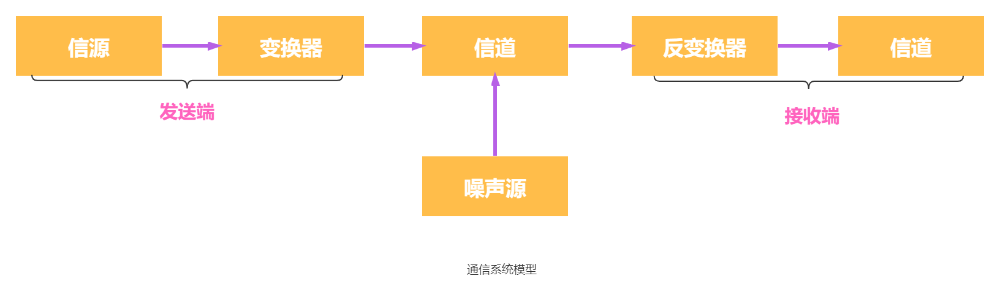
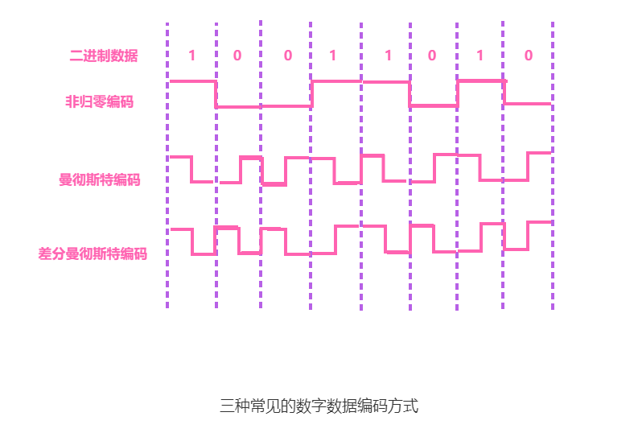
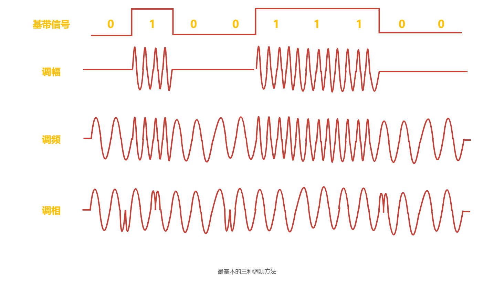
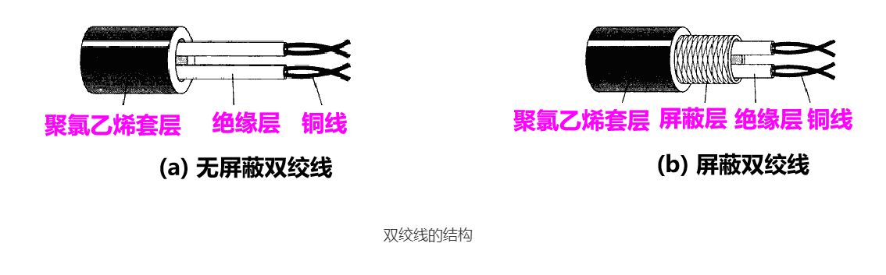
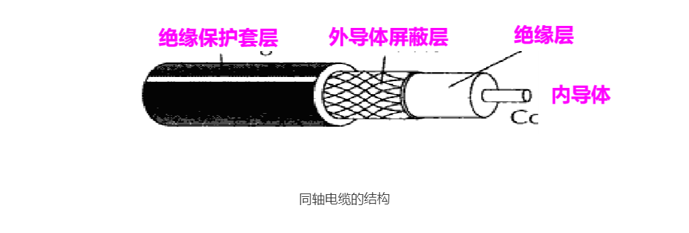
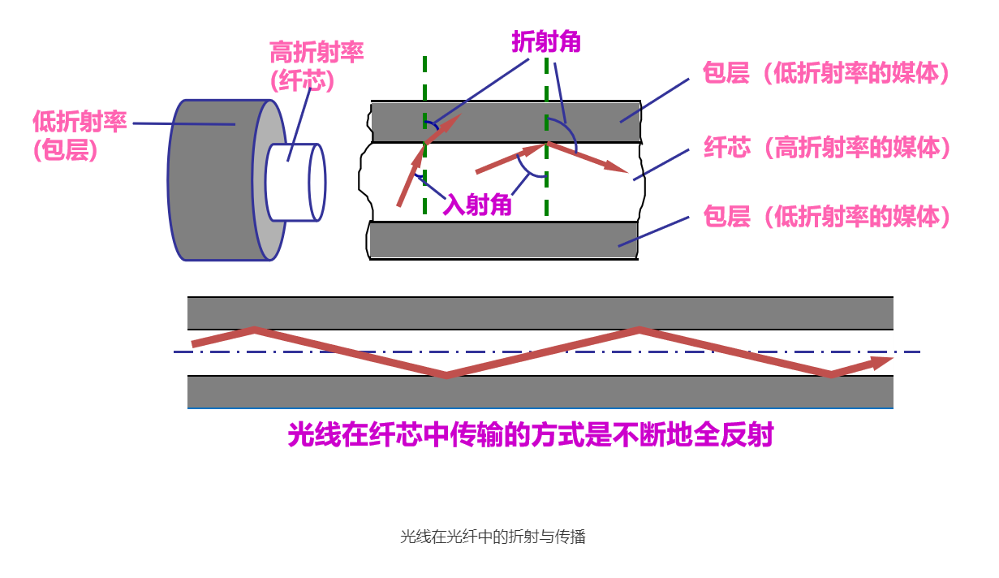
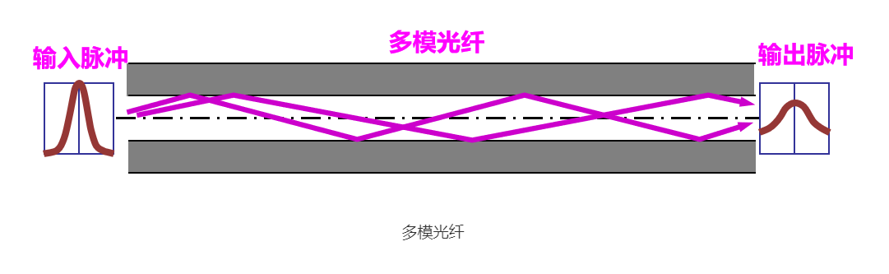
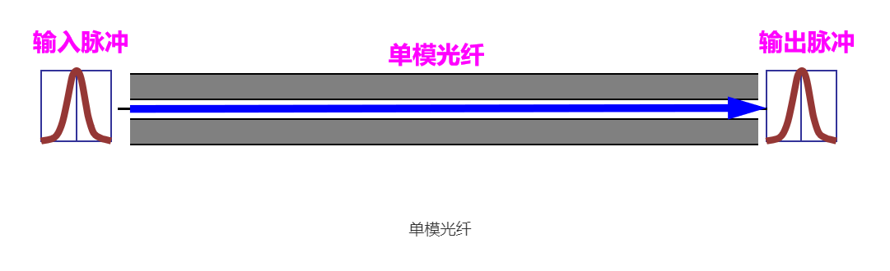

物理层考虑的是如何才能在连接各台计算机的传输媒体上传输数据比特流，而不指具体的传输介质。现有的计算机网络的硬件设备和传输介质的种类非常繁多，而通信方式也有许多不同方式。因此，物理层应尽可能屏蔽各种物理设备的差异，使物理层上面的数据链路层只需考虑本层的协议和服务。物理层的主要任务可以描述为确定与传输媒体的接口有关的一些特性：

1. 机械特性。主要定义物理连接的边界点，即接插装置。规定物理连接时所采用的规格、引线的数目、引脚的数量和排列情况等。
2. 电气特性。规定传输二进制位时，线路上信号的电压高低、阻抗匹配、传输速率和距离限制等。
3. 功能特性。指明某条线上出现的某一电平的电压表示何种意义，接口部件的信号线（数据线、控制线、定时线等）的用途。
4. 规程特性。主要定义各条物理线路的工作规程和时序关系。

# 通信基础

通信的目的是传送消息，数据是指传送信息的实体。信号是指数据的电气或电磁表现，是数据在传输过程中的存在形式。根据信号中代表消息的参数的取值方式不同，信号可分为以下两大类：

1. 模拟信号，或连续信号 —— 代表消息的参数的取值是连续的。
2. 数字信号，或离散信号 —— 代表消息的参数的取值是离散的。

数据传输方式可分串行传输和并行传输。

1. 串行传输，是指逐个比特按照时间顺序传输。处于经济上的考虑，远距离通信通常采用串行传输。
2. 并行传输，是指多个比特通过多条通信信道同时传输。

数据在计算机内部多采用并行传输方式。但数据在通信线路上的传输方式一般都是串行传输。因此物理层还要完成传输方式的转换。

码元是指用一个固定时长的信号波形（数字脉冲）表示一位 k 进制数字，代表不同离散数值的基本波形，是数字通信中数字信号的计量单位，这个时长内的信号称为 k 进制码元，而该时长称为码元宽度。1 码元可以携带多个比特的信息量。例如，在使用二进制编码时，只有两种不同的码元：一种代表 0 状态，一种代表 1 状态。

## 通信系统模型

数据通信是指数字计算机或其他数字终端之间的通信。一个数据通信系统主要划分为信源、信道和信宿三部分。

下图所示为一个单向通信系统的模型。实际的通信系统大多为双向的，即往往包含一条发送信道和一条接收信道，信道可以进行双向通信。

### 信源与信宿

信源是产生和发送数据的源头。信宿是接收数据的终点，它们通常都是计算机或其他数字终端装置。发送端信源发出的信息需要通过变换器转换成适合于在信道上传输的信号，而通过信道传输到接收端的信号先由反变换器转换成原始信息，再发送给信宿。

### 信道

信道与电路并不相同，信道是信号的传输媒介。一个信道可视为一条线路的逻辑部件，一般用来表示向某个方向传送信息的介质，因此一条通信线路往往包含一条发送信道和一条接收信道。噪声源是信道上的噪声（即对信号的干扰）及分散在通信系统其他各处的噪声的集中表示。

信道按传输信号形式的不同可分为传送模拟信号的模拟信道和传送数字信号的数字信道两大类；信道按传输介质的不同可分为无线信道和有线信道。

信道上传送的信号有基带信号和宽带信号之分。

1. 基带信号将数字信号 1 和 0 直接用两种不同的电压表示，然后送到数字信道上传输，称为基带传输。
2. 宽带信号将基带信号进行调制后形成频分复用模拟信号，然后传送到模拟信道上去传输，称为宽带传输。

从通信双方信息的交互方式看，可分为三种基本方式：

1. 单工通信。即只有一个方向的通信而没有反方向的交互。仅需要一条信道。例如，无线电广播、电视广播就属于这种类型。
2. 半双工通信。通信的双方都可以发送或接收信息，但任何一方都不能同时发送和接收信息，此时需要两条信道。
3. 全双工通信。通信双方可以同时发送和接收信息，也需要两条信道。

信道的极限容量是指信道的最高码元传输速率或信道的极限信息传输速率。

信道是用来表示向某一个方向传送信息的媒体。因此，一条通信电路往往包含一条发送信道和一条接收信道。

### 速率

速率也称数据率，指的是数据的传输速率，表示单位时间内传输的数据量。可以用码元传输速率和信息传输速率表示。

1. 码元传输速率。又称码元速率、波形速率等，它表示单位时间内数字通信系统所传输的码元个数（也可称为脉冲个数或信号变化的次数），单位是波特（Baud）。1 波特表示数字通信系统每秒传输一个码元。这里的码元可以是多进制的，也可以是二进制的，但码元速率与进制数无关。
2. 信息传输速率。又称信息速率、比特率等，它表示单位时间内数字通信系统传输的二进制码元个数（即比特数），单位是比特/秒（b/s）。

注意：波特和比特是两个不同的概念，码元传输速率也称调制速率、波形速率或符号速率。但码元传输速率与信息传输速率在数量上却又有一定的关系。若一个码元携带 n 比特的信息量、则 M 波特率的码元传输速率所对应的信息传输速率为 Mn 比特/秒。

### 带宽

带宽原指信号具有的频带宽度，单位是赫兹（Hz）。在实际网络中，由于数据率是信道最重要的指标之一，而带宽与数据率存在数值上的互换关系，因此常用来表示网络的通信线路所能传输数据的能力。因此，带宽表示单位时间内从网络中的某一点到另一点所能通过的 “最高数据率”。显然，此时带宽的单位不再是 Hz，而是 b/s。

## 奈奎斯特定理

奈奎斯特（Nyquist）定理又称奈氏准则，它指出在理想低通（没有噪声、带宽有限）的信道中，极限码元传输率为 2W 波特，其中 W 是理想低通信道的带宽，单位为 Hz。若用 V 表示每个码元离散电平的数目（码元的离散电平数目是指有多少中不同的码元，比如有 16 种不同的码元，则需要 4 位二进制位，因此数据传输率是码元传输率的 4 倍），则极限数据率为

$$
理想低通信道下的极限数据传输率 = 2W log_2V \quad  (单位为 b/s)
$$

对于奈氏准则，可以得出以下结论：

1. 在任何信道中，码元传输的速率是有上限的。若传输速率超过此上限，就会出现严重的码间串扰问题（指在接收端收到的信号波形失去了码元之间的清晰界限），使得接收端不可能完全正确识别码元。
2. 信道的频带越宽（即通过的信号高频分量越多），就可用更高的速率进行码元的有效传输。
3. 奈氏准则给出了码元传输速率的限制，但并未对信息传输速率给出限制，即未对一个码元可以对应多少个二进制位给出限制。

由于码元的传输速率受奈氏准则的制约，所以要提高数据的传输速率，就必须设法使每个码元携带更多个比特的信息量，此时就需要采用多元制的调制方法。

## 香农定理

香农（Shannon）定理给出了带宽受限且有高斯白噪声干扰的信道的极限数据传输率，当用此速率进行传输时，可以做到不产生误差。香农定理定义为

$$
信道的极限数据传输率 = Wlog_2(1+S/N)  \quad (单位为 b/s)
$$

式中，W 为信道的带宽，S 为信道所传输信号的平均功率，N 为信道内部的高斯噪声功率。S/N 为信噪比，即信号的平均功率与噪声的平均功率之比，信噪比 = $10log_{10}(S/N)$（单位为 dB），例如当 S/N = 10 时，信噪比为 10dB，当 S/N = 1000 时，信噪比为 30dB。

对于香农定理，可以得出以下结论：

1. 信道的带宽或信道中的信噪比越大，信息的极限传输速率越高。
2. 对一定的传输带宽和一定的信噪比，信息传输速率的上限是确定的。
3. 只要信息的传输速率低于信道的极限传输速率，就能找到某种方法来实现无差错的传输。
4. 香农定理得出的是极限信息传输速率，实际信道能达到的传输速率要比它低不少。

从香农定理可以看出，若信道带宽 W 或信噪比 S/N 没有上限（实际信道当然不可能这样），则信道的极限信息传输速率也没有上限。

奈氏准则只考虑了带宽与极限码元传输速率的关系，而香农定理不仅考虑到了带宽，也考虑到了信噪比。这从另一个侧面表明，一个码元对应的二进制位数是有限的。

## 编码与调制

数据无论是数字的还是模拟的，为了传输到目的都必须转变成信号。把数据变换为模拟信号的过程称为调制，把数据变化为数字信号的过程称为编码。

信号是数据的具体表示形式，它和数据有一定的关系，但又和数据不同。数字数据可以通过数字发送器转换为数字信息传输，也可以通过调制器转换成模拟信号传输；同样，模拟数据可以通过 PCM 编码器转换成数字信号传输，也可以通过放大器调制器转换成模拟信号传输。这样就形成了下列 4 种编码方式。

### 数字数据编码为数字信号

数字数据编码用于基带传输中，即在基本不改变数字数据信号频率的情况下，直接传输数字信号。对于这种编码方式，具体用什么样的数字信号表示 0 及用什么样的数字信号表示 1 就是所谓的编码。编码的规则有多种，只要能有效地把 1 和 0 区分开即可，常用的编码方式有以下几种，如下图所示。

#### 非归零编码

非归零编码（NRZ）用两个电压来代表两个二进制数字，如用低电平表示 0，用高电平表示 1；或者相反。这种编码虽然容易实现，但没有检错功能，而且也无法判断一个码元的开始和结束，以至于收发双方难以保持同步。

#### 曼彻斯特编码

曼彻斯特编码（Manchester Encoding）将一个码元分成两个相等的间隔，前一个间隔为高电平而后一个间隔为低电平表示码元 1；码元 0 的表示方法则正好相反。当然，也可采用相反的规定。该编码的特点是，在每个码元的中间出现电平跳变，位中间的跳变即作为时钟信号（可用于同步），又作为数据信号，但它所占的频带宽度是原始基带宽度的两倍。以太网使用的编码就是曼彻斯特编码。

#### 差分曼彻斯特编码

差分曼彻斯特编码常用于局域网传输，其规则是：若码元为 1，则前半个码元的电平与上一个码元的后半个码元的电平相同；若码元为 0，则情形相反。该编码的特点是，在每个码元的中间都有一次电平的跳转，可以实现自同步，且抗干扰性较好。

#### 4B/5B 编码

将欲发送数据流的每 4 位作为一组，然后按照 4B/5B 编码规则将其转换成相应的 5 位码。5 位码共 32 种组合，但只采用其中的 16 种对应 16 种不同的 4 位码，其他的 16 种作为控制码（帧的开始和结束、线路的状态信息等）或保留。

### 数字数据调制为模拟信号

数字数据调制技术在发送端将数字信号转换为模拟信号，而在接收端将模拟信号还原为数字信号，分别对应于调制解调器的调制和解调过程。基本的调制方法有如下图所示。

1. 调幅(AM)    即载波的振幅随基带数字信号而变化。例如，0 或 1 分别对应于无载波或有载波输出。
2. 调频(FM)    即载波的频率随基带数字信号而变化。例如，0 或 1 分别对应于频率 $f_1$ 或 $f_2$。
3. 调相(PM)    即载波的初始相位随基带数字信号而变化。例如，0 或 1 分别对应于相位 0 度或 180 度。

幅移键控(ASK)是通过改变载波信号的振幅，而频率和相位都不改变，比较容易实现，但抗干扰能力差；频移键控(FSK)是通过改变载波信号的频率，而振幅和相位都不改变，容易实现，抗干扰能力强；相移键控(PSK)通过改变载波信号的相位，而振幅和频率都不改变，又分文绝对调相和相对调相。为了达到更高的信息传输速率，也可以采用技术上更为复杂的多元制的振幅相位混合调制方法。如正交振幅调制(QAM)，在频率相同的前提下，将 ASK 与 PSK 结合起来，形成叠加信号。设波特率为 B，采用 m 个相位，每个相位有 n 种振幅，则该 QAM 技术的数据传输率 R 为
$$
R = Blog_2{(mn)} \quad (单位为 b/s)
$$

### 模拟数据编码为数字信号

这种编码方式最典型的例子是常用于对音频信号进行编码的脉码调制（PCM）。它主要包括三个步骤，即采样、量化和编码。

先来介绍采样定理：在通信领域，带宽是指信号最高频率与最低频率之差，单位为 Hz。因此，将模拟信号转换成数字信号时，假设原始信号中的最大频率为 $f$，那么采样频率 $f_{采样}$ 必须大于等于最大频率 $f$ 的两倍，才能保证采样后的数字信号完整保留原始模拟信号的信息。另外，采样定理又称奈奎斯特定理。

1. 采样是指对模拟信号进行周期性扫描，把时间上连续的信号变成时间上离散的信号。根据采样定理，当采样的频率大于等于模拟数据的频带带宽（最高变化频率）的两倍时，所得的离散信号可以无失真地代表被采样的模拟数据。
2. 量化是把采样取得的电平幅值按照一定的分级标度转化为对应的数字值并取整数，这样就把连续的电平幅值转换为了离散的数字量。采样和量化的实质就是分隔和转换。
3. 编码是把量化的结果转换为与之对应的二进制编码。

### 模拟数据调制为模拟信号

为了实现传输的有效性，可能需要较高的频率。这种调制方式还可以使用频分复用技术，并充分利用带宽资源。电话机和本地局交换机采用模拟信号传输模拟数据的编码方式；模拟的声音数据是加载到模拟的载波信号中传输的。

# 传输介质

传输介质也称传输媒体或传输媒介，它是发送设备和接收设备之间的物理通路。传输介质可分为导向传输介质和非导向传输介质两大类。在导向传输介质中，电磁波被导向沿着固定媒体传播，而非导向传输介质就是指自由空间，可以是空气、真空或海水等。在非导引型传输介质中电磁波的传输常称为无线传输。

## 有线传输介质

有线传输介质是指在两个通信设备之间实现的物理连接部分，能将信号从一方传输到另一方，其中，有线传输介质主要有双绞线、同轴电缆和光纤。

### 双绞线

双绞线是最古老但又是最常用的传输介质，它由两根互相绝缘的铜导线按一定规则并排绞合在一起。绞合可减少对相邻导线的电磁干扰。

为了进一步提高双绞线的抗电磁干扰能力，可在双绞线的外面再加上一层由金属丝编织成的屏蔽层，这就是屏蔽双绞线（Shielded Twisted Pair，STP），而无屏蔽层的双绞线被称为非屏蔽双绞线（Unshielded Twisted Pair，UTP）。结构如下图所示。

双绞线价格便宜，是最常用的传输介质之一，在局域网和传统电话网中普遍使用，双绞线的带宽取决于铜线的粗细和传输的距离。模拟传输和数字传输都可使用双绞线，其通信距离一般为几千米到数十千米。距离太远时，对于模拟传输，要用放大器放大衰减的信号；对于数字传输，要用中继器将失真的信号整形。

### 同轴电缆

同轴电缆由内导体、绝缘层、网状编织屏蔽层和保护塑料外层构成，如下图所示。由于外导体屏蔽层的作用，同轴电缆具有良好的抗干扰特性，被广泛用于传输较高速率的数据。

按特性阻抗数值的不同，通常将同轴电缆分为两类：50Ω同轴电缆和75Ω同轴电缆。其中，50Ω同轴电缆主要用于传输基带数字信号，又称基带同轴电缆，它在局域网中应用广泛；7Ω同轴电缆主要用于传送宽带信号，又称宽带同轴电缆，主要用于有线电视系统。

### 光纤

光纤通信利用光导纤维传播光脉冲进行通信。有光脉冲相当于 1，无光脉冲相当于 0。由于可见光的频率约为 $10^8$ MHz，因此光纤通信系统的传输带宽范围极大。

光纤是光纤通信的传输介质。在发送端有光源，可以采用发光二极管或半导体激光器，它们在电脉冲的作用下能产生出光脉冲。在接收端利用光电二极管做成光检测器，在检测到光脉冲时可还原出电脉冲。

光纤主要由纤芯和包层构成，而且光波是通过纤芯进行传导，包层较纤芯有较低的折射率，当光线从高折射率的介质射向低折射率的介质时，其折射角将大于入射角，如下图所示。因此，如果入射角足够大，就会出现全反射，即光线碰到包层时会折射回纤芯。这个过程不断重复，光也就沿着光纤传输下去。

只要从纤心中射到纤心表面的光线的入射角大于某个临界角度，就会产生全反射。因此，从不同角度入射的多束光线可在一条光纤中传输，如下图所示，这种光纤称为多模光纤，多模光纤的光源为发光二极管。

光脉冲在多模光纤中传输时会逐渐展宽，造成失真。因此多模光纤只适合于近距离传输。若光纤的直接减小到只有一个光的波长，则光纤就像一根波导那样，它可使光线一直向前传播，而不会产生多次反射。这样的光线称为单模光纤。如下图所示。

单模光纤的纤芯很细，其直径只有几个微米，制造起来成本较高。同时单模光纤的光源为定向性很好的激光二极管，因此单模光纤的衰减较小，适合远距离传输。

光纤不仅具有通信容量非常大的优点，还有传输损耗小，中继距离长；抗雷电和电磁干扰性好；无串音干扰，保密性，不易被窃听或截取数据；体积小，重量轻的几个特点。

## 无线传输介质

无线通信已广泛应用于移动电话领域，构成蜂窝式无线电话网。随着便携式计算机的出现，以及在军事、野外等特殊场合下移动通信联网的需要，促进了数字化移动通信的发展，现在无线局域网产品的应用已非常普遍。

### 无线电波

无线电波具有较强的穿透能力，可以传输很长的距离，所以它被广泛应用于通信领域，如无线手机通信、计算机网络中的无线局域网（WLAN）等。因为无线电波使信号向所有方向散播，因此有效距离范围内的接收设备无须对准某个方向，就可与无线电波发射者进行通信连接，大大简化了通信连接。这也是无线电传输的最重要优点之一。

### 微波

微波的频率范围为 300 MHz~ 300 GHz，但主要使用 2~40 GHz 的频率范围。因此微波波段频率很高，其频段范围也很宽，因而通信信道的容量大。例如，一个带宽为 2MHz 的频段可容纳 500 条语音线路，若用来传输数字信号，数据率可达数兆比特/秒。与通常的无线电波不同，微波通信的信号是沿直线传播的，故在地面的传播距离有限，超过一定距离后就要用中继器来接力。

卫星通信利用地球同步卫星作为中继来转发微波信号，可以克服地面微波通信距离的限制，三颗相隔 120° 的同步卫星几乎能覆盖整个地球表面，因而基本能实现全球通信。卫星通信的优点是通信容量大、距离远、覆盖广，缺点是端到端传播时延长，一般为 250~270ms。

红外线和激光也像微波通信一样沿直线传输，具有很强的方向性。但是，红外线通信和激光通信要把传输的信号分别转换为各自的信号格式，即红外光信号和激光信号，再直接在空间中传播。

# 物理层设备

## 中继器

中继器又称转发器，是工作在物理层上的连接，主要功能是将信号整形并放大再转发出去，以消除信号经过一长段电缆后，因噪声或其他原因而造成的失真和衰减，使信号的波形和强度达到所需要的要求，进而扩大网络传输的距离。其原理是信号再生，而非简单地将衰减的信号放大。中继器有两个端口，数据从一个端口输入，再从另一个端口发出。端口仅作用于信号的电气部分，而不管数据中是否有错误数据或不适于网段的数据。

中继器是局域网环境下用来扩大网络规模的最简单、最廉价的互联设备。使用中继器连接的几个网段仍然是一个局域网。一般情况下，中继器的两端连接的是相同的媒体，但有的中继器也可以完成不同媒体的转接工作。但由于中继器工作在物理层，因此它不能连接两个具有不同速率的局域网。中继器两端的网络部分是网段，而不是子网。中继器若出现故障，对相邻两个网段的工作都将产生影响。

从理论上讲，中继器的使用数目是无限的，网络因而也可以无限延长。但事实上这不可能，因为网络标准中对信号的延迟范围做了具体的规定，中继器只能在此规定范围内进行有效的工作，否则会引起网络故障。例如，在采用粗同轴电缆的 10BASE5 以太网规范中，互相串联的中继器的个数不能超过 4 个，而且用 4 个中继器串联的 5 段通信介质中只有 3 段可以挂接计算机，其余两段只能用作扩展通信范围的链路段，不能挂接计算机。这就是所谓的 “5-4-3 规则”。

注意：放大器和中继器都起放大作用，只不过放大器放大的是模拟信号，原理是将衰减的信号放大，而中继器放大的是数字信号，原理是将衰减的信号整形再生。如果某个网络设备具有存储转发的功能，那么可以认为它能连接两个不同的协议，如果该网络设备没有存储转发功能，那么认为它不能连接两个不同的协议。中继器是没有存储转发功能的，因此它不能连接两个速率不同的网段，中继器两端的网段一定要使用同一个协议。

## 集线器

集线器实质上是一个多端口的中继器，它也工作在物理层。当集线器工作时，一个端口接收到数据信号后，由于信号在从端口到集线器的传输过程中已经衰减，所以集线器便将该信号进行整形放大，使之再生到发送时的状态，紧接着转发到其他所有处于工作状态的端口，除输入端口外。如果同时有两个或多个端口输入，那么输出时会发生冲突，致使这些数据都无效。从集线器的工作方式可以看出，它在网络中只起信号放大和转发作用，目的是扩大网络的传输范围，而不具备信号的定向传输能力，即信号传输的方向是固定的，是一个标准的共享式设备。

集线器主要使用双绞线组建共享网络，是从服务器连接到桌面的最经济方案。在交换式网络中，集线器直接与交换机相连，将交换机端口的数据送到桌面上。使用集线器组网灵活，它把所有结点的通信集中在以其为中心的结点上，对结点相连的工作站进行集中管理，不让出问题的工作站影响整个网络的正常运行，并且用户的加入和退出也很自由。

由集线器组成的网络是共享式网络，但逻辑上仍是一个总线网。集线器的每个端口连接的网络部分是同一个网络的不同网段，同时集线器也只能在半双工状态下工作，网络的吞吐率因而受到限制。

注意：多台计算机必须会发生同时通信的情形，因此集线器不能分割冲突域，所有集线器的端口都属于同一个冲突域。集线器在一个时钟周期中只能传输一组信息，如果一台集线器连接的机器数目较多，且多台机器经常需要同时通信，那么将导致信息碰撞，使得集线器的工作效率很差。比如，一个带宽为 10Mb/s 的集线器上连接了 8 台计算机，当这 8 台计算机同时工作时，每台计算机真正所拥有的带宽为 10/8 Mb/s = 1.25 Mb/s。