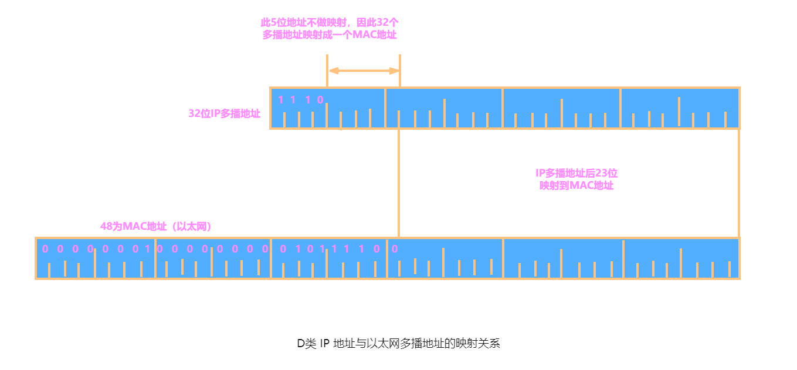

# 网络层的功能

网络层是 OSI 模型中的第三层（TCP/IP模型中的网际层），提供路由和寻址的功能，使两终端系统能够互连且决定最佳路径，并具有一定的拥塞控制和流量控制的能力。由于 TCP/IP 协议体系中的网络层功能由 IP 协议规定和实现，故又称 IP 层。

## 虚拟互连网络

要在全世界范围内把数以百万计的网络互连起来，并且能够互连通信，是一项非常复杂的任务，此时需要解决许多问题，如不同的寻址方案、不同的网络接入机制、不同的差错处理方法、不同的路由选择机制等等。用户的需求是多样的，**没有一种单一的网络能适应所有的需求**。网络层所要完成的任务之一就是使这些异构的网络实现互连。

所谓网络互连，是将指两个以上的计算机网络，通过一定的方法，用一种或多种通信处理设备（即中间设备）互连起来，以构成更大的网络系统。中间设备又称中间系统或中继系统。根据所在的层次，中继系统分为以下四种：

1. 物理层中继系统：转发器(repeater)。
2. 数据链路层中继系统：网桥或桥接器(bridge)。
3. 网络层中继系统：路由器(router)。
4. 网络层以上的中继系统：网关(gateway)。

使用物理层或数据链路层的中继系统时，只是把一个网络扩大了，而从网络层的角度看，它仍然是同一个网络，一般并不称之为网络互连。因此 **网络互连通常是指用路由器进行网络互连和路由选择**。路由器是一台专用计算机，用于在互联网中进行路由选择。

TCP/IP 体系在网络互连上采用的做法是在网络层（即 IP 层）采用标准化协议，但相互连接的网络可以是异构的。下图(a) 表示有许多计算机网络通过一些路由器进行互连。由于参加互连的计算机网络都使用相同的网际协议（Internet Protocol，IP），因此可以把互联后的计算机网络视为下图(b) 所示的一个虚拟互连网络。

所谓虚拟互连网络也就是逻辑互连网络，即互连起来的各种物理网络的异构性本来是客观存在的，但是通过使用 IP 协议就可以使这些性能各异的网络 **在网络层上看起来好像是一个统一的网络**。这种使用 IP 协议的虚拟互连网络可简称为 IP 网。

使用 IP 网的好处是：当 IP 网上的主机进行通信时，就好像在一个单个网络上通信一样，而看不见互连的具体的网络异构细节，如具体的编址方案、路由选择协议等。

## 路由与转发

网络层的作用是将分组从一台发送主机移动到一台接收主机。为此，需要两种重要的网络层功能：

1. 路由选择。指按照复杂的分布式算法，根据从各相邻路由器所得到的的关于整个网络拓扑的变化情况，动态地改变所选择的路由。
2. 分组转发。指路由器根据转发表将用户的 IP 数据报从合适的端口转发出去。

前者是根据特定的路由选择协议构造出路由表。同时经常或定期地和相邻路由器交换路由信息而不断地更新和维护路由表。后者处理通过路由器的数据流，关键操作时转发表查询、转发及相关的队列管理和任务调度等。

路由表示根据路由选择算法得出的，而转发表示从路由表得出的。转发表的结构应当使查找过程最优化，路由表则需要对网络拓扑变化的计算最优化。在讨论路由选择的原理时，往往不去区分转发表和路由表，而是笼统地使用路由表一词。

## 数据传输服务

网络层能够在两台主机之间提供无连接服务或连接服务。网络层的连接和无连接服务在许多方面与传输层的面向连接和无连接服务类似。例如，网络层连接服务以源和目的主机间的握手开始；网络层无连接服务则没有任何握手预备步骤。但也存在差异：

- 网络层中的服务是由网络层向传输层提供的主机到主机的服务；而传输层的服务是由传输层向应用层提供的进程到进程的服务。
- 在网络体系结构中，网络层不能同时提供无连接服务和连接服务，只能提供一种服务。
- 传输层面向连接服务是在网络边缘的端系统中实现；网络层连接服务除了在端系统外，也在位于网络核心的路由器中实现。

网络层提供的两种基本服务是虚电路网络和数据报网络。在作出转发决定时，会使用不同的信息。

### 虚电路服务

计算机网络模仿电信网所建立的面向连接的传输方式被称作 **虚电路**。虚电路的概念来源于电话界，它采用了真正的电路。由于呼叫建立及每呼叫的状态要在网络中的路由器上维持，一个面向虚电路的网络显然比数据报要复杂得多。这也与它的电话传统一致。电话网络在网络中必然有其复杂性，因为它们要连接哑端系统设备，如转盘电话。

在发送数据前首先在源主机和目的主机之间建立一条虚连接。虚电路在两个结点或应用进程之间创建起一个逻辑上的连接或虚电路后，就可以在两个节点之间依次发送每一个分组，接收端收到分组的顺序必然与发送端的发送顺序一致，因此接收端无须负责在手机分组后重新进行排序。

虚电路的组成如下：

1. 源和目的主机之间的路径。
2. VC号，沿着该路径的每段链路的一个号码。
3. 沿着该路径的每台路由器中的转发表表项。属于一条虚电路的分组将在它的首部携带一个 VC 号。

因为一条虚电路在每条链路上可能具有不同的 VC 号，每台中间路由器必须用一个新的 VC 号替代每个传输分组的 VC 号。该新的 VC 号从转发表获得。

虚电路通信过程分为三个阶段：

1. 虚电路建立。在建立连接阶段，需要预留双方通信所需的一切网络资源，等待网络建立虚电路。
2. 数据传送。双方沿着已建立的虚电路发送分组。分组的首部不需要填写完整的目的主机地址，而只需要填写这条虚电路的编号，因而减少分组的开销。
3. 虚电路拆除。在通信结束后拆除已建立的虚电路，并更新路径上每台分组路由器中的转发表以表明该虚电路已不存在。

这种通信方式如果再使用可靠传输的网络协议，就可使所发送的分组不丢失、不重复、无差错按序到达终点。

网络层的虚电路建立与传输层的连接建立之间有一个细微但很重要的区别。传输层的连接建立仅涉及两个端系统。在传输层的连接建立期间，两个端系统独自决定传输层连接的参数。虽然这两个端系统已经知道该传输层连接，但网络中的路由器则对这些完全不知情。在另一方面，对于一个虚电路网络层，沿两个端系统之间路径上的路由器都要参与虚电路的建立，且每台路由器都完全知道经过它的所有虚电路。

端系统向网络发送指示虚电路启动与终止的报文，以及路由器之间传递的用于建立虚电路的报文，它们被称为信令报文，用于交换这些报文的协议常被称为信令协议。

### 数据报服务

在数据报网络中，每当一个端系统要发送分组，它就为该分组加上目的端系统的地址，然后将分组推进网络中。如上图所示，无需建立任何虚电路，路由器不维护任何虚电路的状态信息。

确保每个分组带有足够的信息，从源到目的地，会通过一系列路由器传递。路由器会根据分组中的目的地址来转发分组，使得任何一台路由器都能决定怎样使它到达目的地。

网络在发送分组时不需要先建立连接。每一个分组独立发送，与其前后的分组无关。网络层不提供服务质量的承若。也就是说，所发送的分组可能出错、丢失、重复和失序，当然也不保证分组交付的时限。由于传输网络不提供端到端的可靠传输服务，这就使网络中的路由器比较简单，且造价低廉。如果主机中的进程之间的通信需要是可靠的，那么就由网络的主机中的传输层负责。

下表归纳了虚电路服务与数据报服务的主要区别。

| 对比的方面                 | 虚电路服务                                     | 数据报服务                                         |
| -------------------------- | ---------------------------------------------- | -------------------------------------------------- |
| 思路                       | 可靠通信应当由网络来保证                       | 可靠通信应当由用户主机来保证                       |
| 连接的建立                 | 必须有                                         | 不需要                                             |
| 终点地址                   | 仅在连接建立阶段使用，每个分组使用短的虚电路号 | 每个分组都有终点的完整地址                         |
| 分组的转发                 | 属于同一条虚电路的分组均按照同一路由进行转发   | 每个分组独立选择路由进行转发                       |
| 当结点出故障时             | 所有通过出故障的结点的虚电路均不能工作         | 出故障的结点可能会丢失分组，一些路由可能会发生变化 |
| 分组的顺序                 | 总是按发送顺序到达终点                         | 到达终点的时间不一定按发送顺序                     |
| 端到端的差错处理和流量控制 | 可以由网络负责，也可以由用户主机负责           | 由用户主机负责                                     |

## 拥塞控制

在通信子网中，因出现过量的分组而引起网络性能下降的现象称为拥塞。例如，某个路由器所在链路的带宽为 $R \; B/s$，如果 IP 分组只从它的某个端口进入，那么其速率为 $r_{in} \; B/s$。如下图所示，当 $r_{in}$ 无限接近$R$时，链路带宽被充分利用，但平均时延会急剧增加。因为路由缓冲区容量有限，会有大量的分组被丢弃，整个网络的吞吐量会骤降，源与目的地之间的平均时延也会变得近乎无穷大。

判断网络是否进入拥塞状态的方法是观察网络的吞吐量与网络负载的关系：如果随着网络负载的增加，网络的吞吐量明显小于正常的吞吐量，那么网络就可能已进入 “轻度拥塞” 状态；如果网络的吞吐量随着网络负载的增大而下降，那么网络就可能已进入拥塞状态；如果网络的负载继续增大，而网络的吞吐量下降到零，那么网络就可能已进入死锁状态。

为避免拥塞现象的出现，要采用能防止拥塞的一系列方法对子网进行拥塞控制。拥塞控制主要解决的问题是如何获取网络中发生拥塞的信息，从而利用这些信息进行控制，以避免由于拥塞而出现分组的丢失，以及严重拥塞而产生网络死锁的现象。

拥塞控制是确保子网能够承载所达到的流量，这是一个全局性的过程，涉及各方面的行为：主机、路由器及路由器内部的转发处理过程等。单一地增加资源并不能解决拥塞。

**流量控制和拥塞控制的区别**：流量控制往往是指在发送端和接收端之间的点对点通信量的控制。流量控制所要做的是抑制发送端发送数据的速率，以便使接收端来得及接收。而拥塞控制必须确保通信子网能够传送待传送的数据，是一个全局性的问题，涉及网络中所有的主机、路由器及导致网络传输能力下降的所有因素。

拥塞控制的方法有两种：

1. 开环控制。在设计网络时事先将有关发生拥塞的因素考虑周到，力求网络在工作时不产生拥塞。这是一种静态的预防方法。一旦整个系统启动并运行，中途就不再需要修改。开环控制手段包括确定何时可接收新流量、何时可丢弃分组及丢弃哪些分组，确定何种调度决策等。所有这些手段的共性是，在做决定时不考虑当前网络的状态。
2. 闭环控制。事先不考虑有关发生拥塞的各种因素，采用检测网络系统去监视，及时检测哪里发生了拥塞，然后将拥塞信息传到合适的地方，以便调整网络系统的运行，并解决出现的问题。闭环控制是基于反馈环路的概念，是一种动态的方法。

# 网际协议

网际协议（Internet Protocol，IP）是用于分组交换数据网络的协议。IP 是在 TCP/IP 协议族中网络层的主要的协议，任务仅仅是根据源主机和目的主机的地址来传送数据。为此目的，IP 定义了寻址方法和数据报的封装结构。

由于网际协议 IP 是用来使互连起来的许多计算机网络能够进行通信的，因此 TCP/IP 体系中的网络层常常被称为网际层，或 IP 层。而现在的网络中运行的网际协议是 IPv4 以及 IPv6。IPv6 是为了解决 IP 地址空间耗尽的问题的解决方案。

## IPv4

IPv4 指的是 IP 的第 4 个版本。

与 IP 协议配套使用的还有三个协议：

- 地址解析协议 ARP（Address Resolution Protocol）
- 网际控制报文协议 ICMP（Internet Control Message Protocol）
- 网际组管理协议 IGMP（Internet Group Management Protocol）

### IPv4 数据报

IP 定义数据传输的协议单元为 IP 数据报，也称 IP 分组。IP 也包括一套规则，指明分组如何处理、错误怎样控制。特别是 IP 还包含非可靠投递的思想，以及与此关联的分组路由选择的思想。

IPv4 数据报格式如下图所示。

IPv4 数据报中的关键字段如下：

- 版本（Version）。占 4 bit（位），规定了数据报的 IP 协议版本。通信双方使用的版本必须一致。
- 首部长度（Internet Header Length，IHL）。占 4 bit，单位是 32 位字（1个 32 位字长是 4 字节）。由于 IPv4 首部可能包含数目不定的选项，这个字段也用来确定数据的偏移量。大多数 IP 数据报不包含选项，所以一般的 IP 数据报具有 20 字节的首部，这个字段的最小值是 5，相当于 20 字节，最大十进制值是 15，相当于 60 字节。
- 区分服务（Differentiated Services，DS）。占 8 bit，以便使不同类型的 IP 数据报能相互区别开来，一般情况下不使用。最初被定义为服务类型，但实际上并未使用。1998 年被 IETF 重定义为区分服务。
- 总长度（Total Length）。占 16 bit，指首部和数据之和的长度，单位是字节。所以 IP 数据报的理论最大长度为 $2^{16} - 1 = 65535$ 字节。然而，数据报很少传送这么长的。
- 标识（Identification）。占 16 bit，它是一个计数器，每产生一个数据报就加 1，并赋值给标识字段。 这个字段主要被用来唯一地标识一个报文的所有分片，因为分片不一定按序到达，所以在重组时需要知道分片所属的报文。
- 标志（Flags）。占 3 bit，用于控制和识别分片。
	- 位0：保留，必须为0
	- 位1：禁止分片（Don't Fragment，DF），当DF=0时才允许分片
	- 位2：更多分片（More Fragment，MF），MF=1代表后面还有分片，MF=0代表已经是最后一个分片。
- 片偏移（Fragment Offset）。占 13 bit，指出较长的分组在分片后，某片在原分组中的相对位置。片偏移以 8 个字节为偏移单位，即每个分片的长度一定是 8 字节（64位）的整数倍。
- 存活时间（Time-To-Live，TTL）。占 8 bit，避免数据报永远在网络中循环。每当数据报由一台路由器处理时，该字段的值减 1。若 TTL 字段减为 0，则该数据报必须丢弃。
- 协议（Protocol）。占 8 bit，指出 IP 数据报携带的数据使用何种协议，即分组的数据部分应交给哪个传输协议，如 TCP、UDP 等。其中值为 6 表示 TCP，值为 17 表示 UDP。
- 首部检验和（Header Checksum）。占 16 bit，只检验数据报首部，不包括数据部分。
- 源地址（Source address）。占 32 bit，标识发送方的 IP 地址。
- 目的地址（Destination address）。占 32 bit，标识接收方的 IP 地址。
- 选项（Options）。允许 IP 首部被扩展，但并不经常使用，因此决定对每个数据报首部不包括选项字段中的信息，这样能够节约开销。
- 数据（Data）。 包含要交付给目的地的传输层报文段，该字段也可承载其它类型的数据，如 ICMP 报文。

一个 IP数据报有总长为 20 字节的首部（假设无选项）。如果数据报承载一个 TCP 报文段，则每个（无分片的）数据报共承载了总长 40 字节的首部（20 字节的 IP 首部加上 20 字节的 TCP 首部）以及应用层报文。

注意，在 IP 数据报首部中有三个关于长度的标记，一个是首部长度、一个是总长度、一个是片偏移，基本单位分别为 4字节、1字节、8字节。

#### IP 数据报分片

一个链路层帧能承载的最大数据量叫做 **最大传送单元**（Maximum Transmission Unit，MTU）。每个 IP 数据报封装在链路层帧中从一台路由器传输到下一台路由器，故链路层协议的 MTU 严格地限制着 IP 数据报的长度，而且在 IP 数据报的源与目的地路径上的每段链路可能使用不同的链路层协议，且每种协议可能具有不同的 MTU。

当 IP 数据报的总长度大于链路 MTU 时，就需要将 IP 数据报中的数据分片成两个或更多个较小的 IP 数据报，用单独的链路层帧封装这些较小的 IP 数据报；然后向输出链路上发送这些帧。这些较小的数据报被称为 **片**（fragment）。

片在其到达目的地传输层以前需要重新组装。目的主机使用 IP 首部中的标识、标志和片偏移字段来完成对片的重组。创建一个 IP 数据报时，源主机为该数据报加上一个标识号。当一个路由器需要将一个数据报分片时，形成的每个数据报（即片）都具有原始数据报的标识号。当目的主机收到来自同一发送主机的一批数据报时，它可以通过检查数据报的标识号来确定哪些数据报属于同一个原始数据报的片。IP 首部中的标志位有 3 bit，但只有后 2 bit有意义，分别是 MF 位（More Fragment）和 DF 位（Don't Fragment）。只有当 DF = 0 时，该 IP 数据报才可以被分片。MF 则用来告知目的主机该 IP 数据报是否为原始数据报的最后一个片。当 MF = 1 时，表示相应的原始数据报还有后续的片；当 MF = 0 时，表示该数据报是相应原始数据报的最后一个片。目的主机在对片进行重组时，使用片偏移字段来确定片应放在原始 IP 数据报的哪个位置。

IP 分片涉及一定的计算。例如，一个长 4000字节 的 IP 数据报（首部 20字节，数据部分 3980字节）到达一个路由器，需要转发到一条 MTU 为 1500 字节的链路上。这意味着原始数据报中的 3980 字节数据必须被分配到 3 个独立的片中（每片也是一个 IP 数据报）。假定原始数据报的标识号为 777，那么分成的 3 片如下图所示。可以看出，由于偏移值的单位是 8 字节，所以除最后一个片外，其他所有片中的有效数据载荷都是 8 的倍数。

#### 网络层转发分组的流程

网络层的路由器执行的分组转发算法如下：

1. 从数据报的首部提取目的主机的 IP 地址 D，得出目的网络地址 N。
2. 若网络 N 与此路由器直接相连，则把数据报直接交付给目的主机 D，这称为路由器的直接交付；否则是间接交付，质性步骤3。
3. 若路由表中有目的地址为 D 的特定主机路由（对特定的目的主机指明一个特定的路由，通常是为了控制或测试网络，或出于安全考虑才采用的），则把数据报传送给路由表中所指明的下一跳路由器；否则，执行步骤4。
4. 若路由表中有到达网络 N 的路由，则把数据报传送给路由表指明的下一跳路由器；否则，执行步骤5。
5. 若路由表中有一个默认路由，则把数据报传送给路由表中所指明的默认路由器；否则执行步骤6。
6. 报告转发分组出错。

注意，得到下一跳路由器的 IP 地址后并不是直接将该地址填入待发送的数据报，而是将该 IP 地址转换成 MAC 地址（通过ARP），将其放到 MAC 帧首部中，然后根据这个 MAC 地址找到下一跳路由器。在不同网络中传送时，MAC 帧中的源地址和目的地址要发生变化，但是网桥在转发帧时，不改变帧的源地址，请注意区分。

### IPv4 地址

IP 地址就是给连接到互联网上的每台主机或路由器的每一个接口分配一个 32 bit 的全球唯一标识符。因此总共有 $2^{32} = 4,294,967,296$ 个可能的 IP 地址。对于主机或路由器来说，IP 地址都是 32 位的二进制代码。为了可读性，将地址按点分十进制记法书写，即每个地址中的每个字节用它的十进制形式书写，各字节间以句号隔开。例如，考虑 IP 地址 193.32.216.9，193 是该地址第一个 8 bit的十进制等价数，32 是该地址第二个 8 bit的十进制等价数，一次类推。因此，地址 193.32.216.9 的二进制记法是：

$$
11000001 \  00100000 \  11011000 \  00001001
$$

在全球互联网中的每台主机和路由器上的每个接口，必须有一个全球唯一的 IP 地址。然而，这些地址不能随意地自由选择。一个接口的 IP 地址的一部分需要由其连接的子网来决定。

IP 地址的编址方法共经历三个历史阶段。

1. 分类寻址。将 IP 地址划分为 A、B、C、D、E 五类。IP 地址由网络号和主机号组成。路由器仅根据目的主机的网络号来转发分组，从而减小路由表所占用的存储空间以及查找路由表的时间。
2. 子网划分。对原始的分类寻址的改进，将原始的分类寻址进一步的划分。将之前的主机号进一步划分为子网号和主机号，从而提高 IP 地址的利用率。
3. 无类别域间路由。消除了传统的A类、B类、C类地址以及子网划分的概念，因而更有效地分配 IPv4 的地址。

#### 分类寻址

**分类寻址** 就是将 IP 地址划分为若干个固定类，每一类地址都由网络号和主机号两部分组成。即 `IP 地址::={<网络号>,<主机号>}`。其中符号`::=`表示 **定义为**。网络号标志主机（或路由器）所连接的网络，一个网络号在整个互联网范围内必须是唯一的。主机号标志该主机（或路由器），一台主机号在它前面的网络号所指明的网络范围内必须是唯一的。

分类寻址如下图所示。

分类寻址将 IP 地址分为 5 类是为了更好地满足不同用户的要求。当某个单位申请到一个 IP 地址时，实际上是获得了具有同样网络号的一块地址。其中具体的各台主机号由该单位自行分配，只要做到在该单位管辖的范围内无重复的主机号即可。

**A类** 地址的 **网络号** 占 1 个字节，其第 1 位类别位已固定为 `0`，剩 7 位可供指派的网络号为 $2^7-2 = 126$ 个，网络号可用的为`1~126`，**主机号** 占 3 个字节，最大主机数是 $2^{24}-2=16,777,214$。IP 地址空间共有 $2^{32}$个地址。整个 A 类地址空间共有 $2^{31}$个地址，占整个 IP 地址空间的 50%。

A类地址可用网络号 $2^7-2$ 中减 2 的原因为：① 网络号字段全为 0 的 IP 地址是保留地址，表示本网络；② 网络号为 127 保留作为本地软件环回测试本主机的进程之间的通信之用。

**B类** 地址的 **网络号** 占 2 个字节，其前 2 位类别位已固定为 `10`，剩 14 位可供指派的网络号为 $2^{14}-1=16,383$。**主机号** 占 2 个字节，最大主机数是 $2^{16}-2=65,534$。整个 B 类地址空间共有 $2^{30}$个地址，占整个 IP 地址空间的 25%。

B 类地址的可用网络数为 $2^{14}-1$，减 1 的原因是 `128.0` 这个网络号是不可指派的，可以指派的B类最小网络地址是`128.1.0.0`。

**C类** 地址 **网络号** 占 3 个字节，其前 3 位类别位已固定为 `110`，剩 21 位可供指派的网络号为 $2^{21}-1=2,097,151$。 **主机号** 占 1 个字节，最大主机数是 $2^{8}-2=254$。整个C类地址空间共约有 $2^{29}$ 个地址，占整个 IP 地址的 12.5%。

C 类地址的可用网络数为 $2^{21}-1$，减 1 的原因是网络号为 `192.0.0` 的网络是不可指派的，可以指派的 C 类最小网络地址是 `129.0.1.0`。

**D类** 地址的 **网络号** 占 4 个字节，其前 4 位类别位已固定为 `1110`，用于多播。

**E类** 地址的 **网络号** 占 4 个字节，其前 4 位类别位已固定为 `1111`，保留为以后用。

如此，在各类 IP 地址中，有些具有特殊用途，不用做主机的 IP 地址：

- 主机号全为 0 表示本网络本身，如 202.98.174.0。
- 主机号全为 1 表示本网络的广播地址，有称直接广播地址，如 202.98.174.255。
- 127.0.0.0 保留为环路自检（Loopback Test）地址，此地址表示任意主机本身，目的地址为环回地址的 IP 数据报永远不会出现在任何网络上。
- 32 位全为 0，即 0.0.0.0 表示本网络上的本主机。
- 32 位全为 1，即 255.255.255.255 表示整个 TCP/IP 网络的广播地址，又称受限广播地址。

**实际使用时，由于路由器对广播域的隔离，255.255.255.255 等效为本网络的广播地址。**

IP 地址有以下重要特点：

1. IP 地址由网络号和主机号两部分组成的一种分等级的地址结构。分等级的好处是：① IP 地址管理机构在分配 IP 地址时只分配网络号（第一级），而主机号（第二级）则由得到该网络的单位自行分配，方便了 IP 地址的管理；② 路由器仅根据目的主机所连接的网络号来转发分组（而不考虑目标主机号），从而减小了路由表所占的存储空间。

2. IP 地址是标志一台主机（或路由器）和一条链路的接口。当一台主机同时连接到两个网络时，该主机就必须同时具有两个相应的 IP 地址，每个 IP 地址的网络号必须与所在网络的网络号相同，且这两个 IP 地址的网络号是不同的。因此 IP 网络上的一个路由其必然至少应具有两个 IP 地址（路由器每个端口必须至少分配一个 IP 地址）。
3. 用转发器或桥接器（网桥等）连接的若干 LAN 仍然是同一个网络（同一个广播域），因此该 LAN 中所有主机的 IP 地址的网络号必须相同，但主机号必须不同。
4. 在 IP 地址中，所有分配到网络号的网络（无论是 LAN 还是 WAN）都是平等的。
5. 在同一个局域网上的主机或路由器的 IP 地址中的网络号必须是一样的。路由器总是具有两个或两个以上的 IP 地址，路由器的每个端口都有一个不同网络号的 IP 地址。

#### 子网划分

两级 IP 地址的缺点：

1. IP 地址空间的利用率有时很低；
2. 给每个物理网络分配一个网络号会使路由表变得太大而使网络性能变坏；
3. 两级的 IP 地址不够灵活。

因此，在 IP 地址中又增加了一个 “子网号字段”，使两级 IP 地址变成为三级 IP 地址。这种做法称为子网划分。子网划分已成为互联网的正是标准协议。

子网划分的基本思路如下：

- 一个拥有许多物理网络的单位，可将所属的物理网络划分为若干个子网。子网划分纯属一个单位内部的事情。单位对外仍然表现为没有划分子网的网络。
- 从主机号借用若干比特作为子网号，当然主机号也就相应减少了相同的比特。三级 IP 地址的结构如下：`IP地址 = {<网络号>,<子网号>,<主机号>}`。
- 凡是从其他网络发送给本单位某台主机的 IP 数据报，仍然是根据 IP 数据报的目的网络号，先找到连接到本单位网络上的路由器。然后该路由器在收到 IP 数据报后，按目的网络号和子网号找到目的子网。最后把 IP 数据报直接交付给目的主机。

注意：

1. 划分子网只是把 IP 地址的主机号这部分进行再划分，而不改变 IP 地址原来的网络号。因此，从一个 IP 地址本身或 IP 数据报的首部，无法判断源主机或目的主机所连接的网络是否进行了子网划分。
2. [RFC 950] 规定，对分类的 IPv4 地址进行子网划分时，子网号不能全 1 或全 0。但随着 CIDR 的广泛使用，现在全 1 和全 0 的子网号也可使用，但一定要谨慎使用，要弄清你的路由器所用的路由选择软件是否支持全 0 或全 1 的子网号。
3. 不论是分类的 IPv4 地址还是 CIDR，其子网中的主机号为全 0 或全 1 的地址都不能被指派。子网中主机号全 0 的地址为子网的网络号，主机号全 1 的地址为子网的广播地址。

#### 子网掩码

为了告诉主机或路由器对一个 A 类、B 类、C 类网络进行了子网划分，使用子网掩码来表达对原网络中主机号的借位。

**子网掩码** 是一个与 IP 地址相对应的、长 32 bit 的二进制串，它由一串 1 和跟随的一串 0 组成。其中，1 对应于 IP 地址中的网络号及子网号，而 0 对应于主机号。计算机只需将 IP 地址和其对应的子网掩码逐位 “与”（逻辑 AND 运算），就可得出相应子网的网络地址。

现在的互联网标准规定：所有的网络都必须使用子网掩码。如果一个网络未划分子网，那么就采用默认子网掩码。A、B、C 类地址的默认子网掩码分别是 255.0.0.0、255.255.0.0、255.255.255.0。例如，某主机的 IP 地址 192.168.5.56，子网掩码为 255.255.255.0，进行逐位 “与” 运算后，得出该主机所在子网的网络号为 192.168.5.0。

由于 **子网掩码是一个网络或一个子网的重要属性**，所以路由器在相互之间交换路由信息时，必须把自己所在网络（或子网）的子网掩码告诉对方。路由表中的每个条目，除要给出目的网络地址和下一跳地址外，还要同时给出该目的网络的子网掩码。

在使用子网掩码的情况下：

1. 一台主机在设置 IP 地址信息的同时，必须设置子网掩码。
2. 同属于一个子网的所有主机及路由器的相应端口，必须设置相同的子网掩码。
3. 路由器的路由表中，所包含信息的主要内容必须有目的网络地址、子网掩码、下一跳地址。

使用子网掩码时路由器的分组转发算法如下：

1. 从收到的分组的首部提取目的 IP 地址，记为 D。
2. 先判断是否为直接交付。对路由器直接相连的网络逐个进行检查：用各网络的子网掩码和 D 逐位相 “与”，看结果是否和相应的网络地址匹配。若匹配，则将分组直接交付，否则就是间接交付，执行3。
3. 若路由表中有目的地址为 D 的特定主机路由，则将分组传送给路由表中所指明的下一跳路由器；否则，执行 4。
4. 对路由表中的每一行（目的网络地址、子网掩码、下一跳地址）中的子网掩码和 D 逐位相 “与”，其结果为 N。若 N 与该行的目的网络地址匹配，则将分组传送给该行指明的下一跳路由器；否则执行 5。
5. 若路由表中有一个默认路由，则将分组传送给路由表中所指明的默认路由器；否则，执行步骤 6。
6. 报告转发分组出错。

#### 无分类编址

**无分类域间路由选择**（Classless Interdomain Routing，CIDR）是在变长子网掩码的基础上提出的一种消除传统 A、B、C 类网络划分，并且可以在软件的支持下实现超网构造的一种 IP 地址的划分方法。

例如，如果一个单位需要 2000 个地址，那么就给它分配一个 2048 地址的块（8 个连续的 C 类网络），而不是一个完全的 B 类地址。这样可以大幅度提高 IP 地址空间的利用率，减小路由器的路由表大小，提高路由转发能力。CIDR 的主要特点如下：

1. 消除了传统 A、B、C 类地址及划分子网的概念，因而可以更加有效地分配 IPv4 的地址空间。CIDR 使用 “网络前缀” 的概念代替子网络的概念。这样 IP 地址的无分类两级编址为：`IP::={<网络前缀>,<主机号>}`。
   
   CIDR 还使用 “斜线记法”（或称 CIDR 记法），即：IP地址/网络前缀所占比特数。其中，网络前缀所占比特数对应于网络号的部分，等效于子网掩码中连续 1 的部分。例如，对于 128.14.32.5/20 这个地址，它的掩码是 20 个连续的 1 和后续 12 个连续的 0，通过逐位相 “与” 的方法可以得到该地址的网络前缀（或直接截取前 20 位）：
   
      
   CIDR 虽然不使用子网，但仍然使用 “掩码” 一词。“CIDR 不使用子网” 是指 CIDR 并没有在 32 位地址中指明若干位作为子网字段。但分配到一个 CIDR 地址块的组织，仍可以在本组织内根据需要划分出一些子网。例如，某组织分配到地址块/20，就可以再继续划分为 8 个子网（从主机号中借用 3 位来划分子网），这时每个子网的网络前缀就变成了 23 位。全 0 和 全 1 的主机号地址一般不使用。
   
2. 将网络前缀都相同的连续 IP 地址组成 “CIDR 地址块”。一个 CIDR 地址块可以表示很多地址，这种地址的聚合称为路由聚合，或称构成超网。路由聚合使得路由表中的一个项目可以表示多个原来传统分类地址的路由，有利于减少路由器之间的路由选择信息的交换，从而提高网络性能。

例如，在如下图所示的网络中，如果不使用路由聚合，那么 R1 的路由表中需要分别有到网络 1 和网络 2 的路由表项。不难发现，网络 1 和网络 2 的网络前缀在二进制表示的情况下，前 16 位都是相同的，第 17 位分别是 0 和 1，并且从 R1 到网络 1 和网络 2 的路由的下一跳皆为 R2。若使用路由聚合，在 R1 看来，网络 1 和网络 2 可以构成一个更大的地址块 206.1.0.0/17，到网络 1 和网络 2 的两条路由就可以聚合成一条到 206.1.0.0/17 的路由。

CIDR 地址块中的地址数一定是 2 的整数次幂，实际可指派的地址通常为 $2^N-2$，N 表示主机号的位数，主机号全 0 代表网络号，主机号全 1 为广播地址。网络前缀越短，其地址块所包含的地址数就越多。而在三级结构的 IP 地址中，划分子网是使网络前缀变长。

CIDR 的优点在于网络前缀长度的灵活性。由于上层网络的前缀长度较短，因此相应的路由表的项目较少。而内部又可采用延长网络前缀的方法来灵活地划分子网。

使用 CIDR 时，IP 地址由网络前缀和主机号两部分组成，因此在路由表中的每个项目由 “网络前缀” 和 “下一跳地址” 组成。但是在查找路由表时 **可能会得到不止一个匹配结果**。此时，应当从匹配结果中选择具有最长网络前缀的路由。这叫做 **最长前缀匹配**（longest-prefix matching）。这是因为网络前缀越长，其地址块就越小，因而路由就越具体。最长前缀匹配又称为 **最长匹配** 或 **最佳匹配**。

对无分类编址的路由表的最简单的查找算法就是对所有可能的前缀进行循环查找。例如，给定一个目的地址 D。对每一个可能的网络前缀长度 M，路由器从 D 中提取前 M 个位成一个网络前缀，然后查找路由表中的网络前缀。所找到的最长匹配就对应于要查找的路由。但这种算法的明显缺点就是查找的次数太多，查找过程变得更加复杂。最坏的情况是路由表中没有这个路由。

为了更加有效地查找最长前缀匹配，通常将无分类编址的路由表存放在一种层次的数据结构中，然后自上而下地按层次进行查找。

这里最常用的就是 **二叉线索**（binary tire），它是一种特殊结构的树。IP 地址中从左到右的比特值决定了从根节点向下层延伸的路径，而二叉线索中的各个路径就代表路由表中存放的各个地址。

下图用一个例子来说明二叉线索的结构。图中给出了 5 个地址。为了简化二叉线索的结构，可以先找出对应于每一个 IP 地址的 **唯一前缀**（unique prefix）。所谓唯一前缀就是在表中所有的 IP 地址中，该前缀是唯一的。这样就可以用这些前缀来构造二叉线索。在进行查找时，只要能够和唯一前缀相匹配就行了。

从二叉线索的根节点自顶向下的深度最多有 32 层，每一层对应于 IP 地址中的一位。一个 IP 地址存入二叉线索的规则很简单。先查找 IP 地址左边的第一位，如为 0，则第一层的节点就在根节点的左下方；如为 1，则在右下方。然后再检查地址的第二位，构造出第二层的节点。依次类推，直到唯一前缀的最后一位。由于唯一前缀一般都小于 32 位，因此用唯一前缀构造的二叉线索的深度往往不到 32 层。图中较粗的折线就是前缀 0101 在这个二叉线索中的路径。二叉线索中的小圆圈是中间节点，而在路径终点的小方框是叶节点。每个叶节点代表一个唯一前缀。节点之间的连线旁边的数字表示这条边在唯一前缀中对应的比特是 0 或 1。

为了提高二叉线索的查找速度，广泛使用了各种 **压缩技术**。

#### IP 地址与硬件地址

IP 地址是网络层使用的地址，它是分层次等级的。硬件地址是数据链路层使用的地址（如 MAC 地址），它是平面式的。在网络层及网络层之上使用 IP 地址，IP 地址放在 IP 数据报的首部，而 MAC 地址放在 MAC 帧的首部。通过数据封装，把 IP 数据报分组封装为 MAC 帧后，数据链路层看不见数据报分组中的 IP 地址。

由于路由器的隔离，IP 网络中无法通过广播方式依靠 MAC 地址来完成跨网站寻址，因此在 IP 网络的网络层只使用 IP 地址来完成寻址。寻址时，每个路由器依据其路由表（依靠静态路由或动态路由协议生成）选择到目标网络（即主机号全为 0 的网络地址）需要转发到下一跳（路由器的物理端口号或夏易网络地址），而 IP 分组通过多次路由转发到达目标网络后，改为在目标 LAN 中通过数据链路层的 MAC 地址以广播方式寻址。这样可以提高路由选择的效率。

1. 在 IP 层抽象的互联网上只能看到 IP 数据报。
2. 虽然在 IP 数据报首部中有完整的源 IP 地址和目标 IP 地址，但路由器只根据目的 IP 地址的网络号进行路由选择。
3. 在局域网的链路层，只能看见 MAC 帧。而通过路由器转发 IP 分组时，此 IP 分组在每个网络中都被路由器解封装和重新封装。因此 IP 数据报在被路由器转发时，其数据链路层封装所使用的 MAC 地址是不断改变的。这也决定了无法使用 MAC 地址跨网络通信。
4. 尽管互联网在一起的网络的硬件地址体系各不相同，但 IP 层抽象的互联网却屏蔽了下层这些复杂的细节。只要我们在网络层上讨论问题，就能够使用统一的、抽象的 IP 地址研究主机与主机或路由器之间的通信。

注意，路由器由于互联网多个网络，因此它不仅有多个 IP 地址，也有多个硬件地址。

### 地址解析协议

**地址解析协议**（Address Resolution Protocol，ARP）是一个通过解析网络层的 IP 地址来寻找数据链路层使用的 MAC 地址的网络传输协议。而 **地址解析** 就是主机在发送帧前将目标 IP 地址转换成目标 MAC 地址的过程。

每台主机都设有一个 ARP 高速缓存，用来存放 **本局域网上** 各主机和路由器的 IP 地址到 MAC 地址的映射表，称 ARP 表。使用 ARP 来动态维护此 ARP 表。

ARP 工作在网络层，当主机 A 向主机 B 发送数据时，其工作原理总结如下。

1. 当主机 A 向本局域网上的某台主机 B 发送 IP 数据报时，主机 A 会在自己的 ARP 缓存表中寻找是否有无目标 IP 地址。如果找到就可查出其对应的硬件地址，再将此硬件地址写入 MAC 帧，然后通过局域网将该 MAC 帧发往此硬件地址。

2. 如果在ARP缓存表中没有找到对应的 IP 地址，那么就通过使用目的 MAC 地址为 `FF-FF-FF-FF-FF-FF` 的帧来封装并广播 ARP 请求分组，使同一个局域网里的所有主机收到 ARP 请求。

3. 主机 B 收到该 ARP 请求后，向主机 A 发出响应 ARP 分组，分组中包含本机 B 的 IP 与 MAC 地址的映射关系，主机 A 在收到后将此映射写入 ARP 缓存，然后按查询到的硬件地址发送 MAC 帧。

ARP 由于 “看到了” IP 地址，所以它工作在网络层，而 NAT路由器由于 “看到了” 端口，所以它工作在传输层。

ARP 用于解决同一个局域网上的主机或路由器的 IP 地址和硬件地址的映射问题。如果所要找的主机和源主机不在同一个局域网上，那么就要通过 ARP 找到一个位于本局域网上的某个路由器的硬件地址，然后把分组发送给这个路由器，让这个路由器把分组转发给下一个网络。剩下的工作就由下一个网络来做，尽管 ARP 请求分组是广播发送的，但 ARP 响应分组是普通的单播，即从一个源地址发送到一个目的地址。

从 IP 地址到硬件地址的解析是自动进行的，主机的用户并不知道这种地址解析过程。只要主机或路由器和本网络上的另一个已知 IP 地址的主机或路由器进行通信，ARP 就会自动地将这个 IP 地址解析为链路层所需要的硬件地址。

ARP 的 4 中典型情况总结如下：

1. 发送方是主机时，要把 IP 数据报发送到本网络上的另一台主机。这时用 ARP 找到目的主机的硬件地址。
2. 发送方是主机时，要把 IP 数据报发送到另一个网络上的一台主机。这时用 ARP 找到本网络上的一个路由器的硬件地址，剩下的工作由这个路由器来完成。
3. 发送方是路由器时，要把 IP 数据报转发到本网络上的一台主机。这时用 ARP 找到目的主机的硬件地址。
4. 发送方是路由器时，要把 IP 数据报转发到另一个网络上的一台主机。这时用 ARP 找到本网络上的一个路由器的硬件地址，剩下的工作由找到的这个路由器完成。

## 动态主机配置协议

**动态主机配置协议**（Dynamic Host Configuration Protocol，DHCP）允许主机自动获取一个 IP 地址，该地址在每次与网络连接时也许是不同的。由于 DHCP 具有能将主机连接进一个网络的网络相关方面的自动能力，故它又常被称为 **即插即用协议**（plug-and-play protocol）。除了主机 IP 地址分配外，DHCP 还允许一台主机得知其他信息，例如它的子网掩码、它的第一跳路由器地址（常称为默认网关）与它的本地 DNS 服务器的地址。

DHCP 是基于 UDP 的应用层协议，因为它通过客户-服务器方式工作的。需要 IP 地址的主机在启动时就向 DHCP 服务器广播发送发现报文，这时该主机就成为 DHCP 客户。本地网络上所有主机都能收到此广播报文，但只有 DHCP 服务器才回答此广播报文。DHCP 服务器先在其数据库中查找该计算机的配置信息。若找到，则返回找到的信息。若找不到，则从服务器的 IP 地址池中取出一个地址分配该计算机。DHCP 服务器的回答报文叫做提供报文。

DHCP 服务器聚合 DHCP 客户端的交换过程如下：

1. DHCP 客户机广播 “DHCP 发现” 消息，试图找到网络中的 DHCP 服务器，服务器获得一个 IP 地址。
2. DHCP 服务器收到 “DHCP 发现” 消息后，向网络中广播 “DHCP 提供” 消息，其中包括提供 DHCP 客户机的 IP 地址和相关配置信息。
3. DHCP 客户机收到 “DHCP 提供” 消息，如果接收 DHCP 服务器所提供的相关参数，那么通过广播  “DHCP 请求” 消息向 DHCP 服务器请求提供 IP 地址。
4. DHCP 服务器广播 “DHCP 确认” 消息，将 IP 地址分配给 DHCP 客户机。

DHCP 允许网络上配置多台 DHCP 服务器，当 DHCP 客户机发出 DHCP 请求时，有可能收到多个应答消息。这时，DHCP 客户机只会挑选其中一个，通常挑选最先到达的。

DHCP 服务器分配给 DHCP 客户的 IP 地址是临时的，因此 DHCP 客户只能在一段有限的时间内使用这个分配到的 IP 地址。DHCP 称这段时间为租用期。租用期的数值应由 DHCP 服务器自己决定，DHCP 客户也可在自己发送的报文中提出对租用期的要求。当主机加入或离开时，DHCP 服务器要更新其可用的 IP 地址表。每当一台主机加入时，DHCP 服务器从其当前可用的地址池中分配一个任意的地址给他；每当一台主机离开时，其地址便被收回这个池中。

DHCP 的客户端和服务器端需要通过广播方式来进行交互，原因是在 DHCP 执行期间，客户端和服务器端都没有标识自己身份的 IP 地址，因此不可能通过单播的形式进行交互。采用 UDP 而不采用 TCP 的原因也很明显，TCP 需要建立连接，如果连对方的 IP 地址都不知道，那么更不可能通过双方的套接字建立连接。

## 网际控制报文协议

 **网际控制报文协议**（Internet Control Message Protocol，ICMP）被主机和路由器用来彼此沟通网络层的信息。通常用于主机或路由器报告差错和异常情况。ICMP 报文作为 IP 数据报的数据，加上数据报的首部，组成 IP 数据报发送出去。**ICMP 是 IP 层协议**。

ICMP 报文的种类有两种，即 **ICMP 差错报告报文** 和 **ICMP 询问报文**。

ICMP 报文一般为 8 个字节，包括类型、代码、校验和、报头其余部分。ICMP 报文基本结构如下图所示。

- **类型**。占 1 字节。 ICMP 的消息类型，标识生成的错误报文。
- **代码**。占 1 字节。进一步划分 ICMP 的类型，该字段用来查找产生错误的原因。例如，ICMP 的目标不可达类型可以把这个位设为 1 至 15 等来表示不同的意思。
- **校验和**。占 2 字节。Internet检验和，用于进行错误检查，该检验和是从 ICMP 头和该字段替换为 0 的数据计算得出的。
- **报头其余部分**。占 4 字节。内容根据 ICMP 类型和代码而有所不同。

最后是填充数据，填充的数据紧接着 ICMP 报头的后面，以 8 位为一组，其长度取决于 ICMP 的类型。

ICMP 差错报告报文用于目标主机或到目标主机路径上的路由器向源主机报告差错和异常情况。共有以下 5 中类型：

1. **终点不可达**。当路由器或主机不能交付数据报时，就向源点发送终点不可达报文。
2. **源点抑制**。当路由器或主机由于拥塞而丢弃数据报时，就向源点发送源点抑制报文，使源点知道应当把数据报的发送速率放慢。
3. **时间超过**。当路由器收到生存时间（TTL）为零的数据报时，除丢弃该数据报外，还要向源点发送时间超过报文。当终点在预先规定的时间内不能收到一个数据报的全部数据报片时，就把已收到的数据报片都丢弃，并向源点发送时间超过报文。
4. **参数问题**。当路由器或目的主机收到的数据报的首部中有的字段的值不正确时，就丢弃该数据报，并向源点发送参数问题报文。
5. **改变路由**（**重定向**）。路由器把改变路由报文发送给主机，让主机知道下次应将数据报发送给另外的路由器（可通过更好的路由）。

不应发送 ICMP 差错报告报文的几种情况如下：

1. 对 ICMP 差错报告报文，不再发送 ICMP 差错报告报文。
2. 对第一个分片的数据报片的所有后续数据报片都不发送 ICMP 差错报告报文。
3. 对具有多播地址的数据报都不发送 ICMP 差错报告报文。
4. 对具有特殊地址（如 127.0.0.0 或 0.0.0.0）的数据报不发送 ICMP 差错报告报文。

ICMP 询问报文有 4 中类型：回送请求和回答报文、时间戳请求和回答报文、掩码地址请求和回答报文、路由器询问和通告报文，最常用的是前两类。

ICMP 的两个常见应用是分组网间探测 PING（用来测试两台主机之间的连通性）和 traceroute（UNIX 中的名字，在 Windows 中是 tracert，可以用来跟踪分组经过的路由）。其中 PING 使用了 ICMP 回送请求和回答报文，traceroute（Tracert）使用了 ICMP 时间超过报文。

注意，PING 工作在应用层，它直接使用网络层的 ICMP 协议，而未使用传输层的 TCP 或 UDP 协议。Traceroute/Tracert 工作在网络层。

## IPv6

在 20 世纪 90 年代早期，互联网工程任务组就开始致力于开发一种替代 IPv4 的协议。由于新的子网和 IP 结点以惊人的增长率连到互联网上，32 比特的 IP 地址空间即将用尽。为了推迟 IP 地址耗尽的问题，推出以下 2 中措施：

1. 采用无类别域间路由 CIDR，使 IP 地址的分配更加合理。
2. 采用网络地址转换 NAT，用以节省全球 IP 地址。

但这两种方案只是延长了 IPv4 地址分配结束的时间。为了应对地址枯竭的问题，开发了具有更大地址空间的新的 IP 协议，即 IPv6。

为了应对这种对大 IP 地址空间的需求，开发了一种新的 IP 协议，即 IPv6。

### IPv6 数据报

IPv6 中引入的最重要的变化显示在其数据报格式中：

- 扩大的地址容量。IPv6 将 IP 地址长度从 IPv4 的 32 比特增加到 128 比特。这就确保全世界不会用尽 IP 地址。除了单播与多播地址以外，IPv6 还引入了一种称为任播地址的新型地址，这种地址可以使数据报交付给一组主机中的任意一个。
- 简化高效的 40 字节首部。许多 IPv4 字段已被舍弃或作为选项。因而所形成的 40 字节定长首部允许更快地处理 IP 数据报。一种新的选项编码允许进行更灵活的选项处理。
- 流标签与优先级。IPv6 有一个难以捉摸的流定义。该字段可用于 “给属于特殊流的分组加上标签，这些特殊流是发送方要求进行特殊处理的流，如一种非默认服务质量或需要实时服务的流”。IPv6 首部中还有一个 8 比特的流量类型字段，可用于给出一个流中某些数据报的优先级，以便指明某些应用的数据报比其他应用的数据报有更高的优先级。

与 IPv4 相比，IPv6 数据报的结构更简单、更高效。IPv6 数据报的格式如下图所示。

以下是在 IPv6 中定义的字段。

- 版本（Version）。占 4 bit，用于标识 IP 版本号。毫不奇怪，IPv6 将该字段值设为 6。注意到将该字段值置为 4 并不能创建一个合法的 IPv4 数据报。
- 流量类型（Traffic Class）。占 8 bit，为了区分不同的 IPv6 数据报的类别或优先级。
- 流标签（Flow Label）。占 20 bit，用于标识一条数据报的流。
- 有效载荷长度（Payload Length）。占 16 bit，值作为一个无符号整数，给出了 IPv6 数据报中跟在定长的 40 字节数据报首部后面的字节数量。
- 下一个首部（Next Header）。占 8 bit，相当于 IPv4 中的协议字段或可选字段。
  - 当 IPv6 数据报没有扩展首部时，下一个首部字段的作用和 IPv4 的协议字段一样，它的值指出了基本首部后面的数据应交付 IP 层上面的哪一个高层协议。
  - 当出现扩展首部时，下一个首部字段的值就标识后面第一个扩展首部的类型。
- 跳限制（Hop Limit）。占 8 bit，用来防止数据报在网络中无限期地存在。转发数据报的每台路由器将对该字段的内容减 1。如果跳限制计数到达 0 时，则该数据报将被丢弃。
- 源地址（Source Address）。占 128 bit，是数据报的发送端的 IP 地址。
- 目的地址（Destination Address）。占 128 bit，是数据报的接收端的 IP 地址。
- 数据（Data）。这是 IPv6 数据报的有效载荷部分。当数据报到达目的地时，该有效载荷就从 IP 数据报中移出，并交给在下一个首部字段中指定的协议处理。

IPv6 数据报格式与 IPv4 数据报格式进行比较，会注意到，在 IPv4 数据报中出现的几个字段在 IPv6 数据报中已不复存在：

- 分片/重新组装。IPv6 不允许在中间路由器上进行分片与重新组装。这种操作只能在源与目的地上执行。如果路由器收到的 IPv6 数据报因太大而不能转发到出链路上的话，则路由器只需丢掉该数据报，并向发送方发回一个 “分组太大” 的 ICMP 差错报文即可。于是发送方能够使用较小长度的 IP 数据报重发数据。分片与重新组装是一个耗时的操作，将该功能从路由器中删除并放到端系统中，大大加快了网络中的 IP 转发速度。
- 首部检验和。因为互联网层中的传输层和数据链路层协议执行了检验操作，IP 设计者大概觉得在网络层中具有该项功能实属多余，可以将其去除。再次强调的是，快速处理 IP 分组是关注的重点。
- 选项。选项字段不再是标准 IP 首部的一部分了。但它并没有消失，而是可能出现在 IPv6 首部中由 “下一个首部” 指出的位置上。也就是说，就像 TCP 或 UDP 协议首部能够是 IP 分组中的 “下一个首部”，选项字段也能是 “下一个首部”。删除选项字段使得 IP 首部成为定长的 40 字节。

虽然 IPv6 与 IPv4 不兼容，但总体而言它与所有其他的互联网协议兼容，包括 TCP、UDP、ICMP、IGMP、OSPF、BGP 和 DNS，只是在少数地方做了必要的修改。IPv6 相当好地满足了预定的目标，主要体现在：

1. 首先也是最重要的，IPv6 有比 IPv4 长的多的地址。IPv6 的地址用 16 个字节表示，地址空间是 IPv4 的 $2^{128-32}=2^{96}$倍，从长远来看，这些地址是绝对够用的。
2. 简化了 IP 分组头，它包含 8 个域（IPv4 是 12 个域）。这一改变使得路由器能够更快地处理分组，从而可以改善吞吐率。
3. 更好地支持选项。这一改变对新的分组首部很重要，因为一些从前必要的段现在变成了可选段，此外，表示选项的方式的改变还能加快分组的处理速度。

### IPv6 地址

IPv6 数据报的目的地址可以是以下三种基本类型地址之一：

1. 单播。单播就是传统的点对点通信。
2. 多播。多播是一点对多点的通信，分组被交付到一组计算机的每一个。
3. 任播。这是 IPv6 增加的一种类型。任播的目的站是一组计算机，但数据报在交付时只交付其中的一台计算机，通常是距离最近的一台计算机。

IPv4 地址通常使用点分十进制表示法。如果 IPv6 也使用这种表示法，那么地址书写起来将会相当长。在 IPv6 标准中指定了一种比较紧凑的表示法，即把地址中的每 4 位用一个十六进制数表示，并用冒号分隔每 16 位，如 `4BF5:AA12:0216:FEBC:BA5F:039A:BE9A:2170`。

通常可以把 IPv6 地址缩写成更紧凑的形式。当 16 位域的开头由一些 0 时，可以采用一种缩写表示法，但在域中必须至少有一个数字。例如，可以把地址 `4BF5:0000:0000:0000:BA5F:039A:000A:2176` 缩写为 `4BF5:0:0:0:BA5F:39A:A:2176`。

当有相继的 0 值域时，还可以进一步缩写。这些域可以用双冒号缩写（`::`）。当然，双冒号表示法在一个地址中仅能出现一次，因为 0 值域的个数没有编码，需要从指定的总的域的个数来推算。这样一来，前述地址可被更紧凑地书写成 `4BF5::BA5F:39A:A:2176`。

IPv6 扩展了 IPv4 地址的分级概念，它使用以下 3 个等级：第一级（顶级）指明全球都知道的公共拓扑；第二级（场点级）指明单个场点；第三极指明单个网络接口。IPv6 地址采用多级体系主要是为了使路由器能够更快地查找路由。

### 从 IPv4 到 IPv6 的迁移

新型 IPv6 系统可做成向后兼容，即能发送、路由和接收 IPv4 数据报，但已部署的 IPv4 系统却不能处理 IPv6 数据报。可以采用如下两种策略。

- 双协议栈。指在使用 IPv6 的结点还具有完整的 IPv4 实现，被称为 IPv6/IPv4 结点，它有发送和接收 IPv4 与 IPv6 两种数据报的能力。 
- 隧道技术。两个 IPv6 结点使用 IPv6 数据报进行交互，但需经由中间 IPv4 路由器互联。两台 IPv6 路由器之间的中间 IPv4 路由器的集合称为一个隧道。借助于隧道，隧道发送端的 IPv6 结点可将整个 IPv6 数据报放到一个 IPv4 数据报的数据字段中，隧道接收端的 IPv6 结点收到该 IPv4 数据报后，从中取出 IPv6 数据报，然后再为该 IPv6 数据报提供路由。

## 网络地址转换

**网络地址转换**（Network Address Translation，NAT）是指通过将专用网络地址（如 Intranet）转换为公用地址（如 Internet），从而对外隐藏内部管理的 IP 地址。它使得整个专用网只需要一个全球 IP 地址就可以与互联网连通，由于专用网本地 IP 地址是可重用的，所以 NAT 大大节省了 IP 地址的消耗，缓解了 IPv4 地址枯竭带来的问题。同时，它隐藏了内部网络结果，从而降低了内部网络受到攻击的风险。当然，NAT 也让主机之间的通信变得复杂，导致了通信效率的降低。

此外，为了网络安全，划出了部分 IP 地址为私有 IP 地址。私有 IP 地址只用于 LAN，不用于 WAN 连接（因此私有 IP 地址不能直接用于 Internet，必须通过网关利用 NAT 把私有 IP 地址转换为 Internet 中合法的全球 IP 地址后才能用于 Internet），并且允许私有 IP 地址被 LAN 重复使用。这有效地解决了 IP 地址不足的问题。私有 IP 地址网段如下：

- A类：1 个 A 类网段，即 10.0.0.0 ~ 10.255.255.255。
- B类：16 个 B 类网段，即 172.16.0.0 ~ 172.31.255.255。
- C类：256 个 C 类网段，即 192.168.0.0 ~ 192.168.255.255。

在互联网中的所有路由器，对目的地址是私有地址的数据报一律不进行转发。这种采用私有 IP 地址的互联网络称为专用互联网或本地互联网。私有 IP 地址也可称可重用地址。

使用 NAT 时需要在专用网连接到互联网的路由器上安装 NAT 软件，NAT 路由器至少有一个有效的外部全球地址。使用本地地址的主机和外界通信时，NAT 路由器使用 NAT 转换表将本地地址转换为全球地址，或将全球地址转换成本地地址。NAT 转换表中存放者着 `{本地 IP 地址 : 端口}` 到 `{全球 IP 地址 : 端口}` 的映射。通过 `{ip 地址 : 端口}` 这样的映射方式，就可以让多个私有 IP 地址映射到同一个全球 IP 地址。

下面以宿舍共享宽带上网为例进行说明。假设某个宿舍办理了 2Mb/s 的电信宽带，那么这个宿舍就获得了一个全球 IP 地址（如 138.76.29.7），而宿舍内 4 台主机使用私有地址（如 192.168.0.0 网段）。宿舍的网关路由器应该开启 NAT 功能，并且某时刻路由器上的 NAT 转换表见下表。那么，当路由器从 LAN 端口收到源 IP 及源端口号为 192.168.0.2:2233 的数据报时，就将其映射成 138.76.29.7:5001，然后从 WAN 端口发送到互联网上。当路由器从 WAN 端口收到目的 IP 及目的端口号为 138.76.29.7:5060 的数据报时，就将其映射成 192.168.0.3:1234，然后从 LAN 端口发送给相应的本地主机。这样，只需要一个全球地址，就可以让多态主机同时访问互联网。

    <table class="table table-bordered table-striped table-condensed" style="text-align:center">
        <tr>
            <th colspan="2" >NAT转换表</th>
        </tr>
        <tr>
            <td>WAN端</td>
            <td>LAN端</td>
        </tr>
        <tr>
            <td>138.76.29.7:5001</td>
            <td>192.168.0.2:2233</td>
        </tr>
        <tr>
            <td>138.76.29.7:5060</td>
            <td>192.168.0.3:1234</td>
        </tr>
        <tr>
            <td>...</td>
            <td>...</td>
        </tr>
    </table>

注意：普通路由器在转发 IP 数据报时，不改变其源 IP 地址和目的 IP 地址。而 NAT 路由器在转发 IP 数据报时，一定要更换其 IP 地址（转换源 IP 地址或目的 IP 地址）。普通路由器仅工作在网络层，而 NAT 路由器转发数据报时需要查看和转换传输层的端口号。

# 路由选择算法

当分组到达一台路由器时，该路由器索引其转发表并决定该分组被指向的链路接口。路由选择算法在网络路由器中运行、交换和计算信息，用这些信息配置转发表。

不管网络层提供的是数据报服务，还是虚电路服务，网络层都必须为此发送方到接收方的分组确定所采用的路径。

路由选择算法的目的是在给定的一组路由器以及连接路由器的链路上，找到主机发送的分组从源路由器到目的路由器的理想路径。

路由选择算法的第一种广义分类方式是根据该算法是全局式的还是分散式的来加以区分。

- **全局式路由选择算法**    用完整的、全局性的网络知识计算出从源到目的地之间的最低费用路径。具有全局状态信息的算法常被称作 **链路状态算法**，因为该算法必须知道网络中每条链路的费用。
- **分散式路由选择算法**    以迭代、分布式的方式计算出最低费用路径。距离相连算法是分散式路由选择算法。

路由选择算法的第二种广义分类是根据算法是静态的还是动态的进行分类。

- **静态路由算法**    非自适应路由算法。指由网络管理员手工配置的路由信息。当网络的拓扑结构或链路的状态发生变化时，网络管理员需要手工去修改路由表中相关的静态路由信息。大型和复杂的网络环境通常不宜采用静态路由。一方面，网络管理员难以全面地了解整个网络的拓扑结构；另一方面，当网络的拓扑结构和链路状态发生变化时，路由器中的静态路由信息需要大范围地调整，这一工作的难度和复杂程度非常高。
- **动态路由算法**    自适应路由算法。指路由器上的路由表项是通过相互连接的路由器之间彼此交换信息，然后按照一定的算法优化出来的，而这些路由信息会在一定时间间隙里不断更新，以适应不断变化的网络，以随时获得最优的寻路效果。

静态路由算法的优点是简单、开销较小、可靠，在负荷稳定、拓扑变化不大的网络中运行效果很好，故仍广泛用于高度安全的军事系统和较小的商业网络，但不能及时适应网络状态的变化。对于很简单的小网络，完全可以采用静态路由选择，用人工配置每一条路由。

动态路由算法能改善网络的性能并有助于流量控制，较好地适应网络状态的变化；但算法复杂，开销也比较大，会增加网络的负担，有时因对动态变化的反应太快而引起振荡，或反应太慢而影响网络路由的一致性，因此要仔细设计动态路由算法，以发挥其优势。常用的动态路由算法可分为两类：距离-向量路由想法和链路状态路由算法。因此，动态路由算法适用于较为复杂的大网络。

## 距离-向量路由算法

在距离-向量路由算法中，所有结点都定期地将它们的整个路由选择表传送给所有与之直接相邻的结点。这种路由选择表包含：

- 每条路径的目的地（另一结点）。
- 路径的代价（也称距离）。

注意：这里的距离是一个抽象的概念，如 RIP 就将距离定义为 “跳数”。跳数指从源端口到达目的端口所经过的路由个数，每经过一个路由器，跳数加 1。

在这种算法中，所有结点都必须参与距离向量交换，以保证路由的有效性和一致性，也就是说，所有的结点都监听从其他结点传来的路由选择更新信息，并在下列情况下更新它们的路由选择表：

1. 被通告一条新的路由，该路由在本结点的路由表中不存在，此时本地系统加入这条新的路由。
2. 发来的路由信息中有一条到达某个目的地的路由，该路由与当前使用的路由相比，有较短的距离（较小的代价）。此种情况下，就用经过发送路由信息的结点的新路由替换路由表中到达那个目的地的现有路由。

距离-向量路由算法的实质是，迭代计算一条路由中的站段数或延迟时间，从而得到到达一个目标的最短（最小代价）通路。它要求每个结点在每次更新时都将它的全部路由表发送给所有相邻的结点。显然，更新报文的大小与通信子网的结点个数成正比，大的通信子网将导致很大的更新报文。由于更新报文发送给直接邻接的结点，所以所有结点都将参加路由选择信息交换。基于这些原因，在通信子网上传送的路由选择信息的数量很容易变得非常大。

最常见的距离-向量路由算法是 RIP 算法，它采用 “跳数” 作为距离的度量。

## 链路状态路由算法

链路状态路由算法要求每个参与该算法的结点都具有完全的网络拓扑信息，它们执行下述两项任务。第一，主动测试所有邻接结点的状态。两个共享一条链接的结点是相邻结点，它们链接到同一条链路，或者链接到同一广播型物理网络。第二，定期地将链路状态传播给所有其他结点（或称路由结点）。典型的链路状态算法是 OSPF 算法。

在一个链路状态路由选择中，一个结点检查所有直接链路的状态，并将所得的状态信息发送给网上的所有其他结点，而不是仅送给那些直接相连的结点。每个结点都用这种方式从网上所有其他的结点接收包含直接链路状态的路由选择信息。

每当链路状态报文到达时，路由结点便使用这些状态信息去更新自己的网络拓扑和状态 “视野图”，一旦链路状态发生变化，结点就对更新的网络图利用 Dijsktra 最短路径算法重新计算路由，从单一的源出发计算到达所有目的结点的最短路径。

链路状态路由算法主要有三个特征：

1. 向本自治系统中所有路由器发送信息，这里使用的方法是洪泛法，即路由器通过所有端口向所有相邻的路由器发送信息。而每个相邻路由器又将此信息发往其所有相邻路由器，但不再发送给刚刚发来信息的那个路由器。
2. 发送的信息是与路由器相邻的所有路由器的链路状态，但这只是路由器所知道的部分信息。所谓 “链路状态”，是指说明本路由器与哪些路由器相邻及该链路的 “度量”。对于 OSPF 算法，链路状态的 “度量” 主要用来表示费用、距离、时延、带宽等。
3. 只有当链路状态发生变化时，路由器才向所有路由器发送此消息。

由于一个路由器的链路状态只涉及相邻路由器的连通状态，而与整个互联网的规模并无直接关系，因此链路状态路由算法可以用于大型的或路由信息变化聚敛的互联网环境。

链路状态路由算法的主要优点是，每个路由结点都是用同样的原始状态数据独立地计算路径，而不依赖中间结点的计算；链路状态报文不加改变地传播，故采用该算法易于查找故障。当一个结点从所有其他结点接收到报文时，它可以在本地立即计算正确的通路，保证一步汇聚。最后，由于链路状态算法比距离-向量算法有更好的规模可伸展性。

**距离-向量路由算法与链路状态算法的比较**：在距离-向量路由算法中，每个结点仅与它的直接邻居交谈，它为它的邻居提供从自己到网络中所有其他结点的最低费用估计。在链路状态路由算法中，每个结点通过广播的方式与所有其他结点交谈，但它仅告诉它们与它直接相连的链路的费用。相比之下，距离-向量路由算法有可能遇到路由环路等问题。

## 层次路由

当网络规模扩大时，路由器的路由表成比例地增大。这不仅会消耗越来越多的路由器缓冲区空间，而且需要用更多 CPU 时间来扫描路由表，用更多的带宽来交换路由状态信息。因此路由选择必须按照层次的方式进行。

互联网将整个网络划分为许多较小的自治系统（注意一个自治系统中包含很多局域网），每个自治系统有权自主地决定本系统内应采用何种路由选择协议。如果两个自治系统需要通信，那么就需要一种在两个自治系统之间的协议来屏蔽这些差异。据此，互联网把路由选择协议划分为两大类：

1. 内部网关协议 IGP（Interior Gateway Protocol）    指在一个自治系统内部所使用的路由选择协议，而这与在互联网中的其他自治系统选用什么路由选择协议无关。目前这类路由选择协议使用得最多，如 RIP 和 OSPF 协议。
2. 外部网关协议 EGP（External Gateway Protocol）    若源主机和目的主机处在不同的自治系统中，当数据报传到一个自治系统的边界时，就需要使用一种协议将路由选择信息传递到另一个自治系统中。这样的协议就是外部网关协议 EGP。用在不同自治系统的路由器之间交换路由信息，并负责为分组在不同自治系统之间选择最优的路径。目前使用最多的外部网关协议是 BGP-4。

自治系统之间的路由选择也叫做域间路由系统，而在自治系统内部的路由选择叫做域内路由选择。

采用分层次划分区域的方法虽然会使交换信息的种类增多，也会使 OSPF 协议更加复杂。但这样做却能使每个区域内部交换路由信息的通信量大大减小，因而使 OSPF 协议能够用于规模很大的自治系统中。

# 路由选择协议

路由选择协议的任务就是要确定数据报在源与目的地之间采用的路径。

自治系统（Autonomous System，AS）：单一技术管理下的一组路由器，这些路由器使用一种 AS 内部的路由选择协议和共同的度量来确定分组在该 AS 内的路由，同时还使用一种 AS 之间的路由选择协议来确定分组在 AS 之间的路由。

一个自治系统内的所有网络都由一个行政单位（如一家公司、一所大学、一个政府部门等）管辖，一个自治系统的所有路由器在本自治系统内都必须是连通的。

自治系统内部的路由选择称为域内路由选择，自治系统之间的路由选择称为域间路由选择。使用分层次的路由选择方法，可将互联网的路由选择协议划分为：

1. 内部网关协议（Interior Gateway Protocol，IGP）
2. 外部网关协议（External Gateway Protocol，EGP）

下图是两个自治系统互联的示意图。每个自治系统自己决定在本自治系统内部运行哪个内部路由选择协议（例如，可以是 RIP，也可以是 OSPF），但每个自治系统都有一个或多个路由器。除运行本系统的内部路由选择协议外，还要运行自治系统间的路由选择协议（如 BGP-4）。

## 路由信息协议

路由信息协议（Routing Information Protocol，RIP）是内部网关协议中最先得到广泛应用的协议。RIP 是一种分布式的 **基于距离向量的路由选择协议**，其最大优点就是简单。

**RIP 规定**

1. 网络中的每个路由器都要维护从它自身到其他每个目的网络的距离记录（因此这是一组距离，称为距离向量）。
2. 距离也称跳数（Hop Count），距离就是沿着从源路由器到目的子网的最短路径所经过的子网数量。规定从一个路由器到直接连接网络的距离为1。而每经过一个路由器，距离加 1。
3. RIP 认为好的路由就是它通过的路由器的数目少，即优先选择跳数少的路径。
4. RIP 允许一条路径最多只能包含 15 个路由器（即最多允许 15 跳）。因此距离等于 16 时，它表示网络不可达。可见 RIP 只适用于小型互联网。距离向量路由可能会出现环路的情况，规定路径上的最高跳数的目的是为了防止数据报不断循环在环路上，减少网络拥塞的可能性。
5. RIP 默认在任意两个使用 RIP 的路由器之间每 30 秒广播一次 RIP 路由更新信息以便自动建立并动态维护路由表。
6. 在 RIP 中不支持子网掩码的 RIP 广播，所以 RIP 中每个网络的子网掩码必须相同。但在新的 RIP2 中，支持变长子网掩码和 CIDR。

**RIP 的特点**

1. 仅和相邻路由器交换信息。
2. 路由器交换的信息是当前路由器所知道的全部信息，即自己的路由表。
3. 按固定的时间间隔交换路由信息，如每隔 30 秒。

每台路由器维护一张称为 **路由选择表** 的 RIP 表。一台路由器的路由选择表包括该路由器的距离向量和该路由器的转发表。RIP 通过距离向量算法来完成路由表的更新。最初，每个路由器只知道与自己直接相连的网络。通过每 30 秒的 RIP 广播，相邻两个路由器相互将自己的路由表发给对方。于是经过第一次 RIP 广播，每个路由器就知道了与自己相邻的路由器的路由表（即知道了距离自己的跳数为 1 的网络的路由）。同理，经过第二次 RIP 广播，每个路由器就知道了距离自己跳数为 2 的网络的路由······因此经过若干 RIP 广播后，所有路由器都最终知道了整个 IP 网络的路由表，成为 RIP 最终是收敛的。通过 RIP 收敛后，每个路由器到每个目标网络的路由都是距离最短的（即跳数最少，最短路由），哪怕还存在另一条高速（低时延）但路由器较多的路由。

RIP 最大的优点是实现简单、开销小、收敛过程较快。RIP 的缺点如下：

1. RIP 限制了网络的规模，它能使用的最大距离为 15（16 表示不可达）。
2. 路由器之间交换的是路由器中的完整路由表，因此网络规模越大，开销也越大。
3. 网络出现故障时，会出现慢收敛现象（即需要较长时间才能将此信息传送到所有路由器），俗称 “坏消息传的慢”，使更新过程的收敛时间长。

RIP 是应用层协议，它使用 UDP 传送数据（端口 520）。RIP 选择的路径不一定是时间最短的，但一定是具有最少路由器的路径。因为它是根据最少的跳数进行路径选择的。

## 开放最短路径优先协议

**开放最短路径优先**（Open Shortest Path First）是为了克服 RIP 的缺点而开发的内部网关协议。OSPF 最主要的特征就是使用分布式的链路状态协议。OSPF 与 RIP 相比有以下 4 点主要区别：

1. 向本自治系统中的 **所有路由器** 发送信息。这里使用的方法是洪泛法，路由器通过所有输出端口向所有相邻的路由器发送信息。而 RIP 仅向自己相邻的几个路由器发送信息。
2. 发送的信息就是与本路由器 **相邻的所有路由器的链路状态**，但这只是路由器所知道的部分信息。所谓 “链路状态” 说明本路由器和哪些路由器相邻及该链路的 “度量”。OSPF 将 “度量” 用来表示费用、距离、时延、带宽，等等。有时也称 “代价”。而在 RIP 中，发送的信息是本路由器所知道的全部信息，即整个路由表。
3. 只有当链路状态 **发生变化时**，路由表才用洪泛法向所有路由器发送此信息，并且更新过程收敛得快，不会出现 RIP “坏消息传得慢” 的问题。而在 RIP 中，不管网络拓扑是否发生变化，路由器之间都会定期交换路由表的信息。
4. OSPF 是网络层协议，它不使用 UDP 或 TCP，而直接用 IP 数据报传送（其 IP 数据报首部的协议字段为 89）。而 RIP 是应用层协议，它在传输层使用 UDP。

除以上区别外，OSPF 还有以下特点：

1. OSPF 对不同的链路可根据 IP 分组的不同服务类型（TOS）而设置成不同的代价。因此，OSPF 对于不同类型的业务可计算出不同的路由，十分灵活。
2. 如果到同一个目的网络有多条相同代价的路径，那么可以将通信量分配给这几条路径。这叫做多路径间的 **负载平衡**。
3. 所有在 OSPF 路由器之间交换的分组都具有鉴别功能，因而保证了仅在可信赖的路由器之间交换链路状态信息。
4. OSPF 支持可变长度的子网划分和无分类的编址 CIDR。
5. 由于网络中的链路状态可能经常发生变化，因此 OSPF 让每一个链路状态都带上一个 32 位的序号，序号越大状态就越新。

**OSPF 的基本工作原理**

OSPF 的核心就是一个使用洪泛链路状态信息的链路状态协议和一个 Dijkstra 最低费用路径算法。使用 OSPF ，每台路由器会维护一个相同的 **链路状态数据库**，链路状态数据库用来保存整个AS的网络拓扑结构图。于是，每个路由器根据这个网络拓扑结构图，使用 Dijkstra 最短路径算法计算一个以自身为根结点的到所有子网的最短路径树，以此构造自己的路由表。此后，当链路状态发送变化时，每个路由器重新计算到各自的网络的最优路径，构造新的路由表，并且向自治系统内所有其他路由器广播路由选择信息。即使链路状态未发生变化，它也要周期性地（至少每隔 30 分钟一次）广播链路状态。

为了使 OSPF 能够用于规模很大的网络，一个 OSPF 自治系统配置成多个区域。划分区域的好处是，将利用洪泛法交换链路状态信息的范围局限于每个区域而非整个自治系统，减少了整个网络上的通信量。区域也有层次之分。处在上层的域称为主干区域，负责连通其他下层的区域，并且还连接其他自治域。

每个区域都运行自己的 OSPF 链路状态路由选择算法，一个区域内的每台路由器都向该区域中的所有其他路由器广播链路状态。在一个区域内，一台或多台 **区域边界路由器** 负责向流向该区域以外的分组提供路由选择。最后，在 AS 内只有一个 OSPF 区域配置成主干区域。主干区域的主要作用是为 AS 内其他区域之间的流量提供路由选择。该主干总是包含了 AS 内的所有区域边界路由器，并且可能还包含了一些非边界路由器。在 AS 内的区域间的路由选择要求分组首先路由到一个区域边界路由器，再通过主干路由器到位于目的区域的区域边界路由器，然后再路由到最终目的地。

**OSPF 的分组类型**

OSPF 共有以下五种分组类型：

1. **问候** (Hello)分组，用来发现和维持邻站的可达性。
2. **数据库描述** (Database Description)分组，向邻站给出自己的链路状态数据库中的所有链路状态项目的摘要信息。
3. **链路状态请求** (Link State Request)分组，向对方请求发送某些链路状态项目的详细信息。
4. **链路状态更新** (Link State Update)分组，用洪泛法对全网更新链路状态。
5. **链路状态确认** (Link State Acknowledgment)分组，对链路更新分组的确认。

通常每隔 10 秒，每两个相邻路由器要交换一次问候分组，以便知道哪些站可达。在路由器刚开始工作时，OSPF 让每个路由器使用数据库描述分组和相邻路由器交换本数据库中已有的链路状态摘要信息。然后，路由器使用链路状态请求分组，向对方请求发送自己所缺少的某些链路状态项目的详细信息。经过一系列的这种分组交换，就建立了全网同步的链路数据库。下图给出了 OSPF 的基本操作，说明了两个路由器需要交换的各种类型的分组。

在网络运行的过程中，只要一个路由器的链路状态发生变化，该路由器就要使用链路状态更新分组，用洪泛法向全网更新链路状态。其他路由器在更新后，发送链路状态确认分组对更新分组进行确认。

为了确保链路状态数据库与全网的状态保持一致，OSPF 还规定每隔一段时间，如 30 分钟，要刷新一次数据库中的链路状态。

由于一个路由器的链路状态只涉及与相邻路由器的连通状态，因而与整个互联网的规模并无直接关系。因此，当互联网规模很大时，OSPF 要比 RIP 好得多，而且 OSPF 协议没有 “坏消息传播得慢” 的问题。

## 边界网关协议

**边界网关协议**（Border Gateway Protocol，BGP）是不同自治系统的路由器之间交换路由信息的协议，是一种外部网关协议。边界网关协议常用于互联网的网关之间。路由表包含已知路由器的列表、路由器能够达到的地址及到达每个路由器的路径的跳数。

内部网关协议主要设法使数据报在一个 AS 中尽可能有效地从源站传送到目的站。在一个 AS 内部不需要考虑其他方面的策略。然而 BGP 使用的环境却不同，主要原因如下：

1. 互联网的规模太大，使得自治系统 AS 之间路由选择非常困难，要选择最佳路由就很不现实。
3. 自治系统 AS 之间的路由选择必须考虑有关策略。

边界网关协议 BGP 只能力求寻找一条能够达到目的网络且比较好的路由，而 **并非寻找一条最佳路由**。BGP 采用了 **路径向量选择协议**，它与距离向量协议和链路状态协议由很大的区别。BGP 是应用层协议，它是基于 TCP 的。

在配置 BGP 时，每个自治系统的管理员要选择至少一个路由器作为该自治系统的 “BGP 发言人”。一个 BGP 发言人与其他自治系统中的 BGP 发言人要交换路由信息，就要先建立 TCP 连接（端口号为 179），然后在此连接上交换 BGP 报文以建立 BGP 会话，利用 BGP 会话交换路由信息，如增加了新的路由，或撤销过时的路由，以及报告出差错的情况等等。当所有 BGP 发言人都相互交换网络可达性的信息后，各 BGP 发言人就可找出到达各个自治系统的较好路由。

每个 BGP 发言人除必须运行 BGP 外，还必须运行该 AS 所用的内部网关协议，如 OSPF 或 RIP。BGP 所交换的网络可达性信息就是要到达某个网络（用网络前缀表示）所要经过一系列 AS。下图给出了一个 BGP 发言人交换路径向量的例子。

BGP 的特点如下：

1. BGP 交换路由信息的结点数量级是自治系统的数量级，要比这些自治系统中的网络数少很多。
2. 每个自治系统中 BGP 发言人（或边界路由器）的数目是很少的。这样就使得自治系统之间的路由选择不致过分复杂。
3. BGP 支持 CIDR，因此 BGP 的路由表也就应当包括目的网络前缀、下一跳路由表，以及到达该目的网络所要经过的各个自治系统序列。
4. 在 BGP 刚运行时，BGP 的邻站交换整个 BGP 路由表，但以后只需在发生变化时更新有变化的部分。这样做对节省网络带宽和较少路由器的处理开销都有好处。

BGP-4 共使用 4 种报文：

1. OPEN （打开）报文。用来与相邻的另一个 BGP 发言人建立关系。
2. UPDATE（更新）报文。用来发送某一路由的信息，以及列出要撤销的多条路由。
3. KEEPALIVE（保活）报文。用来确认打开报文并周期性地证实邻站关系。
4. NOTIFICATION（通知）报文。用来发送检测到的差错。

RIP、OSPF 与 BGP 的比较如下表所示。

    <table class="table table-bordered table-striped table-condensed" style="text-align:center">
        <tr>
            <th>协议</th>
            <th>RIP</th>
            <th>OSPF</th>
            <th colspan="2">BGP</th>
        </tr>
        <tr>
            <td>类型</td>
            <td>内部</td>
            <td>内部</td>
            <td colspan="2">外部</td>
        </tr>
        <tr>
            <td>路由算法</td>
            <td>距离-向量</td>
            <td>链路状态</td>
            <td colspan="2">路径-向量</td>
        </tr>
        <tr>
            <td>传递协议</td>
            <td>UDP</td>
            <td>IP</td>
            <td colspan="2">TCP</td>
        </tr>
        <tr>
            <td>路径选择</td>
            <td>跳数最少</td>
            <td>代价最低</td>
            <td colspan="2">较好，非最佳</td>
        </tr>
        <tr>
            <td>交换结点</td>
            <td>和本结点相邻的路由器</td>
            <td>网络中的所有路由器</td>
            <td colspan="2">和本结点相邻的路由器</td>
        </tr>
        <tr>
            <td rowspan="2">交换内容</td>
            <td rowspan="2">当前本路由器知道的全部信息，即自己的路由表</td>
            <td rowspan="2">与本路由器相邻的所有路由器的链路状态</td>
            <td>首次</td>
            <td>整个路由表</td>
        </tr>
        <tr>
            <td>非首次</td>
            <td>有变化的部分</td>
        </tr>
    </table>

# IP 多播

为了能够支持像视频点播和视频会议这样的多媒体应用，网络必须实施某种有效的多播机制。使用多个单播传送来仿真多播总是可能的，但这会引起主机上大量的处理开销和网络上太多的交通量。人们所需要的多播机制是让源计算机一次发送的单个分组可以抵达用一个组地址标识的若干目标主机，并被它们正确接收。

在互联网中，**IP 多播** 是一种通过使用一个 **多播地址** 将数据在同一时间以高效的方式发往处于 TCP/IP 网络上的多个接收者的协议。而多播一定应用于 UDP，它对将报文同时送往多个接收者的应用来说非常重要。而 TCP 是一个面向连接的协议，它意味着分别运行于两台主机（由 IP 地址来确定）内的两个进程（由端口号来确定）之间存在一条连接，因此会一对一发送。

使用多播的缘由是，有的应用程序要把一个分组发送给多个目的地主机。不是让源主机给每个目的地主机都发送一个单独的分组，而是让源主机把单个分组发送给一个多播地址，该多播地址标识一组地址。网络把这个分组的副本投递给该组中的每台主机。主机可以选择加入或离开一个组，因此一台主机可以同时属于多个组。

互联网中的 IP 多播也使用多播组的概念，每个组都有一个特别分配的地址，要给该组发送的计算机将使用这个地址作为分组的目标地址。在 IPv4 中，这些地址在 D 类地址空间中分配，而 IPv6 也有一部分地址空间保留给多播组。

主机使用一个称为 IGMP 的协议加入多播组。它们使用该协议通知本地网络上的路由器关于要接收发送给某个多播组的分组的愿望。通过扩展路由器的路由选择和转发功能，可以在许多路由器互联的支持硬件多播的网络上面实现互联网多播。

需要注意的是，主机多播时仅发送一份数据，只有数据在传送路径出现分岔时才将分组复制后继续转发。因此，对发送者而言，数据只需发送一次就可发送到所有接收者，大大减轻了网络的负载和发送者的负担。多播需要路由器的支持才能实现，能够运行多播协议的路由器称为 **多播路由器**。单播与多播的比较如下图所示。

而要使路由器知道多播组成员的信息，需要利用 IGMP。连接到局域网上的多播路由器还必须使用多播路由选择协议和互联网上的其他多播路由器协同工作，以便把多播数据报用最小代价传送给所有组成员。

## IP 多播地址

在互联网中，IP 多播是一种通过使用一个多播地址将数据在同一时间以高效的方式发往处于 TCP/IP 网络上的多个接收者的协议。

在互联网中，表示一组接收方的单一标识就是一个 D 类多播地址。与一个 D 类地址相关联的接收方小组被称为一个多播组。

在互联网中，表示一组接收方的单一标识就是一个 D 类多播地址。与一个 D 类地址相关联的接收方小组被称为一个多播组。D 类地址的前四位是 `1110`，因此 D 类地址范围是 `224.0.0.0`~`239.255.255.255`。每一个 D 类 IP 地址标志一个多播组。这样，D 类地址共可标志 $2^{28}$ 个多播组，也就是说，在同一时间可以允许有超过 2.6 亿的多播组在互联网上运行。

多播数据报和一般的 IP 数据报的区别是，多播数据报使用 D 类 IP 地址作为目的地址，并且首部中的协议字段值是 2，表明使用 IGMP。需要注意的是：

1. 多播数据报 “尽最大努力交付”，不保证一定能够交付多播组内的所有成员。
2. 多播地址只能用于目的地址，而不能用于源地址。
3. 对多播数据报不产生 ICMP 差错报文。因此，若在 PING 命令后面键入多播地址，将永远不会收到响应。
4. 并非所有的 D 类地址都可作为多播地址。

IP 多播可以分为两种：一种只在本局域网上进行硬件多播；另一种则在互联网的范围内进行多播。在互联网上进行多播的最后阶段，还是要把多播数据报在局域网上用硬件多播交付给多播组的所有成员[见上图(b)]。下面讨论这种硬件多播。

互联网号码指派管理局 LANA 拥有的以太网多播地址的范围是从 `01-00-5E-00-00-00` 到 `01-00-5E-7F-FF-FF`。不难看出，在每个地址中，只有 23 位可用作多播。这只能和 D 类 IP 地址中的 23 位有一一对应关系。D 类 IP 地址可供分配的有 28 位，可见在这 28 位中，前 5 位不能用来构成以太网的硬件地址，如下图所示。

例如，IP 多播地址 `224.128.64.32`（即 `E0-80-40-20`）和另一个 IP 多播地址 `224.0.64.32`（即 `E0-00-40-20`）转换成以太网的硬件多播地址都是 `01-00-5E-00-40-20`。由于多播 IP 地址与以太网硬件地址的映射关系不是唯一的，因此受到多播数据报的主机，还要在 IP 层利用软件进行过滤，把不是本主机要接收的数据报丢弃。

## 因特网组管理协议

**因特网组管理协议**（Internet Group Management Protocol，IGMP）是用于管理网路协议多播组成员的一种通信协议。

IGMP 并非是在互联网范围内对所有多播组成员进行管理的协议。IGMP 不知道 IP 多播组包含的成员数，也不知道这些成员分布在哪些网络上。IGMP 让连接到本地局域网上的多播路由器知道本局域网上是否有主机参加或退出了某个多播组。

IGMP 使用 IP 数据报传递其报文（即 IGMP 报文加上 IP 首部构成 IP 数据报），但它也向 IP 提供服务。因此，IGMP 也是属于整个网际协议 IP 的一个组成部分。其工作可分为两个阶段。

第一阶段：当某台主机加入新的多播组时，该主机应向多播组的多播地址发送一个 IGMP 报文，声明自己要成为该组的成员。本地的多播路由器收到 IGMP 报文后，利用多播路由选择协议将组成员关系转发给互联网上的其他多播路由器。

第二阶段：组成员关系是动态的。本地多播路由器要周期性地探询本地局域网上的主机，以便知道这些主机是否还继续是组的成员。只要有一台主机对某个组响应，那么多播路由器就认为这个组是活跃的。但一个组在经过几次的探询后仍然没有一台主机响应时，则不再将该组的成员关系转发给其他的多播路由器。

为避免多播控制信息给网络增加大量的开销，IGMP 采用的具体措施如下：

1. 在主机和多播路由器之间的所有通信都使用 IP 多播。
2. 多播路由器在探询组成员关系时，只需要对所有的组发送一个请求信息的询问报文，而不需要对每一个组发送一个询问报文。默认的询问速率是每 125 秒发送一次。
3. 当同一个网络上连接有几个多播路由器时，它们能够迅速和有效地选择其中的一个来探询主机的成员关系。
4. 在 IGMP 的询问报文中有一个数值 N，它指明一个最长响应时间，默认为10秒。当收到询问时，主机在 0 到 N 之间随机选择发送响应所需经过的时延。对应于最小时延的响应最先发送。
5. 同一个组内的每一台主机都要监听响应，主要有本组的其他主机先发送了响应，自己就可以不再发送响应了。这样就抑制了不必要的通信量。

## 多播路由选择协议

**多播路由选择** 实际上就是要找出以源主机为根结点的 **多播转发树**。在多播转发树上，每一个多播路由器向树的叶节点方向转发收到的多播数据报，但在多播转发树上的路由器不会收到重复的多播数据报。不同的多播组对应于不同的多播转发树；同一个多播组，对不同的源点也会有不同的多播转发树。

采用两种方法来确定多播路由选择树：

1. **使用一棵组共享树的多播路由选择**。
2. **使用一棵基于源的树的多播路由选择**。

这两种方法的区别在于：是用单一的组共享树来为组中的所有发送方分发流量，还是为每个独立的发送方构建一棵特定源的路由选择树。

多播路由选择协议在转发多播数据报时使用如下三种方法：

1. **洪泛与剪除**。适合于较小的多播组。所有的组成员接入的局域网也是相邻接的。一开始，路由器转发多播数据报使用洪泛的方法。为避免兜圈子，采用 **反向路径广播 RPB**（Reverse Path Broadcasting）的策略。
2. **隧道技术**(tunneling)。
3. **基于核心的发现技术**。适用于较大的多播组。这种方法是对每一个多播组 G 指定一个核心路由器，给出它的 IP 单播地址。核心路由器会创建出对应于多播组 G 的转发树。

在许多由路由器互联的支持硬件多点传送的网络上实现互联网多播时，下面是建议使用的多播路由选择协议。

1. **距离向量多播路由选择协议**（Distance Vector Multicast Routing Protocol, DVMRP）。
3. **开放最短路径优先的多播扩展**（Multicast extensions to OSPF，MOSPF）。
4. **协议无关的多播** （Protocol Independent Multicast，PIM） **路由选择协议**。分为稠密模式和稀疏模式。

# 路由器

路由器是一种具有多个输入/输出端口的专用计算机，其任务是连接异构网络并完成转发分组。在多个逻辑网络（即多个广播域）互联时必须使用路由器。路由器也可以作为最基础的包过滤防火墙应用。

当源主机要想目标主机发送数据报时，路由器先检查源主机与目标主机是否连接在同一个网络上。如果源主机和目标主机在同一个网络上，那么直接交付而无须通过路由器。如果源主机和目标主机不在同一个网络上，那么路由器按照转发表指出的路由将数据报转发给下一个路由器，这称为间接交付。可见，在同一个网络中传递数据无须路由器的参与，而跨网络通信必须通过路由器进行转发。例如，路由器可以连接不同的 LAN，连接不同的 VLAN，连接不同的 WAN，或者把 LAN 和 WAN 互联起来。路由器隔离了广播域。

从结构上看，路由器由路由选择和分组转发两部分构成，如下图所示。而从模型的角度看，路由器是网络层设备，它实现了网络模型的下三层，即物理层、数据链路层和网络层。

注意，如果一个存储转发设备实现了某个层次的功能，那么它就可以互联在该层次上使用不同协议的网段（网络）。如果网桥实现了物理层和数据链路层，那么网桥可以互联两个物理层和数据链路层不同的网段；但中继器实现了物理层后，却不能互联两个物理层不同的网段，这是因为中继器不是存储转发设备，它属于直通式设备。

路由选择部分也称控制部分，其核心构建是路由选择处理机。路由选择处理机的任务是根据所选定的路由选择协议构造出路由表，同时经常或定期地和其他相邻路由器交换路由信息而不断更新和维护路由表。

分组转发部分由三部分组成：交换结构、一组输入端口和一组输出端口。输入端口在从物理层接收到的比特流中提取出链路层帧，进而从帧中提取出网络层数据报，输出端口则执行恰好相反的操作。交换结构是路由器的关键部件，它根据转发表对分组进行处理，将某个输入端口进入的分组从一个合适的输出端口转发出去。有三种常用的交换方法：通过存储器进行交换、通过总线进行交换和通过互联网络进行交换。交换结构本身就是一个网络。

路由器主要完成两个功能：

1. 分组转发。处理通过路由器的数据流，关键操作时转发表查询、转发及相关的队列管理和任务调度等。
2. 路由计算。通过和其他路由器进行基于路由协议的交互，完成路由表的计算。

路由器和网桥的重要区别是：网桥与高层协议无关，而路由器是面向协议的，它依据网络地址进行操作，并进行路径选择、分段、帧格式转换、对数据报的生存时间和流量进行控制等。现今的路由器一般都提供多种协议的支持，包括 OSI、TCP/IP、IPX 等。

## 路由表

路由表是根据路由选择算法得出的，主要用途是路由选择。标准的路由表有 4 个项目：目的网络 IP地址、子网掩码、下一跳 IP 地址、接口。在下图所示的网络拓扑中，R1 的路由表见下表，该路由表包含到互联网的默认路由。

| 目的网络IP地址 | 子网掩码 | 下一跳IP地址 | 接口 |
| :--------------: | :--------: | :------------: | :----: |
| 202.114.1.0 | 255.255.255.0 | Direct | E1 |
| 202.114.2.0 | 255.255.255.0 | Direct | L0 |
| 202.114.3.0 | 255.255.255.0 | 202.114.2.2 | L0 |
| 0.0.0.0 | 0.0.0.0 | 202.114.2.2 | L0 |

转发表是从路由表得出的，其表项和路由表项有直接的对应关系。但转发表的格式和路由表的格式不同，其结构应使查找过程最优化（而路由表则需对网络拓扑变化的计算最优化）。转发表中含有一个分组将要发往的目的地址，以及分组的下一跳（即下一步接收者的目的地址，实际为 MAC 地址）。为了减少转发表的重复项目，可以使用一个默认路由代替所有具有相同 “下一跳” 的项目，并将默认路由设置得比其他项目的优先级低，如下图所示。路由表总是用软件来实现的；转发表可以用软件来实现，甚至也可以用特殊的硬件来实现。

注意，在讨论路由选择的原理时，往往不去区分转发表和路由表的区别，但要注意路由表不等于转发表。分组的实际转发是靠直接查找转发表，而不是直接查找路由表。

注意转发和路由选择的区别：“转发” 是路由器根据转发表把收到的 IP 数据报从合适的端口转发出去，它仅涉及一个路由器。而 “路由选择” 则涉及很多路由器，路由表是许多路由器协同工作的结果。这些路由器按照复杂的路由算法，根据从各相邻路由器得到的关于网络拓扑的变化情况，动态地改变所选择的路由，并由此构造出整个路由表。