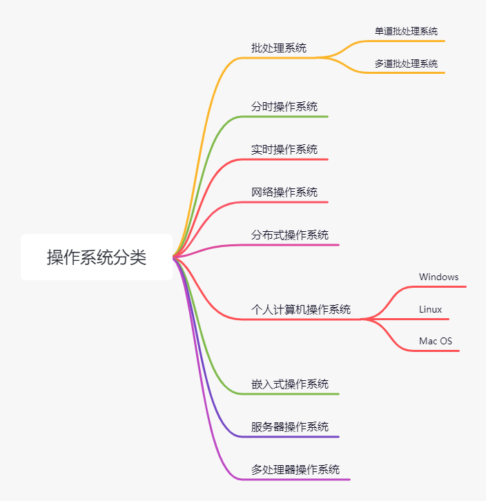
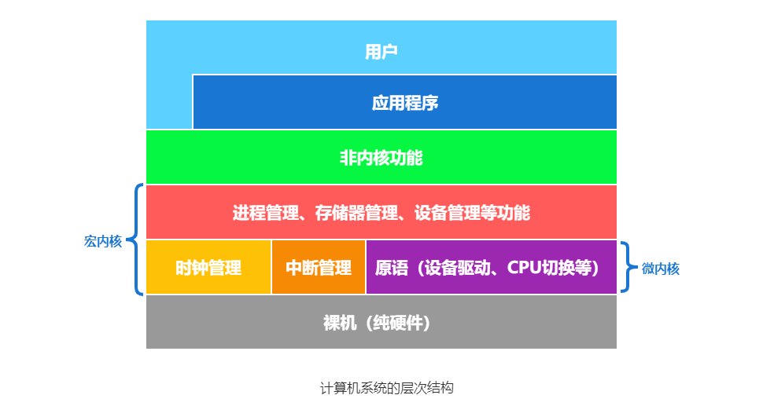
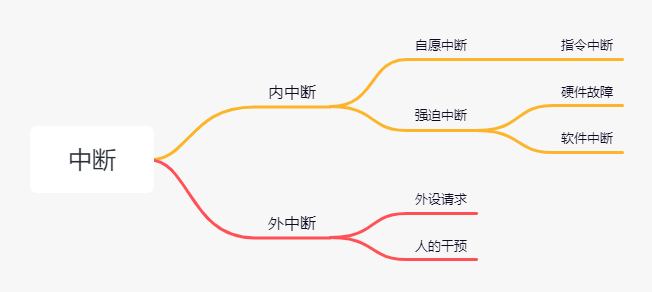
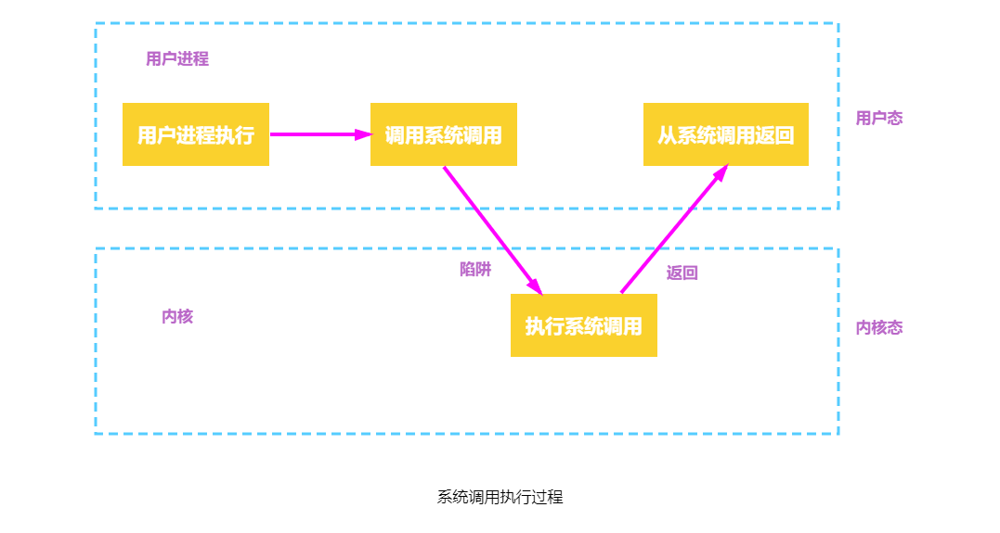
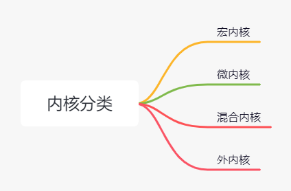

**操作系统**（Operating System，OS）是指控制和管理整个计算机系统的硬件与软件资源，合理地组织、调度计算机的工作与资源的分配，进而为用户和其他软件提供方便接口与环境的程序集合。计算机操作系统是随着计算机研究和应用的发展逐步形成并发展起来的，它是计算机系统中最基本的系统软件。

## 操作系统的特征

操作系统与其它系统软件和应用软件相比，有其基本特征，包括并发、共享、虚拟和异步。

### 并发

**并发**（Concurrence）是指两个或多个事件在同一时间间隔内发生。操作系统的并发性是指计算机系统中同时存在多个运行的程序，因此它具有处理和调度多个程序同时执行的能力。在操作系统中，引入进程的目的是使程序能并发执行。

并行性在多道环境下，宏观上有多道程序同时执行，而每个时刻，单处理器环境下仅有一道在执行，微观上程序仍是分时交替执行。操作系统的并发性通过分时得以实现。

> 并行性和并发性是两个概念，并行性是指系统具有同时进行运算或操作的特性，在同一时刻能完成两种或两种以上的工作。并行性需要相关硬件的支持，如多流水线或多处理器硬件环境。
> 

### 共享

**共享**（Sharing）即资源共享，指系统中的资源可供内存中多个并发执行的进程共同使用。共享可分为以下两种资源共享方式。

1. 互斥共享方式。规定在一段时间内只允许一个进程访问某一资源。而该资源称为临界资源或独占资源，计算机系统中的大多数物理设备及某些软件中所用的栈、变量和表格，都属于临界资源，它们都要求被互斥地共享。
2. 同时访问方式。在一段时间允许允许多个进程同时访问。同时访问指的是在宏观上，微观上，多个进程可能是交替地对资源进行访问即分时共享，计算机系统中的磁盘设备或可同时被多人访问的文件。

> 注意，互斥共享要求一种资源在一段时间内只能满足一个请求，否则就会出现严重的问题，而同时访问共享通常要求一个请求分几个时间片段间隔地完成，其效果与连续完成的效果相同。
>

并发和共享是操作系统两个最基本的特征，两者之间互为存在的条件：

1. 资源共享是以程序的并发为条件的，若系统不允许程序并发执行，则自然不存在资源共享问题；
2. 若系统不能对资源共享实施有效的管理，则必将影响到程序的并发执行，甚至根本无法并发执行。

### 虚拟

**虚拟**（Virtural）是指把一个物理上的实体变为若干逻辑上的对应物。物理实体是实的，即实际存在的；而后者是虚的，是用户感觉上的事物。用于实现虚拟的技术，称为虚拟技术。操作系统利用时分复用和空分复用技术来实现虚拟技术，如下所示。

- 时分复用技术。利用某设备为一用户服务的空闲时间，又转去为其他用户服务，使设备得到最充分的利用，如处理器的分时共享。
- 空分复用技术。利用存储器的空闲空间分区域存放和运行其它的多道程序，以此来提高内存的利用率，如虚拟存储器。

虚拟处理器技术是通过多道程序设计技术，采用让多道程序并发执行的方法，来分时使用一个处理器的。此时，虽然只有一个处理器，但它能同时为多个用户服务，使每个终端用户都感觉有一个 CPU 在专门为它服务。利用多道程序设计技术把一个物理上的 CPU 虚拟为多个逻辑上的 CPU，称为虚拟处理器。

虚拟存储器技术将一台机器的物理存储器变为虚拟存储器，以便从逻辑上扩充存储器的容量。当然，这时用户所感觉到的内存容量是虚的。我们把用户感觉到但实际不存在的存储器称为虚拟存储器。

还可采用虚拟设备技术将一台物理 I/O 设备虚拟为多台逻辑上的 I/O 设备，并允许每个用户占用一台逻辑上的 I/O 设备，使原来仅允许在一段时间内由一个用户访问的设备变为在一段时间内允许多个用户同时访问的共享设备。

### 异步性

异步（Asynchronous）性指的是在多道程序环境允许多个程序并发执行，但由于资源有限，进程的执行并不是一贯到底，而是走走停停，以不可预知的速度向前推进。

异步性使得操作系统运行在一种随机的环境下，可能导致进程产生与时间有关的错误。然而，只要运行环境相同，操作系统就必须保证多次运行进程后都能获得相同的结果。

## 操作系统的功能

操作系统为多道程序提供良好的运行环境，应具有处理器管理、存储器管理、设备管理和文件管理功能等功能，并为用户提供接口。同时，操作系统可用来扩充机器，以提供更方便的服务、更高的资源利用率。

### 处理器管理

在多道程序环境下，处理器的分配和运行都以进程为基本单位，因而对处理器的管理可归结为对进程的管理。并发是指在计算机内同时运行多个进程，因此进程何时创建、何时撤销、如何管理、如何避免冲突、合理共享就是进程管理的最主要的任务。处理器管理的主要功能包括进程控制、进程同步、进程通信、死锁处理、处理器调度等。

### 存储器管理

存储器管理主要是为多道程序的运行提供良好的环境，提高存储器的利用率，方便用户使用，并能从逻辑上扩充内存。为此，存储器管理应具有内存分配和回收、内存保护与共享、地址映射和内存扩充等功能。

### 文件管理

文件管理的主要任务是对用户文件和系统进行管理以方便用户使用，并保证文件的安全性。为此，文件管理应具有对文件存储空间的管理、目录管理、文件的读/写管理以及文件的共享与保护等功能。

### 设备管理

设备管理的主要任务是完成用户的 I/O 请求，方便用户使用 I/O 设备，并提高 CPU 和 I/O 设备的利用率。为此，设备管理应具有缓冲管理、设备分配和设备处理以及虚拟设备等功能。

### 接口

为方便用户使用，操作系统还提供了用户接口。该接口通常分为用户接口和程序接口两类。

- 用户接口。用户利用操作系统提供的命令接口来直接或间接地组织和控制作业的执行。用户接口主要分为联机用户接口和脱机用户接口。
	- 联机命令接口又称交互式命令接口，由一组键盘操作命令及命令解释程序组成。用户通过控制台或终端输入操作命令，向系统提出各种服务要求。用户每输入一条命令，控制权就转给操作系统的命令解释程序，然后由命令解释程序解释并执行输入的命令，完成指定的功能，之后，控制权转回控制台或终端，此时用户又可输入下一条命令。
	- 脱机命令接口又称批处理命令接口，由一组作业控制命令组成。脱机用户不能直接干预作业的运行，而应事先用相应的作业控制命令写成一份作业操作说明书，连同作业一起提交给系统，系统调度到该作业时，由系统中的命令解释程序逐条解释执行作业说明书上的命令或作业控制语句，从而间接地控制作业的运行。

- 程序接口。由一组系统调用组成，用户通过在程序中使用系统调用命令来请求操作系统为其提供服务。用户在程序中可以直接使用这组系统调用命令向系统提出各种服务要求，如使用各种外部设备、进行有关磁盘文件的操作、申请分配和回收内存及其他各种控制要求。

### 新功能

现代操作系统除了上述功能外，还增加了面向安全、网络和多媒体等的功能。

大量的信息资源被存储在计算机中，为了保护这些信息资源，现代操作系统增加了系统安全功能，主要采用了认证技术、密码技术、访问控制技术以及反病毒技术等。

现代操作系统中，网络也是必不可少的功能。操作系统增加网络功能，主要用于实现网络通信和资源管理，以及提供用户取得网络服务的手段。网络功能主要具备网络通信、资源管理以及应用互操作等功能。

除此之外，现代操作系统增加多媒体功能用于处理音视频等多媒体信息，为此，支持多媒体的处理功能主要有接纳控制功能、实时调度以及多媒体文件的存储等。

## 操作系统分类

在没有操作系统的时间节点上，用户想在计算机上运行程序都需要人工干预，如程序的装入、运行、结果的输出等。随着硬件的发展，速度越来越快，而资源利用却越来越低。

该阶段有两个突出的缺点：用户独占全机、不会出现因资源已被其他用户占用而等待的现象，但资源利用率低；`CPU` 等待手动操作，利用不充分。

为了解决速度与资源利用的矛盾，发展出了操作系统，而操作系统的发展有批处理、分时操作、实时操作、网络操作和分布式几个阶段。

### 批处理系统

批处理系统分为单道批处理系统、多道批处理系统。

#### 单道批处理系统

系统对作业的处理是成批进行的，但内存中始终保持一道作业。单道批处理系统是在解决人机矛盾及 CPU 和 I/O 设备速率不匹配的矛盾中形成的。单道批处理系统的主要特征如下：

1. 自动性。在顺利的情况下，磁带上的一批作业能自动地逐个运行，而无须人工干预。
2. 顺序性。磁带上的各道作业顺序地进入内存，各道作业的完成顺序与它们进入内存的顺序在正常情况下应完全相同，亦即先调入内存的作业先完成。
3. 单道性。内存中仅有一道程序运行，即监督程序每次从磁带上只调入一道程序进入内存运行，当该程序完成或发生异常情况时，才换入其后继程序进入内存运行。

每次主机内存中仅存放一道作业，每当它在运行期间发出输入/输出请求后，告诉的 CPU 便处于等待低速的 I/O 完成状态。为了进一步提高资源的利用率和系统的吞吐量，引入了多道程序技术。

#### 多道批处理系统

多道程序设计技术允许多个程序同时进入内存并允许这些它们在 CPU 中交替地运行，这些程序共享系统中的各种硬/软件资源。当一道程序因 I/O 请求而暂停运行时，CPU 便立即转去运行另一道程序。它不采用某些机制来提高某一技术方面的瓶颈问题，而让系统的各个组成部分都尽量去 “忙”，因此切换任务所花费的时间很少，可实现系统各部件之间的并行工作，使其整体在单位时间内的效率翻倍。

当然，多道批处理系统的设计和实现要比单道系统复杂很多，因为要充分利用各种资源，就要涉及各种资源的调度问题。

多道程序设计的特点是多道、宏观上并行、微观上串行。

1. 多道。计算机内存中同时存放多道相互独立的程序。
2. 宏观上并行。同时进入系统的多道程序都处于运行过程中，即它们先后开始各自的运行，但都未运行完毕。
3. 微观上串行。内存中的多道程序轮流占有 CPU，交替执行。

多道程序设计技术的实现需要解决下列问题：

1. 如何分配处理器。
2. 多到程序的内存分配问题。
3. I/O 设备如何分配。
4. 如何组织和存放大量的程序和数据，以方便用户使用并保证其安全性与一致性。

在批处理系统中采用多道程序设计技术就形成了多道批处理操作系统。该系统把用户提交的作业成批地送入计算机内存，然后由作业调度程序自动地选择作业运行。

优点：资源利用率高，多道程序共享计算机资源，从而使各种资源得到充分利用；系统吞吐量大，CPU 和其他资源保持 “忙碌” 状态。缺点：用户响应的时间较长；不提供人机交互能力，用户既不能了解自己的程序的运行情况，又不能控制计算机。

### 分时操作系统

分时技术是指把处理器的运行时间分成很短的时间片，按时间片轮流把处理器分配给各联机作业使用。若某个作业在分配给它的时间片内不能完成其计算，则该作业暂时停止运行，把处理器让给其他作业使用，等待下一轮再继续运行。分时操作系统采用的技术就是分时技术，在作业轮转得快的情况下，使得用户感觉像是在独占系统。

分时操作系统是指多个用户通过终端同时共享一台主机，这些终端连接在主机上，用户可以同时与主机进行交互操作而互不干扰。因此，实现分时系统最关键的问题是如何使用户能与自己的作业进行交互，即当用户在自己的终端上键入命令时，系统应能及时接收并及时处理该命令，再将结果返回用户。分时系统也是支持多道程序设计的系统，但它不同于多道批处理系统。多道批处理是实现作业自动控制而无须人工干预的系统，而分时系统是实现人机交互的系统，这使得分时系统具有与批处理系统不同的特征。分时系统的主要特征如下：

1. 同时性。同时性也称多路性，指允许多个终端用户同时使用一台计算机，即一台计算机与若干台终端相连接，终端上的这些用户可以同时或基本同时使用计算机。
2. 交互性。用户能够方便地与系统进行人机对话，即用户通过终端采用人机对话的方式直接控制程序运行，与同程序进行交互。
3. 独立性。系统中多个用户可以彼此独立地进行操作，互不干扰，单个用户感觉不到别人也在使用这台计算机，好像只有自己单独使用这台计算机一样。
4. 及时性。用户请求能在很短时间内获得响应。分时系统采用时间片轮转方式使一台计算机同时为多个终端服务，使用户能够对系统的及时响应感到满意。

虽然分时操作系统较好地解决了人机交互问题，但在一些应用场合，需要系统能对外部的信息在规定的时间内做出处理，因此，实时系统应运而生。

### 实时操作系统

为了能在某个时间限制内完成某些紧急任务而不需要时间片排队，诞生了实时操作系统。这里的时间限制可以分为两种情况：若某个动作必须绝对地在规定的时刻或规定的时间范围发生，则称为硬实时系统，如飞行器的飞行自动控制系统，这类系统必须提供绝对保证，让某个特定的动作在规定的时间内完成。若能够接受偶尔违反时间规定且不会引起任何永久性的损害，则称为软实时系统，如飞机订票系统、银行管理系统。

在实时操作系统的控制下，计算机系统接收到外部信号后及时进行处理，并在严格的时限内处理完接收的事件。实时操作系统的主要特点是及时性和可靠性。

### 网络操作系统

网络操作系统把计算机网络中的各台计算机有机地结合起来，提供一种统一、经济而有效的使用各台计算机的方法，实现各台计算机之间数据的交互传送。网络操作系统最主要的特点是网络中各种资源的共享及各台计算机之间的通信。

### 分布式计算机系统

分布式计算机系统是由多台计算机组成并满足下列条件的系统：系统中任意两台计算机通过通信方式交换信息：系统中的每台计算机都具有同等的地位，即没有主机也没有从机；每台计算机上的资源为所有用户共享；系统中的任意台计算机都可以构成一个子系统，并且还能重构；任何工作都可以分布在几台计算机上，由它们并行工作、协同完成。用户管理分布式计算机系统的操作系统称为分布式计算机系统。该系统的主要特点是：分布性和并行性。分布性操作系统与网络操作系统的本质不同是，分布式操作系统中的若干计算机相互协同完成同一任务。

### 个人计算机操作系统

个人计算机操作系统是目前使用最广泛的操作系统。它广泛应用于文字处理、电子表格、游戏中，常见的有 Windows、Linux 和 Mac OS 等。

此外，还有嵌入式操作系统、服务器操作系统、多处理器操作系统等。

## 操作系统的运行

计算机系统中，通常 CPU 执行两种不同性质的程序，一种是操作系统内核程序；另一种是应用程序。对操作系统而言，这两种程序的作用不同，前者是后者的管理者，因此内核程序要执行一些特权指令，而即应用程序处于安全考虑不能执行这些指令。所谓特权指令，是指计算机中不允许用户直接使用的指令，如 I/O 指令、置中断指令，存取用于内存保护的寄存器、送程序状态字到程序状态字寄存器等的指令。在具体实现上，将 CPU 的状态划分为用户态和核心态，用户自编程序运行在用户态，操作系统内核程序运行在核心态。

现代操作系统几乎都是层次式的结构，各项功能分别被设置在不同的层次上。与硬件关联较为紧密的模块，如时钟管理、中断处理、设备驱动等处于最底层；其次是运行频率较高的程序，如进程管理、存储器管理和设备管理等。这两部分内容构成了操作系统的内核，这部分的指令操作工作在核心态。

内核是计算机上配置的底层软件，是计算机功能的延伸。不同系统对内核的定义稍有区别，大多数操作系统内核包括以下几方面。

- 时钟管理。实现计时功能；通过时钟中断管理，实现进程切换。
- 中断管理。负责保护和恢复中断现场的信息，转移控制权到相关的处理程序，提高 CPU 利用率。
- 原语。完成规定的操作的特殊程序。处于操作系统最底层，最接近硬件的部分；具有原子性，其运行要一气呵成，不可中断；运行时间较短且调用频繁。
- 系统资源处理。系统对资源操作的处理，常见的操作有进程管理、存储器管理以及设备管理。

由以上可了解，核心态指令实际上包括系统调用类指令和一些针对时钟、中断和原语的操作指令。

### 中断

引入核心态和用户态后，就需要考虑这两种状态之间如何切换，操作系统内核工作在核心态，用户程序工作在用户态。系统不允许用户程序实现核心态的功能，而它们又必须使用这些功能。在操作系统中通过中断或异常实现从用户态进入核心态。

所谓中断，是指程序在执行过程中，遇到急需处理的事件时，计算机暂停 CPU 上现行程序的运行，转向对相应的事件进行处理，待处理完毕后，再返回现行程序被中断处或调度其他程序执行的过程。

根据中断发生的事件，将中断分为外中断和内中断。如下所示。

- 外中断指的是来自 CPU 执行指令以外的事件的发生，如 I/O 结束中断，表示设备输入/输出处理已经完成，处理器能够向设备发送下一个输入/输出请求，同时让完成输入/输出后的程序继续运行，时钟中断。
- 内中断也称异常、陷入，指源自 CPU 执行指令内部的事件，如程序的非法操作码、地址越界、算术溢出、虚拟系统的缺页及专门的陷入指令等引起的事件。对异常的处理一般要依赖于当前程序的运行现场，而且异常不能被屏蔽，一旦出现应立即处理。

### 系统调用

所谓系统调用，是指用户在程序中调用操作系统所提供的一些子功能，系统调用可视为特殊的公共子程序。系统中的各种共享资源都由操作系统统一掌管，因此在用户程序中，凡是与资源有关的操作（如存储分配、进行 I/O 传输及管理文件等），都必须通过系统调用方式向操作系统提出服务请求，并由操作系统代为完成。通常，一个操作系统提供的系统调用命令有几十条乃至上百条之多。这些系统调用按功能大致可分为如下几类。

- 设备管理。完成设备的请求或释放，以及设备启动等功能。
- 文件管理。完成文件的读、写、创建及删除等功能。
- 进程控制。完成进程的创建、撤销、阻塞及唤醒等功能。
- 进程通信。完成进程之间的消息传递或信号传递等功能。
- 内存管理。完成内存的分配、回收以及获取作业占用内存区大小及始址等功能。

显然，系统调用相关功能涉及系统资源管理、进程管理之类的操作，对整个系统的影响非常大，因此必定需要使用某些特权指令才能完成，所以系统调用的处理需要由操作系统内核程序负责完成，要运行在核心态。用户程序可以执行陷入指令（又称访管指令或trap指令）来发起系统调用，请求操作系统提供服务。

用户程序不能直接执行对系统影响非常大的操作，必须通过系统调用的方式请求操作系统代为执行，以便保证系统的稳定性和安全性，防止用户程序随意更改或访问重要的系统资源，影响其他进程的运行。

用户通过操作系统运行上层程序（如系统提供的命令解释程序或用户自编程序），而这个上层程序的运行依赖于操作系统的底层管理程序提供服务支持，当需要管理程序服务时，系统则通过硬件中断机制进入核心态，运行管理程序；也可能是程序运行出现异常情况，被动地需要管理程序的服务，这时就通过异常处理来进入核心态。管理程序运行结束时，用户程序需要继续运行，此时通过相应的保存的程序现场退出中断处理程序或异常处理程序，返回断点处继续执行，如下图所示。

系统调用、发生中断、用户程序产生错误状态、执行一条特权指令等都可以由用户态转向核心态。但用户态转向核心态，不仅状态需要切换，而且所用的堆栈也可能需要由用户堆栈切换为系统堆栈，但这个系统堆栈也是属于该进程的。

若程序的运行由用户态转到核心态，则会用到访管指令，访管指令是在用户态使用的，所以它不可能是特权指令。

## 内核

操作系统在核心态为应用程序提供公共的服务，而核心态提供什么服务，由内核决定，内核是一个操作系统的核心。它负责管理系统的进程、内存、设备驱动程序、文件和网络系统等，决定着系统的性能和稳定性。是连接应用程序和硬件的桥梁。内核就是操作系统背后的黑盒的核心。

内核主要分为宏内核、微内核、混合内核和外内核四类。

### 宏内核

宏内核将操作系统的各个模块作为一个紧密联系的整体放在内核态中运行，从而为应用提供高性能的系统服务。因为各管理模块之间共享信息，能有效利用相互之间的有效特性，所以具有无可比拟的性能优势。但宏内核整体放在内核态中运行，导致各个模块高度紧密，扩展性较低。

### 微内核

微内核将宏内核模块化，并将最基本的模块留在内核态中运行，其余的模块移出内核，放在用户态运行，从而降低内核的设计复杂性。放在用户态中的其余模块相互独立，交互借助于微内核进行通信。

微内核结构有效地分离了内核与服务、服务与服务，使得它们之间的接口更加清晰，维护的代价大大降低，各部分可以独立地优化和演进，从而保证了操作系统的可靠性。但缺点也很明显，需要频繁地在核心态和用户态之间来回切换，使得性能降低。

### 混合内核

混合内核实质上还是微内核，主要是将频繁使用的系统服务移回内核，解决微内核中需要频繁地在核心态和用户态之间来回切换的问题，提高性能与效率。

### 外内核

外内核在内核态中运行，主要负责系统保护和资源复用，把硬件暴露出去，并没有提供高级的硬件抽象，使得用户程序可以直接访问硬件。理论上，多个操作系统都可以运行在外内核上，但限制只能使用已分配给它的那部分资源。但是目前外内核设计还停留在研究阶段，并没有商业系统采用这种设计。