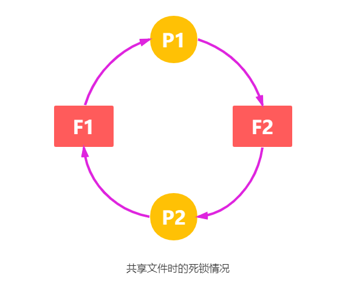
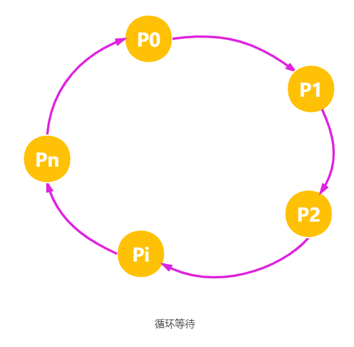
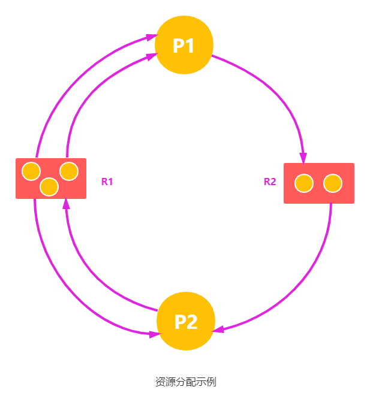
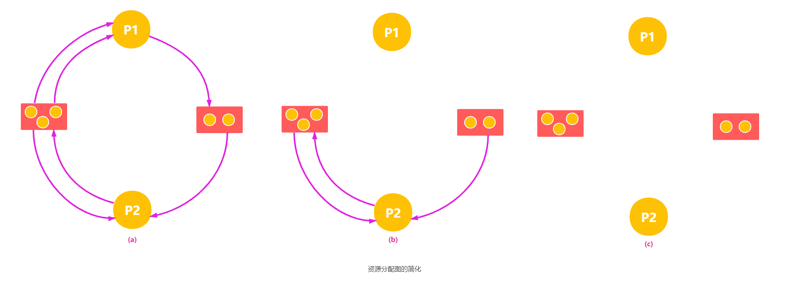

在多道程序系统中，由于多个进程的并发执行，改善了系统资源的利用率并提高了系统的处理能力。然而，多个进程的并发执行也带来了新的问题——死锁。

在一组进程发生死锁的情况下，这组死锁进程中的每一个进程，都在等待另一个死锁进程所占有的资源。或者说每个进程所等待的事件是该组中其它进程释放所占有的资源。但由于所有这些进程已都无法运行，它们中的任何一个都无法释放资源，致使没有任何一个进程可被唤醒。这样这组进程只能无限期地等待下去。

所谓 **死锁**，是指多个进程因竞争资源而造成的一种互相等待的僵局，若无外力作用，这些进程都将无法向前推进。

## 资源

可以引起死锁的是可以获得排他性访问、不可以被抢占的资源。资源可以是硬件设备或是一组信息，即资源是随着时间推移，必须能获得、使用以及释放的任何东西。资源分为两类：可抢占的和不可抢占的，如下所示。

- 可抢占性资源。指进程在获得资源后，该资源也可以被其它进程或系统抢占而不会产生任何副作用。`CPU` 和主存均属于可抢占性资源。
- 不可抢占性资源。指系统把资源分配给进程后， 在不引起相关的计算失败的情况下，不能强行抢占，只能用完后自行释放。刻录机、磁带机和打印机均属于不可抢占性资源。

死锁与不可抢占资源有关，有关可抢占资源的潜在死锁通常可以通过在进程之间重新分配资源而化解。

## 死锁的原因

通常是源于多个进程对资源的争夺而陷入僵局，才会引发死锁。如磁带机、打印机等。

### 竞争不可抢占性资源

系统所拥有的不可抢占性资源的数量不足以满足多个进程运行需要，使得进程在运行过程中，因争夺资源而陷入僵局。例如，并发进程$P_1$ 和 $P_2$ 分别打开文件 $F_1$ 和 $F_2$，当进程 $P_1$ 试图打开 $F_2$，$P_2$ 试图打开 $F_1$ 时，两者都会因文件已被打开而阻塞，从而两个进程会无限期地等待下去，形成死锁。下图可以说明死锁情况。

### 进程推进顺序非法

进程在运行过程中，请求和释放资源的顺序不当，也同样会导致死锁。例如，并发进程 $P_1$、$P_2$ 分别保持了资源 $R_1$、$R_2$，而进程 $P_1$ 申请资源 $R_2$、进程 $P_2$ 申请资源 $R_1$ 时，两者都会因为所需资源被占用而阻塞。

信号量使用不当也会造成死锁。进程间彼此相互等待对方发来的消息，也会使得这些进程间无法继续向前推进。例如，进程 A 等待进程 B 发的消息，进程 B 又等待进程 A 发的消息，可以看出进程 A 和 B 不是因为竞争同一资源，而是在等待对方的资源导致死锁。

## 死锁的必要条件

如下所示，产生死锁必须同时满足 4 个条件，只要其中任意一个条件不成立，死锁就不会发生。

1. 互斥条件：进程要求对所分配的资源（如打印机）进行排他性控制，即在一段时间内某资源仅为一个进程所占有。此时若有其他进程请求该资源，则请求进程只能等待。
2. 不剥夺条件：进程所获得的资源在未使用完之前，不能被其他进程强行夺走，即只能由获得该资源的进程自己来释放（只能是主动释放）。
3. 请求并保持条件：进程已经保持了至少一个资源，但又提出了新的资源请求，而该资源已被其他进程占有，此时请求进程被阻塞，但对自己获得的资源保持不放。
4. 循环等待条件：存在一种进程资源的循环等待链，链中每个进程已获得的资源同时被链中下一个进程所请求。即存在一个处于等待态的进程集合 $\{P_1,P_2,···,P_n\}$，其中 $P_1$ 等待的资源被 $P_{i+1}（i=0,1,···,n-1）$ 占有，$P_n$ 等待的资源被 $P_0$ 占有，如下图所示。

## 死锁的处理策略

为使系统不发生死锁，必须设法破坏产生死锁的 4 个必要条件之一，或允许死锁产生，但当死锁发生时能检测出死锁，并有能力实现恢复。目前死锁的处理策略可归结为四种：

1. 预防死锁。通过设置某些限制条件，去破坏产生死锁的 4 个必要条件中的一个或几个，以防止发生死锁。
2. 避免死锁。在资源的动态分配过程中，用某种方法防止系统进入不安全状态，从而避免发生死锁。
3. 检测死锁。无须采取任何限制性措施，允许进程在运行过程中发生死锁。通过检测机构及时地检测出死锁的发生，然后采取某种措施把进程从死锁中解脱出来。
4. 解除死锁。当检测到系统中已发生死锁时，就采取相应措施，将进程从死锁状态中解脱出来。常用的方法是撤销一些进程，回收它们的资源，将它们分配给已处于阻塞状态的进程，使其能继续运行。

上述的四种方法，从1到4对死锁的防范程度逐渐减弱，但对应的是资源利用率的提高，以及进程因资源因素而阻塞的频度下降，即并发程度提高。

预防死锁和避免死锁属于事先预防策略，预防死锁的限制条件比较严格，实现起来较为简单，但往往导致系统的效率低，资源利用率低；避免死锁的限制条件相对宽松，资源分配后需要通过算法来判断是否进入不安全状态，实现起来较为复杂。

## 预防死锁

防止死锁的发生只需破坏死锁产生的 4 个必要条件之一即可。

### 破坏互斥条件

若允许系统资源都能共享使用，则系统不会进入死锁状态。但有些资源根本不能同时访问，如打印机等临界资源只能互斥使用。所以，破坏互斥条件而预防死锁的方法不太可行，而且在有的场合应该保护这种互斥性。

### 破坏请求并保持条件

为了破坏请求并保持条件，必须保证当一个进程请求资源时，它不能持有不可抢占性资源。可以通过如下两个不同的协议实现。

第一种协议采用预先静态分配方法，即进程在运行前必须一次申请其在整个运行过程中所需要的全部资源，在它的资源未满足前，不把它投入运行。一旦投入运行，这些资源就一直归它所有，不再提出其他资源请求，这样就可以保证系统不会发生死锁。

这种方法实现简单，但缺点也显而易见，如下所示。

1. 系统资源被严重浪费，其中有些资源可能仅在运行初期或运行快结束时才使用，甚至根本不使用，严重地恶化了资源的利用率。
2. 导致饥饿现象，由于个别资源长期被其他进程占用时，将致使等待该资源的进程迟迟不能开始运行。

第二种协议对第一种协议进行了改进，它采用动态分配方法，允许进程只获得运行初期所需的资源后，便开始运行，并在运行过程中再逐步释放已分配给自己，且已用毕的全部资源，再请求新的所需资源。改进的第二种协议不仅能使进程更快地完成任务，提高设备的利用率，还可减少进程发生饥饿的几率。

### 破坏不可抢占性条件

当一个已保持了某些不可抢占性资源的进程请求新的资源而得不到满足时，它必须释放已经保持的所有资源，待以后需要再重新申请。这意味着进程已占有的资源会被暂时释放，或者说是被抢占，从而破坏了不可抢占条件。

该策略实现起来比较复杂，释放已获得的资源可能造成前一阶段工作的失效，反复地申请和释放资源致使进程的执行被无限地推迟，延长了进程的周转时间，而且也会增加系统开销，降低系统吞吐量。这种方法常用于状态易于保存和恢复的资源，如 `CPU` 的寄存器及内存资源，一般不能用于打印机之类的资源。

### 破坏循环等待条件

为了破坏循环等待条件，可采用顺序资源分配法。首先给系统中的资源编号，规定每个进程必须按编号递增的顺序请求资源，同类资源一次申请完。也就说，只要进程提出申请分配资源 $R_i$，则该进程在以后的资源申请中就只能申请编号大于 $R_i$ 的资源。

这种方法存在的问题是，编号必须相对稳定，这就限制了新类型设备的增加；尽管在为资源编号时已考虑到大多数作业实际使用这些资源的顺序，但也经常会发生作业使用资源的顺序与系统规定顺序不同的情况，造成资源的浪费；此外，这种按规定次序申请资源的方法，也必然会给用户的编程带来麻烦。

## 死锁避免

避免死锁同样属于事先预防策略，但并不是事先采取某种限制破坏死锁的必要条件，而是在资源动态分配过程中，防止系统进入不安全状态，以避免发生死锁。这种方法所施加的限制条件较弱，可以获得较好的系统性能。

### 系统安全状态

避免死锁的方法中，允许进程动态地申请资源，但系统在进行资源分配之前，应先计算此次资源分配的安全性。若此次分配不会导致系统进入不安全状态，则将资源分配给进程；否则让进程等待。

所谓安全状态，是指系统能按某种进程推进顺序 $(P_1, P_2, ···, P_n)$ 为每个进程 $P_i$ 分配其所需的资源，直至满足每个进程对资源的最大需求，使每个进程都可顺序完成。此时称 $(P_1, P_2, ···, P_n)$ 为安全序列。若系统无法找到一个安全序列，则被系统处于不安全状态。

假设系统中有三个进程 $P_1$、$P_2$ 和 $P_3$，共有 12 台磁带机。进程 $P_1$ 共需要 10 台磁带机，$P_2$ 和 $P_3$ 分别需要 4 台和 9 台。假设在 $T_0$ 时刻，进程 $P_1$、$P_2$ 和 $P_3$ 已分别获得 5 台、2 台和 2 台，尚有 3 台未分配，见下表。

|进程|最大需求|已分配|可用|
|:---:|:---:|:---:|:---:|
|$P_1$|10|5|3|
|$P_2$|4|2||
|$P_3$|9|2||

在 $T_0$ 时刻是安全的，因为存在一个安全序列 $(P_2, P_1, P_3)$，即只要系统按此进程序列分配资源，那么每个进程都能顺利完成。若在 $T_0$ 时刻后，系统分配 1 台磁带机给 $P_3$，则此时系统便进入不安全状态，因为此时已无法再找到一个安全序列。例如剩余的 2 台分配给 $P_2$，这样在 $P_2$ 完成后会释放 4 台，既不能满足 $P_1$，也不能满足 $P_3$，致使无法它们都无法完成，彼此都在等待对方释放资源，结果导致死锁。

并非所有的不安全状态都是死锁状态，但当系统进入不安全状态后，便可能进入死锁状态；反之，只要系统处于安全状态，系统便可避免进入死锁状态。

### 银行家算法

`Dijkstra` 提出的银行家算法可以避免死锁。为实现该算法，需要在进程进入系统时，必须申请在运行过程中，可能需要每种资源类型的最大单元数目，其数目不应超过系统所拥有的资源总量。当进程请求一组资源时，系统必须首先确定是否有足够的资源分配给该进程。若有，再进一步计算在将这些资源分配给进程后，是否会使系统处于不安全状态。如果不会，才将资源分配给它，否则让进程等待。

#### 数据结构

必须设置四个数据结构，分别用来描述系统中可利用的资源、所有进程对资源的最大需求、系统中的资源分配以及所有进程还需要多少资源的情况，如下所示。

1. 可利用资源向量 `Available`：含有 m 个元素的数组，其中每个元素代表一类可用的资源数目。初始值是系统中所配置的该类全部可用资源的数目，数值随该类资源的分配和回收而动态改变。`Available[j]=K` 表示系统中现有 $R_j$ 类资源 `K` 个。
2. 最大需求矩阵 `Max`：$n \times m$ 矩阵，定义系统中 n 个进程中的每个进程对 m 类资源的最大需求。`Max[i,j]=K` 表示进程 `i` 需求 $R_j$ 类资源的最大数目为 `K`。
3. 分配矩阵 `Allocation`：$n \times m$ 矩阵，定义系统中每类资源当前已分配给每个进程资源数。`Allocation[i,j]=K` 表示进程 `i` 当前已分得 $R_j$ 类资源的数目为 `K`。
4. 需求矩阵 `Need`：$n \times m$矩阵，表示每个进程尚需的各类资源数。`Need[i,j]=K` 表示进程 `i` 还需要 $R_j$ 类资源的数目为 `K`。

上述三个矩阵间存在下述关系：

$$
Need[i, j] = Max[i, j] - Allocation[i, j]
$$

#### 银行家算法描述

设 $Request_i$ 是进程 $P_i$ 的请求向量，如果 $Request_i[j]=K$ ，表示进程 $P_i$ 需要 K 个 $R_j$ 类型的资源。当 $P_i$ 发出资源请求后，系统按下述步骤进行检查：

1. 若 $Request_i[j] \leq Need[i,j]$，则转向步骤 2；否则认为出错，因为它需要的资源数已超过它所宣布的最大值。
2. 若 $Request_i[j] \leq Available[j]$，则转向步骤 3；否则，表示尚无足够资源，$P_i$ 须等待。
3. 系统试探着把资源分配给进程 $P_i$，并修改下面数据结构中的数值：

$$
Available[j] = Available[j]-Request_i[j]; \\
Allocation[i,j]=Allocation[i,j]+Request_i[j]; \\
Need[i,j]=Need[i,j]-Request_i[j]; \\
$$

4. 系统执行安全性算法，检查此次资源分配后，系统是否处于安全状态。若安全，才正式将资源分配给进程 $P_i$，以完成本次分配；否则，将本次的试探分配作废，恢复原来的资源分配状态，让进程 $P_i$ 等待。

#### 安全性算法

1. 初始时安全序列为空。
2. 从 `Need` 矩阵中找出符合下面条件的行：该行对应的进程不在安全序列中，而且该行小于等于 `Available` 向量，找到后，把对应的进程加入安全序列；若找不到，则执行步骤 4。
3. 进程 $P_i$ 进入安全序列后，可顺利执行，直至完成，并释放分配给它的资源，故应执行 `Available = Available + Allocation[i]`。其中 `Allocation[i]` 表示进程 $P_i$ 代表的在 `Allocation` 矩阵中对应的行。返回步骤 2。
4. 若此时安全序列中已有所有进程，则系统处于安全状态，否则系统处于不安全状态。

## 死锁检测

在系统中，既不采取死锁预防措施，也未配有死锁避免算法，系统很可能会发生死锁。这种情况需提供死锁检测算法，用于检测系统状态，以确定系统中是否发生了死锁。

为检测系统中的死锁，在系统中必须有保存有关资源的请求和分配信息并利用这些信息检测系统是否已进入死锁状态。

### 资源分配图

系统死锁可利用资源分配图来描述。如下图所示，由一组结点 N 和 一组边 E 所组成的一个对偶 G=(N,E)，它具有下述形式的定义和限制：

（1）把 N 分为两个互斥的自己，即一组进程结点 $P=(P_1, P_2, ···, P_n)$ 和一组资源结点 $R=(R_1, R_2, ···, R_n)$，$N = P \cup R$。在下图所示的例子中，$P = \{P_1, P_2\}$，$R = \{R_1, R_2\}$，$N = \{R_1, R_2\} \cup \{P_1, P_2\}$。
（2）凡属于 E 中的一个边 $e \in E$，都连接着 P 中的一个结点和 R 中的一个结点， $e = \{P_i, R_j\}$ 是资源请求边，由进程 $P_i$ 指向资源 $R_j$，它表示进程 $P_i$ 请求一个单位的 $R_j$ 资源。$E=\{R_j, P-i\}$ 是资源分配边，由资源 $R_j$ 指向进程 $P_i$，它表示把一个单位的资源 $R_j$ 分配给进程 $P_i$。下图中示出了两个请求边和两个分配边，即 $E = \{(P_1, R_2), (R_2, P_2), (P_2, R_1), (R_1, P_1)\}$。

用圆圈代表一个进程，用框代表一类资源。由于一种类型的资源可能有多个，因此用框中的一个圆代表一类资源中的资源。从进程到资源的有向边称为请求边，表示该进程申请一个单位的该类资源；从资源到进程的边称为分配边，表示该类资源已有一个资源分配给了该进程。在上图所示的资源分配图中，进程 $P_1$ 已经分得了两个 $R_1$ 资源，并又请求一个 $R_2$ 资源；进程 $P_2$ 分得了 $R_1$ 资源和一个 $R_2$ 资源，并又请求一个 $R_1$ 资源。

### 死锁定理

简化资源分配图可检测系统状态 S 是否为死锁状态。简化方法如下：

1. 在资源分配图中，找出既不阻塞又不孤点的进程 $P_i$。顺利的情况下，$P_1$ 可获得所需资源而继续运行，直至运行完毕，再释放其所占有的全部资源，这相当于消去 $P_1$ 的请求边和分配边，使之成为孤立的结点。在下图(a)中，$P_1$ 是满足这一条件的进程结点，将 $P_1$ 的两个分配边和一个请求边消去，便得到下图(b)所示的情况。

2. 进程 $P_i$ 所释放的资源，可以唤醒某些因等待这些资源而阻塞的进程，原来的阻塞进程可能变为非阻塞进程。在下图中，进程 $P_2$ 就满足这样的条件，获得资源而继续运行，直至 $P_2$ 完成后又释放它所占有的全部资源，形成下图 (c) 所示的情况，即将 $P_2$ 的两条请求边和一条分配边消去。

3. 在进行一系列的简化后，若能消去图中所有的边，使所有的进程结点都成为孤立结点。则称该图是可完全简化的；若不能通过任何过程使该图完全简化，则称该图是不可完全简化的。

S 为死锁状态的充分条件是当且仅当 S 状态的资源分配图是不可完全简化的，该充分条件被称为死锁定理。

## 死锁解除

当利用死锁检测算法检测到了系统中已发生死锁，需提供死锁解除算法，将系统从死锁状态中解脱出来。死锁解除的主要方法有：

1. 资源剥夺法。挂起某些进程，并抢占它的资源，将这些资源分配给其他的死锁进程。但应防止被挂起的进程长时间得不到资源而处于资源匮乏的状态。
2. 终止进程法。强制终止部分甚至全部死锁进程并剥夺这些进程的资源，直至打破循环环路，使系统从死锁状态解脱出来。终止的原则可以按进程优先级和终止进程代价的高低进行。
3. 进程回退法。让一个或多个进程回退到足以回避死锁的地步，进程回退时自愿释放资源而非被剥夺。要求系统保持进程的历史信息，设置还原点。