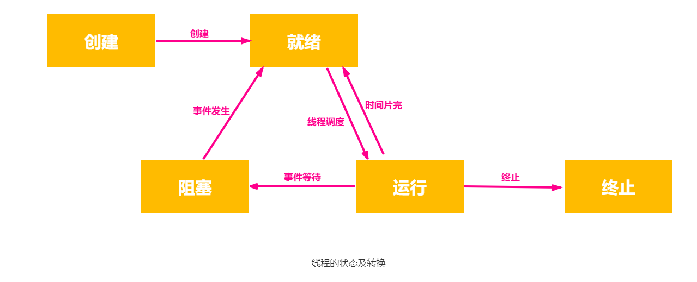
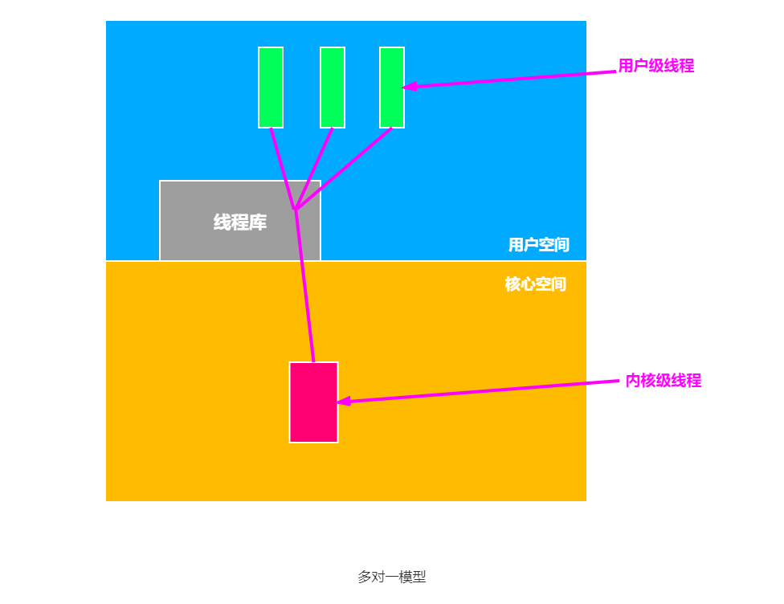
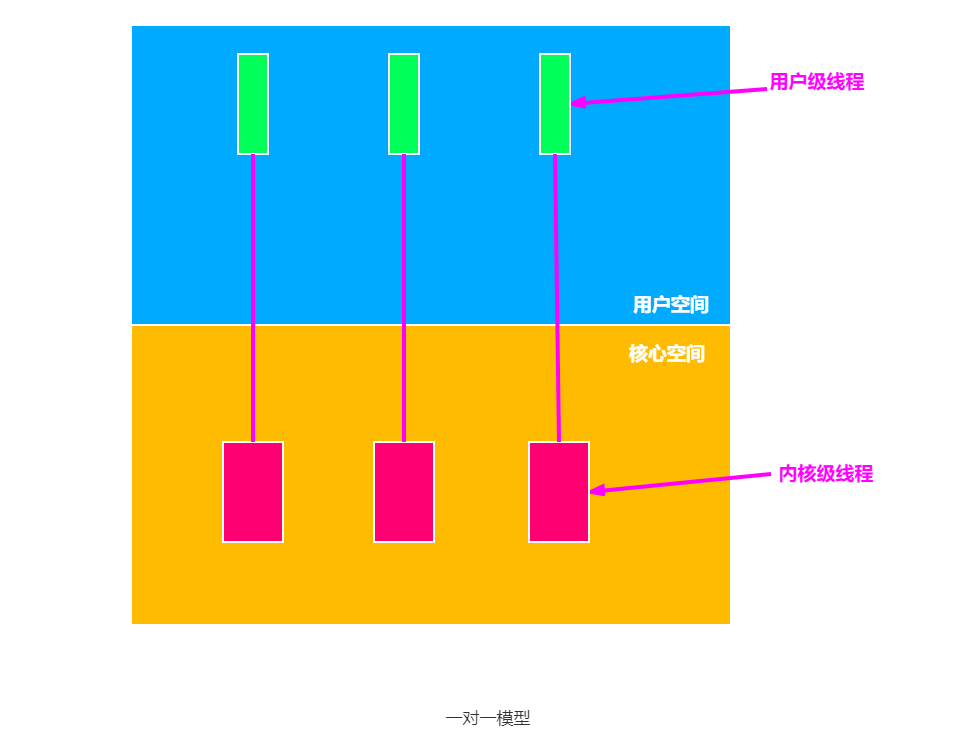
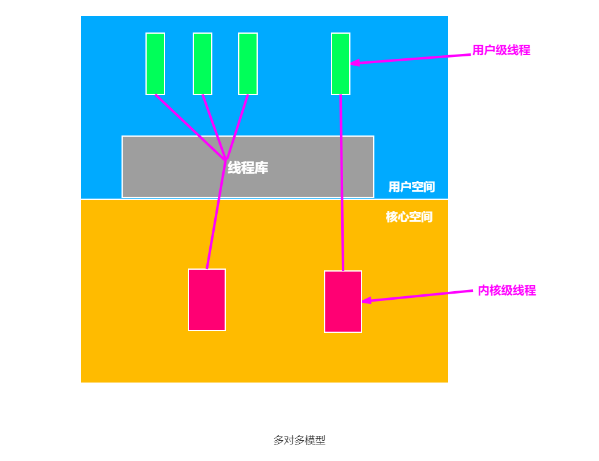

引入进程的目的是为了更好地使多道程序并发执行，提高资源利用率和系统吞吐量，增加并发程度；但也因为进程是一个资源的拥有者，因而在创建、撤销和切换中，系统必须付出较大的时空开销。这就限制了系统中所设置进程的数目，而且进程切换也不宜过于频繁，从而限制了并发程度的进一步提高。线程引入的目的就是为了减小程序在并发执行时所付出的时空开销，提高操作系统的并发性能。

线程可以看作是 `轻量级进程`，它是一个基本的 CPU 执行单元，也是程序执行流的最小单位，由线程 ID、程序计数器、寄存器集合和堆栈组成。线程是进程中的一个实体，是被系统独立调度和分派的基本单位，线程自己不拥有系统资源，只拥有一点儿在运行中必不可少的资源，但它可与同属一个进程的其他线程共享进程所拥有的全部资源，一个线程可以创建和撤销另一个线程，同一进程中的多个线程之间可以并发执行。由于线程之间的相互制约，致使线程在运行中呈现出间断性。线程也有就绪、阻塞和运行三种基本状态。

引入线程后，进程的内涵发生了改变，进程只作为除 CPU 外的系统资源的分配单元，线程则作为处理器的分配单元。由于一个线程内部有多个线程，若线程的切换发生在同一个进程内部，则只需要很少的时空开销。

## 线程状态

线程之间也存在着与进程相似的共享资源和相互合作的制约关系，致使线程在运行时也具有间断性。相应地，线程在运行时也具有三种基本状态：

1. 运行状态。表示线程实际占用处理器并运行。
2. 就绪状态。指该时刻的线程具备了执行时所需的资源，只需再获得处理器便可立即执行。
3. 阻塞状态。指线程在执行中因某事件受阻而暂停运行，如线程执行从键盘读入数据的系统调用时，该线程就会被阻塞。

线程也具有生命周期，由创建而产生，由调度而执行，由终止而消亡。三种基本状态加上创建状态与终止状态，线程状态之间的转换和进程状态之间的转换是一样的，如下图所示。

### 创建线程

应用程序在启动时，通常仅有一个线程在执行，人们把线程称为 `“初始化线程”`，它的主要功能是用于创建新线程。在创建新线程时，需要利用一个线程创建函数，并提供相应的参数，如指向线程主程序的入口指针、堆栈的大小，以及用于调度的优先级等。在线程的创建函数执行完后，将返回一个线程标识符供以后使用。

### 终止线程

当一个线程完成任务或是在运行中出现异常而被强制终止时，由终止线程通过调用相应函数对它执行终止操作。但有些线程被建立后便会一直运行下去而不被终止。大多数的操作系统中的线程被终止后并不立即释放它所占的资源，只有当进程中的其它线程执行了分离函数后，被终止的线程才与资源分离，此时的资源才能被其它线程利用。

被终止但尚未释放资源的线程仍可以被需要的线程调用，以便被终止线程重新恢复运行。为此，调用线程须调用一条 `等待线程终止` 的连接命令来与该线程进行连接。如果在一个调用者线程调用 `等待线程终止` 的连接命令，试图与指定线程相连时，若指定线程尚未被终止，则调用连接命令的线程将会阻塞，直至指定线程被终止后，才能实现它与调用者线程的连接并继续执行；若指定线程已被终止，则调用者线程不会被阻塞而是继续执行。

## 线程控制块

线程也有将所有用于控制和管理线程的信息记录的线程控制块（Thread Control Block，TCB），主要有以下几部分组成：

1. 线程标识符。为每个线程赋予一个唯一的线程标识符。
2. 寄存器。寄存器主要包括程序计数器、状态寄存器和通用寄存器的内容。
3. 线程运行状态。描述线程处于何种运行状态。
4. 优先级。线程执行的优先程度。
5. 专有存储区。用于线程切换时存放现场保护信息，和与该线程相关的统计信息等。
6. 信号屏蔽。对某些信号加以屏蔽。
7. 堆栈指针。 用来保存局部变量和返回地址。

## 线程的属性

多线程操作系统中的进程都包含多个线程，并为它们提供资源。线程作为独立运行的基本单位，此时的进程已不再是一个基本的可执行实体，但它仍具有与执行相关的状态。所谓进程处于`执行`状态，实际上是指该进程中的某线程正在执行。线程的主要属性如下所示。

1. 线程是一个轻型实体，它不拥有系统资源，但每个线程都应有一个唯一的标识符和一个线程控制块，线程控制块记录了线程执行的寄存器和栈等现场状态。
2. 不同的线程可以执行相同的程序，即同一个服务程序被不同的用户调用时，操作系统把它们创建成不同的线程。
3. 同一进程中的各个线程共享该进程所拥有的资源。进程作为一个可拥有资源的基本单位，资源包括用户的地址空间、实现进程或线程间同步和通信的机制、已打开的文件和已申请到的 I/O 设备，以及一张由核心进程维护的地址映射表，该表用于实现用户程序的逻辑地址到其内存物理地址的映射。
4. 线程是处理器的独立调度单位，多个线程是可以并发执行的。在单 `CPU` 的计算机系统中，各线程可交替地占用 `CPU`；在多 `CPU` 的计算机系统中，各线程可同时占用不同的 `CPU`，若各个 `CPU` 同时为一个进程内的各线程服务，则可以缩短进程的处理时间。
5. 一个线程被创建后，便开始了它的生命周期，直至终止。线程在生命周期内会经历阻塞态、就绪态和运行态等各种状态变化。

有了线程后，线程切换时，有可能会发生进程切换，也有可能不发生进程切换，平均而言每次切换所需的开销就变小了，因此能够让更多的线程参与并发，而不会影响到响应时间等问题。

## 线程实现方式

线程已在许多系统中实现，但各系统的实现方式并不完全相同。而线程的实现可以分为用户级线程（User-Level Thread，ULT）和内核级线程（Kernel-Level Thread，KLT）两类。内核级线程又称内核支持的线程。

### 用户级线程

在用户级线程中，有关线程管理的所有工作都在用户空间中实现，无需内核帮助，因此内核意识不到线程的存在。应用程序可以通过使用线程库设计成多线程程序。通常，应用程序从单线程开始，在该线程中开始运行，在其运行的任何时刻，可以通过调用线程库中的派生例程创建一个在相同进程中运行的新线程。

使用用户级线程方式有以下几个优点：

1. 进程中所有线程的管理均在该进程的用户空间中，因此进程切换不需要切换到内核方式来做线程管理，从而节省了模式切换的开销。
2. 不干扰操作系统调度的情况下，不同进程根据自身需要选择不同的调度算法，对自己的线程进行管理和调度，与操作系统的低级调度算法无关。
3. 用户级线程的实现属于用户程序的一部分，可以在不支持线程机制的操作系统平台上实现，与操作系统平台无关。

而用户级线程方式的主要缺点则在于：

1. 基于进程机制的操作系统中，大多数系统调用将使进程阻塞，因此，当线程执行系统调用时被阻塞时，进程内的所有线程也会被阻塞。而在内核级线程方式中，则进程中的其它线程仍然可以运行。
2. 在单纯的用户级线程实现方式中，多线程应用不能利用多处理器进行多重处理的优点，内核每次分配给一个进程的仅有一个 `CPU`，因此，进程中仅有一个线程能执行，在该线程放弃 `CPU` 之前，其它线程只能等待。

### 内核级线程

在内核级线程中，线程管理的所有工作都在内核空间中实现，应用程序没有进行线程管理的代码，只有一个到内核级线程的编程接口。内核为进程及其内部的每个线程维护上下文信息，调度也在内核基于线程架构的基础上完成。

内核级线程实现方式主要有以下几个优点：

1. 在多处理器系统中，内核能够同时调度同一进程中的多个线程并行执行。
2. 如果进程中的一个线程被阻塞了，内核可以调度该进程中的其它线程占有处理器运行，也可以运行其它进程中的线程。
3. 内核支持线程具有很小的数据结构和堆栈，线程的切换比较快，切换开销小。
4. 内核本身也可以采用多线程技术，可以提高系统的执行速度和效率。

而内核级线程的主要缺点是：对于用户的线程切换而言，其模式切换的开销较大，在同一个进程中，从一个线程切换到另一个线程时，需要从用户态转到核心态进行，这是因为用户进程的线程在用户态运行，而线程调度和管理是在内核实现的，系统开销较大。

### 组合模式

有些系统使用用户级线程和内核级线程的组合方式实现多线程。线程创建完全在用户空间中完成，线程的调度和同步也在应用程序中进行。一个应用程序中的多个用户级线程被映射到小于或等于用户级线程数目的内核级线程上。

组合方式多线程机制能够结合用户级线程和内核级线程两者的优点，并克服了其各自的不足。

## 多线程模型

系统同时支持用户级线程和内核级线程，产生了用户级线程和内核级线程的连接方式的不同，由此产生了不同的多线程模型，如下所示。

### 多对一模型

将多个用户级线程映射到一个内核级线程，线程管理在用户空间完成。仅当用户线程需要访问内核时，才将其映射到一个内核级线程上，但每次只允许一个线程进行映射，多个线程不能同时在多个处理器上运行。此模式中的用户级线程对操作系统不可见。

该模式的主要优点是线程管理在用户空间进行，因此开销小，效率高；但缺点也存在，一个线程在访问内核时发生阻塞，整个进程就都会被阻塞。

### 一对一模型

将每个用户级线程映射到一个内核级线程。为每一个用户线程都设置一个内核级线程与之相连。该模式允许多个线程并行运行在多处理器系统上。

该模式的主要优点是当一个线程被阻塞后，允许调度另一个线程，所以它比多对一模式的并发能力强；但缺点也是如此，没创建一个用户级线程，就要创建相应的内核级线程，开销较大，影响应用程序的性能，因此要限制系统的线程数量。

### 多对多模型

将  n 个用户级线程映射到 m 个内核级线程上，要求 m $ \leq $ n。

该模式结合多对一模型和一对一模型中的优点，可以像一对一模型那样，使一个进程的多个线程并行地运行在多处理器上，也可以像多对一模式那样，减少线程的管理开销和提高效率。

## 进程的比较

线程具有许多进程所具有的特征，因此称之为轻型进程或进程元。相应地，把进程称为重型进程。下面从几个方面对线程和进程进行比较。

1. **调度**。在传统的操作系统中，拥有资源和独立调度的基本单位都是进程，但每次被调度时，都需要进行上下文切换，开销较大。而在引入线程的操作系统中，线程是独立调度的基本单位，进程是拥有资源的基本单位。当线程切换时，仅需保存和设置少量寄存器内容，切换代价远低于进程。在同一进程中，线程的切换不会引起进程切换。在不同进程中进行线程切换，如从一个进程内的线程切换到另一个进程中的线程时，会引起进程切换。
2. **并发性**。在引入线程的操作系统中，不仅进程之间可以并发执行，而且一个进程中的多个线程之间亦可并发执行，甚至允许在一个进程中的所有线程都能并发执行，从而使操作系统具有更好的并发性，提高了系统的吞吐量。同样地，不同进程中的线程也能并发执行。
3. **拥有资源**。不论是传统操作系统还是设有线程的操作系统，进程都是拥有资源的基本单位，而线程本身并不拥有系统资源，而是仅有一点必不可少的、能保证独立运行的资源，并且还允许线程访问其隶属进程所拥有的资源。若线程也是拥有资源的单位，则切换线程就需要较大的时空开销，线程就没有意义。
4. **独立性**。每个进程都拥有一个独立的地址空间和其它资源，除了共享全局变量外，不允许其它进程访问。同一进程的各线程间共享进程的内存地址空间和资源，某进程内的线程对于其他进程不可见。
5. **系统开销**。在创建或撤销进程时，系统都要为之分配或回收资源，如内存空间、I/O 设备等，因此操作系统所付出的开销远大于线程创建或撤销时所付出的开销。类似地，在进程切换时，涉及到进程上下文的切换，代价远大于线程切换。此外，由于同一进程内的多个线程共享进程的地址空间，线程之间的同步与通信也比进程要容易实现，甚至无需操作系统的干预。
6. **通信方面**。进程间通信（IPC）需要进程同步和互斥手段的辅助，以保证数据的一致性，而线程间可以直接读/写进程数据段（如全局变量）来进行通信。

