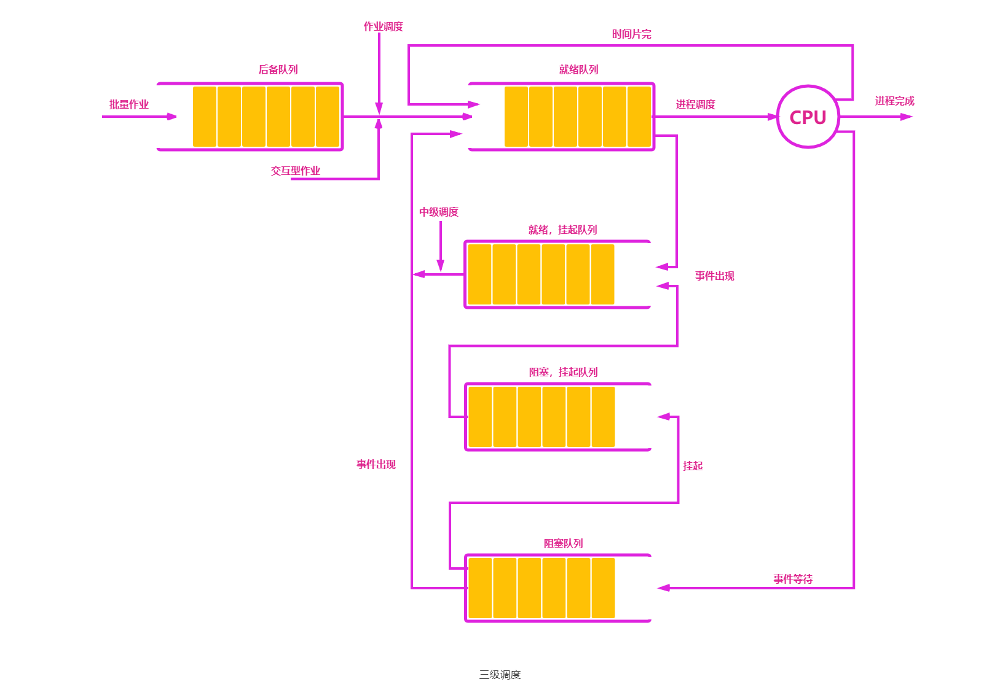
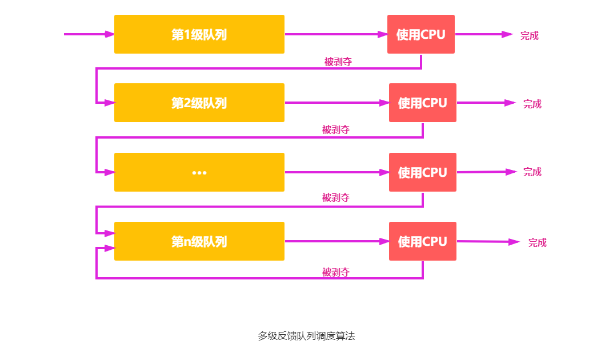
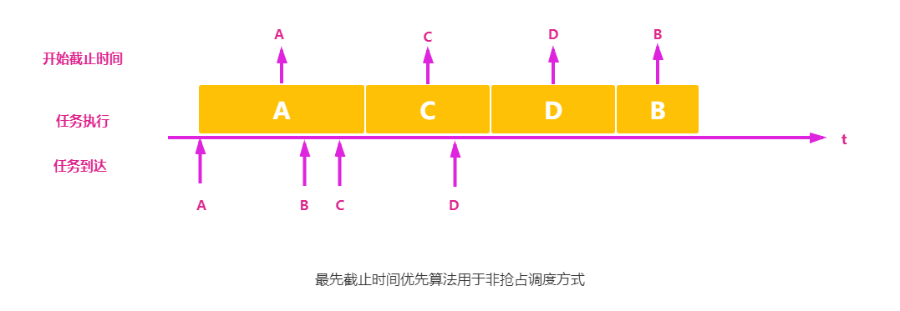
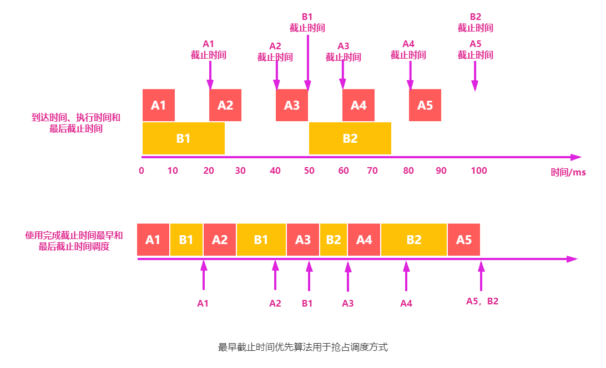
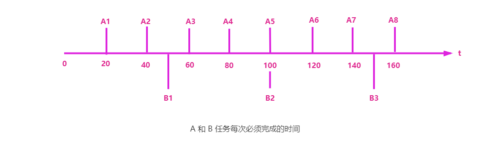
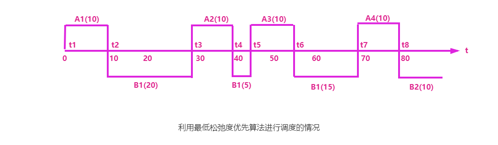

多道程序系统中，进程的数量往往多于处理器的数量，这样会遇到多个进程或线程同时争用处理器的情况，并且没有抢到处理器的进程或线程处于就绪状态。处理器调度是对处理器进行分配，即从就绪队列中按调度算法选择一个进程并将处理器分配给它运行，以实现进程或线程并发地执行。

## 调度的层次

一个作业从提交开始直到完成，往往要经历以下三级调度，如下图所示。

1. 高级调度。又称作业调度，其主要任务是按一定的原则从外存上处于后备队列的作业中挑选几个作业调入内存，给它们建立进程、分配必要的资源，并将它们放入就绪队列，以使它们获得竞争处理器的权利。简言之，作业调度就是内存与辅存之间的调度。对于每个作业只调入一次、调出一次。
   多多批处理系统中大多配有作业调度，而其他系统中通常不需要配置作业调度。作业调度的执行频率较低，通常为几分钟一次。

2. 中级调度。又称内存调度，其作用是提高内存利用率和系统吞吐量。为此，应将那些暂时不能运行的进程调至外存等待，把此时的进程状态称为就绪驻外存状态或挂起状态。当它们已具备运行条件且内存又稍有空闲时，由中级调度来决定把外存上的那些已具备运行条件的就绪进程再重新调入内存，并修改其状态为就绪态，挂在就绪队列上等待。
3. 低级调度。又称进程调度，其主要任务是按照某种方法和策略从就绪队列中选取一个进程，将处理器分配个它。进程调度是操作系统中最基本的一种调度，在一般的操作系统中都必须配置进程调度。进程调度的频率很高，一般几十毫秒一次。

作业调度从外存的后备队列中选择一批作业进入内存，为它们建立进程，这些进程被送入就绪队列，进程调度从就绪队列中选出一个进程，并把其状态改为运行态，把 CPU 分配给它。中级调度是为了提高内存的利用率，系统将那些暂时不能运行的进程挂起来。当内存空间宽松时，通过中级调度选择具备运行条件的进程，将其唤醒。

1. 作业调度为进程活动做准备，进程调度使进程正常活动起来，中级调度将暂时不能运行的进程挂起，中级调度处于作业调度和进程调度之间。
2. 作业调度次数少，中级调度次数略多，进程调度频率最高。
3. 进程调度是最基本的，不可或缺。

## 调度的切换

进程调度和切换程序是操作系统内核程序。请求调度的事件发生后，才可能运行进程调度程序，调度了新的就绪进程后，才会进行进程间的切换。理论上这三件事情应该顺序执行，但在实际设计中，操作系统内核程序运行时，若某时发生了引起进程调度的因素，则不一定能够马上进行调度与切换。

现代操作系统中，不能进行进程的调度与切换的情况有以下几种：

1. 在处理中断的过程中。中断处理过程复杂，在实际上很难做到进程切换，而且中断处理是系统工作的一部分，逻辑上不属于某一进程，不应被剥夺处理器资源。
2. 进程在操纵系统内核程序临界区中。进入临界区后，需要独占式地访问共享数据，理论上必须加锁，以防止其他并行程序进入，在解锁前不应切换到其他进程运行，以加快该共享数据的释放。
3. 其他需要完全屏蔽中断的原子操作过程中。如加锁、解锁、中断现场保护、恢复等原子操作。在原子过程中，连中断都要屏蔽，更不应该进行调度与切换。

若在上述过程中发生了引起调度的条件，则不能马上进行调度和切换，应置系统的请求调度标志，直到上述过程结束后才进行相应的调度与切换。

应该进行进程调度与切换的情况如下：

1. 发生引起调度条件且当前进程无法继续运行下去时，可以马上进行调度与切换。若操作系统只在这种情况下进行进程调度，则是非剥夺调度。
2. 中断处理结束或自陷处理结束后，返回被中断进行的用户态程序执行现场前，若置上请求调度标志，即可马上进行进程调度与切换。若操作系统支持这种情况下的运行调度程序，则实现了剥夺方式的调度。

进程切换往往在调度完成后立刻发生，它要求保存原进程当前切换点的现场信息，恢复被调度进程的现场信息。现场切换时，操作系统内核将原进程的现场信息推入当前进程的内核堆栈来保存它们，并更新堆栈指针。内核完成从新进程的内核栈中装入新进程的现场信息，更新当前运行进程空间指针、重设 PC 寄存器等相关工作之后，开始运行新的进程。

## 作业调度

所谓作业调度，是指从后备作业队列中选取一个作业并将其从外存调入内存执行，而作业是程序、数据和作业说明书集合的基本单位。作业在运行期间，每个作业都必须经过若干个相对独立且又相互关联的加工步骤才能得到结果。加工步骤称为作业步，因此作业可分成三个作业步：

1. “编译” 作业步
2. “链接装配” 作业步
3. “运行” 作业步

### 作业控制块

多道批处理系统中为每个作业设置一个作业控制块（Job Control Block，JCB），它是作业在系统中存在的标志，其中保存了系统对作业进行管理和调度所需的全部信息，用于方便管理和调度作业。作业控制块汇总包含：

1. 作业标识
2. 用户名称
3. 用户账号
4. 作业类型。如 `CPU` 繁忙型、`I/O` 繁忙型、批量型、终端型
5. 作业状态
6. 调度信息。如优先级和作业运行时间
7. 资源需求。如预计运行时间和要求内存大小等
8. 资源使用情况等。

作业控制块是作业在系统中存在的唯一标志。每当作业进入系统时，都会由系统建立一个作业控制块，再根据作业类型，将它放到相应的作业后备队列中。调度程序依据调度算法将作业从外存调入内存。运行期间，系统依据作业控制块和作业说明书对作业进行控制。当作业结束并退出，系统负责回收已分配给作业的资源，并撤销该作业控制块。

### 作业运行

作业从进入系统到运行结束，通常需要经历收容、运行和完成三个阶段。相应的作业也就有后备状态、运行状态和完成状态。

当作业已经完成其指定的功能，便进入停止状态，系统回收已分配资源。

1. 收容阶段。用户提交的作业存放到外存上，再为该作业建立 JCB，并把它放入作业后备队列中，此时的作业状态为后备状态。
2. 运行阶段。当作业被作业调度调入内存放到就绪队列，并为它分配必要的资源和建立进程。此时的作业状态为运行状态。
3. 完成阶段。作业完成或发生异常而结束时，系统便会终止作业程序并回收已分配的作业控制块和所有资源，并将作业运行结果输出。此时的作业状态为完成状态。 

## 进程调度

所谓进程调度，是指当某个进程正在处理器上执行时，若有某个更为重要或紧迫的进程需要处理，即有优先权更高的进程进入就绪队列，此时应如何分配处理器。进程调度的任务有三个：

1. 保存处理器的现场信息。调度时需要保存当前进程的处理器现场信息。
2. 按调度算法选取进程。通过调度算法选取进程，将其状态改为运行状态，并准备分配处理器。
3. 把处理器分配给进程。把处理器分配给该进程，此时将选中进程的进程控制块内有关处理器现场的信息装入处理器相应的各个寄存器中，把处理器的控制器交予该进程，让它从上次的断点处恢复运行。

进程调度有两种调度方式，如下所示：

1. 非剥夺调度方式，又称非抢占方式。非剥夺调度方式是指当一个进程正在处理器上执行时，即使有某个更为重要或紧迫的进程进入就绪队列，仍然让正在执行的进程继续执行，直到该进程完成或发生某种事件而进入阻塞态时，才把处理器分配给更为重要或紧迫的进程。
   在非剥夺调度方式下，一旦把 CPU 分配给一个进程，该进程就会保持 CPU 直到终止或转换到等待态。这种方式的优点是实现简单、系统开销小，适用于大多数的批处理系统，但它不能用于分时系统和大多数的实时系统。

2. 剥夺调度方式，又称抢占方式。剥夺调度方式是指当一个进程正在处理器上执行时，若有某个更为重要或紧迫的进程需要使用处理器，即立即暂停正在执行的进程，将处理器分配给这个更为重要或紧迫的进程。
   采用剥夺式的调度，对提高系统吞吐率和响应效率都有明显的好处。但 “剥夺” 不是一种任意性行为，必须遵循一定的原则，主要有优先权、短进程优先和时间片原则等。

## 实时调度

所谓实时调度，是指系统能够在限定的响应时间内提供所需水平的服务。正确性处理逻辑正确，还要对时间有要求，如果时间约束条件不满足，将会发生错误。

实时任务中的每个进程的行为是可预测和提前掌握，分为硬实时和软实时，如下所示。

- 硬实时任务，必须满足绝对的截止时间。
- 软实时任务，有截止时间，但必须在不对系统造成大影响的前提下，才容忍出错。

为实现实现调度，系统应向调度程序提供有关的任务信息：

1. 就绪时间。指任务成为就绪状态的起始时间。
2. 开始与完成的截止时间。开始截止时间是任务必须在某时间之前开始执行；完成截止时间是任务必须在某时间之前执行完成。
3. 处理时间。任务从开始到完成所需的时间。
4. 资源要求。任务执行时所需的一组资源。
5. 优先级。根据任务的性质赋予不同的优先级。

除了任务信息外，系统的处理能力也要强，要不处理器可能忙不过来，而致使某些实时任务得不到及时处理，从而产生难以预料的后果。假如系统中有 m 个周期性的硬实时任务 `HRT`，处理时间为 $C_i$，周期时间为 $P_i$，则在单处理器情况下，必须满足下面的限制条件系统才是可调度的：

$$
\sum_{i=1}^{m} \frac{C_i}{P_i} \leq 1
$$

因此，要提高系统处理能力，除了增强单处理器的处理能力，还有采用多处理器。假定多处理器数为 N，则应将上述的限制条件改为：

$$
\sum_{i=1}^{m} \frac{C_i}{P_i} \leq N
$$

实时调度算法有非抢占式和抢占式两种调度算法，如下所示。

1. 非抢占式。该调度方式又分为非抢占式轮转调度算法和非抢占式优先调度算法。
	- 非抢占式轮转调度算法。若干相同对象排成一个轮转队列，每次选择队首运行，完成后再挂在轮转队列的末尾等待，如此循环下去。这种调度算法可获得数秒至数十秒的响应时间，可用于要求不太严格的实时控制系统中。
	- 非抢占式优先调度算法。系统为任务赋予优先级，并根据优先级安排就绪队列中的位置并等待调度执行。这种调度算法可获得数秒至数百毫秒的响应时间，可用于有一定要求的实时控制系统。

2. 抢占式。根据抢占发生时间的不同，进一步分成时钟中断的抢占式优先级调度算法和立即抢占的优先级调度算法。
	- 基于时钟中断的抢占式优先级调度算法。任务的优先级高于当前任务的优先级，并不会立即抢占当前任务的处理器，而会等时钟中断，才会抢占处理器并运行。该算法能获得较好的响应效果，其调度延迟可降为几十至几毫秒，可用于大多数的实时系统中。
	- 立即抢占的优先级调度算法。操作系统要具有快速响应外部事件中断的能力。一旦出现外部中断，只要当前任务未处于临界区，便立即抢占并运行紧迫任务。该算法能获得非常快的响应，可把调度延迟降低到几毫秒至一百微秒。

## 调度的基本准则

不同的调度算法具有不同的特性，在选择调度算法时，必须考虑算法的特性。为了比较处理器调度算法的性能，人们提出了很多评价准则，下面介绍其中主要的几种：

1. 资源利用率。为提高系统的资源利用率，应尽可能使处理器和其它所有资源都保持忙碌状态。

2. 系统吞吐量。表示单位时间内处理器完成作业的数量。长作业需要消耗较长的处理器时间，因此会降低系统的吞吐量。而对于短作业，它们所需要消耗的处理器时间较短，因此能提高系统的吞吐量。调度算法和方式的不同，也会对系统的吞吐量产生较大的影响。
3. 周转时间。周转时间是指从作业提交到作业完成所经历的时间，是作业等待、在就绪队列中排队、在处理器上运行及进行输入/输出操作所花费时间的总和。
   作业的周转时间可用公式表示如下：
$$
周转时间 = 作业完成时间 - 作业提交时间
$$

   平均周转时间是指多个作业周转时间的平均值：

$$
平均周转时间 = (作业 1 的周转时间+···+作业 n 的周转时间)/n
$$

   带权周转时间是指作业周转时间与作业实际运行时间的比值：
$$
带权周转时间 = \frac{作业周转时间}{作业实际运行时间}
$$

   平均带权周转时间是指多个作业带权周转时间的平均值：

$$
平均带权周转时间 = (作业 1 的带权周转时间 +···+ 作业 n 的带权周转时间)/n
$$

4. 等待时间。等待时间是指进程处于等处理器状态的时间之和，等待时间越长，用户满意度越低。处理器调度算法实际上并不影响作业执行或输入/输出操作的时间，只影响作业在就绪队列中等待所花的时间。因此，衡量一个调度算法的优劣，常常只需简单地考察等待时间。

5. 响应时间。响应时间指从用户提交请求到系统首次产生响应所用的时间。在交互式系统中，周转时间不可能是最好的评价准则，一般采用响应时间作为衡量调度算法的重要准则之一。从用户角度来看，调度策略应尽量降低响应时间，使响应时间处在用户能接收的范围之内。

要想得到一个满足所有用户和系统要求的算法几乎是不可能的。设计调度程序，一方面要满足特定系统用户的要求（如某些实时和交互进程的快速响应要求），另一方面要考虑系统整体效率（如减少整个系统的进程平均周转时间），同时还要考虑调度算法的开销。

## 调度算法

操作系统中存在多种调度算法，不同的环境需要不同的调度算法，这是因为不同的领域有不同的目标。调度算法使用的情况有批处理、交换式与实时三种环境，下面介绍几种不同的调度算法。

### 先来先服务

先来先服务（first-come first-served，FCFS）调度算法是最简单的调度算法，即可用于作业调度，又可用于进程调度。在作业调度中，该算法每次从后备作业队列中选择几个最先进入进入该队列的作业，将它们调入内存，分配资源和创建进程，然后放入就绪队列中。

在进程调度中采用 FCFS 调度算法时，每次就会从就绪队列中选择一个最先进入该队列的进程，为之分配处理器，使之投入运行，直到运行完成或因某种原因而阻塞时才释放处理器。

下面通过一个实例来说明 FCFS 调度算法的性能。假设系统中有 4 个作业，系统采用 FCFS 调度算法，这组作业的平均等待时间、平均周转时间和平均带权周转时间见下表。

|作业号|提交时间|运行时间|开始时间|等待时间|完成时间|周转时间|带权周转时间|
|:---:|:---:|:---:|:---:|:---:|:---:|:---:|:---:|
|1|8|2|8|0|10|2|1|
|2|8.4|1|10|1.6|11|2.6|2.6|
|3|8.8|0.5|11|2.2|11.5|2.7|5.4|
|4|9|0.2|11.5|2.5|11.7|2.7|13.5|

<small>
平均等待时间 t = (0+1.6+2.2+2.3)/4=1.575;  
平均周转时间 T = (2+2.6+2.7+2.7)/4=2.5;  
平均带权周转时间 W = (1+2.6+5.4+13.5)/4=5.625  
</small>

FCFS 调度算法属于不可剥夺算法。从表面上看，它对所有作业都是公平的，但若一个长作业先到达系统，就会使后面的许多短作业等待很长时间，因此它不能作为分时系统和实时系统的主要调度策略。但它常被结合在其他调度策略中使用。例如，在使用优先级作为调度策略的系统中，往往对多个具有相同优先级的进程按 FCFS 原则处理。

FCFS 调度算法的特点是算法简单，但效率低；对长作业比较有利，但对短作业不利（相对 SJF 和高响应比），有利于 `CPU` 繁忙型作业，而不利于 `I/O` 繁忙型作业。

### 短作业优先

短作业优先（short job first，SJF）调度算法是指对短作业（进程）优先调度的算法。SJF 调度算法从后备队列中选择几个估计运行时间最短的作业，优先将它们调入内存运行；短进程优先（short process first，SPF）调度算法从就绪队列中选择一个估计运行时间最短的进程，将处理器分配给它，使之立即执行，直到完成或发生某事件而阻塞时，才释放处理器。

例如，考虑上表中给出的一组作业，若系统采用短作业优先调度算法，其平均等待时间、平均周转时间和平均带权周转时间见下表。

|作业号|提交时间|运行时间|开始时间|等待时间|完成时间|周转时间|带权周转时间|
|:---:|:---:|:---:|:---:|:---:|:---:|:---:|:---:|
|1|8|2|8|0|10|2|1|
|2|8.4|1|10.7|2.3|11.7|3.3|3.3|
|3|8.8|0.5|10.2|1.4|10.7|1.9|3.8|
|4|9|0.2|10|1|10.2|1.2|6|

<small>
平均等待时间 t = (0+2.3+1.4+1)/4=1.175;  
平均周转时间 T = (2+3.3+1.9+1.2)/4=2.1;  
平均带权周转时间 W = (1+3.3+3.8+6)/4=3.525。
</small>

SJF 调度算法也存在不容忽视的缺点：

1. 对长作业不利，长作业的周转时间会明显地增加。更严重的是，若有一长作业进入系统的后备队列，由于调度程序总是优先调度短作业，将导致长作业长期不被调度，出现饥饿现象。
2. 该调度算法完全未考虑作业的紧迫程度，因而不能保证紧迫性作业会被及时处理。
3. 由于作业的长短只是根据用户所提供的的估计执行时间而定的，而用户又可能会有意或无意地缩短其作业的估计运行时间，致使该算法不一定能真正做到短作业优先调度。

> 注意区分饥饿与死锁，饥饿是调度策略问题，死锁是系统环形等待。

### 优先级

优先级调度算法（priority-scheduling algorithm，PSA）又称优先权调度算法，既可用于作业调度，又可用于进程调度。该算法中的优先级用于描述作业运行的紧迫程度。

在作业调度中，优先级调度算法每次从后备作业队列中选择几个优先级最高的作业，将它们调入内存，分配必要的资源，创建进程并放入就绪队列。在进程调度中，优先级调度算法每次从就绪队列中选择优先级最高的进程，将处理器分配给它，使之投入运行。

根据新的更高优先级进程能否抢占正在执行的进程，可将该调度算法分为如下两种：

1. 非剥夺式优先级调度算法。当一个进程正在处理器上运行时，即使有某个更为重要或紧迫的进程进入就绪队列，仍然让正在运行的进程继续运行，直到由于其自身的原因而主动让出处理器时（任务完成或等待事件），才把处理器分配给更为重要或紧迫的进程。
2. 剥夺式优先级调度算法。当一个进程正在处理器上运行时，若有某个更为重要或紧迫的进程进入就绪队列，则立即暂停正在运行的进程，将处理器分配给更重要或紧迫的进程。

而根据进程创建后其优先级是否可以改变，可以将进程优先级分为以下两种：

1. 静态优先级。优先级是在创建进程时确定的，且在进程的整个运行期间保持不变。确定静态优先级的主要依据有进程类型、进程对资源的要求、用户要求。
2. 动态优先级。在进程运行过程中，根据进程情况的变化动态调整优先级。动态调整优先级的主要依据有进程占有 CPU 时间的长短、就绪进程等待 CPU 时间的长短。

一般来说，进程优先级的设置可以参照以下原则：

1. 系统进程 > 用户进程。系统进程作为系统管理者，理应拥有更高的优先级。
2. 交互型进程 > 非交互型进程，或前台进程 > 后台进程。大家平时在使用手机时，在前台运行的正在和你交互的进程应该更快速地响应你，因此自然需要被优先处理，即要有更高的优先级。
3. I/O 型进程 > 计算型进程。所谓 I/O 型进程，是指那些会频繁使用 I/O 设备的进程，而计算型进程是那些频繁使用 CPU 的进程（很少使用 I/O 设备）。我们知道，I/O 设备的处理速度要比 CPU 慢得多，因此若将 I/O 型进程的优先级设置得更高，就更有可能让 I/O 设备尽早开始工作，进而提升系统的整体效率。

### 高响应比优先

高响应比优先（highest response ratio next，HRRN）调度算法主要用于作业调度，是对 FCFS 调度算法和 SJF 调度算法的一种综合平衡，同时考虑了每个作业的等待时间和估计的运行时间。在每次进行作业调度时，先计算后备作业队列中每个作业的响应比，从中选出响应比最高的作业投入运行。

由于等待时间与要求服务时间之和就是系统对该作业的响应时间，故该优先级又相当于响应比 $R_P$。而响应比的变化规律可描述为

$$
响应比 R_P = \frac{等待时间+要求服务时间}{要求服务时间} = \frac{响应时间}{要求服务时间}
$$

根据以上公式可知：

1. 作业的等待时间相同时，要求服务时间越短，响应比越高，有利于短作业，类似于 SJF 算法。
2. 要求服务时间相同时，作业的响应比由其等待时间决定，等待时间越长，其响应比越高，因而它实现的是先来先服务，类似于 FCFS 算法。
3. 对于长作业，作业的响应比可以随等待时间的增加而提高，等待时间足够长时，其响应比便可升到很高，从而也可获得处理器。因此，克服了饥饿状态，兼顾了长作业。

该算法在其中做了较好的这种，但是利用该算法时，每次进行调度之前都需要先做响应比计算，会增加系统开销。

### 时间片轮转

时间片轮转（round-robin，RR）调度算法主要适用于分时操作系统。在轮转法中，系统将所有的就绪进程按到达时间的先后次序排成一个就绪队列，进程调度程序总是选择就绪队列的队首并分配给 CPU 执行一个时间片，即使未完成，也必须中断并返回到就绪队列的末尾重新排队，等待再次运行，然后把处理器分配给就绪队列中新的队首进程，执行一个时间片。

在时间片轮转调度算法中，可分为两种情况进行进程的切换：

1. 当一个时间片尚未用完，正在运行的进程便已经完成，就立即激活调度程序，将它从就绪队列中删除，再调度就绪队列中队首的进程运行，并启动新的时间片。
2. 当一个时间片用完，而进程尚未运行完毕，计时器中断处理程序被激活，调度程序交给把它送往就绪队列的末尾。

在时间片轮转调度算法中，时间片的大小对系统性能的影响很大。若时间片足够大，以至于所有进程都能在一个时间片内执行完毕，则时间片轮转调度算法就退化为先来先服务调度算法。若时间片很小，将有利于短作业，但处理器将在进程间过于频繁地切换，使处理器的开销增大，而真正用于运行用户进程的时间将减少。因此，时间片的大小应选择适当。而影响时间片的大小通常由系统的响应时间、就绪队列中的进程数目和系统的处理能力等因素确定。

### 多级反馈队列

如下图所示，多级反馈队列（multileved feedback queue，MFQ）调度算法通过动态调整进程优先级和时间片大小，多级反馈队列调度算法可以兼顾多方面的系统目标。比如，为提高系统吞吐量和缩短平均周转时间而照顾短进程；为获得较好的 I/O 设备利用率和缩短响应时间而照顾 I/O 型进程；同时，也不必事先估计进程的执行时间。

多级反馈队列调度算法的调度机制如下所示：

1. 设置多个就绪队列，并为各个队列赋予不同的优先级，第 1 级队列的优先级最高，第 2 级队列次之，其余队列的优先级逐次降低。赋予各个队列中进程执行时间片的大小各不相同。在优先级越高的队列中，每个进程的运行时间片越小。例如，第 2 级队列的时间片要比第 1 级队列的时间片长 1 倍······第 i + 1 级队列的时间片要比第 i 级队列的时间片长 1 倍。
2. 一个新进程进入内存后，首先将它放入第 1 级队列的末尾，按 FCFS 原则排队等待调度。当轮到该进程执行时，如它能在该时间片完成，便可准备撤离系统；若它在一个时间片结束时尚未完成，调度程序便将该进程转入第 2 级队列的末尾，再同样按 FCFS 原则等待调度执行；若它在第 2 级队列中运行一个时间片后仍未完成，再以同样的方法放入第 3 级队列······如此下去，当一个长进程从第 1 级队列依次降到第 n 级队列后，在第 n 级队列中便采用时间片轮转的方式运行。
3. 仅当第 1 级队列为空时，调度程序才调度第 2 级队列中的进程运行；仅当第 1~(i-1) 级队列均为空时，才会调度第 i 级队列中的进程运行。若处理器正在执行第 i 级队列中的某进程，这时又有新进程进入优先级较高的队列 [第 1~(i-1) 中的任何一个队列]，则此时新进程将抢占正在运行进程的处理器，即由调度程序把正在运行的进程放回第 i 级队列的末尾，把处理器分配个新到的更高优先级的进程。

多级反馈队列的优势有以下几点：

1. 终端型作业用户。终端型用户提交的作业多属于交互型作业，通常短作业优先。
2. 短批处理作业用户。如果第一队列可执行完成，便获得与终端型作业一样的响应时间。而稍长的短作业也只需在第二和第三队列中各执行一时间片完成，其周转时间较短。
3. 长批处理作业用户。经过前面几个队列得到部分执行，然后再按轮转方式运行，不会长期得不到处理。

### 保证调度

保证调度算法是一种基于公平原则的调度算法，它向用户所做出的保证并不是优先运行，而是明确的性能保证，该算法可以做到调度的公平性。一种比较容易实现的性能保证是处理器分配的公平性。如果在系统中有 n 个同类型进程同时运行，为保证公平，保证每个进程应该获得的处理器时间的 1/n。在实施公平调度算法时系统中必须具有这样一些功能：

1. 计算每个进程自创建以来已经执行的处理时间。
2. 计算每个进程应获得的处理器时间，即自创建以来的时间除以并发进程数 n。
3. 计算进程获得处理器时间的比率，即进程实际执行的处理时间和应获得的处理器时间之比。
4. 比较个进程获得处理器时间的比率。如进程 A 的比率为 0.5，进程 B 的比率为 0.8，进程 C 的比率为 1.2。
5. 调度程序应选择比率最小的进程将处理器分配给它，并让该进程一直运行，直到超过最接近它的进程比率为止。

### 公平分享

公平分享调度算法也是一种基于公平原则的调度算法，就是给每个进程分配相同的处理器时间，这对诸进程体现了一定的公平，但如果每个用户所拥有的进程数不同，就会发生对用户的不公平问题。因此，该调度算法中的公平性不是针对进程，而是用户，使得每个用户能获得相同的处理器时间，或所要求的时间比例。然而调度是以进程为基本单位，必须考虑为每个用户所拥有的进程数目。

### 最早截止时间优先

最早截止时间优先（earliest deadline first，EDF）算法是根据任务的截止时间确定任务的优先级，任务的截止时间越早，其优先级越高，具有最早截止时间的任务排在队列的队首。调度程序总是选择就绪队列中的第一个任务，为之分配处理器。最早截止时间优先算法即可用于抢占式调度方式中，也可用于非抢占式调度方式中，如下所示。

- 非抢占式调度方式。用于非周期实时任务。如下图所示，有四个任务A、B、C、D，A先到先执行，任务B、C又先后到达。C的开始截止时间早于任务B，因此任务A执行完后调度任务C。在C执行的时候，任务D又到达，并且任务D的开始截止时间早于任务B，因此任务C执行完后调度任务D，最后才调度任务B执行。

- 抢占式调度方式。用于周期实时任务。如下图所示，有两个周期任务A、B并且周期时间分别为 20 ms 和 50 ms，每个周期的处理时间分别为 10 ms 和 25 ms。
  - t=0时，$A_1$ 和 $B_1$ 同时达到，但 $A_1$ 比 $B_1$ 的截止时间早，所以 $A_1$ 先运行；
  - t=10时，$A_1$ 执行完，调度 $B_1$ 执行；
  - t=20时，$A_2$ 到达，并且截止时间早于 $B_1$，$A_2$ 抢占处理器，$B_1$ 中断；
  - t=30时，$A_2$ 完成并调度 $B_1$执行；
  - t=40时，$A_3$ 到达，但 $B_1$ 截止时间早于 $A_3$，$A_3$等待；
  - t=45时，$B_1$执行完，调度 $A_3$ 执行，如此执行下去。

### 最低松弛度优先

最低松弛度优先（Least Laxity First）算法根据任务的紧急或松弛程度来确定任务的优先级。任务紧急程度越高或松弛度越低，赋予的优先级就越高，使之优先执行。

松弛度，是当前时刻到开始截止时刻间的差距，随着时间的推进，这个差值会逐渐变小，任务也就越来越紧迫，优先级也就越高。松弛度的计算公式如下所示：

$$
松弛度 = 截止完成时间 - 还需执行时间 - 当前时间
$$

实现该算法时要求系统中有一个按松弛度排序的实时任务就绪队列，松弛度最低的任务排在最前面，调度程序选择队列中的队首任务执行。主要用于可抢占调度方式中。

如下图所示，有两个周期任务A、B并且周期时间分别为 20 ms 和 50 ms，每个周期的处理时间分别为 10 ms 和 25 ms。

- t=0时，$A_1$ 的松弛度=20-10-0=10，$B_1$ 的松弛度=50-25-0=25，先调度 $A_1$ 执行；
- t=10时，$A_1$ 执行完，$A_2$ 的松弛度=40-10-10=20，$B_1$ 的松弛度=50-25-10=15，先调度 $B_1$ 执行；
- t=30时，$A_2$ 的松弛度=40-10-30=0，$B_1$ 的松弛度=50-(25-(30-10))-30=15，$A_2$ 抢占处理器执行，$B_1$ 中断；
- t=40时，$A_2$ 执行完，$A_3$ 的松弛度=60-10-40=10，$B_1$ 的松弛度=50-(25-(30-10))-40=5，调度 $B_1$ 执行；
- t=45时，$B_1$ 执行完，$A_3$ 的松弛度=60-10-45=5，$B_2$ 的松弛度 = 100-25-45=30，调度 $A_3$ 执行，如此执行下去。下面画出两个任务在 LLF 算法下的调度情况。

使用最低松弛度优先算法时，进程切换发生的时机有进程执行完、进程 I/O阻塞、新进程出现时可能的抢占、某进程松弛度为 0 时发生抢占，需要注意的是，有的时刻，其它并发的实时任务下一周期未到来，会出现只有一个任务的情况。