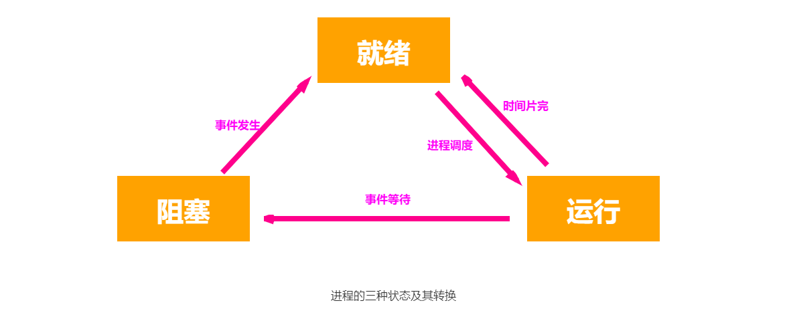
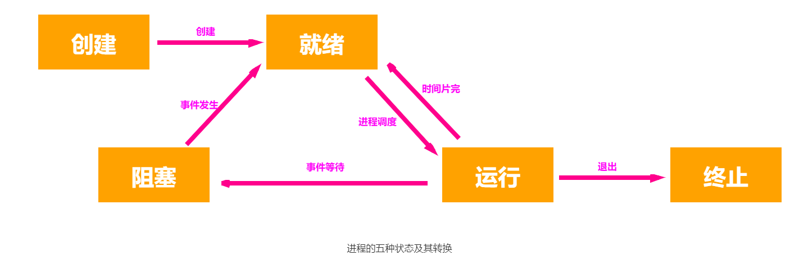
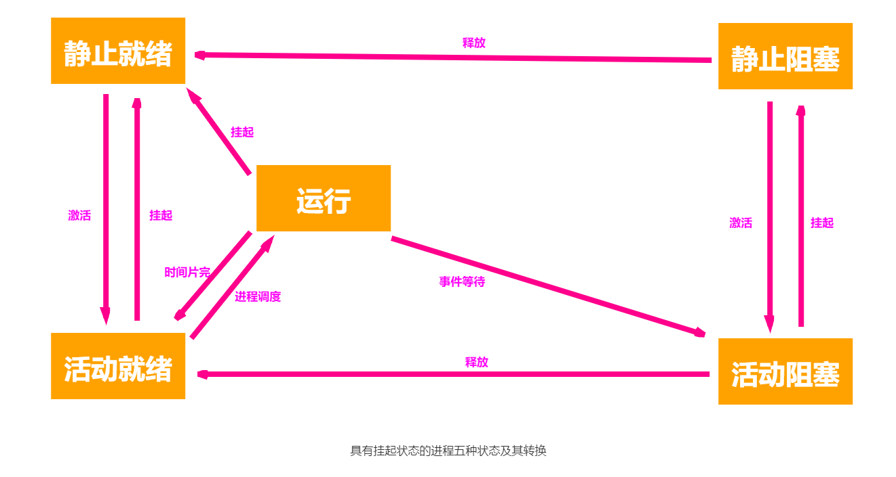
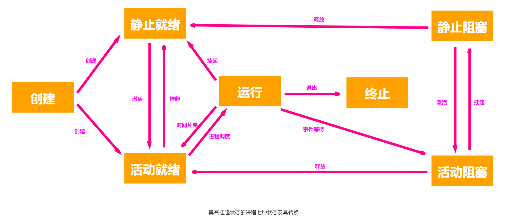
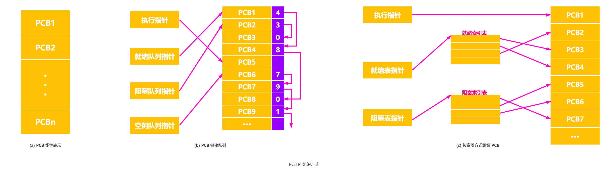
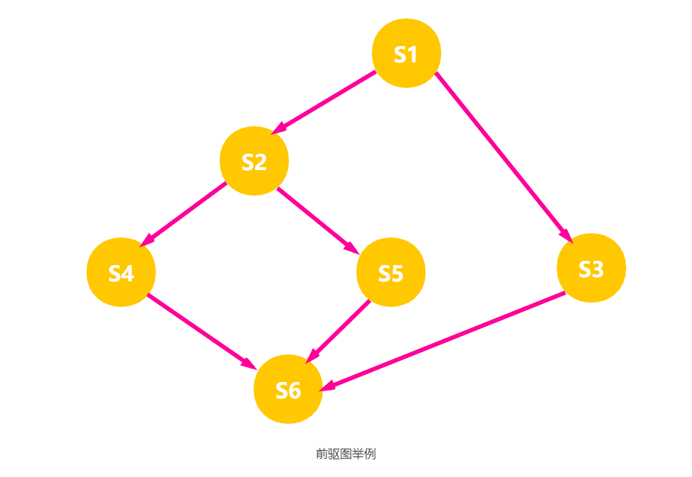
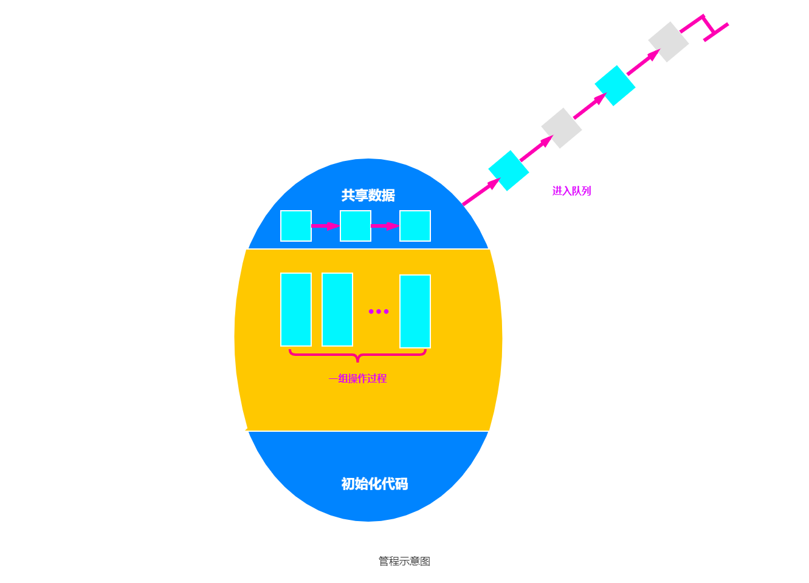

在多道程序环境下，允许多道程序并发执行，此时它们将失去其封闭性，并具有间断性，以及其运行结果不可再现性的特征。为此引入了进程的概念，以便更好地描述和控制程序的并发执行，实现操作系统的并发性和共享性。

从不同的角度可以对进程有不同的定义：

1. 进程是程序的一次执行。
2. 进程是一个程序及其数据在处理器上顺序执行时所发生的活动。
3. 进程是具有独立功能的程序在一个数据集合上运行的过程，它是系统进行资源分配和调度的一个独立单位。

在引入了进程实体的概念后，我们可以把传统操作系统中的进程定义为：“进程是进程实体的运行过程，是系统进行资源分配和调度的一个独立单位。”

## 进程的特征

进程是由多程序的并发执行而引出的，和程序是两个截然不同的概念。进程的基本特征是对比单个程序的顺序执行提出的，也是对进程管理提出的基本要求。

1. 动态性。进程的实质是进程实体的执行过程，是进程的最基本的特征。具有一定的生命周期，动态地创建、调度和消亡。
2. 并发性。是指多个进程实体同存于内存中，且能在一段时间内同时运行，是进程的重要特征。引入进程的目的也正是为了使其进程实体能和其它进程实体并发执行，以提高资源利用率。
3. 独立性。是指进程实体是一个能独立运行、独立获得资源和独立接受调度的基本单位。凡未建立进程控制块的程序都不能作为一个独立的单位参与运行。
4. 异步性，是指进程是按异步方式运行的，即按各自独立的、不可预知的速度向前推进。异步性会导致执行结果的不可再现性，为此在操作系统中必须配置相应的进程同步机制。
5. 结构性。每个进程都配置一个进程控制块对其进行描述。从结构上看，进程实体是由程序段、数据段和进程控制端三部分组成的。

## 进程的状态

尽管每个进程是一个独立的实体，有其自己的程序计数器和内部状态，但是，各个进程在其生命周期内，会存在相互制约关系及系统的运行环境的变化，使得进程的状态也在不断地发生变化。一般而言，每一个进程至少应处于以下三种基本状态之一。

- 运行态。该时刻进程实际占用处理器。单处理器系统中只有一个进程处于运行态，而多处理器系统中有多个进程处于运行态。
- 就绪态。该时刻进程处于运行的状态，即进程获得了除处理器外的一切所需资源，但因为其他进程正在运行而暂时停止。
- 阻塞态。又称等待态。该时刻进程发生某事件而暂停运行，如等待某资源为可用或等待输入/输出完成。资源可用不包括处理器，即使处理器空闲，该进程也不能运行。

就绪态与阻塞态是进程生命周期中的两个完全不同的状态，因为在分时系统的时间片轮转机制中，每个进程分到的时间片是若干毫秒。因此，进程得到处理器的时间很短且非常频繁，进程在运行过程中会频繁地转换到就绪态；而其它资源的使用和分配或某一事件的发生对应的时间相对来说会很长，进程转换到阻塞态的次数也相对较少。

进程在运行过程中会经常发生状态的转换。三种基本状态的转换如下所示。



- 就绪态 -> 运行态：处理就绪态的进程被调度后，获得处理器资源，于是进程由就绪态转换为运行态。
- 运行态 -> 就绪态：处于运行态的进程在时间片用完后，不得不让出处理器，从而进程由运行态转换为就绪态。此外，在可剥夺的操作系统中，当有更高优先级的进程就绪时，调度程序将正执行的进程转换为就绪态，让更高优先级的进程执行。
- 运行态 -> 阻塞态：进程请求某一资源的使用和分配或等待某一事件的发生时，如 I/O 操作的完成，它就从运行态转换为阻塞态。进程以系统调用的形式请求操作系统提供服务，这是一种特殊的、由运行用户态程序调用操作系统内核过程的形式。
- 阻塞态 -> 就绪态：进程等待的事件到来时，如 I/O 操作结束或中断结束时，中断处理程序必须把相应进程的状态由阻塞态转换为就绪态。

进程从运行态转换为阻塞态是主动行为，而从阻塞态转换为就绪态是被动行为，需要其他相关进程的协助。

### 创建与结束

为了满足进程控制块对数据及操作的完整性要求以及增强管理的灵活性，通常在系统中又为进程引入了两种常见的状态。下图显示引入两种状态后的进程状态的转换。



- 创建态。进程正在被创建，尚未转到就绪态。进程所需的资源尚不能满足，或系统尚无足够的内存使进程无法装入其中，此时创建工作尚未完成，进程不能被调度运行，称此时进程的状态为创建状态。
- 结束态。进程正从系统中消失，可能是进程正常结束或其他原因中断退出运行。进程需要结束运行时，系统首先必须置该进程为结束态，然后再进一步处理资源释放和回收等工作。

### 挂起操作

在许多系统中，进程除了就绪、执行和阻塞三种最基本的状态外，为了系统和用户观察和分析的需要，还引入了一个对进程的重要操作 —— 挂起操作。当该操作作用于某个进程时，该进程将被挂起，意味着此时该进程处于静止状态。如果进程正在执行，它将暂停执行。若原本处于就绪状态，则该进程此时暂不接受调度。与挂起操作对应的操作是激活操作。

引入挂起操作的原因，是基于系统和用户的如下需求：

1. 终端用户的需求。当终端用户在自己的程序运行期间发现有可疑问题，希望暂停自己的程序的运行，使之停止下来，以便用户研究其执行情况或对程序进行修改。
2. 父进程请求。有时父进程希望挂起自己的某个子进程，以便考察和修改该子进程，或者协调各子进程间的活动。
3. 负荷调节的需要。把实时系统中的工作负荷较重，已可能影响到对实时任务的控制时，可由系统把一些不重要的进程挂起，以保证系统能正常运行。
4. 操作系统的需要。操作系统有时希望挂起某些进程，以便检查运行中的资源使用情况或进行记账。

在引入挂起原语 `suspend` 和激活原语 `active` 后，在它们的作用下，进程将可能发生以下几种状态的转换，如下图所示。



1. 活动就绪 -> 静止就绪。当进程处于未被挂起的就绪状态时，称此为活动就绪状态，表示为 Readya，此时进程可以接受调度。当用挂起原语 `suspend` 将该进程挂起后，该进程便转变为静止就绪状态，表示为 `readys`，处于 `readys` 状态的进程不再被调度执行。
2. 活动阻塞 -> 静止阻塞。当进程处于未被挂起的阻塞状态时，称它是处于活动阻塞状态，表示为 `blockeda`。当用 `suspend` 原语将它挂起后，进程便转变为静止阻塞状态，表示 `blockeds`。处于该状态的进程在其所期待的事件出现后，它将从静止阻塞变为静止就绪 `readys` 状态。
3. 静止就绪 -> 活动就绪。处于 `readys` 状态的进程若用激活原语 `active` 激活后，该进程将转变为 `readya` 状态。
4. 静止阻塞 -> 活动阻塞。处于 `blockeds` 状态的进程若用激活原语 `active` 激活后，进程将转变为 `blockeda` 状态。下图显示了具有挂起状态的进程状态图。

下图显示了增加创建状态和终止状态后具有挂起操作的进程状态及转换图。



引入创建和终止状态后，在进程状态转换时，与进程五状态转换相比较。要增加考虑下面的几种情况：

1. `NULL` -> 创建：一个新进程产生时，该进程处于创建状态。
2. 创建 -> 活动就绪：在当前系统的性能和内存的容量均允许的情况下，完成对进程创建的必要操作后，相应的系统进程将进程的状态为活动就绪状态。
3. 创建 -> 静止就绪：考虑到系统当前资源状况和性能的要求，不分配给新键进程所需资源，主要是主存，相应的系统将进程状态转为静止就绪状态，被安置在外存，不参与调度，此时进程创建工作尚未完成。
4. 执行 -> 终止：当一个进程已完成任务时，或是出现了无法克服的错误，或是被操作系统或是被其他进程所终结，此时将进程的状态转换为终止状态。

## 进程控制

进程控制的主要功能是对系统中的所有进程实施有效的管理，具有创建新进程、撤销已有进程、实现进程状态转换等功能。在操作系统中，一般把进程控制用的程序段称为原语，原语的特点是执行期间不允许中断，它是一个不可分割的基本单位。

### 创建进程

允许一个进程创建另一个进程。此时创建者称为父进程，被创建的进程称为子进程。子进程可以继承父进程所拥有的资源。当子进程被撤销时，应将其从父进程那里获得的资源归还给父进程。此外，在撤销父进程时，必须同时撤销其所有的子进程。

在操作系统中，终端用户登录系统、作业调度、系统提供服务、用户程序的应用请求等都会引起进程的创建。操作系统创建一个新进程的过程如下：

1. 申请空白 PCB，为新进程申请获得唯一的数字标识符，并从 PCB 集合中索取一个空白 PCB。若 PCB 申请失败，则创建失败。
2. 为进程分配资源，为新进程的程序和数据及用户栈分配必要的内存空间。注意，若资源不足，则并不是创建失败，而是处于 `阻塞态`，等待资源。
3. 初始化 PCB，主要包括初始化标志信息、初始化处理器状态信息和初始化处理器控制信息，以及设置进程的优先级等。
4. 若进程就绪队列能够接纳新进程，则将新进程插入就绪队列，等待被调度运行。

### 终止进程

引起进程终止的事件主要有：

- 正常结束，表示进程的任务已经完成并准备退出运行。
- 异常结束，表示进程在运行时，发生了某种异常事件，使程序无法继续运行。如存储区越界、保护错、非法指令、特权指令错、I/O 故障等。
- 外界干扰，是指进程应外界的请求二终止运行。如操作员或操作系统干预、父进程请求和父进程终止。

操作系统终止进程的过程如下：

1. 根据被终止进程的标识符，从 PCB 集合中检索出该进程的 PCB，从中读出该进程的状态。
2. 若被终止进程处于执行状态，立即终止该进程的执行，并将处理器资源分配给其他进程。
3. 若该进程还有子进程，则应将其所有子进程终止，以防它们成为不可控的进程。
4. 将被终止的进程所拥有的全部资源归还给其父进程，或归还给系统。
5. 将被终止的 PCB 从所在队列或链表中移除，等待其它程序来搜集信息。

### 阻塞进程

正在执行的进程，由于期待的某些事件未发生，如请求系统资源失败、等待某种操作的完成、新数据尚未到达或无新工作可做等，由系统自动执行阻塞，使自己由运行态变为阻塞态。可见，进程的阻塞是进程自身的一种主动行为，也因此只有处于运行态的进程，才可能将其转为阻塞态。阻塞原语 `block` 的执行过程如下：

1. 找到将要被阻塞进程的标识号对应的 PCB。
2. 若该进程为运行态，则保护其现场，将其状态转为阻塞态，停止运行。
3. 把该 PCB 插入相应事件的等待队列。

### 唤醒进程

当被阻塞进程所期待的事件出现时，如它所启动的 I/O 操作已完成或其所期待的数据已到达，由有关进程（如提供数据的进程）调用唤醒原语 `wakeup`，将等待该事件的进程唤醒。唤醒原语的执行过程如下：

1. 在该事件的等待队列中找到相应进程的 PCB。
2. 将其从等待队列中移出，并置其状态为就绪态。
3. 把该 PCB 插入就绪队列，等待调度程序调度。

`block` 原语和 `wakeup` 原语是一对作用刚好相反的原语，必须成对使用。`block` 原语是由被阻塞进程自我调用实现的，而 `wakeup` 原语则是由一个与被唤醒进程合作或被其他相关的进程调用实现的。

### 挂起进程

当系统中出现了引起进程挂起的事件时，系统将利用挂起原语 `suspend` 将指定进程或处于阻塞状态的进程挂起。挂起的执行过程是：

1. 检查被挂起进程的状态，若处于活动就绪状态，便将其改为静止就绪；若处于活动阻塞状态，便将其改为静止阻塞。
2. 为了方便用户或父进程查看该进程的运行情况，把该进程的 PCB 复制到某指定的内存区域。
3. 若被挂起的进程正在执行，则转向调度程序重新调度。

### 激活进程

当系统中发生激活进程的事件时，系统将利用激活原语 `active`，将指定进程激活。激活原语的过程是将进程从外存调入内存，检查该进程的现行状态，若是静止就绪，便将之改为活动就绪；若为静止阻塞，便将之改为活动阻塞。

假如采用的是抢占调度策略，则每当有静止就绪进程被激活而插入就绪队列时，便应检查是否要进行重新调度，即由调度程序将被激活的进程与当前进程的优先级进行比较，如果被激活进程的优先级低，就不必重新调度；否则，立即剥夺当前进程的运行，把处理器分配给刚刚被激活的进程。

### 进程切换

对于通常的进程而言，其创建、撤销及要求由系统设备完成的 I/O 操作，都是利用系统调用而进入内核，再由内核中的相应处理程序予以完成的。进程切换同样是在内核的支持下实现的，因此可以说，任何进程都是在操作系统内核的支持下运行的，是与内核紧密相关的。

进程切换是指处理器从一个进程的运行转到另一个进程上运行，在这个过程中，进程的运行环境产生了实质性的变化。进程切换的过程如下：

1. 保存处理器上下文，包括程序计数器和其他寄存器。
2. 更新 PCB 信息。
3. 把进程的 PCB 移入相应的队列，如就绪、在某事件阻塞等队列。
4. 选择另一个进程执行，并更新其 PCB。
5. 更新内存管理的数据结构。
6. 恢复处理器上下文。

进程切换与处理器模式切换是不同的，模式切换时，处理器逻辑上可能还在同一进程中运行。若进程因中断或异常进入核心态运行，执行完后又回到用户态刚被中断的程序运行，则操作系统只需恢复进程进入内核时所保存的 `CPU` 现场，而无须改变当前进程的环境信息。但若要切换进程，当前运行进程改变了，则当前进程的环境信息也需要改变。

> 调度和切换的区别，调度是指决定资源分配给哪个进程的行为，是一中决策行为；切换是指实际分配的行为，是执行行为，一般来说，先有资源的调度，然后才有进程的切换。

## 进程的组织

进程是一个独立的运行单位，也是操作系统进行资源分配和调度的基本单位。一般由进程控制块、程序段和数据段三部分组成。

### 进程控制块

为了便于系统描述和管理进程的运行，在操作系统的核心为进程专门定义了一个数据结构 —— **进程控制块**（Process Control Block，PCB）。PCB 作为进程实体的一部分，是进程存在的唯一标志，记录了操作系统用于描述进程的当前情况以及管理进程运行的全部信息，可以让进程实现间断性地运行方式和其它进程的同步与通信。

当创建一个进程时，系统会为该进程建立一个 PCB，并常驻内存；进程执行时，系统会从内存中存取 PCB 来了解进程的现行状态信息，以便对其进行控制和管理；进程结束时，系统收回其 PCB，该进程随之消亡。操作系统通过 PCB 表来管理和控制进程。

在进程控制块中，主要包括进程标识符、处理器状态、进程调度与控制信息等。如下所示：

- 进程标识符。用于唯一地标识一个进程。一个进程通常有两种标识符。
	- 外部标识符。进程归属创建者，主要为共享和保护服务。
	- 内部标识符。赋予每一个进程一个唯一的数字标识符，通常是一个进程的序号。

- 处理器状态。处理器状态信息也称处理器的上下文，主要是由处理器的各种寄存器中的内容组成的。寄存器包括通用寄存器、指令计数器、程序状态字段 PSW 和用户栈指针。当进程被切换时，处理器状态信息都必须保存在相应的 PCB 中，以便在该进程重新执行时能再从断点继续执行。

- 进程调度信息。在操作系统进行调度时，必须了解进程的状态及有关进程调度的信息，包括进程状态、进程优先级、进程调度所需的其它信息和事件。

- 进程控制信息。是指用于进程控制所必须的信息，包括程序和数据的地址、进程同步和通信机制、资源清单和链接指针。

在一个系统中，通常存在着许多进程，有的处于阻塞态，而且阻塞的原因各不相同。为了方便进程的调度和管理，需要将各进程的 PCB 用适当的方法组织起来。常用的组织方式如下图所示。



1. 线性方式。将系统中所有 PCB 都组织在一张线性表中，将该表的首址存放在内存的一个专用区域中。该方式实现简单、开销小，但每次查找都需要扫描整表，适合进程数目不多的系统。

2. 链接方式。 将同一状态的 PCB 链接成一个队列，不同状态对应不同的队列，也可把处于阻塞态的 PCB，根据其阻塞原因的不同，排成多个阻塞队列。

3. 索引方式。将同一状态的进程组织在一个索引表中，索引表的表项指向相应的 PCB，不同状态对应不同的索引表，如就绪索引表和阻塞索引表等，并记录具有相应状态的某个 PCB 在 PCB 表中的地址。

### 程序段

程序段就是能被进程调度程序调度到 CPU 执行的程序代码段。注意，程序可被多个进程共享，即多个进程可以运行同一个程序。

### 数据段

一个进程的数据段，可以是进程对应的程序加工处理的原始数据，也可以是程序执行时产生的中间或最终结果。

## 进程通信

进程通信是指进程之间的信息交换。进程的互斥与同步需要在进程间交换一定的信息，但只能称为低级进程通信，是因为其效率低和通信对用户不透明；而进程之间要传送大量数据，应当利用高级通信方式。高级通信方式是指以较高的效率传输大量数据的通信方式，主要有共享存储、消息传递和管道通信三类。

### 共享存储

相互通信的进程之间存在一块共享空间，通过共享空间，可以实现进程之间的信息交换，如下图所示。在对共享空间进行写/读操作时，需要使用同步互斥工具，对共享空间的写/读进行控制。


共享存储的通信方式有两种：

1. 基于共享数据结构的通信方式。诸进程公用某些数据结构，借以实现诸进程间的信息交换。操作系统仅提供共享存储器，由用户负责对公用数据结构的设置及对进程间同步的处理。仅适于传递相对少量的数据，通信效率低下，属于低级通信。
2. 基于共享存储的通信方式。在内存中划出一块共享存储区域，用于传输大量数据，诸进程可以通过对该共享区的读/写交换信息，实现通信，数据的形式和位置甚至访问控制都由进程负责，而不是操作系统，属于高级通信。

注意，用户进程空间一般都是独立的，进程运行期间一般不能访问其他进程的空间，要想让两个用户进程共享空间，必须通过特殊的系统调用实现，而进程内的线程是自然共享进程空间的。

### 消息传递

在消息传递系统中，进程间的数据交换是以格式化的消息为单位的。若通信的进程之间不存在可直接访问的共享空间，则必须利用操作系统提供的消息传递方法实现进程通信。进程通过系统提供的发送消息和接收消息两个原语进行数据交换。


基于消息传递的通信方式属于高级通信方式，根据实现方式的不同分为两类：

1. 直接通信方式。发送进程直接把消息发送给接收进程，并将它挂在接收进程的消息缓冲队列上，接收进程从消息缓冲队列中取得消息，如上图所示。
2. 间接通信方式。发送进程把消息发送到某个中间实体，接收进程从中间实体取得消息。这种中间实体一般称为信箱，这种通信方式又称信箱通信方式。

### 管道通信

管道通信是消息传递的一种特殊方式，如下图所示。所谓 **管道**，是指用于连接一个读进程和一个写进程以实现它们之间的通信的一个共享文件，又名 `pipe` 文件。向管道（共享文件）提供输入的发送进程（即写进程），以字符流形式将大量的数据送入（写）管道；而接收管道输出的接收进程（即读进程）则从管道中接收（读）数据。


为了协调双方的通信，管道机制必须提供以下三方面的协调能力：

1. 互斥。当一个进程正在 `pipe` 执行读/写操作时，其它进程必须等待。
2. 同步。当写进程把一定数量的数据写入 `pipe`，便去睡眠等待，直到读进程取走数据后再把它唤醒。当读进程读一空 `pipe` 时，也应睡眠等待，直至写进程将数据写入管道后才将之唤醒。
3. 确定对方是否存在。只有确定了对方已存在时才能进行通信。

下面以 Linux 中的管道为例进行说明。在 Linux 中，管道是一种使用非常频繁的通信机制。从本质上说，管道也是一种文件，但它又和一般的文件有所不同，管道可以克服使用文件进行通信的两个问题，具体表现如下：

1. 限制管道的大小。实际上，管道是一个固定大小的缓冲区。在 Linux 中，该缓冲区的大小为 `4KB`，这使得它的大小不像文件那样不加检验地增长。使用单个固定缓冲区也会带来问题，比如在写管道时可能变满，这种情况发生时，随后对管道的 `write()` 调用将默认地被阻塞，等待某些数据被读取，以便腾出足够的空间供 `write()` 调用写。
2. 读进程也可能工作得比写进程快。当所有当前进程数据已被读取时，管道变空。当这种情况发生时，一个随后的 `read()` 调用将默认地被阻塞，等待某些数据被写入，这解决了 `read()` 调用返回文件结束的问题。

> 注意，从管道读数据是一次性操作，数据一旦被读取，它就从管道中被抛弃，释放空间以便写更多的数据。管道只能采用半双工通信，即某一时刻只能单向传输。要实现父子进程双方互动通信，需要定义两个管道。

管道可以理解为共享存储的优化和发展，因为在共享存储中，若某进程要访问共享存储空间，则必须没有其他进程在该共享存储空间中进行写操作，否则访问行为就会被阻塞。而管道通信中，存储空间进化成了缓冲区，缓冲区只允许一边写入、另一边读出，因此只要缓冲区中有数据，进程就能从缓冲区中读出，而不必担心会因为其他进程在其中进行写操作而遭到阻塞，因为写进程会先把缓冲区写满，然后才让读进程读，当缓冲区中还有数据时，写进程不会往缓冲区写数据。当然，这也决定了管道通信必然是半双工通信。


## 进程同步

操作系统引入进程后，使得系统中的多道程序可以并发执行，改善了资源利用率和提高了系统的吞吐量，但也增加了系统的复杂性。在多道程序环境下，进程是并发执行的，不同进程之间存在着不同的相互制约关系。为了协调进程之间的相互制约关系，引入了进程同步的概念。

多道程序环境下，对于同处于一个系统中的多个进程，由于它们共享系统中的资源，或为完成某一任务而相互合作，它们之间可能存在着以下两种形式的制约关系。

### 间接相互制约关系

间接制约关系也称互斥。当一个进程进入临界区使用临界资源时，另一个进程必须等待，当占用临界资源的进程退出临界区后，另一进程才允许去访问此临界资源。

例如，在仅有一台打印机的系统中，有两个进程 A 和进程 B，若进程 A 需要打印时，系统已将打印机分配给进程 B，则进程 A 必须阻塞。一旦进程 B 将打印机释放，系统便将进程 A 唤醒，并将其由阻塞态变为就绪态。

### 直接相互制约关系

直接相互制约关系亦称同步，是指为完成某种任务而建立的两个或多个进程，这些进程因为需要的某些位置上协调它们的工作次序而等待、传递信息所产生的制约关系。进程间的直接制约关系源于它们之间的相互合作。

例如，输入进程 A 通过单缓冲向进程 B 提供数据。当该缓冲区空时，进程 B 不能获得所需数据而阻塞，一旦进程 A 将数据送入缓冲区，进程 B 就被唤醒。反之，当缓冲区满时，进程 A 被阻塞，仅当进程 B 取走缓冲数据时，才唤醒进程 A。

### 临界资源

虽然多个进程可以共享系统中的各种资源，但其中许多资源一次只能为一个进程所用，我们将一次仅允许一个进程使用的资源称为临界资源。许多物理设备都属于临界资源，如打印机等。此外，还有许多变量、数据等都可以被若干进程共享，也属于临界资源。

对临界资源的访问，必须互斥地进行，在每个进程中，访问临界资源的那段代码称为临界区。为了保证临界资源的正确使用，可把临界资源的访问过程分成 4 个部分：

1. 进入区。为了进入临界区使用临界资源，在进入区要检查可否进入临界区。若能进入临界区，则应设置正在访问临界区的标志，以阻止其他进程同时进入临界区。
2. 临界区。进程中访问临界资源的那段代码，又称临界段。
3. 退出区。将正在访问临界区的标志清除。
4. 剩余区。代码中的其余部分。

```c
do {
    entry section;       // 进入区
    critical section;    // 临界区
    exit section;        // 退出区
    remainder section;   // 剩余区
}
```

为禁止两个进程同时进入临界区，同步机制应遵循以下准则：

1. 空闲让进。临界区空闲时，可以允许一个请求进入临界区的进程立即进入临界区，以有效地利用临界资源。
2. 忙则等待。当已有进程进入临界区时，其他试图进入临界区的进程必须等待，以保证对临界资源的互斥访问。
3. 有限等待。对请求访问的进程，应保证能在有限时间内进入临界区，以免陷入 `死等` 状态。
4. 让权等待。当进程不能进入临界区时，应立即释放处理器，防止进程陷入 `忙等` 状态。

### 软件同步

在进入区设置并检查一些标志来标明是否有进程在临界区中，若已有进程在临界区，则在进入区通过循环检查进行等待，进程离开临界区后则在退出区修改标志。

1. 算法一：单标志法。该算法设置一个公用整型变量 `turn`，用于指示被允许进入临界区的进程编号，即若 `turn=0`，则允许 $P_0$ 进程进入临界区。该算法可确保每次只允许一个进程进入临界区。但两个进程必须交替进入临界区，若某个进程不再进入临界区，则另一个进程也将无法进入临界区，未被了`空闲让进`。这样很容易造成资源利用不充分。
   若 $P_0$ 顺利进入临界区并从临界区离开，则此时临界区是空闲的，但 $P_1$ 并没有进入临界区的打算，`turn=1` 一直成立，$P_0$ 就无法再次进入临界区，会一直被 while 死循环困住。

```c
P0进程：                  P1进程：
while(turn!=0);          while(turn!=1);        // 进入区
cirtical section;        cirtical section;      // 临界区
turn=1;                  turn=0;                // 退出区
remainder section;       remainder section;     // 剩余区
```

2. 算法二：双标志法先检查。该算法的基本思想是在每个进程访问临界区资源之前，先查看临界资源是否正被访问，若正被访问，该进程需等待；否则，进程才进入自己的临界区。为此，设置一个数据 `flag[i]`，如第 `i` 个元素值为 `false`，表示 $P_i$ 进程未进入临界区，值为 TRUE，表示 $P_i$ 进程进入临界区。

```c
Pi进程：                  Pj进程
while(flag[j]);  ①       while(flag[i]);  ②    // 进入区
flag[i]=true;    ③       flag[j]=true;    ④    // 进入区
cirtical section;        cirtical section;     // 临界区
flag[i]=false;           flag[j]=false;        // 退出区
remainder section;       remainder section;    // 剩余区
```

   优点：不用交替进入，可联系使用；缺点：$P_i$ 和 $P_j$ 可能同时进入临界区。按序列执行时，会同时进入临界区，违背`忙则等待`。即在检查对方的 `flag` 后和切换自己的 `flag` 前有一段时间，结果都检查通过。这里的问题出在检查和修改操作不能一次进行。

3. 算法三：双标志法后检查。算法二先检测对方的进程状态标志，再置自己的标志，由于在检测和放置中可插入另一个进程到达时的检测操作，会造成两个进程在分别检测后同时进入临界区。为此，算法三先将自己的标志设置为 `true`，在检测对方的状态标志，若对方标志为 `true`，则进入等待；否则进入临界区。

```c
Pi进程：                   Pj进程：
flag[i]=true;             flag[j]=true;         // 进入区
while(flag[j]);           while(flag[i]);       // 进入区
cirtical section;         cirtical section;     // 临界区
flag[i]=false;            flag[j]=false;        // 退出区
remainder section;        remainder section;    // 剩余区
```

   两个进程几乎同时都想进入临界区时，它们分别将自己的标志值 `flag` 设置为 `true`，并且同时检测对方的状态（执行 while 语句），发现对方也要进入临界区时，双方互相谦让，结果谁也进入不了临界区，从而导致 “饥饿” 现象。

4. 算法四：Peterson‘s Algorithm。为了防止两个进程为进入临界区而无期限等待，又设置了变量 `turn`，每个进程在先设置自己的标志后再设置 `turn` 标志。这时，再同时检测另一个进程状态标志和不允许进入标志，以便保证两个进程同时要求进入临界区时，只允许一个进程进入临界区。

```c
Pi进程：                      Pj进程：
flag[i]=true;turn=j          flag[j]=true;turn=i           // 进入区
while(flag[j] && turn==j);   while(flag[i] && turn==i);    // 进入区
cirtical section;            cirtical section;             //临界区
flag[i]=false;               flag[j]=false;                //退出区
remainder section;           remainder section;            // 剩余区
```

   具体如下，考虑进程 $P_i$，一旦设置 `flag[i] = true`，就表示它想要进入临界区，同时 `turn=j`，此时若进程 $P_j$ 已在临界区中，符合进程 $P_i$ 中的 `while` 循环条件，则 $P_i$ 可以顺利进入，反之亦然。本算法的基本思想是算法一和算法三的结合。利用 `flag` 解决临界资源的互斥访问，而利用 `turn` 解决 `饥饿` 现象。

### 硬件同步机制

软件方法解决诸进程互斥进入临界区的问题有一定难度，并且有很大的局限性，现在很少被采用。相应地，计算机提供了特殊的硬件指令来解决临界区问题，允许对一个字中的内容进行检测和修正，或对两个字的内容进行交换等。通过硬件支持实现临界段问题的方法称为低级方法，或称元方法。

#### 中断屏蔽方法

当一个进程正在使用处理器执行它的临界区代码时，防止其他进程进入其临界区进行访问的最简单方法是，禁止一切中断发生，或称之为屏蔽中断、关中断。因为 CPU 只在发生中断时引起进程切换，因此屏蔽中断能够保证当前运行的进程让临界区代码顺利地执行完，进而保证互斥的正确实现，然后执行开中断。其典型模式为

```c
···
关中断;
临界区;
开中断;
···
```

这种方法限制了处理器交替执行程序的能力，因此执行的效率会明显降低。对内核来说，在它执行更新变量或列表的几条指令期间，关中断是很方便的，但将关中断的权利交给用户则很不明智，若一个进程关中断后不再开中断，则系统可能会因此终止。

#### 硬件指令方法

借助指令 `Test-and-Set` 实现互斥方法，这条指令是原子操作，即执行该代码时不允许被中断。其功能是读出指定标志后把该标志设置为真。指令的功能描述如下：

```c
boolean test_and_set(boolean *lock) {
    boolean old;
    old=*lock;
    *lock=true;
    return old;
}
```

可以为每个临界资源设置一个共享布尔变量 `lock`，表示资源的两种状态：`lock=true` 表示正被占用，`lock=false` 表示空闲。在进程访问临界资源之前，利用 `TestAndSet` 检查和修改标志 `lock`；若有进程在临界区，则重复检查，直到进程退出。利用该指令实现互斥的循环进程结构描述如下：

```c
do {
    while test_and_set(&lock);
    进程的临界区代码段;
    lock=false;
    进程的其他代码;
} while(true)
```

`swap` 指令称为对换指令，该指令的功能是交换两个字的内容。其功能描述如下：

```c
void swap(boolean *a, boolean *b) {
    boolean temp;
    temp=*a;
    *a=*b;
    *b=temp;
}
```

> 注意，`TestAndSet` 和 `Swap` 指令的描述仅是功能实现，而并非软件实现的定义，事实上，它们是由硬件逻辑直接实现的，不会被中断。

用对换指令可以简单有效地实现互斥，方法是为每个临界资源设置一个共享变量 `lock`，初值为 `false`；在每个进程中再设置一个局部布尔变量 `key`，用于与 `lock` 交换信息。在进入临界区前，先利用 `swap` 指令交换 `lock` 与 `key` 的内容，然后检查 `key` 的状态；有进程在临界区时，重复交换和检查过程，直到进程退出。利用 `swap` 指令实现进程互斥的循环进程描述如下：

```c
do {
    key=true;
    do {
        swap(&lock, &key);
    }
    进程的临界区代码段;
    lock=false;
    ···
} while(true)
```

硬件方法的优点：适用于任意数目的进程，而不管是单处理器还是多处理器；简单、容易验证其正确性。可以支持进程内有多个临界区，只需为每个临界区设立一个布尔变量。

硬件方法的缺点：进程等待进入临界区时要耗费处理器时间，不能实现让权等待。从等待进程中随机选择一个进入临界区，有的进程可能一直选不上，从而导致 “饥饿” 现象。

### 信号量

信号量机制是一种功能较强的机制，可用来解决互斥与同步问题，它只能被两个标准的原语 `wait(S)` 和 `signal(S)` 访问，也可即为 `P 操作` 和 `V 操作`。

原语是指完成某种功能且不被分割、不被中断执行的操作序列，通常可由硬件来实现。例如，前述的 `test-and-set` 和 `swap` 指令就是由硬件实现的原子操作。原语功能的不被中断执行特性在单处理器上可由软件通过屏蔽中断方法实现。

原语之所以不能被中断执行，是因为原语对变量的操作过程若被打断，可能会去运行另一个对同一变量的操作过程，从而出现临界段问题。若能够找到一种解决临界段问题的元方法，就可以实现对共享变量操作的原子性。

#### 整型信号量

整型信号量被定义为一个用于表示资源数目的整型量 `S`，`wait` 和 `signal` 操作可描述为：

```c
wait(S) {
    while(S<=0) {
        S=S-1;
    }
}
signal(S) {
    S=S+1;
}
```

它们在执行时是不可中断的。亦即，当一个进程在修改某信号量时，没有其它进程可同时对该信号量进行修改。此外，`wait` 操作中，只要信号量 $S \leq 0$，就会不断地测试。因此，该机制并未遵循 “让权等待” 的准则，而是使进程处于 “忙等” 的状态。

#### 记录型信号量

记录型信号量是不存在 “忙等” 现象的进程同步机制。除需要一个用于代表资源数目的整型变量 `value` 外，再增加一个进程链表指针 `list`，用于链表所有等待该资源的进程。记录型信号量得名于采用了记录型的数据结构。记录型信号量可描述为

```c
typedef struct {
    int value;
    struct process *list;
} semaphore;
```

相应的 `wait(S)` 和 `signal(S)` 的操作如下：

```c
void wait(semaphore S) {    // 相当于申请资源
    S.value--;
    if (S.value<0) {
        add this process to S.list
        block(S.list);
    }
}
```

`wait` 操作，`S.value--` 表示进程请求一个该类资源，当 `S.value < 0` 时，表示该类资源已分配完毕，因此进程应调用 `block` 原语，进行自我阻塞，放弃处理器，并插入该类资源的等待队列 `S.list`，可见该机制遵循了 "让权等待" 的准则。

```c
void signal(semaphore S) {    // 相当于释放资源
    S.value++;
    if (S.value<=0) {
        remove a process P from S.list;
        wakeup(S.list);
    }
}
```

`signal` 操作，表示进程释放一个资源，使系统中可供分配的该类资源数增 1，故有 `S.value++`。若加 `1` 后仍是 S.value $\leq$ 0，则表示在 `S.list` 中仍有等待该资源的进程被阻塞，故还应调用 `wakeup` 原语，将 `S.list` 中的第一个等待进程唤醒。

#### 利用信号量实现同步

信号量机制能用于解决进程间的各种同步问题。设 S 为实现进程 $P_1$、$P_2$ 同步的公共信号量，初值为 0。进程 $P_2$ 中的语句 y 要使用进程 $P_1$ 中语句 x 的运行结果，所以只有当语句 x 执行完成之后语句 y 才可以执行。其实现进程同步的算法如下：

```c
semaphore S=0;     // 初始化信号量
P1() {
    ···
    x;  // 语句x
    V(S); //告诉进程 P2，语句 x 已经完成
    ···
}
P2() {
    ···
    P(S); // 检查语句 x 是否运行完成
    y; // 检查无误，运行 y 语句
    ···
}
```

若 $P_2$ 先执行到 `P(S)` 时，`S` 为 `0`，执行 `P` 操作会把进程 $P_2$ 阻塞，并放入阻塞队列；当进程 $P_1$ 中的 `x` 执行完后，执行 `V` 操作，把 $P_2$ 从阻塞队列中放回就绪队列，当 $P_2$ 得到处理器时，就得以继续执行。

#### 利用信号量实现进程互斥

信号量实现多个进程互斥地访问某临界资源，需为该资源设置进程互斥的信号量 `S`，由于每次只允许一个进程进入临界区，所以设置 `S` 初始值为 `1`。只需把临界区置于 `P(S)` 和 `V(S)` 之间，即可实现两个进程对临界资源的互斥访问。其算法如下：

```c
semaphore S=1;  // 初始化信号量
P1() {
    ···
    P(S);    // 准备开始访问临界资源，加锁
    进程P1的临界区;
    V(S);    //访问结束，解锁
    ···
}
P2() {
    ···
    P(S);    // 准备开始访问临界资源，加锁
    进程 P2 的临界区;
    V(S);    // 访问结束，解锁
    ···
}
```

当没有进程在临界区时，任意一个进程要进入临界区，就要执行 `P` 操作，把 `S` 的值减为 `0`，然后进入临界区；当有进程存在于临界区时，`S` 的值为 `0`，再有进程要进入临界区，执行 `P` 操作时将会被阻塞，直至在临界区中的进程退出，这样便实现了临界区的互斥。

互斥是不同进程对同一信号量进行 `P`、`V` 操作实现的，一个进程成功对信号量执行了 `P` 操作后进入临界区，并在退出临界区后，由该进程本身对该信号量执行 `V` 操作，表示当前没有进程进入临界区，可以让其他进程进入。

#### 利用信号量实现前驱关系

信号量也可用来描述程序之间或语句之间的前驱关系。下面给出了一个前驱图，其中 $S_1,S_2,S_3,···,S_6$ 是最简单的程序段。为使各程序段能正确执行，应设置若干初始值为 `0` 的信号量。例如，为保证 $S_1 \to S_2$、$S_1 \to S_3$ 的前驱关系，应分别设置信号量 `a1`、`a2`。同样，为保证 $S_2 \to S_4$、$S_2 \to S_5$、$S_3 \to S_6$、$S_4 \to S_6$、$S_5 \to S_6$，应设置信号量 `b1`、`b2`、`c`、`d`、`e`。



实现算法如下：

```c
semaphore a1=a2=b1=b2=c=d=e=0;   // 初始化信号量
S1() {
    ···
    V(a1); V(a2);    // S1已经运行完成
}
S2() {
    P(a1);    // 检查 S1 是否运行完成
    ···
    V(b1); V(b2);    // S2已经运行完成
}
S3() {
    P(a2);    // 检查 S1 是否运行完成
    ···
    V(c);    // S3已经运行完成
}
S4() {
    P(b1);    // 检查 S2 是否运行完成
    ···
    V(d);    // S4已经运行完成
}
S5() {
    P(b2);    // 检查 S2 是否运行完成 
    ··· 
    V(e);    // S5已经运行完成 
}
S6() {
    P(c);    // 检查 S3 是否运行完成
    P(d);    // 检查 S4 是否运行完成
    P(e);    // 检查 S5 是否运行完成
    ···
}
```

#### 分析进程同步和互斥问题的方法步骤

1. 关系分析。找出问题中的进程数，并分歧它们之间的同步和护持关系。同步、互斥、前驱关系直接按照上面例子中的经典范式改写。
2. 整理思路。找出解决问题的关键点，并根据做过的题目找出求解的思路。根据进程的操作流程确定 P 操作、V 操作的大致顺序。
3. 设置信号量。根据上面的两步，设置需要的信号量，确定初值，完善整理。

这是一个比较直观的同步问题，以 $S_2$ 为例，它是 $S_1$ 的后继，所以要用到 $S_1$ 的资源，在前面的简单总结中我们说过，在同步问题中，要用到某种资源，就要在行为前面 P 这种资源一下。$S_2$ 是 $S_4$、$S_5$ 的前驱，给 $S_4$、$S_5$ 提供资源，所以要在 L 行为后面 V 由 $S_4$ 和 $S_5$ 代表的资源一下。

### 管程

系统中的各种硬件资源和软件资源均可用数据结构抽象地描述其资源特性，即用少量信息和对资源所执行的操作来表征该资源，而忽略它们的内部结构和实现细节。管程是由一组数据及定义在这组数据之上的对这组数据的操作组成的资源管理模块，这组操作能初始化并改变管程中的数据和同步进程。管程被请求和释放资源的进程所调用。

#### 管程的组成

通过管程的定义可知，管程由四部分组成，如下图所示。



1. 管程的名称。
2. 局部于管程的共享结构数据说明。
3. 对该数据结构进行操作的一组过程。
4. 对局部于管程的共享数据设置初始值的语句。

#### 管程的基本特性

管程有以下特性：

1. 局部于管道的数据只能被局部于管程内的过程所访问。
2. 一个进程只有通过调用管程内的过程才能进入管程访问共享数据。
3. 每次仅允许一个进程在管程内执行某个内部过程。

所有进程要访问临界资源时，都只能通过管程间接访问，而管程每次只准许一个进程进入管程，执行管程内的过程，从而实现了进程互斥。