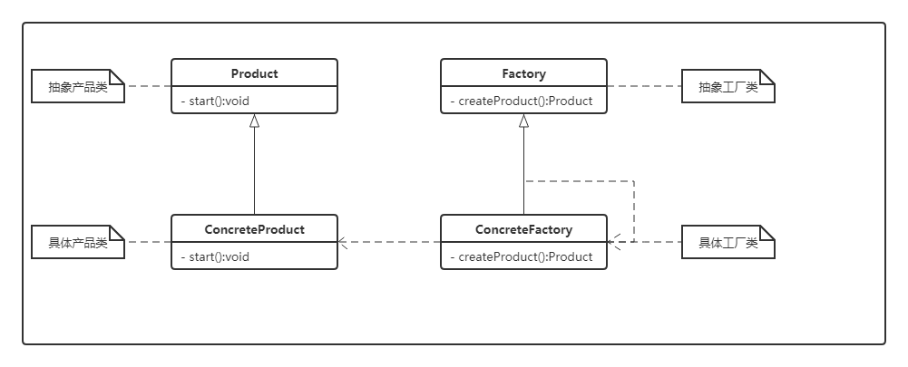

# 工厂方法模式（Factory Method）

> 设计模式是一种思想，适用于任何一门面向对象的语言

## 工厂方法模式的定义

设计原则中有一句话：类应该对扩展开放，对修改关闭。对于简单工厂，是将创建产品的细节抽取封装到工厂类中，如果在后来的扩展中又加入了新的产品，就需要对工厂类创建产品的方法进行修改，这样就违背了开-闭原则。

那么这样设计工厂类才能使每次新增加的产品不会违背开-闭原则，并且可以灵活的对系统进行扩展呢？我们需要解决以下几个问题：

- 只能对现有的工厂类进行扩展，不能修改已有工厂类创建实例的逻辑
- 每次有新产品只需要对创建细节进行定义扩展

为了解决以上问题，可以定义一个抽象类，提供创建对象方法的接口，但由子类实现创建方法，决定要实例化的类是哪一个。在抽象类中，任何其它实现的方法都可以使用到这个创建接口所创造出来的产品，但只有子类真正实现这个工厂方法并创建产品。这种设计模式称为工厂方法模式。

工厂方法模式：定义了一个创建对象的接口，但由子类决定要实例化哪个类。工厂方法把实例化操作推迟到子类。

工厂方法模式是简单工厂的延伸。在工厂方法模式中，核心工厂类不在负责产品的创建，而是将具体的创建工作交给子类完成。当系统需要增加其它新的对象时，只需要添加一个具体的产品和它的创建工厂即可，不需要对原工厂进行任何修改，很好的符合了开-闭原则。

## 类图



- 抽象产品类（Product）：提供抽象方法供具体产品类实现
- 具体产品类（ConcreteProduct）：提供具体的产品
- 抽象工厂类（Factory）：提供抽象方法供具体工厂实现
- 具体工厂类（ConcreteFactory）：提供具体的工厂

### 工厂方法模式实例

下面是抽象产品类与具体产品子类的实现

```java
public interface Product {
    /**
     * 产品的抽象方法，有具体的产品类去实现
     */
    void start();
}
```

```java
public class SlicedNoodlesProduct implements Product {
    @Override
    public void start() {
        System.out.println("生产刀削面");
    }
}
```

```java
public class RiceNoodlesProduct implements Product {
    @Override
    public void start() {
        System.out.println("生产米线");
    }
}
```

下面是抽象工厂类与具体工厂类的实现

```java
public abstract class Factory {
    /**
     * 创建产品的抽象类
     * @return
     */
    protected abstract Product createProduct();

    public void doSomething() {
        Product product = createProduct();
        // do something with the product
        product.start();
    }
}
```

```java
public class SlicedNoodlesProduct implements Product {
    @Override
    public void start() {
        System.out.println("生产刀削面");
    }
}
```

```java
public class RiceNoodlesFactory extends Factory {
    @Override
    protected Product createProduct() {
        return new RiceNoodlesProduct();
    }
}
```

测试方法：

```java
public class Test {
    public static void main(String[] args) {
        Factory factory = new SlicedNoodlesFactory();
        factory.doSomething();
    }
}
```

## 工厂方法模式的优缺点

- 优点：用户只需要关心锁需产品的对应工厂，无需关心细节，符合开闭原则，提高可扩展性
- 缺点：类的个数容易过多，增加复杂度，增加了系统的抽象性和理解难度

## 使用场景

- 创建对象需要大量重复的代码
- 客户端不依赖于产品类实例如何被创建、实现的细节
- 一个类通过子类来指定创建哪个对象
