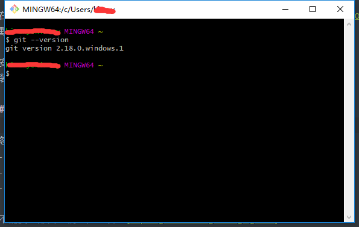

# Git

## 目录

- Git简介
	- 集中式VS分布式
	- 中心服务器

- 安装Git
- 创建版本库
- 远程仓库
- 分支管理
	- 创建与合并分支
	- 解决冲突
	- 分支管理策略
	- Bug分支
	- Feature分支
	- 多人协作
	- Rebase

- 标签管理
- 自定义Git
- Git命令一览

## 一、Git简介

Git是分布式版本控制系统。
工作原理/流程：


- Workspace：工作区
- Index/Stage：暂缓区
- Repository：仓库区（或本地仓库）
- Remote：远程仓库

##### 集中式VS分布式

SVN是集中式版本控制系统，版本库是几种放在中央服务器的，而干活的时候，用的都是自己的电脑，所以首先要从中央服务器哪里得到最新的版本，然后干活，干完后，需要把自己做完的活推送到中央服务器。集中式版本控制系统是必须联网才能工作，如果在局域网还可以，带宽够大，速度够快，如果在互联网下，如果网速慢的话，就纳闷了。

Git是分布式版本控制系统，那么它就没有中央服务器的，每个人的电脑就是一个完整的版本库，这样，工作的时候就不需要联网了，因为版本都是在自己的电脑上。既然每个人的电脑都有一个完整的版本库，那多个人如何协作呢？比如说自己在电脑上改了文件A，其他人也在电脑上改了文件A，这时，你们两之间只需把各自的修改推送给对方，就可以互相看到对方的修改了。

##### 中心服务器

中心服务器用来交换每个用户的修改，没有中心服务器也能工作，但是中心服务器能够24小时保持开机状态，这样就能更方便的交换修改。

GItHub就是一个中心服务器。

## 二、安装Git

##### 在Windows上安装GIt

在Windows上使用GIt，可以从Git官网直接[下载安装程序](https://git-scm.com/downloads)，然后默认安装即可。

安装完成后，在开始菜单里找到"GIt"->"GIt Bash"，蹦出一个类似命令行窗口的东西，说明GIt安装成功！



安装完成后，还需要最后一步设置，在命令行输入：

```shell
$ git config --global user.name "Your Name"
$ git config --global user.email "email@email.com"
```

> 注意：`git config` 命令的 `--global` 参数，用了这个参数，表示你这台机器上所有的Git仓库都会使用这个配置，当然也可以对某个仓库指定不同的用户名和Email地址。

### .gitignore文件

忽略以下文件：
- 操作系统自动生成的文件，比如缩略图；
- 编译生成的中间文件，比如Java编译产生的.class文件
- 自己的敏感信息，比如存放口令的配置文件。

不需要全部自己编写，可以到 [https://github.com/github/gitignore](https://github.com/github/gitignore)中进行查询。

##### 上传

```shell
echo "# python_markup" >> README.md // 新建一个记录提交操作的文档 
git init // 初始化本地仓库 
git add README.md // 添加 
git add * 加入所有项目 
git status // 检查状态 如果都是绿的 证明成功 
git commit -m "first commit" // 提交到本地仓库，并写一些注释 
git remote add origin git@github.com:yourname/test.git // (git@github.com:rrenhai910502500/Test.git为SSH地址，在GitHub上复制)命令将本地仓库与远程仓库取得关联 
git push -u origin master //该命令将本地仓库的代码push到GItHub。
```


## 七、Git命令一览


##### 代码提交

```shell
git add . 监控工作区的状态树，使用它会把工作时的所有变化提交到暂存区，包括文件内容修改（modified）以及新文件（new），但不包括被删除的文件
git add -u 它仅监控已经被add的文件（即tracked file），它会将被修改的文件提交到暂存区。add -u 不会提交新文件（untracked file）（git add --update的缩写）
git add -A 是上面两个功能的合集（git add --all的缩写）
git status 查看有改动的文件
git diff 查看文件具体改动
```

##### 分支处理

```shell
git branch   查看本地分支
git branch -a 查看全部分支（本地和远程）
git checkout xxx   切换到xxx分支（已存在的xxx）
git checkout -b 本地分支名 origin/远程分支名   拉取远程分支并且创建到本地分支
git branch -d xxx   删除本地xxx分支
git push origin --delete xxx 删除远程xxx分支
git push --set-upstream origin xxx   将本地分支发送到远程并关联，xxx为所要推送的本地分支在远程的名称
git push -u origin master   如果当前分支与多个主机存在追踪关系，则可以使用 -u 参数指定一个默认主机，这样后面就可以不加任何参数使用git push
```

##### commit查看

```shell
git log 列出所有提交事件的更新
git log -2 只显示最近两条的提交记录
git log -p 用来显示提交内容的差异，常和上面的限制数量一起配合使用
```

##### 版本/代码回滚处理

```shell
git checkout .   忽略/还原当前目录下所有更改文件
git reset --hard xxxx(commit版本号)  取消合并，回退到xxx版本
git clean -df  删除当前目录下没有被track过的文件和文件夹
ps：git reset --hard和git clean -df是一对常用组合，结合使用他们能让你的工作目录完全回退到最近一次commit的时候. 
git push --force-with-lease  强制推送到远程
```

##### git仓库相关

```shell
git remote set-url origin(远程仓库名称) https://xxxxx/ProjectName.git  从ssh切换至https
git remote set-url origin git@email:username/ProjectName.git  从https切换至ssh
git remote -v  查看当前是ssh还是https
git tag -a v1.4 -m 'my version 1.4'  创建一个含附注类型的标签，-a，指定标签名
```