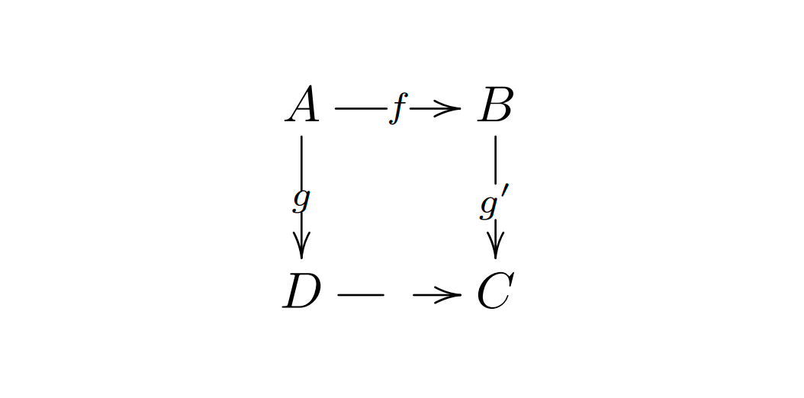
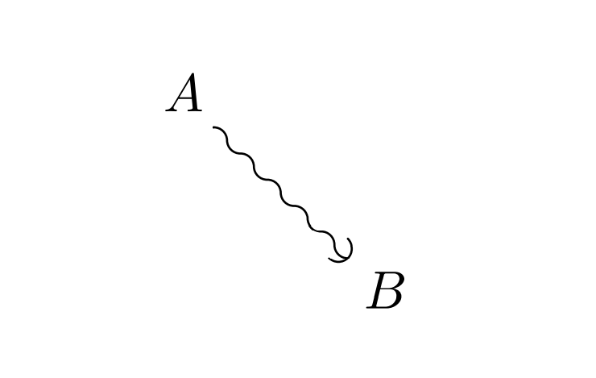
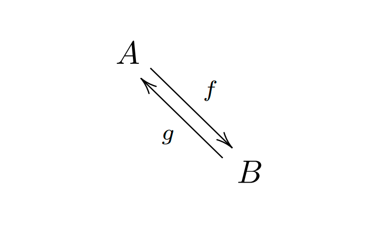

XY-pic 是绘制流程图的专用宏包。要想使用它，只需在导言区加上：

```latex
\usepackage[options]{xy}
```

- `[options]`：`options` 是列出需要载入的 `XY-pic` 的选项。这些选项基本上被用于调试这个宏包的使用。建议使用 `all`，可以让 LaTex 载入 XY 的所有命令。

`XY-pic` 中最常用的是基于矩阵的图形。它的矩阵语法如下：

```latex
\xymatrix{object}
```

- `{object}`：`object` 是矩阵的语法，和 `matrix` 环境类似，矩阵的内容将以数学模式排版。

如下是使用 `XY-pic` 绘制在画布上一个矩阵：

```latex
\begin{displaymath}
    \xymatrix{A & B \\
              C & D }
\end{displaymath}
```


命令 `\xymatrix` 必须置于数学模式中。上面的例子设定了一个两行两列的矩阵。只要使用命令 `\ar[direction]` 添加带方向的箭头即可，而箭头命令要放在其触发的那个单元里。`direction` 参量是箭头的方向（`u`：上，`d`：下，`r`：右 以及 `l`：左）。 

命令 `\xymatrix` 必须置于数学模式中。这里，我们设定了一个两行两列的矩阵。为了画出流程，我们只需要使用命令 `\ar` 增加带方向的箭头即可。

```latex
\begin{displaymath}
    \xymatrix{ 
        A \ar[r] & B \ar[d] \\
        D \ar[u] & C \ar[l] 
    }
\end{displaymath}
```


而对角线可以指向不同的方向参量。下面是一个指向同一个方向的箭头。

要画对角线，可以指出不只一个方向参量。实际上，你还可以重复同一个方向来得到更大的箭头。

```latex
\begin{displaymath}
    \xymatrix{
        A \ar[d] \ar[dr] \ar[drr] & B &&\\
        C \ar[r] & D \ar[u] & E \ar[r] & F \ar[ull] 
    }
\end{displaymath}
```


还可以给箭头加上标签，只需要使用普通的上标和下标即可。

```latex
\begin{displaymath}
    \xymatrix{
        A \ar[r]^f \ar[d]_g &
        B \ar[d]^{g’} \\
        D \ar[r]_{f’} & C 
    }
\end{displaymath}
```


如上图所示，使用上下标会给箭头添加标签。上标表示放在 “箭头的上方”，下标表示放在 “箭头的下方”。如果想把标签放在箭头上可以使用 `|`。如下所示：

```latex
\begin{displaymath}
    \xymatrix{
        A \ar[r]|f \ar[d]|g &
        B \ar[d]|{g’} \\
        D \ar[r]|\hole & C 
    }
\end{displaymath}
```



上面有一个命令，我们没有见到过，就是 `\ar[...]|\hole`。这是用来绘制空心箭头的。

下面给出不同类型的箭头。

```latex
\begin{displaymath}
    \xymatrix{
        A \ar@{->}[dr] \\
        & B
    }
\end{displaymath}
```


```latex
\begin{displaymath}
    \xymatrix{
        A \ar@{-->}[dr] \\
        & B
    }
\end{displaymath}
```


```latex
\begin{displaymath}
    \xymatrix{
        A \ar@{=>}[dr] \\
        & B
    }
\end{displaymath}
```


```latex
\begin{displaymath}
    \xymatrix{
        A \ar@{~)}[dr] \\
        & B
    }
\end{displaymath}
```



```latex
\begin{displaymath}
    \xymatrix{
        A \ar@{.>}[dr] \\
        & B
    }
\end{displaymath}
```


```latex
\begin{displaymath}
    \xymatrix{
        A \ar@{:>}[dr] \\
        & B
    }
\end{displaymath}
```


```latex
\begin{displaymath}
    \xymatrix{
        A \ar@{-}[dr] \\
        & B
    }
\end{displaymath}
```


```latex
\begin{displaymath}
    \xymatrix{
        A \ar@{|->>}[dr] \\
        & B
    }
\end{displaymath}
```


```latex
\begin{displaymath}
    \xymatrix{
        A \ar@{^(-_>}[dr] \\
        & B
    }
\end{displaymath}
```


```latex
\begin{displaymath}
    \xymatrix{
        A \ar@3{->}[dr] \\
        & B
    }
\end{displaymath}
```


```latex
\begin{displaymath}
    \xymatrix{
        A \ar@{=+}[dr] \\
        & B
    }
\end{displaymath}
```


```latex
\begin{displaymath}
    \xymatrix{
        A \ar@{}[dr] \\
        & B
    }
\end{displaymath}
```


从上面这些箭头样式来看，样式是由中间的连线和箭头的前后端点组成，中间的连线可以是直线、虚线、双线、波浪线、点线等样式组成。箭头也可以是尖角、圆角、平角等样式，或是通过上下标调整位置的样式。连线和箭头都可以为空，不同的样式可以组合成多种复杂的形式。

除了直接连线，`XY-pic` 也可以画出弯曲的箭头连线，其语法是：

```latex
\ar@/(曲线)/
```

- `(曲线)`：`曲线` 可以是 `^` 或 `_`，即沿箭头向左或向右弯曲。

下面给出例子。

```latex
\begin{displaymath}
    \xymatrix{
        A \ar@/^/[dr]^{\phi} \\
        & B \ar@/^/[ul]^{\psi}
    }
\end{displaymath}
```


更复杂的曲线可以用 `@((出),(入))` 指定曲线发出和射入的方向，如下所示，画出有向图的自环：

```latex
\begin{displaymath}
    \xymatrix{
        A \ar@{->}[dr] \\
        & B \ar@(ur, dr)
    }
\end{displaymath}
```


在箭头命令 `\ar` 后面加上 `@<(偏移量)>`可以画出向一侧平移的箭头，这特别适用于在两个对象之间画双箭头，例如：

```latex
\begin{displaymath}
    \xymatrix{
        A \ar@<.5ex>[dr]^f \\
        & B \ar@<.5ex>[ul]^g
    }
\end{displaymath}
```



在 `XY-pic` 中，不仅连线可以有多种样式，矩阵的元素和标签页可以有不同的样式。使用 `*` 可以引入带有修饰符的对象，其语法如下：

```latex
*(修饰){(文本)}
```

下面看例子。

```latex
\begin{displaymath}
    \xymatrix@=2cm{
        *[F]{A} \ar[r]^*+[F=]{k} & *=[o][F]{B}
    }
\end{displaymath}
```


其中 `[F]` 表示加框，`[F=]` 加双框，`[o]` 表示使用圆形框，`+` 表示增加对象与边框的间距；`XY-pic` 中常见的修饰符见下表。这里在 `\xymatrix` 后面用 `@=(距离)` 来设置相邻矩阵元素的间距。

|语法|说明|
|:---|:---|
|+|增加边距|
|+<(长度)>|增加指定（长度）的边距|
|+=|扩展边距到正方形，使水平与垂直边距相等|
|-|减少边距|
|-<(长度)>|减少指定（长度）的边距|
|-=|减少边距到正方形，使水平与垂直边距相等|
|!|不居中|
|[o]|设置边框为椭圆形|
|[l] [x] [u] [d]|左、右、上、下对齐|
|[F] [F=]|单线框、双线框|
|[F.] [F--]|点线框、虚线框|
|[F-,] [F-<3pt>]|阴影框 圆角矩形框|

之前 `XY-pic` 中的标签都是数学公式，使用 `\txt{...}` 命令则可以得到文字模式的 `XY-pic` 对象。使用 `\txt` 可以在内容中用 `\\` 换行，使用 `txt<(宽度)>` 可以让文字指定宽度自动换行，如下所示：

```latex
\begin{displaymath}
    \xymatrix{
        *++=[o][F]\txt{猫猫} \ar@{<->}[r] & 
        *+[F]\txt{狗\\狗}
    }
\end{displaymath}
```


这里组合使用了 `+`、`+=`、`[o]` 和 `[F]` 修饰符来画出比文字稍大的圆形边框。

命令 `\composite{... * ...}` 可以用来修饰把两个不同的 `Xy-pic` 对象重叠在一起组合成一个对象，例如：

```latex
\begin{displaymath}
    \xymatrix{
        *+[F]{\composite{*+[o][F]{a\quad} * *+[F]{\quad b}}} \ar[r]
        & *+[F]{c}
    }
\end{displaymath}
```


在 `\xymatrix` 命令后面也可以使用如下修饰符来调整矩阵元素的间距：

|修饰符|描述|
|:---|:---|
|@=(长度)|设置元素间距|
|@R=(长度)|设置行间距|
|@C=(长度)|设置列间距|
|@M=(长度)|设置元素的默认边距|
|@W=(长度)|设置元素的默认宽度|
|@H=(长度)|设置元素的默认高度|
|@L=(长度)|设置标签的边距|

其中的等号 `=` 还可以替换为 `+`、`+=`、`-` 和 `-=`，其意义与上述`Xy-pic`修饰符表一致，例如：

```latex
\begin{displaymath}
    \xymatrix@R=2ex{
        A \ar[drr] & B & C \\
        D & E & F
    }
\end{displaymath}
```


在 `\xymatrix` 后面直接加上 u，d，ul，ur 等方向，则表示将矩阵的连线按此方向旋转，使原来向右的方向指向给定的坐标方向，例如：

```latex
\begin{displaymath}
    \xymatrix@ru{
        A \ar[r] & B \ar[d] \\
        C \ar[u] & D \ar[l]
    }
\end{displaymath}
```


这里就介绍到这里，如需了解更多用法，就需要参见宏包的官方指南。