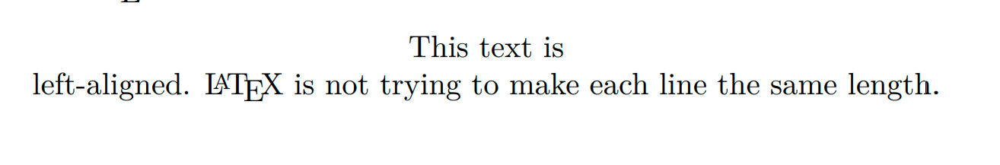

## 标题

$LaTeX$ 提供一组命令用于生成论文的标题、作者以及发表日期等信息。

```latex
\title{标题}    用于设置论文标题的命令
\author{作者}    用于设置论文作者的命令
\and            论文中有多个作者，用在 \author 中分隔并列
\thanks{脚注}    可用在 \title 或 \author 中，可在底部生成脚注，脚注的内容可以是对标题的说明、作者的介绍或是对某人表示感谢等
\today          自动生成当天日期
\date{日期}      设置论文发表的日期
\maketitle      自动生成论文的标题等相关信息。须置于上述各种命令之后，没有该命令，上述命令都无法生效
```

声明的标题、作者等命令中可以使用 `\\` 进行换行。

```latex
\documentclass{article}
\title{A Sample Thesis Article \\ Subheading}
\author{E. Simple\thanks{Doctor} \and T. Elliott}
\date{2022.2.27}
\begin{document}
\maketitle
This is a \LaTeXe{} sample case.
\end{document}
```


要是将标题格式单独成页，可以在 `titlepage` 环境中排版。`titlepage` 环境提供没有页码的单独一页，并使后面的内容页码从 1 开始计数。

```latex
\begin{titlepage}
    \vspace*{10mm}
    \begin{center}
        {\Huge A Sample Thesis Article}\\[30mm]
        {\Large E. Simple\footnote{Doctor}}\\[5mm]
        {\Large T. Elliott}\\[5mm]
        2022.2.27
    \end{center}
\end{titlepage}
```


## 摘要

一般编写的论文，在正文之前都会要求有摘要，摘要一般是对正文的简单概述。$LaTeX$ 中的 `report` 和 `article` 都提供了 `abstract` 摘要环境。

```latex
\begin{abstract}
...
\end{abstract}
```

这样生成的摘要标题是 `Abstract`，可以使用如下命令重定义摘要标题：

```latex
\renewcommand{\abstractname}{Redefine}
```

例子如下：

```latex
\documentclass{article}
\title{A Sample Thesis Article \\ Subheading}
\author{E. Simple\thanks{Doctor} \and T. Elliott}
\date{2022.2.27}
\begin{document}
\maketitle  
\renewcommand{\abstractname}{Redefine}
\begin{abstract}
    This is a brief summary.
\end{abstract}
\end{document}
```

如下效果：


## 章节

$LaTeX$ 划分了章节层次。如下所示：

```latex
%命令                   层级           说明
\part{...}             %Level -1      部分。想把文档分成几个部分而且不影响章节编号
\chapter{....}         %Level 0       章。使用 report 或者 book 类的时候，使用的最高命令
\section{...}          %Level 1       节
\subsection{...}       %Level 2       小节
\subsubsection{...}    %Level 3       小小节。默认不编号、不编目录
\paragraph{...}        %Level 4       段。默认不编号、不编目录
\subparagraph{...}     %Level 5       小段。默认不编号、不编目录
```

`article` 中没有 `chapter`，而 `report` 和 `book` 则支持所有层次。章节的序号和标题的字号由 $LaTeX$ 自动设置。

```latex
\begin{document}
\part{Part 1}
Part One Content.
\section{Some Interesting Words}
This is a \LaTeXe{} sample case.
\subsection{Ok, The is Subsection}
This is a \LaTeX Subsection Content.
\section{Good Bye World}
\ldots{} and here it ends.
\end{document}
```


其中 `\appendix` 命令用来表示附录部分的开始。命令 `\appendix` 后面的所有章节都将改用字母进行编号。

```latex
\appendix
\section{Sample A}
\subsection{Sample aaa}
\section{Sample B}
```


可以使用带星号的章节（如 `\chapter*`）命令表示不编号、不编目的章节。

对于 `book` 风格的文档。可以使用如下命令来改变章节的标题和页码：

- `\frontmatter`：紧挨着命令 `\begin{document}` 使用。它把页码更换为罗马数字，并关闭`\chapter`的编号。
- `\mainmatter`：会将页码按阿拉伯数字编号。
- `\backmatter`：应该插入与书中最后一部分内容的前面，如参考文献和索引。在标准文档类型中，它对页面没有什么效果。

## 目录

当设置完章节后，$LaTeX$ 提供 `\tableofcontents` 命令，提取所定义的各章节标题和页码以生成目录。

```latex
\begin{document}
\tableofcontents
\part{Part 1}
Part One Content.
\section{Some Interesting Words}
This is a \LaTeXe{} sample case.
\subsection{Ok, The is Subsection}
This is a \LaTeX Subsection Content.
\section{Good Bye World}
\ldots{} and here it ends.
\end{document}
```


目录出现的标题，一般与输入的文本完全一致。有时这是不可能的，因为标题太长排不进目录。在这种情况下，目录的条目可由实际标题前的可选参量确定。

命令 `\listoffigures` 和 `\listoftables` 则会收集在 `figure` 环境和 `table` 环境中 `\caption` 命令的图表标题，产生图表的目录，其格式与章节目录类似。

## 脚注

$LaTeX$ 中提供如下命令产生脚注。

```latex
\footnote[seq]{text}
```

- `seq`：设置序号值。通常不使用，会自动生成序号值。
- `text`：脚注内容。

脚注显示在当前页底部，且将脚注命令置于指向的单词或句子的后面。

```latex
This is a \LaTeX Subsection\footnote{This is a footnote.} Content.
```


也可以使用如下命令修改脚注的编号。

```latex
This is a \LaTeX Subsection\renewcommand{\thefootnote}{\Alph{footnote}}\footnote{This is a footnote.} Content.
```


或者将命令写在 `\begin{document}` 之前也可以。

```latex
\documentclass{article}
\renewcommand{\thefootnote}{\textcircled{\arabic{footnote}}}
\begin{document}
...
\end{document}
```


## 边注

$LaTeX$ 提供了边注的命令。

```latex
\marginpar{content}
```

- `content`：显示在页边的内容。

与脚注使用方法差不多，只是不编号。

单面模式 `onecolumn` 下，边注在页面的右侧；双肩模式 `towcolumn` 下，边注在页面的外侧。

```latex
This is a \LaTeXe{} sample\marginpar{marginal note} case.
```


可以使用命令 `\reversemarginpar` 改变边注的左右位置，或者用命令 `\normalmarginpar` 复原边注的左右位置。

## 注释

$LaTeX$ 提供 `%` 来标明注释，但也可以使用 `verbatim` 宏包的 `comment` 环境。

```latex
\begin{comment}
...
\end{comment}
```

## 段落对齐

$LaTeX$ 提供三个环境让段落分别左对齐、右对齐或居中对齐。

对如下文本使用段落对齐功能。

```latex
This text is\\ left-aligned.
        \LaTeX{} is not trying to make
        each line the same length.
```

左对齐使用 `flushleft` 环境：

```latex
\begin{flushleft}
...
\end{flushleft}
```


右对齐使用 `flushright` 环境：

```latex
\begin{flushright}
...
\end{flushright}
```


居中对齐使用 `center` 环境：

```latex
\begin{center}
...
\end{center}
```



如果不输入命令 `\\` 指定断行点，$LaTeX$ 将自行决定。

## 列表

$LaTeX$ 提供了三种列表环境：`itemize`无序列表、`enumerate`有序列表和 `description` 描述列表。

使用 `itemize` 环境实现无序列表。

```latex
\begin{itemize}
    \item C
    \item C++
    \item[-] Java
\end{itemize}
```


`\item[flag]` 可以通过修改 `flag`来修改无序列表中的标志 。

使用 `enumerate` 环境实现有序列表。

```latex
\begin{enumerate}
    \item C
    \item C++
    \item Java
\end{enumerate}
```


使用 `description` 环境实现描述列表。

```latex
\begin{description}
    \item[C] Process oriented compiler language.
    \item[C++] Object oriented compiler language.
    \item[Java] A programming language with both compilation and interpretation.
\end{description}
```


## 交叉引用

交叉引用是通过一个符号标签引用文档中某个对象的编号、页码或章节等信息，而不必知道在什么地方。交叉引用主要用如下三种命令。

```latex
\label{marker}
\ref{marker}
\pageref{marker}
```

- `marker`：用户选择的标识符。

下面给出实际效果

```latex
This is a \LaTeX{} Section\label{sec:this} Content. \\
The rest of the content. \\
Cross reference \pageref{sec:this} page \ref{sec:this} section.
```


## 摘录

`quote` 环境用于摘录。

```latex
A typographical rule of thumb
for the line length is:
\begin{quote}
On average, no line should
be longer than 66 characters.
\end{quote}
This is why \LaTeX{} pages have
such large borders by default
and also why multicolumn print
is used in newspapers.
```


`quotation` 环境也可用于摘录，它在 `quote` 基础上增加了首行缩进。


`verse` 环境比 `quote` 多了第二行起的缩进。主要用于诗歌等。

## 原文打印

位于 `\begin{verbatim}` 和 `\end{verbatim}` 之间的文本将直接打印，包括所有的断行和空白，就像在打字机上键入一样，不执行任何 $LaTeX$ 命令。带星号版本可以打印出空格。

```latex
\begin{verbatim}
    the started version of 
    the       verbatim
    environment emphasizes
    the spaces    in the text
\end{verbatim}
\begin{verbatim*}
    the started version of 
    the       verbatim
    environment emphasizes
    the spaces    in the text
\end{verbatim*}
```

