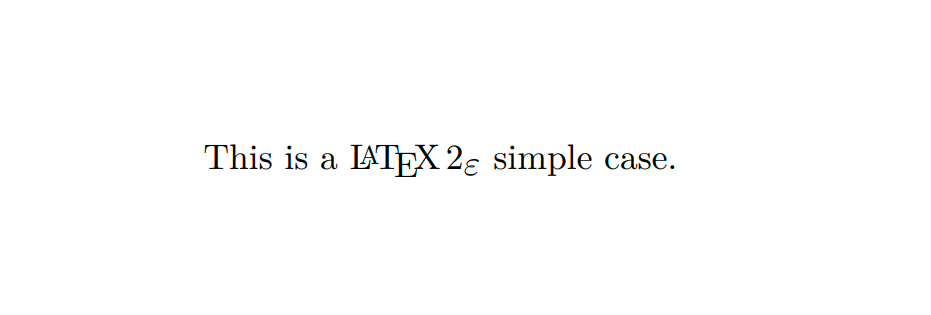

LaTex处理源文件时，希望文件遵从一定的结构。下面给出一个简单的小例子。

```latex
\documentclass[a4paper, 11pt]{article}
\begin{document}
This is a \LaTeXe{} simple case.
\end{document}
```

效果如下：



## 文档类

当 LaTex 处理源文件时，需要知道作者所要创建的文档类型。上面的例子使用 `\documentclass{article}`来指定文档类型。语法如下：

```latex
\documentclass[options]{class}
```

- `options`：该参数用于定制文档类的属性。不同的选项之间须用逗号隔开。
- `class`：该参数指定想要的文档类型。

下表列出 `options` 常用选项。

|选项|描述|
|:---:|:---:|
|10pt，11pt，12pt|设置文档中所使用的字体的大小。如果该项没有指定，默认使用10pt字体|
|a4paper，letterpaper，···|定义纸张的尺寸。缺省设置为letterpaper。此外，还可以使用a5paper，b5paper，executivepaper以及legalpaper|
|fleqn|设置行间公式为左对齐，而不是居中对齐|
|leqno|设置行间公式的编号为左对齐，而不是右对齐|
|titlepage，notitlepage|指定是否在文档标题(document title)后另起一页。article文档类缺省设置为不开始新页，report和book类则相反|
|onecolumn，twocolumn|LaTex以单栏(one column)或双栏(two column)的方式来排版文档|
|twoside，oneside|指定文档为双面或单面打印格式。article和report类为单页(single sided)格式，book类缺省为双面(double sided)格式。注意该选项只是作用于文档样式，而不会通知打印机以双面格式打印文档|
|landscape|将文档的打印输出布局设置为landscape模式|
|openright，openany|决定新的一章仅在奇数页开始还是在下一页开始。在文档类型为article时该选项不起作用，因为该类中没有定义“章”(chapter)。report类默认在下一页开始新一章而book类的新一章总是在奇数页开始|

下表列出 `class` 指定的文档类型。

|类型|描述|
|:---:|:---:|
|article|排版科学期刊、演示文档、短报告、程序文档、邀请函等|
|proc|一个基于 article 的会议文集类|
|minimal|非常小的文档类。只设置了页面尺寸和基本字体。主要用来查错|
|report|排版多章节长报告、短篇书籍、博士论文等|
|book|排版书籍|
|slides|排版幻灯片。其中使用了大号sans serif字体。也可以选用 FoilTex 来得到相同的效果|

## 宏包

在排版文档时，会发现基本的 LaTex 并不能解决你的问题。因此，就需要宏包扩展或新增某种排版功能。在 LaTex 调用宏包的命令如下所示：

```latex
\usepackage[options]{package}
```

- `options`：激活宏包特殊功能的可选参数，多个子参数时用逗号分隔。
- `package`：宏包的名称，不区分大小写。

下面在列出一些 `package` 指定的常用宏包。

|宏包|描述|宏包|描述|
|:---:|:---:|:---:|:---:|
|amsmath|多种公式环境和数学命令|graphicx|插图处理|
|amssymb|数学符号生成命令|hyperref|创建超文本链接和PDF书签|
|array|数组和表格制作|ifthen|条件判断|
|booktabs|绘制水平表格线|longtable|制作跨页表格|
|calc|四则运算|multicol|多栏排版|
|caption|插图和表格标题格式设置|ntheorem|定理设置|
|ctex|中文字体|paralist|多种列表环境|
|ctexcap|中文字体和标题|tabularx|自动设置表格的列宽|
|fancyhdr|页眉页脚设置|titlesec|章节标题格式设置|
|fancyvrb|抄录格式设置|titletoc|目录格式设置|
|geometry|版面尺寸设置|xcolor|颜色处理|

## 正文

LaTex 源文件分为导言和正文两部分。从 `\documentclass`开始，一直到 `\begin{document}` 命令之前都是导言部分。

在 `\begin{document}` 与 `\end{document}` 两个命令之间的所有命令语句和文本统称为正文，视为文档的主体部分。命令如下所示：

```latex
\begin{document}
···正文···
\end{document}
```

`\end{document}` 之后的任何字符，LaTex都将忽略。

## 页面样式

LaTex 支持三种预定义的页眉/页脚(header/footer) 样式，称为页面样式(page style)。命令如下所示：

```latex
\pagestyle{style}
```

- `style`：确定使用哪一种页面样式。

中的 style 参数确定了使用哪一种页面样式。下表列出了预定义的页面样式。

|样式|描述|
|:---:|:---:|
|plain|在页脚正中显示页码。这是页面样式的缺省设置|
|beadings|在页眉中显示章节名及页码，页脚空白|
|empty|将页眉页脚都设为空白|

想要改变当前页面的页面样式，使用如下命令：

```latex
\thispagestyle{style}
```

## 各类文件

下面解释在使用 LaTex 时可能遇到的文件类型。

- `.tex`：Latex 或 Tex 源文件。可以使用 latex 命令编译。
- `.sty`：LaTex 宏包文件。可以使用 `\usepackage` 命令将宏包文件下载到你的 LaTex 文档中。
- `.dtx`：文档化 Tex 文件。这是 LaTex 宏包文件的主要发布格式。如果编译 `.dtx` 文档，将会得到其中包含的 LaTex 宏包文件的文档化宏代码。
- `.ins` 对应 `.dtx` 文件的安装文件。如果从网上下载一个 LaTex 的宏包文件，其中一般会包含一个 `.dtx` 文件和一个 `.ins` 文件。使用 LaTex 处理 `.ins` 文件可以解开 `.dtx` 文件。
- `.cls`：定义文档外观形式的类文件，可以通过使用 `\documentclass` 命令选取。
- `.fd`：字体描述文件，可以告诉 LaTex 有关新字体的信息。

下面是使用 LaTex 处理源文件时产生的文件类型。

- `.dvi`：设备无关文件。这是运行 LaTex 编译的主要结果。你可以使用 SVI 预览器预览器内容或使用 `dvips` 或其他程序输出到打印机。
- `.log`：记录了上次编译时的详细信息。
- `.toc`：存储了所有的章节标题。下次编译时将读取该文件并生成目录。
- `.lof`：和 `.toc` 文件类似，可生成图形目录。
- `.lot`：和 `.toc` 文件类似，可生成表格目录。
- `.aux`：用来向下次编译传递信息的辅助文件。主要存储交叉引用的相关信息。
- `.idx`：如果文档中包含索引，LaTex 将使用该文件存储所有的索引词条。
- `.ind`：处理过的 `.idx` 文件。下次编译时将读入到你的文档中。
- `.ilg`：和 `.log` 文件类似，记录了 `makeindex` 命令运行的详细信息。

# 参考资料

- 一份不太简短的LATEX2介绍 - Tobias Oetiker
- LaTex 完全学习手册 - 胡伟