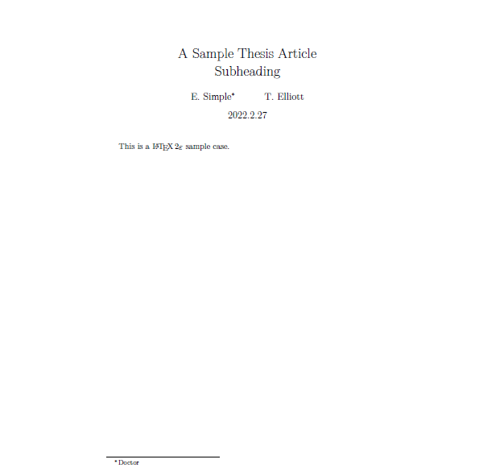

## 标题

$LaTeX$ 提供一组命令用于生成论文的标题、作者以及发表日期等信息。

```latex
\title{标题}    用于设置论文标题的命令
\author{作者}    用于设置论文作者的命令
\and            论文中有多个作者，用在 \author 中分隔并列
\thanks{脚注}    可用在 \title 或 \author 中，可在底部生成脚注，脚注的内容可以是对标题的说明、作者的介绍或是对某人表示感谢等
\today          自动生成当天日期
\date{日期}      设置论文发表的日期
\maketitle      自动生成论文的标题等相关信息。须置于上述各种命令之后，没有该命令，上述命令都无法生效
```

声明的标题、作者等命令中可以使用 `\\` 进行换行。

```latex
\documentclass{article}
\title{A Sample Thesis Article \\ Subheading}
\author{E. Simple\thanks{Doctor} \and T. Elliott}
\date{2022.2.27}
\begin{document}
\maketitle
This is a \LaTeXe{} sample case.
\end{document}
```




要是将标题格式单独成页，可以在 `titlepage` 环境中排版。`titlepage` 环境提供没有页码的单独一页

## 断行和分页

### 对齐段落

通常书籍是用等长的行来排版的。为了优化整个段落的内容，$\LaTeX$ 在单词之间插入必要的断行点和间隙。如果一行的单词排不下，$LaTeX$ 也会进行必要的断词。段落如何排版依赖于文档类别。通常，每一段的第一行有缩进，在两段之间没有额外的间隙。

有特殊情形下，有必要命令 $LaTeX$ 断行

```latex
\\ or \newline
```

另起一行，而不另起一段。

```latex
\\*
```

在强制断行后，还禁止分页。

```latex
\newpage
```

另起一行。

```latex
\linebreak[n], \nolinebreak[n], \pagebreak[n], \nopagebreak[n]
```

上述命令的效果可以从它们的名字看出来。通过可选参量 n，作者可以影响这些命令的效果。n 可以取为 0 和 4 之间的数。如果命令的效果看起来非常差，把 n 取为小于 4 的数，可以让 $LaTeX$ 在排版效果不佳的时候选择忽略这个命令。不要把 “break” 命令与 “new” 命令混淆。即使你给出了 “break” 命令，$LaTeX$ 仍然视图对齐页面的右边界。如果你真想另起一行，就使用相应的命令。猜猜该是什么命令。

$LaTeX$ 总是尽可能产生最好的断行效果。如果断行无法达到 $LaTeX$ 的高标准，就让这一行在段落的右侧溢出。然后在处理源文件的同时，报告溢出的消息。这最有可能发生在 $LaTeX$ 找不到合适的地方断词的时候。你可以使用 `\sloppy` 命令，告诉 $LaTeX$ 降低一点儿标准。它通过增加单词之间的间隔，以防止出现过长的行，虽然最终的输出结果不是最优的。在这种情况下给出警告。在大多数情况下得到的结果看起来不会非常好。`\fussy` 命令把 $LaTeX$ 恢复为缺省状态。

### 断词

必要时 $LaTeX$ 就会断词。如果断词算法不能确定正确的断词点，可以使用如下命令告诉 $TeX$ 如何弥补这个缺憾。

```latex
\hyphenation{word list}
```

使列于参量的单词仅在注有 `-` 的地方断词。命令的参量仅由正常字母构成的单词，或由 $LaTeX$ 视为正常字母的符号组成。当断词命令出现时，根据正在使用的语言，断词的提示就已经被存放好待选了。这意味着如果你在文档导言中设置了断词命令，它将影响英文的断词。如果断词命令置于 `\begin{document}` 后面，而且你正使用比方 `babel` 的国际语言支持宏包，那么断词提示在由 `babel` 激活的语言中就处于活动状态。

下面的例子允许对 `hyphenation` 和 `Hyphenation` 进行断词，却根本不允许 `FORTRAN`，`Fortran` 和 `fortran` 进行断词。在参量中不允许出现特殊的字符和符号。

例子：

```latex
\hyphenation{FORTRAN Hy-phen-a-tion}
```

命令 `\-` 在单词中插入一个自主的断词点。它也就成为这个单词中允许出现的唯一断词点。对于包含特殊字符的单词，这个命令是特别有用的，因为对于他们，$LaTeX$ 不会自动断词。

命令

```latex
\mbox{text}
```

保证把几个单词排在同一行上。在任何情况下， 这个命令把它的参量排在一起。

命令 `\fbox` 和 `\mbox` 类似，此外它还能围绕内容画一个框。

## 特殊字符和符号

### 引号

在 $LaTeX$ 中，用两个`（重音）产生左引号，用两个'（直立引号）产生右引号。一个‘和’产生一个单引号。

### 破折号和连字号

$LaTeX$ 中有四种短划（dash）标点符号。连续用不同数目的短划，可以得到其中的三种。第四种实际不是标点符号，它是数学中的减号：

这些短划线：`-`连字号，`-`短破折号，`——`长破折号和 `-`减号。

### 波浪号(~)

波浪号经常和网址用在一起。它在 $LaTeX$中，可用 `\~` 产生，但其结果：~却不是你真正想要的。试一下这个：

```latex
http://www.rich.edu/\~{}bush \\
http://www.clever.edu/$\sim$demo
```

### 度的符号(o)

下面的例子演示了在 $LaTeX$中如何排版度的符号：

```latex
It's $-30\,^{\circ}\mathrm{C}$. I will soon start to super-conduct.
```

textcomp 宏包里有另外一个度的符号 $\textcelsius$。

### 欧元符号

现在撰写有关货币的文章，通常需要欧元符号。现有的许多字体都包含它。在你的导言区载入 textcomp 宏包：

```latex
\usepackage{textcomp}
```

你就可以使用命令

```latex
\texteuro
```

来生成欧元符号。

如果你的字体不提供或者你不喜欢它给出的欧元符号，还有两个选择：

首先是 eurosym 宏包。它提供了官方的欧元符号：

```latex
\usepackage[official]{eurosym}
```

如果你希望得到跟所用字体匹配的欧元符号，使用选项 gen 替换 official 。

marvosym 宏包也提供了许多符号，包括一个名为 `\EURtm` 的欧元符号。它的缺点是没有提供欧元符号的斜体和粗体变形。

### 省略号

在打印机上，逗号或句号占据的空间和其它字母符号相等。在书籍印刷中，这些字符仅占据一点儿空间，并且与前一个字母贴的非常紧。所以不能只键入三个点来输出 “省略号”，因为间隔划分得不对。有一个专门的命令输出省略号。它被称为

```latex
\ldots
```

### 连字

一些字母组合不是简单键入一个个字母得到得的，而实际上用到了一些特殊符号。

这就是所谓的连字，在两个字母之间插入一个 `\mbox{}` ，可以禁止连字。对于由两个词构成的单词，这可能是必要的。

```latex
Not shelfful \\
but shelf\mbox{}ful
```

### 注音符号和特殊字符

$LaTeX$ 支持来自许多语言中的注音符号和特殊字符。下表就字母 o 列出了所有的注音符号。对于其他字母也自然有效。

在字母 i 和 j 上标一个注音符号，它的点儿必须去掉。这个可由 `\i` 和 `\j` 做到。

## 强调

如果文本是用于打字机键入的，用下划线来强调重要的单词。

```latex
\underline{text}
```

但是在印刷的书中，用一种斜体字体排印要强调的单词。$LaTeX$提供命令

```latex
\emph{text}
```

来强调文本。这些命令对其参量的实际作用效果依赖于它的上下文：

请注意要求 $LaTeX$ 强调什么和要求它使用不同字体的不同效果：

## 环境

为了排版专用的文本，$LaTeX$ 定义了各种不同格式的环境：

```latex
\begin{environment} text \end{environment}
```

其中 environment 是环境的名称。只要保持调用顺序，环境可以嵌套。

```latex
\begin{aaa}...\begin{bbb}...\end{bbb}...\end{aaa}
```

下面的章节对所有重要的环境都做了解释。

### 引用、语录和韵文

quote 环境可以用于引文、语录和例子。

```latex
A typographical rule of thumb
for the line length is:
\begin{quote}
On average, no line should
be longer than 66 characters.
\end{quote}
This is why \LaTeX{} pages have
such large borders by default
and also why multicolumn print
is used in newspapers.
```

有两个类似的环境：quotation 和 verse 环境。quotation 环境用于超过几段的较长引用，因为它对段落进行缩进。verse 环境用于诗歌，在诗歌中断行很重要。在一行的末尾用 `\\` 断行，在每一段后留一空行。

```latex
I know only one English poem by
heart. It is about Humpty Dumpty.
\begin{flushleft}
\begin{verse}
Humpty Dumpty sat on a wall:\\
Humpty Dumpty had a great fall.\\
All the King’s horses and all
the King’s men\\
Couldn’t put Humpty together
again.
\end{verse}
\end{flushleft}
```

### 原文打印

位于 `\begin{verbatim}` 和 `\end{verbatim}` 之间的文本将直接打印，包括所有的断行和空白，就像在打字机上键入一样，不执行任何 $LaTeX$ 命令。

在一个段落中，类似的功能可由

```latex
\verb+text+
```

完成。+ 仅是分隔符的一个例子。除了 * 或空格，可以使用任意一个字符。这个小册子中的许多例子是用这个命令排印的。

```latex
The \verb|\ldots| command \ldots
\begin{verbatim}
10 PRINT ”HELLO WORLD ”;
20 GOTO 10
\end{verbatim}
```

```latex
\begin{verbatim*}
the starred version of
the verbatim
environment emphasizes
the spaces in the text
\end{verbatim*}
```

带星的命令 `\verb` 能以类似的方式使用：

```latex
\verb*|like this :-) |
```

verbatim 环境和 `\verb` 命令不能在其他命令的参数中使用。

### 表格

tabular 环境能用来排版带有水平和垂直表线的漂亮表格。$LaTeX$ 自动确定每一列的宽度。命令：

```latex
\begin{tabular}[pos]{table spec}
```

的参量 table spec 定义了表格的格式。用一个 `1` 产生左对齐的列，用一个 `r` 产生右对齐的列，用一个 `c` 产生居中的列；用 `p{width}` 产生相应宽度	、包含自动断行文本的列；`|` 产生垂直表线。

如果一列里的文本太宽，$LaTeX$ 不会自动折行显示。使用字母 `t`、`b` 和 `c` 来设定表格靠上、靠下或者居中放置。

在 tabular 环境中，用 `&` 跳入下一列，用 `\\` 开始新的一行，用 `\hline` 插入水平表线、用 `\cline{j-i}` 可添加部分表线，其中 j 和 i 分别表示表线的起始列和终止列的序号。

```latex
\begin{tabular}{|r|l|}
\hline
7C0 & hexadecimal \\
3700 & octal \\ \cline{2-2}
11111000000 & binary \\
\hline \hline
1984 & decimal \\
\hline
\end{tabular}
```

```latex
\begin{tabular}{|p{4.7cm}|}
\hline
Welcome to Boxy’s paragraph.
We sincerely hope you’ll
all enjoy the show.\\
\hline
\end{tabular}
```

表格的列分隔符可由 `@{...}` 构造。这个命令去掉表列之间的间隔，代之为两个花括号间的内容。一个用途在于下面要解释的十进制数对对齐问题。另一个可能应用在于用 `@{}` 压缩表列右端空间。

```latex
\begin{tabular}{@{} l @{}}
\hline
no leading space\\
\hline
\end{tabular}
```

```latex
\begin{tabular}{l}
\hline
leading space left and right\\
\hline
\end{tabular}
```

由于没有内建机制使十进制按小数点对齐，我们可以使用两列 “作弊” 达到这个目的：整数向右，小数向左对其。`\begin{tabular}` 行中的命令 `@{.}` 用一个 `.` 取代了列间正常间隔，从而给出了按小数点列对齐的效果。不要忘记用列分隔符(&)取代十进制小数点！使用命令 `\multicolumn` 可在数值 “列” 上防止一个列标签。

```latex
\begin{tabular}{c r @{.} l}
Pi expression &
\multicolumn{2}{c}{Value} \\
\hline
$\pi$ & 3&1416 \\
$\pi^{\pi}$ & 36&46 \\
$(\pi^{\pi})^{\pi}$ & 80662&7 \\
\end{tabular}
```

```latex
\begin{tabular}{|c|c|}
\hline
\multicolumn{2}{|c|}{Ene} \\
\hline
Mene & Muh! \\
\hline
\end{tabular}
```

用表格环境排印的材料总是呆在同一页上。如果要排印一个长表格，可以看一下 supertabular 和 longtabular 环境。

## 浮动体

对于在当前排不下的任何一个图片或表格，其解决办法是把它们 “浮动” 到下一页，与此同时当前页面用正文文本填充。$LaTeX$提供了两个浮动体环境：一个用于图片，一个用于表格。要充分发挥这两个环境的优越性，应该大致了解 $LaTeX$ 处理浮动体的内在原理。但是浮动可能成为令人沮上的主要原因，因为 $LaTeX$ 总不把浮动体放在你想要的位置。

首先看一下供浮动使用的 $LaTeX$ 命令：

包含在 figure 环境或 table 环境中的任何材料都将被视为浮动内容。两个浮动环境都支持可选参数。

```latex
\begin{figure}[placement specifier] 或 \begin{table}[...]
```

称为 placement specifier，它由浮动许可放置参数写成的字符串组成。这个参数用于告诉 $LaTeX$ 浮动体可以被移动的位置。一个 placement specifier 由一串浮动体许可防止位置构成。

|Spec|浮动体许可放置位置|
|:---:|:---:|
|h|here在文本的确切位置上，对于小的浮动体很有用|
|t|在页面的顶部（top）|
|b|在页面的底部（bottom）|
|p|在一个只有浮动体的专门的页面上|
|!|忽略阻止浮动体放置的大多数内部参数|

一个表格可以由如下命令，例如：

```latex
\begin{table}[!hbp]
```

开始，placement specifier [!hbp] 允许 $LaTeX$ 把表格就放当前页，或放在某页的底部(b)，或放在一个专门的浮动页上(p)，严格按照放置说明符放置即使看起来不好(!)。如果没有给定放置说明符，缺省值为[tbp]。

$LaTeX$ 将按照作者提供的 placement specifier，安排它遇到的每一个浮动体。如果浮动体在当前页不能安排，就把它寄存在图片或表格等待队列中。当新的一页开始的时候，$LaTeX$ 首先检查是否可能用等待队列中的浮动体一样，处理等待队列中的第一个浮动体：$LaTeX$ 重新尝试按照其相应的放置说明符（除了不再可能的 'h'）来处理它。文本中出现的任何一个新浮动体寄存在相应的等待队列中。对于每一种浮动体，$LaTeX$ 保持它们出现的顺序。这就说明了为什么一个不能安排的图片把所有后来的图片都推导文档末尾的原因。所以：

如果 $LaTeX$ 没有像你期待的那样安排浮动体，那么经常是仅有一个浮动体堵塞了两个等待队列中的某一个。

仅给定单个 placement specifiers 是允许的，但这会引起问题。如果在指定的位置安排不了，它就会成为障碍，堵住后续的浮动体。不要单独时候用参数[h]，在 $LaTeX$ 最近的版本中，它的效果太差了以至于被 [ht] 自动替换。

虽然对浮动体问题已经做了说明，对table 和 figure 环境还有内容要交代。使用

```latex
\caption{caption text}
```

命令，可以给浮动体定义一个标题。序号和字符串 “图” 或 “表” 将由 $LaTeX$ 自动添加。

两个命令

```latex
\listoffigures 和 \listofitables
```

用起来和 `\tableofcontents` 命令类似，分别排版一个图形目录和表格目录。在这些目录中，所有的标题都将重复。如果打算使用长标题，就必须准备一个能放进目录的，较短版本的标题。即在 `\caption` 命令后面的括号内输入较短版本的标题。

```latex
\caption[Short]{LLLLLoooooonnnnnnggggg}
```

利用 `\label` 和 `\ref`，在文本中可以为浮动体创建交叉引用。

下面的例子画一个方形，并将它插入文档。如果想在完成的文档中为你打算嵌入的图片保留空间，你可以利用这个例子。

```latex
Figure \ref{white} is an example of Pop-Art.
\begin{figure}[!hbp]
\makebox[\textwidth]{\framebox[5cm]{\rule{0pt}{5cm}}}
\caption{Five by Five in Centimetres.\label{white}}
\end{figure}
```

在上面的例子中，为了把图片就放在当前位置(h)，$LaTeX$ 尝试得很辛苦(!)。如果这不可能，它将试图把图片安排在页面的底部(b)。如果不能将图片安排在当前页面，它将决定是否可能开一个浮动页面以放置这张图片或来自表格等待队列中的一些表格。如果没有足够的材料来填充一个专门浮动页面，$LaTeX$就开一个新页，像对文本中刚出现的图片一样，再一次处理这个图片。

在一些情况下，可能需要使用命令

```latex
\clearpage 或者甚至是 \cleardoublepage
```

它命令 $LaTeX$ 立即放置等待队列中所有剩下的浮动体，并且开一新页。命令 `\cleardoublepage` 甚至会命令 $LaTeX$ 新开奇数页面。

## 保护脆弱命令

作为命令（如 `\caption` 或 `\section`）参量的文本，可能在文档中出现多次（例如，在文档的目录和正文中）。当用于类似 `\section` 的参量时，一些命令会失效。它们被称为脆弱命令（fragile commands）。`\footnote` 或 `\phantom` 是脆弱命令的例子。这些脆弱命令需要的，正是保护。把 `\protect` 命令放在它们前面，就能保护它们。

`\protect` 仅仅保护紧跟其右侧的命令，连它的参量也不惠及。在大多数情形下，过多的 `\protect` 并不碍事。

```latex
\section{I am considerate
\protect\footnote{and protect my footnotes}}
```