在 LaTex 中，可以直接使用 `picture` 环境绘制图形。但这种方法具有局限性，比如线段的斜率和圆的半径只能在一个很小的范围内取值。`picture` 环境提供了 `\qbezier` 命令，`"q"` 表示 `"quadratic"`。许多常用的曲线如圆、椭圆、或者悬链线都可以用二次 Bezier 曲线得到令人满意的近似，虽然这可能需要一些辛苦的数学准备。

虽然在 LaTex 里绘图有局限性而且比较繁琐，但绘图而不插入额外的图片，会使得生成的文档体积较小，比较实用。

如果想要在 LaTex 中使用 `picture` 环境来绘制一些简单的图形，就需要知道它的语法，如下所示：

```latex
\begin{picture}(x,y)...\end{picture}
% 或者
\begin{picture}(x,y)(x0,y0)...\end{picture}
```

- `(x, y)` ：在文档中图形保留一个矩阵的区域。
- `(x0, y0)` ：可选参数，为矩形左下角指派任意的坐标。相对于 `\unitlength` 而言，任何时候（除了在`picture`环境之内以外），都可以使用命令 `\setlength{\unitlength}{1.2cm}` 来改变。

大多数的绘图命令是下面两种格式之一

```latex
\put(x,y){object}
% 或者
\multiput(x,y)(△x,△y){n}{object}
```

- `(x, y)`：起始点。
- `(△x,△y)`：从一个对象到下一个的平移向量。
- `{n}`：`n` 为对象的数目。
- `{object}`：`object` 为要绘制的对象。

控制绘制图像的线宽的两类命令如下所示：

- `\linethickness{length}`：仅对水平和垂直直线及二次 `Bézier` 曲线有作用。
- `\thinlines` 与 `\thicklines`：可以作用于倾斜的线段、圆和椭圆。`\thinlines` 让线变得更细；`\thicklines` 让线变得更粗。

下面是使用 `\multiput` 的案例。

```latex
\setlength{\unitlength}{2mm}
\begin{picture}(30,20)
    \linethickness{0.075mm}
    \multiput(0,0)(1,0){26}{\line(0,1){20}}
    \multiput(0,0)(0,1){21}{\line(1,0){25}}
    \linethickness{0.15mm}
    \multiput(0,0)(5,0){6}{\line(0,1){20}}
    \multiput(0,0)(0,5){5}{\line(1,0){25}}
    \linethickness{0.3mm}
    \multiput(5,0)(10,0){2}{\line(0,1){20}}
    \multiput(0,5)(0,10){2}{\line(1,0){25}}
\end{picture}
```

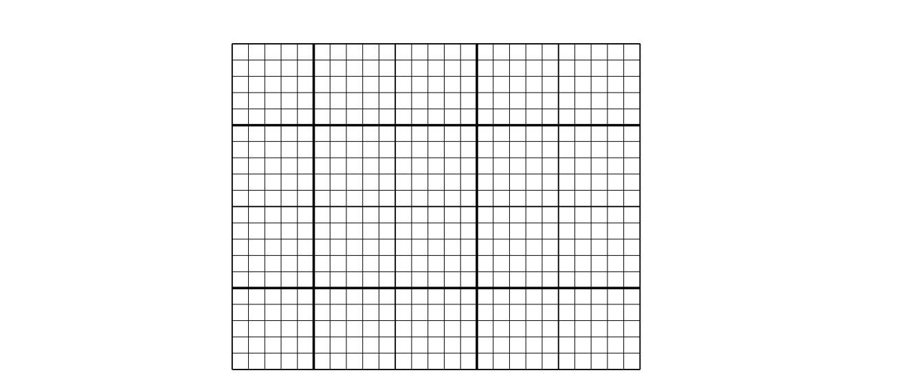

## 圆

使用 `picture` 环境来绘制一个圆，它的语法如下：

```latex
\put(x,y){\circle{diameter}}
% 或
\put(x, y){\circle*{diameter}}
```

- `(x, y)` 为圆心坐标。
- `diameter` 为圆的直径。`picture`环境只允许`diameter`直径最大值约为 `14mm`。
- `\circle{}` 画出空心圆；`\circle*{}` 画出实心圆。 

跟线段的情况一样，你可能需要其他宏包的帮助，比如 `eepic` 或者 `pstricks`。

也可以使用二次 `Bézier` 曲线拼成一个圆。下面看案例。

```latex
\setlength{\unitlength}{1mm}
\begin{picture}(10,6)
    \put(20,30){\circle{1}}
    \put(20,30){\circle{4}}
    \put(20,30){\circle{8}}
    \put(20,30){\circle{14}}
\end{picture}
```

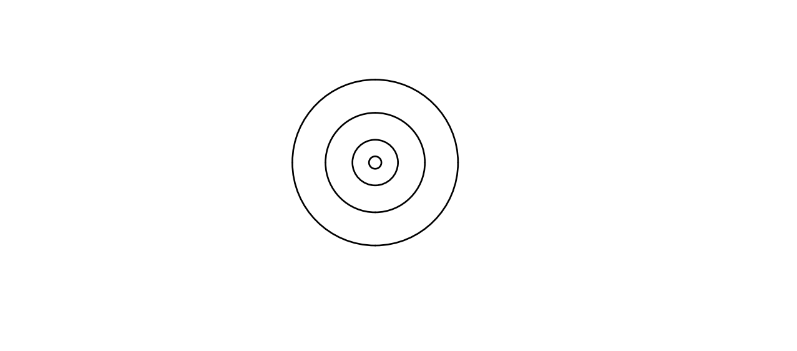

```latex
\setlength{\unitlength}{1mm}
\begin{picture}(10,6)
    \put(15,30){\circle*{1}}
    \put(20,30){\circle*{4}}
    \put(25,30){\circle*{8}}
    \put(30,30){\circle*{14}}
\end{picture} 
```

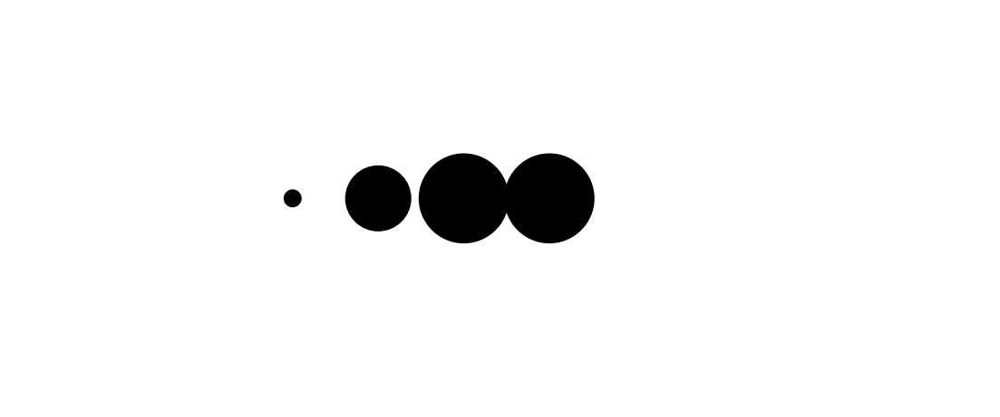

## 椭圆

使用 `picture` 环境绘制椭圆，语法如下：

```latex
\put(x, y){\oval(w, h)[position]}
```

- `(x, y)` 为椭圆的中心点。
- `(w, h)` 中参数 w 表示椭圆的宽，参数 h 表示椭圆的高。
- `[position]` 中的参数 `position`为可选的，它的值可为 `b`、`t`、`l`、`r` ，分别表示仅绘制椭圆的 `“下部”`、`“上部”`、`“左部”` 和 `“右部”`。

下面看案例。

```latex
\setlength{\unitlength}{1cm}
\begin{picture}(6,6)
    \linethickness{0.075mm}
    \put(2, 3){\oval(3, 1.8)}
\end{picture} 
```

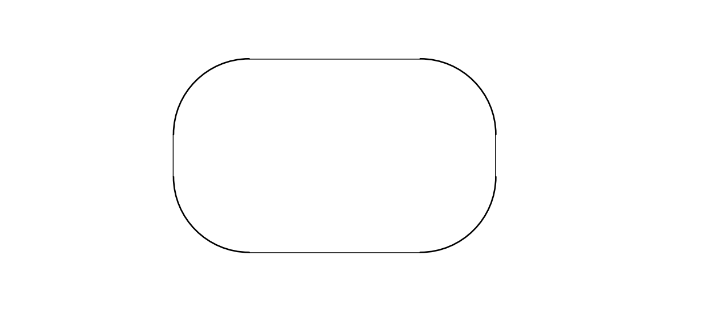

```latex
\setlength{\unitlength}{1cm}
\begin{picture}(6,6)
    \thinlines
    \put(3, 2){\oval(3, 1.8)}
\end{picture}
```

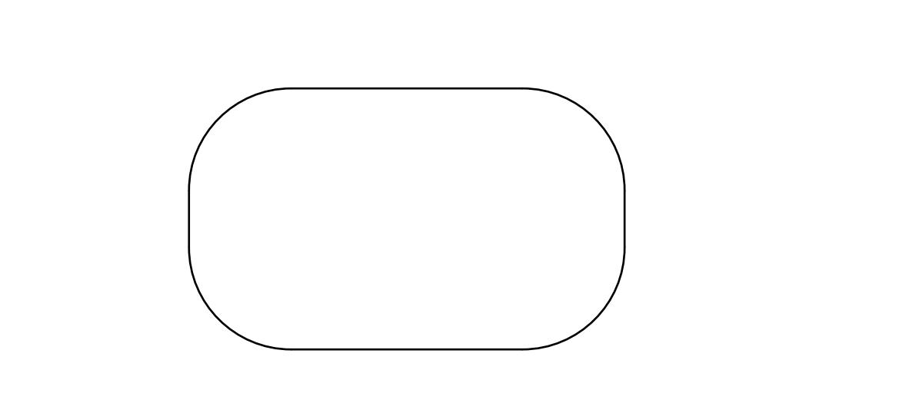

```latex
\setlength{\unitlength}{1cm}
\begin{picture}(6,6)
    \thicklines
    \put(3, 2){\oval(3, 1.8)}
\end{picture} 
```

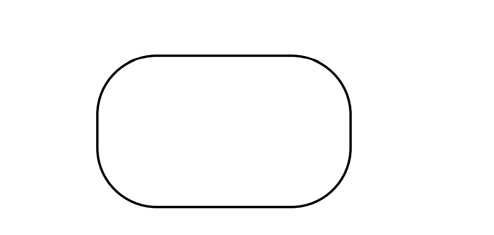

可以明显地看出，上面三个图形的线不一样。接着，绘制二分之一椭圆。

```latex
\setlength{\unitlength}{1cm}
\begin{picture}(6,6)
    \thicklines
    \put(2, 3){\oval(3, 1.8)[b]}
\end{picture} 
```

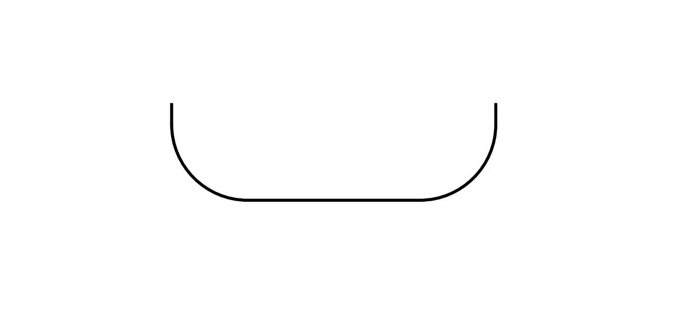

下面绘制四分之一椭圆。


```latex
\setlength{\unitlength}{1cm}
\begin{picture}(6,6)
    \thicklines
    \put(2, 3){\oval(3, 1.8)[bl]}
\end{picture} 
```

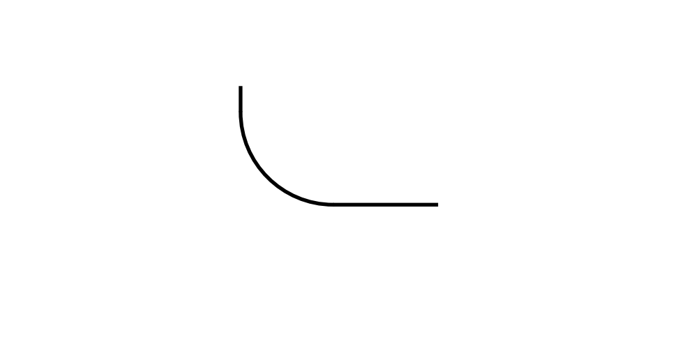

## 线段

在 `picture` 环境中绘制线段，使用如下语法：

```latex
\put(x,y){\line(x1,y1){length}}
```

- `(x, y)`：线段的绘制起点。
- `(x1, y1)`：与`(x, y)` 相对应的线段方向向量。方向向量需由 `-6`，`-5`，...，5，6 整数构成且它们需要互斥（除 1 以外，没有公约数）。
- `[length]`：`length` 表示线段的长度。长度是相对于 `\unitlength` 来说的。

下面看案例。

```latex
\setlength{\unitlength}{5cm}
\begin{picture}(1,1)
    \put(0, 0){\line(1, 0){1}}
    \put(0,0){\line(1,1){.2}}
    \put(.2,.2){\line(2,1){.33}}
    \put(.53, .365){\line(5,1){.15}}
    \put(0, 0){\line(0, 1){1}}
\end{picture} 
```

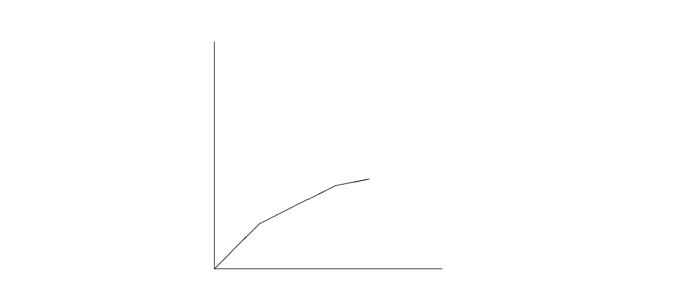

## 箭头

在 `picture` 环境中绘制箭头，使用如下语法：

```latex
\put(x,y){\vector(x1,y1){length}}
```

- `(x, y)`：箭头绘制起点。
- `(x1, y1)`：与 `(x, y)` 相对的箭头方向向量。方向向量需由 `-4`，`-3`，...，3，4 整数构成且它们需要互斥（除 1 以外，没有公约数）。
- `[length]`：`length` 表示线段长度。

注意：命令 `\thicklines` 对指向左上方的两个箭头产生效果。

下面看案例。

```latex
\setlength{\unitlength}{0.75mm}
\begin{picture}(1,1)
    \put(0, 0){\vector(1, 0){30}}
    \put(0, 0){\vector(4, 1){20}}
    \thicklines
    \put(0, 0){\vector(-4, 1){25}}
    \thinlines
    \put(0, 0){\vector(-1, -4){5}}
\end{picture} 
```

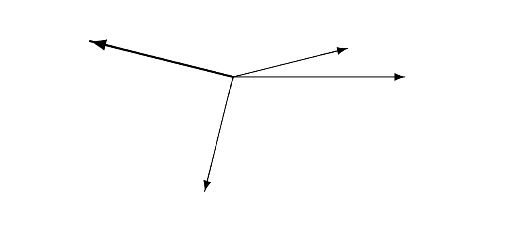

## 公式

在 `picture` 环境中使用 `\put` 命令绘制文本与公式。如下所示：

```latex
\setlength{\unitlength}{0.8cm}
\begin{picture}(6,5)
    \thicklines
    \put(1,0.5){\line(2,1){3}}
    \put(4,2){\line(-2,1){2}}
    \put(2,3){\line(-2,-5){1}}
    \put(0.7,0.3){$A$}
    \put(4.05,1.9){$B$}
    \put(1.7,2.95){$C$}
    \put(3.1,2.5){$a$}
    \put(1.3,1.7){$b$}
    \put(2.5,1.05){$c$}
    \put(0.3,4){$F=\sqrt{s(s-a)(s-b)(s-c)}$}
    \put(3.5,0.4){$\displaystyle
    s:=\frac{a+b+c}{2}$}
\end{picture}
```

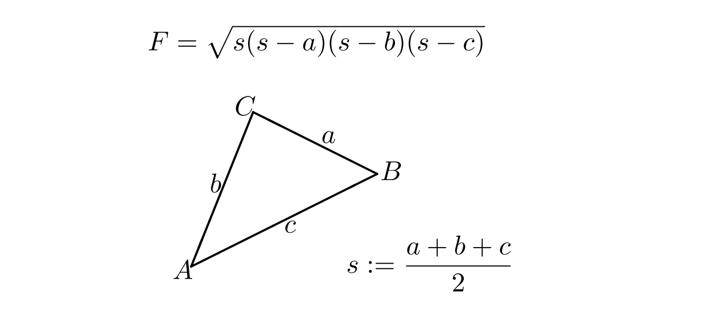

## 二次 Bézier 曲线

`Bézier` 曲线需要如下命令绘制：

```latex
\qbezier(x1,y1)(x,y)(x2,y2)
```

- `(x1, y2)`：`Bézier` 曲线中的起点。
- `(x, y)`：`Bézier` 曲线的中间控制点。
- `(x2, y2)`：`Bézier` 曲线中的终点。

令 $P_1 = (x_1, y_1)$，$P_2 = (x_2, y_2)$ 和 $m_1$，$m_2$ 分别表示一条二次 `Bézier` 曲线的两个端点及其对应斜率。中间控制点 S = (x, y) 则由下述方程给出

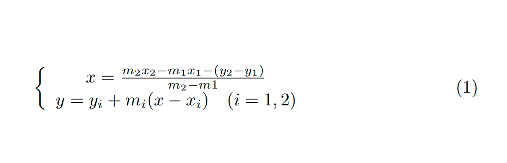

下面是使用二次 `Bézier` 曲线拼接的圆形。

```latex
\setlength{\unitlength}{0.8cm}
\begin{picture}(6,4)
    \qbezier(4,2)(4,3)(3,3)
    \qbezier(3,3)(2,3)(2,2)
    \qbezier(2,2)(2,1)(3,1)
    \qbezier(3,1)(4,1)(4,2)
\end{picture} 
```

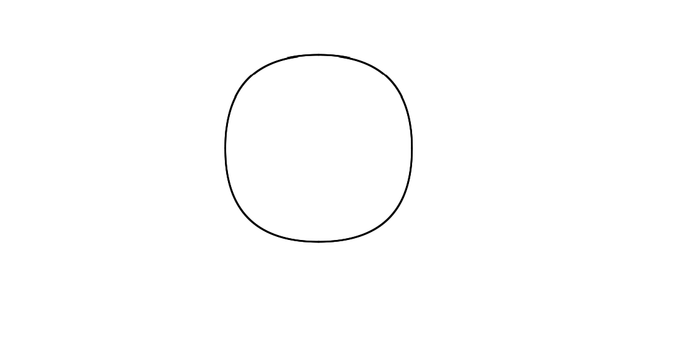

使用四条二次 `Bézier` 曲线拼成圆形的效果不是很让人满意。

再看一下其他的案例。

```latex
\setlength{\unitlength}{0.8cm}
\begin{picture}(6,4)
    \put(0.5,0.5){\line(1,5){0.5}}
    \put(1,3){\line(4,1){2}}
    \qbezier(0.5,0.5)(1,3)(3,3.5)
\end{picture}
```

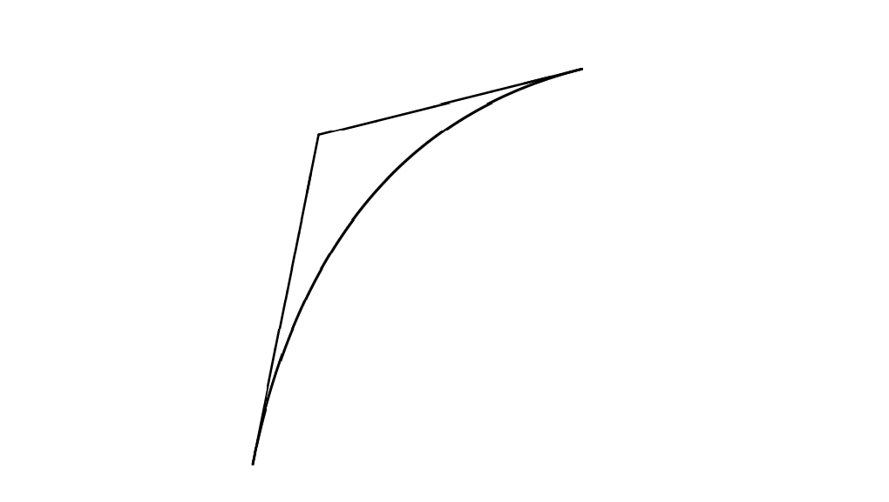

```latex
\setlength{\unitlength}{0.8cm}
\begin{picture}(6,4)
    \thinlines
    \put(2.5,2){\line(2,-1){3}}
    \put(5.5,0.5){\line(-1,5){0.5}}
    \linethickness{1mm}
    \qbezier(2.5,2)(5.5,0.5)(5,3)
\end{picture} 
```

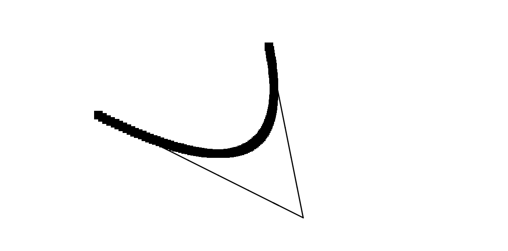

## 悬链线

悬链线指的是两端固定的一条均匀、柔软的链条，在重力的作用下所具有的曲线形状。

下面画出一条悬链线。

```latex
\setlength{\unitlength}{1cm}
\begin {picture} (4.3, 3.6)(-2.5,-0.25)
    \put(-2,0){\vector(1,0){4.4}}
    \put(2.45,-.05){$x$}
    \put(0,0){\vector(0,1){3.2}}
    \put(0,3.35){\makebox(0,0){$y$}}
    \qbezier(0.0,0.0)(1.2384,0.0)(2.0,2.7622)
    \qbezier(0.0,0.0)(-1.2384,0.0)(-2.0,2.7622)
    \linethickness{.075mm}
    \multiput(-2,0)(1,0){5}{\line(0,1){3}}
    \multiput(-2,0)(0,1){4}{\line(1,0){4}}
    \linethickness{.2mm}
    \put( .3,.12763){\line(1,0){.4}}
    \put(.5,-.07237){\line(0,1){.4}}
    \put(-.7,.12763){\line(1,0){.4}}
    \put(-.5,-.07237){\line(0,1){.4}}
    \put(.8,.54308){\line(1,0){.4}}
    \put(1,.34308){\line(0,1){.4}}
    \put(-1.2,.54308){\line(1,0){.4}}
    \put(-1,.34308){\line(0,1){.4}}
    \put(1.3,1.35241){\line(1,0){.4}}
    \put(1.5,1.15241){\line(0,1){.4}}
    \put(-1.7,1.35241){\line(1,0){.4}}
    \put(-1.5,1.15241){\line(0,1){.4}}
    \put(-2.5,-0.25){\circle*{0.2}}
\end{picture}
```

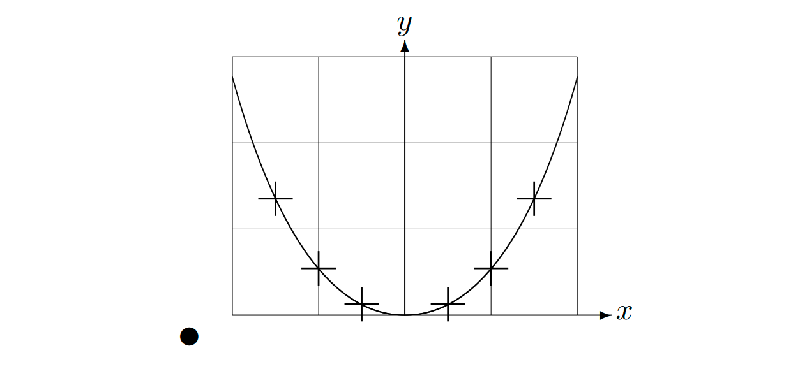

在上图中，悬链线 `y=cosh x - 1` 对称的两半由二次 `Bézier` 曲线分别近似地绘成。曲线的右半部分终止于点 `(2, 2.7622)`，对应的斜率为 `m=3.6269`。再次使用 `Bézier` 的公式，可以计算中间控制点。计算结果为 `(1.2384, 0)` 和 `(-1.2384, 0)`。图中的十字为真正的悬链线上的点。误差小于百分之一，很难被发现。

该例指出了命令 `\begin{picture}` 的可选参数的用法。该图通过使用命令

```latex
\begin{picture}(4.3, 3.6)(-2.5, -0.25)
```

定义了方便的 "数学" 坐标：左下角（由黑色圆点标出）坐标是 (-2.5, -0.25)。

## 坐标的相对性

`Bezier`的公式给出了两条 `Bezier` 曲线的控制点。正向分支由 $P_1 = (0, 0), m_1 = 1$ 和 $P_2 = (2, tanh 2), m_2 = 1 / cosh^2 2$ 确定。与前例相同，本图也定义了在数学上方便的坐标，左下角的坐标是 (-3, -2)（黑点）。

下面看案例。

```latex
\setlength{\unitlength}{0.8cm}
\begin{picture}(6,4)(-3,-2)
    \put(-2.5,0){\vector(1,0){5}}
    \put(2.7,-0.1){$\chi$}
    \put(0,-1.5){\vector(0,1){3}}
    \multiput(-2.5,1)(0.4,0){13}{\line(1,0){0.2}}
    \multiput(-2.5,-1)(0.4,0){13}{\line(1,0){0.2}}
    \put(0.2,1.4){$\beta=v/c=\tanh\chi$}
    \qbezier(0,0)(0.8853,0.8853)(2,0.9640)
    \qbezier(0,0)(-0.8853,-0.8853)(-2,-0.9640)
    \put(-3,-2){\circle*{0.2}}
\end{picture}
```

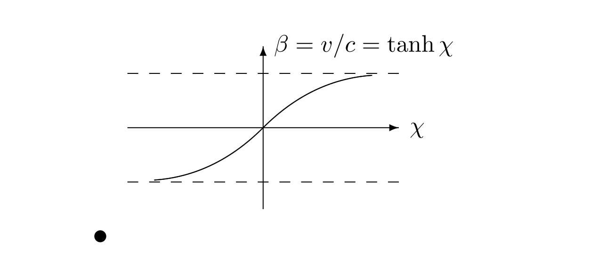


## 预定义的图形盒子

在 `picture` 环境中绘制图形盒子，使用如下语法进行声明：

```latex
\newsavebox{name}
```

声明后，使用如下语法进行定义：

```latex
\savebox{name}{width, height}[position]{content}
```

最后一步，使用如下语法重复绘制：

```latex
\put(x, y)\usebox{name}
```

- `{name}`：参数`name` 指明了 LaTex 存储槽，揭示了其命令本质。
- `{position}`：可选参数 `position`，用于定义图形存放盒子的 “锚点”。`t`、`l`、`b`、`r` 分别描述的位置为 “上”、“左”、“下”、“右”。

```latex
\setlength{\unitlength}{0.5mm}
\begin{picture}(120,168)
    \newsavebox{\foldera}
    \savebox{\foldera}(40,32)[bl]{% definition
        \multiput(0,0)(0,28){2}{\line(1,0){40}}
        \multiput(0,0)(40,0){2}{\line(0,1){28}}
        \put(1,28){\oval(2,2)[tl]}
        \put(1,29){\line(1,0){5}}
        \put(9,29){\oval(6,6)[tl]}
        \put(9,32){\line(1,0){8}}
        \put(17,29){\oval(6,6)[tr]}
        \put(20,29){\line(1,0){19}}
        \put(39,28){\oval(2,2)[tr]}
    }
    \newsavebox{\folderb}
    \savebox{\folderb}(40,32)[l]{% definition
        \put(0,14){\line(1,0){8}}
        \put(8,0){\usebox{\foldera}}
    }
    \put(34,26){\line(0,1){102}}
    \put(14,128){\usebox{\foldera}}
    \multiput(34,86)(0,-37){3}{\usebox{\folderb}}
\end{picture}
```

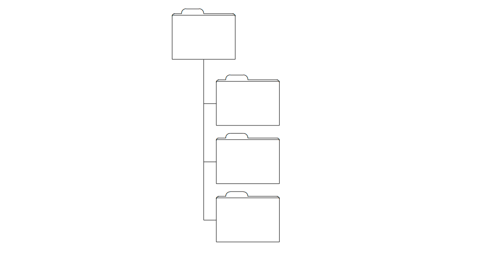

由于命令 `\line` 在线段长度小于大约 `3mm` 的时候不能正常工作，所以必须使用命令 `\oval`。

# 总结

在 LaTex 中，使用 `picture` 环境绘制图形有较大的局限性且比较繁琐，但也有其优点，就是不需要插入额外的图片。这篇文章主要是介绍了使用 `picture` 环境简单的绘制圆、椭圆、线段、箭头、`Bézier`曲线等图形。