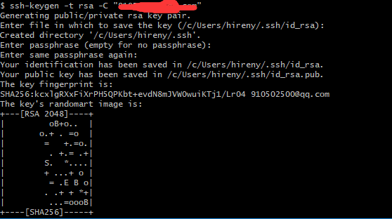
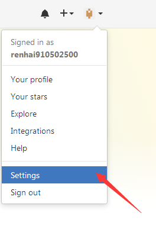
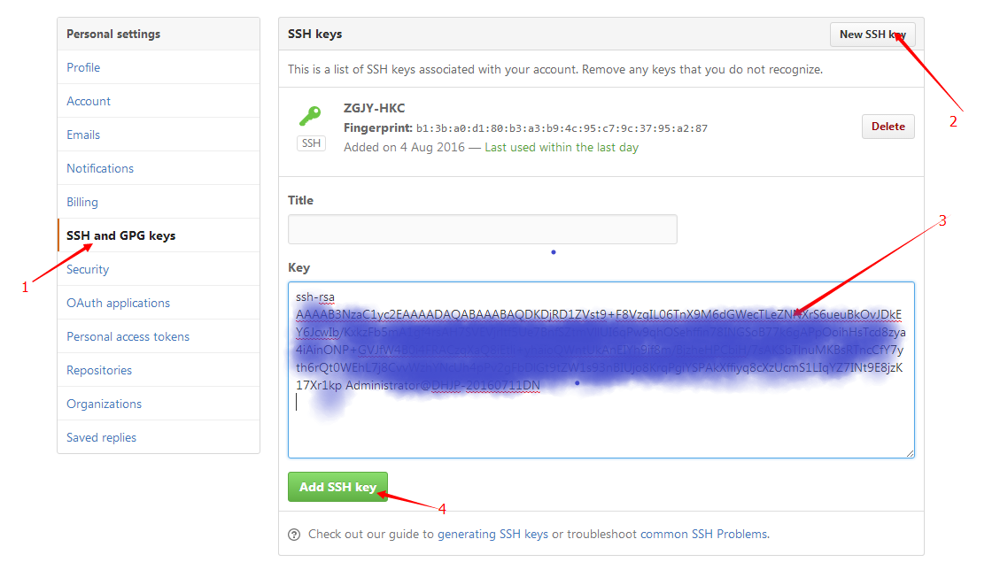
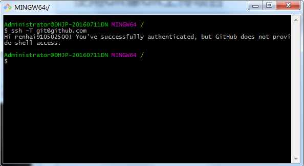
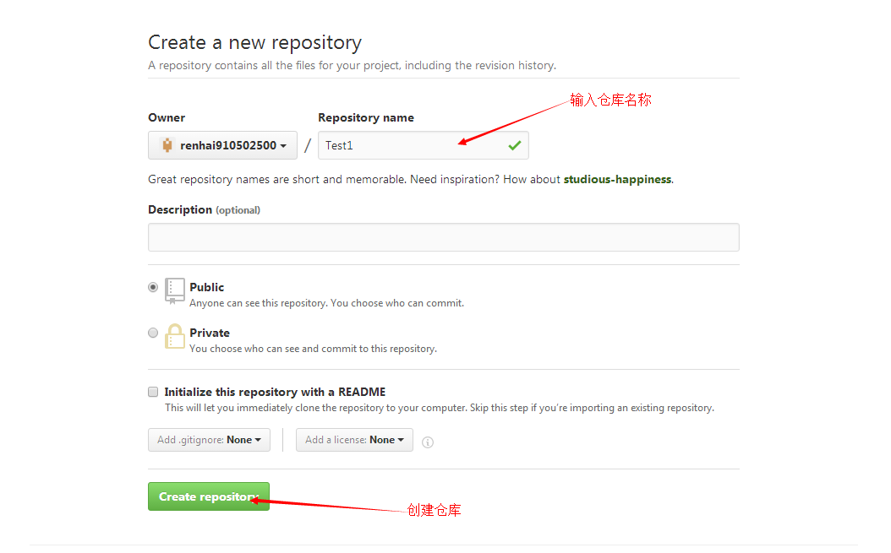
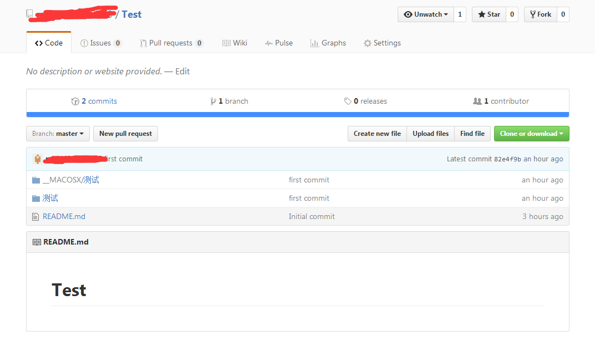

# 设置SSH

## 1.1、生成SSH Key

打开 Git Bash，输入 ssh-keygen -t rsa -C "user.email" 然后按三下回车，如下图所示



这里的 ssh-keygen 中间没有空格，如果输入 ssh-keygen 就会报错 Bad escape character 'ngen'.

接着就会在 C:\Users\Administrator.ssh 目录下生成到 id_rsa 和 id_rsa.pub 两个文件， id_rsa 是密钥， id_rsa.pub 是公钥，接下来需要将 id_rsa.pub 的内容添加到 GitHub上，这样本地的 id_rsa 密钥才能跟 GitHub 上的 id_rsa.pub 公钥进行配对，才能授权成功。

## 1.2、在 GitHub 上添加 SSH Key

首先点击右上角的倒三角进入 Settings



紧接着选择左侧 SSH and GPG Keys，然后选择右上角的 New SSH Key，在把 id_rsa.pub 的内容复制黏贴到 key(id_rsa.pub可以使用记事本打开)，然后点击 Add SSH key 就可以了。

 

SSH key 添加成功之后，输入 ssh -T git@github.com 进行测试，如果出现以下提示证明添加成功了。




# 创建项目

## 2.1、打开终端

先测试一下你的正好跟 github 连接上了没有： ssh -T git@github.com 如果出现以下提示，表示你已经连上了(因为有了第一步，所以不用自己做过多的连接 github 操作，另外，下一次要连接 github 的时候记得打开第一步的工具)

```shell
Hi hireny! You've successfully authenticated, but GitHub does not provide shell access.
```

## 2.2、在 github 创建个人项目



上传项目
根据如下步骤进行操作

```shell
echo "# python_markup" >> README.md // 新建一个记录提交操作的文档 
git init // 初始化本地仓库 
git add README.md // 添加 
git add * 加入所有项目 
git status // 检查状态 如果都是绿的 证明成功 
git commit -m "first commit" // 提交到本地仓库，并写一些注释 
git remote add origin git@github.com:yourname/test.git // (git@github.com:rrenhai910502500/Test.git为SSH地址，在GitHub上复制)命令将本地仓库与远程仓库取得关联 
git push -u origin master //该命令将本地仓库的代码push到GitHub。
```

或者从命令行推送现有的存储库

```shell
git remote add origin git@github.com:hireny/python_markup.git 
git push -u origin master
```

接下来刷新 GitHub 就可以看到刚刚提交上去的代码了。



# 解决问题

如果输入 `$ git remote add origin git@github.com:renhai910502500/Test.git`
提示出错信息：`fatal: remote origin alrready exists`

解决方法如下：

1. 先输入 `$ git remote rm origin`
2. 再输入` $ git remote add origin git@github.com:renhai910502500/Test.git` 就不会报错了！
3. 如果输入 `$ git remote rm origin` 还是报错的话，`error: Could not remove config section 'remote.origin'.`， 我们需要修改 `gitconfig`文件的内容

如果输入 `$ git push origin master`提示出错信息：`error:failed to push som refs to......` 解决办法如下： 

1. 先输入 `git pull origin master // 先把远程服务器 github 上面的文件拉下来`
2. 再输入 `git push origin master` 
3. 如果出现报错 `fatal: Couldn't find remote ref master` 或者 `fatal: 'origin' does not appear to be a git repository` 以及 `fatal: Could not read from remote repository.` 
4. 则需要重新输入 `git remote add origin git@github.com:renhai910502500/Test.git`